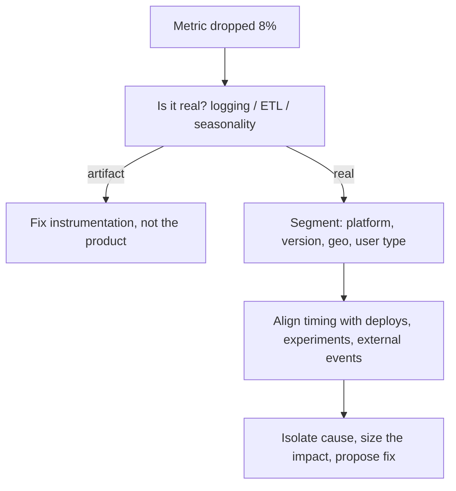

Product-sense rounds test judgment, not code: can you turn a vague goal
into the right metric, diagnose why a number moved, and reason about
tradeoffs a launch decision hinges on? These are structured conversations,
so answer with frameworks, not lists of ideas.

<Figure
  slug="interview-data-scientist-product-sense-and-metrics-cutout"
  alt="A single raised star-topped block on a platform with three smaller supporting metric blocks around it, one of them shielded by a small barrier"
/>

## Q&A

### What is a north-star metric, and what makes a good one?

A **north-star metric** is the single measure that best captures the value
your product delivers to users, the thing the whole team optimizes toward.
A good one is a **leading** indicator of long-term success (not lagging
revenue), reflects genuine user value (not vanity), and is **movable** by
the team's work. "Weekly active listeners who hit 30+ minutes" beats "total
signups" because it tracks retained value, not one-time curiosity.

A north star only aligns teams if it means one thing. Three defensible
definitions of "active users" over the same events table, drifting apart
all year while everyone quotes the same metric name.

<Chart slug="metric-definition-drift" />

### What are guardrail metrics, and why do you need them?

**Guardrail metrics** are health checks you refuse to harm while chasing the
primary metric, latency, crash rate, unsubscribe rate, revenue, trust. They
exist because almost any single metric can be gamed at the expense of the
product: you can boost sessions by sending more notifications while
quietly increasing churn. Every experiment is judged on its primary metric
**and** its guardrails.

### Leading vs. lagging indicators, why does the distinction matter?

A **leading** indicator moves *before* the outcome you care about (activation
in week one predicts month-three retention); a **lagging** indicator
confirms it *after* the fact (quarterly revenue, annual churn). You steer
day to day with leading indicators because lagging ones tell you too late to
act. The risk is choosing a leading proxy that is only correlated, not
causal, and optimizing it away from the real goal.

### How would you define success metrics for a new feature, say, a "Save for later" button?

Start from the **user job** the feature serves (come back and act on saved
items), then pick:

- A **primary** metric tied to that job: return rate to saved items, or
  downstream conversion from saves.
- **Secondary** metrics that explain movement: save rate, saves per user.
- **Guardrails**: overall session time, purchases, latency, so you catch
  cannibalization of the main flow.

Avoid a primary metric that is trivially satisfied by usage of the feature
itself (raw click count); measure the *value realized*, not the interaction.

### Walk me through diagnosing a sudden 8% drop in daily active users.

Work outside-in before theorizing:

1. **Is it real?** Rule out logging bugs, a tracking change, a broken ETL,
   or a holiday/weekend seasonality artifact. Compare year-over-year and
   check whether related metrics moved consistently.
2. **Is it broad or narrow?** Segment by platform, app version, geography,
   new vs. existing users, and acquisition channel. A drop isolated to one
   segment (say, Android after a release) points straight at a cause.
3. **What changed and when?** Line the drop's timestamp up against
   deploys, experiment launches, pricing changes, and external events.
4. **Internal or external?** A competitor launch or a marketing pause looks
   different from a product regression.

Start with the instrument, not the business. This is the shape a dropped
pipeline day makes, and it is indistinguishable from a collapse that
recovered.

<Chart slug="missing-as-zero" />

### How do you decide whether a metric change is signal or noise?

Quantify the day-to-day variation first: a metric that swings 3% on a normal
day has not "dropped" when it moves 2%. Compare against a **confidence band**
or control chart, look at the trend over multiple days rather than one
point, and check whether independent related metrics corroborate it. A real
shift is persistent, corroborated, and larger than the metric's usual
volatility.

The calibration worth having first: four series that look like stories
and contain no trend at all.

<Chart slug="noise-looks-like-a-trend" />

### How would you design an experiment to test a new recommendation algorithm?

State a **hypothesis** and one **primary metric** (say, downstream
engagement), plus guardrails (latency, diversity, revenue). **Randomize** at
the right unit, usually the user, to prevent contamination and to respect
that one user's sessions are correlated. Compute the **sample size** for
your minimum detectable effect at power 0.8 and $\alpha = 0.05$ **before**
launching, run for full business cycles to absorb weekly seasonality and
novelty effects, then read the primary metric and check every guardrail.

What the sizing step is actually trading. Each halving of the lift you
want to catch roughly quadruples the traffic you need to catch it.

<Chart slug="power-vs-n" />

### When can you *not* run an A/B test, and what do you do instead?

You can't randomize when the change is global (a brand redesign), when units
interfere (marketplace or social-network effects violate the no-interference
assumption), when the population is tiny, or when it would be unethical.
Alternatives: **switchback** or time-based tests, **geo experiments**,
**difference-in-differences**, synthetic control, or interrupted time-series
analysis, each trading some causal rigor for feasibility.

### How do you reason about tradeoffs between competing metrics?

Name the tension explicitly, engagement vs. long-term retention, revenue
vs. user trust, precision vs. recall of a ranking, then decide which is the
**constraint** and which is the **objective**. A notification change that
lifts sessions 5% but raises unsubscribes 2% is only good if the retention
math nets positive over a realistic horizon. Frame it as expected long-term
user value, not the metric that happens to move most this week.

### What is Goodhart's law, and how does it show up in metrics?

"When a measure becomes a target, it ceases to be a good measure." Optimize
a proxy hard enough and people (or models) find ways to move the proxy
without moving the underlying goal, support agents closing tickets fast by
closing them prematurely, a model inflating click-through with clickbait.
Defend against it with **counter-metrics** and guardrails that capture the
value the proxy was standing in for.

### What is a vanity metric, and how do you avoid choosing one?

A **vanity metric** looks impressive and only goes up, cumulative signups,
total page views, but doesn't inform a decision or reflect retained value.
The test: "If this number doubled, would I know what to *do* differently?"
Prefer **actionable, ratio, and cohort-based** metrics (activation rate,
week-4 retention) over raw cumulative counts.

A near relative of the vanity metric: a headline number that is true,
reported, and cannot tell four very different years apart.

<Chart slug="dashboard-kpi-trend" />

### Why are ratio metrics tricky, and what should you watch for?

A ratio can move because the numerator changed, because the **denominator**
changed, or because the *mix* of segments changed (Simpson's paradox), a
rate can fall in every segment yet rise overall if traffic shifts toward
higher-rate segments. Always look at numerator and denominator separately,
and be wary of averaging ratios across groups rather than aggregating the
raw counts.

The failure mode that survives every review, because the arithmetic is
fine: sort by rate and the top and bottom of the table are just the rows
with the fewest observations.

<Chart slug="rates-from-small-denominators" />

### How would you estimate the market size or scale of something on the spot?

Decompose top-down or bottom-up and state assumptions out loud. To size
daily searches for a new feature: start from monthly active users, times the
share who would use the feature, times sessions per user, times searches per
session. Interviewers care about **structure and sanity-checking** (round
numbers, an answer within an order of magnitude), not a precise figure.

### How do you size the potential impact of a feature *before* building it?

Bound it. Compute the **addressable population** (how many users hit the
relevant surface), a **plausible effect size** from analogous past launches
or a small qualitative study, and multiply through to a range. If the
optimistic ceiling is still tiny relative to the goal, that is a signal to
deprioritize before spending engineering time, the cheapest experiment is
the arithmetic.

### What is a novelty effect, and how do you separate it from real impact?

Users engage with anything new simply because it is new, inflating early
results that fade. Detect it by watching the treatment effect **over time**,
a spike that decays toward zero is novelty; a durable lift is real. Running
the experiment across full cycles and inspecting the effect's trend (not
just the pooled average) guards against shipping a fad.

Two changes, eight weeks of measured lift each. Read in week one, the one
about to evaporate is the one that looks better.

<Chart slug="novelty-effect-fades" />

## Concept checks

<MultipleChoice
  markdown={`A team picks "total cumulative signups" as its north-star metric. What is the main problem?

- It is a guardrail metric, not a north-star.
  > It is a vanity metric; guardrails are health limits like latency or churn, which this is not.
- [o] It only ever goes up and reflects one-time curiosity, not retained value, so it can't guide decisions.
  > A number that can never fall gives no feedback on whether the product is getting better; a retention- or engagement-based metric would.
- It is too hard to measure accurately.
  > Cumulative signups is trivially easy to measure; ease is not the issue.
- It cannot be moved by the team.
  > The team can move it (spend on acquisition); the problem is that moving it does not signal durable value.`}
/>

<MultipleChoice
  markdown={`Daily active users dropped 8% overnight. What should you check **first**?

- Whether a competitor launched something.
  > External causes are worth checking, but only after you have confirmed the drop is real and segmented it.
- Rerun the marketing campaign to bring users back.
  > That treats a symptom before you know the cause, and the cause may not be acquisition at all.
- Ship a fix for whichever feature you suspect.
  > Acting before confirming the drop is real risks fixing a phantom; instrumentation bugs cause many "drops."
- [o] Whether the drop is real, ruling out logging changes, ETL failures, and seasonality.
  > Confirming the number is genuine comes before diagnosing a cause; a broken tracking pipeline mimics a real drop.`}
/>

<MultipleChoice
  markdown={`An experiment lifts sessions but the effect shrinks steadily over three weeks toward zero. What is the most likely explanation?

- The guardrail metrics were violated.
  > Guardrails are separate health checks; they do not explain why the primary effect faded.
- The randomization was broken.
  > Broken randomization biases the effect but would not produce a clean decay toward zero over weeks.
- [o] A novelty effect: users engaged because the feature was new, and the boost faded.
  > A treatment effect that decays toward zero over time is the signature of novelty, not durable value.
- The sample size was too small.
  > Sample size affects noise, not a systematic decay of the effect over time.`}
/>

## Go deeper

- [Statistics for Data Science with Python](/courses/statistics-for-data-science-python)
- [Data Analysis with Python & Pandas](/courses/data-analysis-python-pandas)
