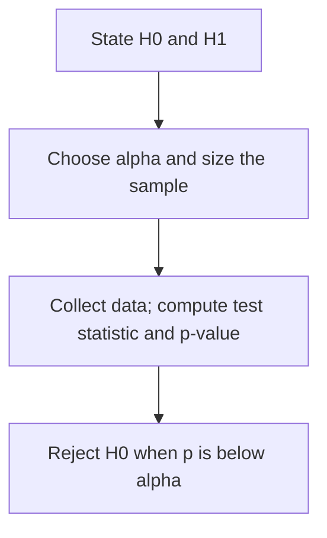

Statistics is the part of a Data Scientist interview most candidates are
rustiest on. The questions below build up in a deliberate order, sampling
and distributions first, then estimation, then the hypothesis-testing
machinery (which is where the p-value finally appears). Review the Q&A,
then the concept checks.

<Figure
  slug="interview-data-scientist-statistics-cutout"
  alt="A bell-shaped curve model on a platform with a narrow shaded band marked out beneath it by two small upright posts"
/>

## Q&A

### What's the difference between a parameter and a statistic?

A **parameter** describes the population (the true mean $\mu$) and is
usually unknown; a **statistic** is computed from a sample (the sample
mean $\bar{x}$) and estimates the parameter. Inference is the bridge from
statistic to parameter, with quantified uncertainty, everything below is
about crossing that bridge responsibly.

### What is the standard error, and how does it differ from standard deviation?

**Standard deviation** measures the variability of individual
observations around the mean. **Standard error** measures the variability
of a *sample statistic* (such as the mean) around the true parameter:

$$
SE = \frac{\sigma}{\sqrt{n}}
$$

The standard error shrinks as the sample size $n$ grows (you can estimate
the mean more precisely with more data); the standard deviation does not,
because it estimates a fixed population property that does not depend on
$n$.

How fast it shrinks, which is the part interviewers probe: as the square
root of n, so four times the data halves it.

<Chart slug="standard-error-vs-n" />

### What is a sampling distribution?

A **sampling distribution** is the probability distribution of a statistic
(like the sample mean) over all possible samples of the same size from a
population. Its standard deviation is the standard error,
$SE = \sigma / \sqrt{n}$, and the Central Limit Theorem says its shape
approaches a normal curve as $n$ grows.

The code below makes this concrete: it draws 2,000 samples of size 50 from
a deliberately skewed (exponential) population and compares the spread of
those sample means against the formula. The two numbers come out nearly
equal, demonstrating that $SE = \sigma/\sqrt{n}$ holds even when the raw
data is not normal.

<CodeBlock
  adapter="python"
  files={[
    {
      filename: "main.py",
      starterCode: `import numpy as np

rng = np.random.default_rng(42)
population = rng.exponential(scale=5, size=100_000)  # skewed population
sample_means = [rng.choice(population, 50).mean() for _ in range(2000)]
print(f"SE (formula): {population.std() / 50**0.5:.3f}")
print(f"SE (simulated): {np.std(sample_means):.3f}")
# Both should be close, CLT at work
`,
    },
  ]}
/>

Where it comes from: draw a sample, take its statistic, put a dot down,
repeat.

<Chart slug="sampling-distribution-build" />

### Why does the Central Limit Theorem matter?

For a large enough sample, the distribution of the **sample mean** is
approximately normal **regardless of the population's shape**. That's
what justifies normal-based confidence intervals and z/t-tests for means
even when the underlying data is skewed. A common rule of thumb is that
$n \geq 30$ is "large enough" for moderately skewed data; heavier skew
needs more.

Simulated rather than asserted. The population is nothing like a bell
curve, and the means converge to one anyway.

<Chart slug="clt-convergence" />

### What is the Law of Large Numbers?

The Law of Large Numbers states that as the sample size grows, the sample
mean converges in probability to the population mean. This is what
justifies using large samples to estimate population parameters and why
more data improves estimates. The **weak** law gives convergence in
probability; the **strong** law gives almost-sure convergence.

Note the distinction from the Central Limit Theorem: the Law of Large
Numbers says *where* the sample mean ends up (at $\mu$); the Central Limit
Theorem says *what shape* its uncertainty takes (normal) along the way.

And the distinction from the CLT, drawn: the LLN is about one running
average settling down, not about the shape of many.

<Chart slug="lln-convergence" />

### What is conditional probability?

$P(A \mid B)$ is the probability of event $A$ given that $B$ has already
occurred:

$$
P(A \mid B) = \frac{P(A \cap B)}{P(B)}
$$

Events $A$ and $B$ are independent if $P(A \mid B) = P(A)$, knowing $B$
tells you nothing about $A$.

### What does it mean for two events to be mutually exclusive vs. independent?

**Mutually exclusive** events cannot both occur, so $P(A \cap B) = 0$.
**Independent** events have no influence on each other, so
$P(A \cap B) = P(A)\,P(B)$. The two ideas are often confused but are
nearly opposites: mutually exclusive events with non-zero probability are
*never* independent, because knowing one occurred rules the other out.

Independence has a shape. Two tables with identical margins, drawn as
area: under independence every column splits at the same height.

<Chart slug="mosaic-independence" />

### What is Bayes' theorem?

Bayes' theorem updates a prior belief given new evidence:

$$
P(A \mid B) = \frac{P(B \mid A)\,P(A)}{P(B)}
$$

In data science it powers spam filters, medical diagnosis, and Bayesian
inference, where you update a prior distribution over parameters into a
posterior after observing data.

The code below works the classic medical-test example: even with a 99%
accurate test, a rare disease (1% prevalence) means a positive result
still implies a fairly low probability of actually being sick, because
the many false positives from the healthy majority swamp the few true
positives. It is the canonical demonstration of why base rates matter.

<CodeBlock
  adapter="python"
  files={[
    {
      filename: "main.py",
      starterCode: `# Medical test example: P(disease | positive test)
p_disease = 0.01          # prior prevalence
p_pos_given_disease = 0.99  # sensitivity
p_pos_given_no_disease = 0.05  # 1 - specificity

p_pos = p_pos_given_disease * p_disease + p_pos_given_no_disease * (1 - p_disease)
p_disease_given_pos = p_pos_given_disease * p_disease / p_pos
print(f"P(disease | positive) = {p_disease_given_pos:.3f}")
`,
    },
  ]}
/>

The classic interview version, counted out one dot at a time.

<Chart slug="base-rate-grid" />

### Describe the normal distribution and its key properties.

The normal (Gaussian) distribution is symmetric and bell-shaped,
parameterized by mean $\mu$ and variance $\sigma^2$. By the **empirical
rule**, about 68%, 95%, and 99.7% of the data fall within 1, 2, and 3
standard deviations of the mean:

$$
P(\mu - k\sigma \leq X \leq \mu + k\sigma) \approx 68\%,\ 95\%,\ 99.7\% \quad \text{for } k = 1, 2, 3
$$

It arises naturally via the Central Limit Theorem and is the foundation
for many statistical tests.

The three numbers worth knowing cold.

<Chart slug="normal-68-95-997" />

### What is a Poisson distribution?

The Poisson distribution models the number of events in a fixed interval
when events occur independently at a constant average rate $\lambda$:

$$
P(X = k) = \frac{\lambda^k e^{-\lambda}}{k!}
$$

Its mean and variance are **both** $\lambda$. Common uses: customer
arrivals per hour, defects per unit, or server requests per second.

One distribution, three rates. Rare-event counts pile up at zero, and by
a rate of about ten the shape is hard to tell from a normal curve.

<Chart slug="poisson-shapes" />

### What is a binomial distribution?

The binomial distribution counts the number of successes in $n$
independent Bernoulli trials, each with success probability $p$:

$$
P(X = k) = \binom{n}{k} p^k (1 - p)^{n-k}
$$

Its mean is $np$ and its variance is $np(1 - p)$. It is used for click
rates, conversion rates, and quality control.

How its shape moves with n and p, including where it starts to look normal.

<Chart slug="binomial-shapes" />

### What is Maximum Likelihood Estimation?

Maximum Likelihood Estimation finds the parameter values that maximize the
probability (the *likelihood*) of observing the data under a given model.
For a normal distribution the maximum-likelihood estimate of the mean is
just the sample mean; for logistic regression it maximizes the
log-likelihood of the observed labels. The method is consistent and
asymptotically efficient but can overfit small samples.

The likelihood of the data you saw, over every parameter it might have
come from. The peak is the estimate; the width is the precision.

<Chart slug="mle-likelihood-curve" />

### What are the properties of an unbiased estimator?

An estimator is **unbiased** if its expected value equals the true
parameter. The sample mean is an unbiased estimator of the population
mean. The sample variance with denominator $n - 1$ (Bessel's correction)
is unbiased; dividing by $n$ gives a biased (but lower-variance)
estimator. Bias and variance combine into mean squared error:

$$
\text{MSE} = \text{Bias}^2 + \text{Variance}
$$

The code below computes both variance estimators on the same data so you
can see the gap: `ddof=1` applies Bessel's correction (unbiased), while
`ddof=0` is the biased maximum-likelihood version that divides by $n$.

<CodeBlock
  adapter="python"
  files={[
    {
      filename: "main.py",
      starterCode: `import numpy as np

data = np.array([4.0, 7.0, 13.0, 2.0, 1.0])
# ddof=1 → Bessel's correction (unbiased); ddof=0 → biased MLE
unbiased_var = np.var(data, ddof=1)
biased_var   = np.var(data, ddof=0)
print(f"Unbiased variance (n-1): {unbiased_var:.2f}")
print(f"Biased variance (n):     {biased_var:.2f}")
`,
    },
  ]}
/>

Unbiasedness is a statement about the average over many samples, which is
the only way to see it: ten thousand samples at each size, with the two
divisors for the variance.

<Chart slug="bessel-correction" />

### What does a 95% confidence interval actually mean?

It's a procedure: if you repeated the experiment many times and built an
interval each time, about 95% of those intervals would contain the true
parameter. It is **not** "a 95% probability the parameter is in *this*
interval", the parameter is fixed; the interval is what's random. For a
mean, the interval is

$$
\bar{x} \pm t^{*}_{n-1} \cdot \frac{s}{\sqrt{n}}
$$

where $t^{*}_{n-1}$ is the critical value from the t-distribution.

The code below builds exactly that interval: `stats.sem` computes the
standard error $s/\sqrt{n}$, and `stats.t.interval` multiplies it by the
critical value and centers it on the sample mean.

<CodeBlock
  adapter="python"
  files={[
    {
      filename: "main.py",
      starterCode: `import numpy as np
from scipy import stats

data = np.array([12, 15, 14, 10, 13, 16, 11, 14])
n = len(data)
mean = data.mean()
se = stats.sem(data)  # SE = std / sqrt(n)
ci_low, ci_high = stats.t.interval(0.95, df=n - 1, loc=mean, scale=se)
print(f"95% CI: ({ci_low:.2f}, {ci_high:.2f})")
`,
    },
  ]}
/>

The definition, drawn: a hundred intervals from a hundred samples, about
five of which miss.

<Chart slug="ci-coverage" />

### What is hypothesis testing, and what are its four key steps?

Hypothesis testing is a formal procedure for deciding whether data provide
sufficient evidence against a null hypothesis. The four steps are:

1. State the null hypothesis $H_0$ and the alternative hypothesis $H_1$.
2. Choose the significance level $\alpha$ and compute the required sample size.
3. Collect data and compute the test statistic and its p-value.
4. Reject $H_0$ if $p < \alpha$ and interpret the result in context.

Always state the hypotheses and fix $\alpha$ **before** collecting data,
to avoid bias. The remaining questions in this section unpack each piece
of this procedure.

### State the null and alternative hypotheses for an A/B test on click-through rate.

The **null hypothesis** $H_0$ is that the two click-through rates are
equal (no effect). The **alternative hypothesis** $H_1$ is that the
treatment click-through rate differs from the control (two-sided) or is
specifically greater/less (one-sided). You choose the alternative before
seeing data. A two-sided test is safer because it catches effects in
either direction without inflating power in one direction.

### When do you use a z-test vs a t-test?

Use a **z-test** when the population variance is known or the sample is
large enough (roughly $n \geq 30$) that the sample standard deviation is a
reliable estimate. Use a **t-test** for small samples where you must
estimate the variance; the t-distribution has heavier tails to account for
that extra uncertainty. In practice, software always uses the t-test,
which converges to the z-test as $n$ grows.

The code below runs a one-sample t-test asking whether a small sample's
mean differs from a hypothesized value of 10. It returns the test
statistic and the p-value you would compare against $\alpha$.

<CodeBlock
  adapter="python"
  files={[
    {
      filename: "main.py",
      starterCode: `from scipy import stats

# One-sample t-test: is the mean significantly different from 10?
sample = [9.2, 10.5, 11.1, 8.7, 10.0, 9.8]
t_stat, p_value = stats.ttest_1samp(sample, popmean=10)
print(f"t={t_stat:.3f}, p={p_value:.4f}")
`,
    },
  ]}
/>

Why it stops mattering as n grows: the t distribution's tails pull in
toward the normal.

<Chart slug="t-vs-normal" />

### What is the chi-square test used for?

The chi-square test checks whether observed counts in categories differ
from expected counts (goodness-of-fit), or whether two categorical
variables are independent (test of independence). The test statistic sums
the squared, normalized gaps between observed and expected counts:

$$
\chi^2 = \sum_i \frac{(O_i - E_i)^2}{E_i}
$$

Large values indicate the null is implausible. The test requires expected
cell counts of at least 5 in most cells.

The code below applies it to an A/B conversion table: `chi2_contingency`
computes the $\chi^2$ statistic above, its p-value, and the degrees of
freedom for a 2×2 table of variant vs. converted/not-converted.

<CodeBlock
  adapter="python"
  files={[
    {
      filename: "main.py",
      starterCode: `from scipy.stats import chi2_contingency

# Contingency table: rows = variant (A/B), cols = converted/not
observed = [[120, 880],   # control: 120 converted, 880 did not
            [150, 850]]   # treatment
chi2, p, dof, expected = chi2_contingency(observed)
print(f"chi2={chi2:.3f}, p={p:.4f}, dof={dof}")
`,
    },
  ]}
/>

The reference distribution the test statistic is compared against, at
three degrees of freedom, each with its 95th percentile marked.

<Chart slug="chi-square-shapes" />

### What is ANOVA, and when do you use it?

ANOVA (Analysis of Variance) tests whether the means of three or more
groups are equal. It compares within-group variance to between-group
variance via an F-statistic. A significant F only tells you that at least
one group differs; post-hoc tests (Tukey, Bonferroni) identify which pairs
differ. Use it instead of running many pairwise t-tests, which would
inflate the Type I error rate.

The code below runs a one-way ANOVA across three groups; `f_oneway`
returns the F-statistic and the p-value for the null that all three means
are equal.

<CodeBlock
  adapter="python"
  files={[
    {
      filename: "main.py",
      starterCode: `from scipy.stats import f_oneway

group_a = [5.1, 5.5, 4.9, 5.3]
group_b = [6.2, 6.5, 6.0, 6.3]
group_c = [5.0, 4.8, 5.2, 5.1]
f_stat, p_value = f_oneway(group_a, group_b, group_c)
print(f"F={f_stat:.3f}, p={p_value:.4f}")
`,
    },
  ]}
/>

The comparison the F ratio is making: spread between the groups against
spread within them.

<Chart slug="anova-between-within" />

### What exactly is a p-value?

Now that the tests above each emit one, here is what the number means: a
p-value is the probability of observing data **at least as extreme** as
yours **assuming the null hypothesis is true**. It is *not* the
probability that the null is true, nor the probability your result is a
fluke. A small p-value means the data would be surprising under the null,
so you reject it at your chosen significance level $\alpha$:

$$
\text{reject } H_0 \quad \text{when} \quad p < \alpha
$$

<Callout type="warning" title="Common misconception">
A p-value is **not** the probability that the null hypothesis is true, and
**not** the probability your result is a fluke, it is computed *assuming*
the null holds. Conflating the two is the single most common statistics
interview slip.
</Callout>

The code below runs a two-sample t-test (the two-group analogue of the
one-sample test above) and prints the t-statistic and p-value; here
$p < 0.05$ would lead you to reject the null that the two group means are
equal.

<CodeBlock
  adapter="python"
  files={[
    {
      filename: "main.py",
      starterCode: `from scipy import stats

# Two-sample t-test: compute t-statistic and p-value
group_a = [12, 15, 14, 10, 13]
group_b = [18, 20, 17, 22, 19]
t_stat, p_value = stats.ttest_ind(group_a, group_b)
print(f"t={t_stat:.3f}, p={p_value:.4f}")
# p < 0.05 → reject the null that the means are equal
`,
    },
  ]}
/>

The p-value is the shaded area: how much of the null's distribution sits
at least as far out as what you saw.

<Chart slug="p-value-tail-area" />

### What is the difference between a Type I and a Type II error?

A **Type I error** is a false positive (rejecting a true null); its rate
is $\alpha$. A **Type II error** is a false negative (failing to detect a
real effect); its rate is $\beta$, and **power** $= 1 - \beta$. The four
possible outcomes of a test form a decision matrix:

|                          | $H_0$ is true                                | $H_0$ is false                              |
| ------------------------ | -------------------------------------------- | ------------------------------------------- |
| **Reject $H_0$**         | Type I error (false positive), rate $\alpha$ | Correct decision, power $= 1 - \beta$       |
| **Fail to reject $H_0$** | Correct decision, rate $1 - \alpha$          | Type II error (false negative), rate $\beta$ |

Lowering $\alpha$ (a stricter test) reduces false positives but raises
false negatives, all else equal, the two error rates trade off against
each other.

The two error rates on one axis, so the trade between them is visible.

<Chart slug="alpha-power-tradeoff" />

### What is statistical power?

Power is the probability of correctly rejecting the null when the
alternative is true:

$$
\text{power} = 1 - \beta
$$

where $\beta$ is the Type II error rate. A power of 0.8 means an 80% chance
of detecting a true effect if one exists. Power rises with larger sample
size, larger effect size, lower variance, and a higher $\alpha$.

The code below solves for power given an effect size (Cohen's d), a
per-group sample size, and $\alpha$, the standard pre-experiment check
that a planned test is sensitive enough to find the effect you care about.

<CodeBlock
  adapter="python"
  files={[
    {
      filename: "main.py",
      starterCode: `from statsmodels.stats.power import TTestIndPower

analysis = TTestIndPower()
# Compute power given effect size (Cohen's d), sample size, and alpha
power = analysis.solve_power(effect_size=0.5, nobs1=50, alpha=0.05)
print(f"Power: {power:.3f}")
`,
    },
  ]}
/>

What it costs to detect a smaller effect: each halving of the effect
roughly quadruples the sample.

<Chart slug="power-vs-n" />

### What is the difference between one-tailed and two-tailed tests?

A **two-tailed test** detects effects in either direction (greater or less
than the null value) and splits $\alpha$ between both tails. A
**one-tailed test** focuses on one direction, giving more power there but
missing effects in the other direction. Use two-tailed tests by default
unless you have a strong directional hypothesis stated before seeing data.

The whole difference, as area: 5% in one tail against 2.5% in each.

<Chart slug="one-vs-two-sided" />

### What is effect size, and why does it matter alongside p-values?

**Effect size** quantifies the *magnitude* of a difference (Cohen's d for
means, the odds ratio for proportions, Pearson's r for correlations). A
result can be statistically significant but practically negligible (large
$n$, tiny effect), or practically large but not significant (small $n$).
Always report effect sizes and confidence intervals alongside p-values, so
the reader sees both "is it real?" and "is it big enough to matter?"

What Cohen's d means as a picture, since the number alone is hard to
calibrate: two populations at d = 0.2, 0.5 and 0.8.

<Chart slug="effect-size-overlap" />

### How do you correct for multiple comparisons?

The **Bonferroni correction** divides $\alpha$ by the number of tests $m$
(testing each at $\alpha / m$), controlling the family-wise error rate.
The **Benjamini-Hochberg procedure** controls the false discovery rate
instead, giving more power when many tests are run. Choose Bonferroni when
you cannot tolerate *any* false positive, and Benjamini-Hochberg when you
can accept a controlled proportion of them.

The code below applies the Benjamini-Hochberg procedure to five raw
p-values: it returns which hypotheses to reject and the adjusted p-values,
which are larger than the originals because the correction makes each test
stricter.

<CodeBlock
  adapter="python"
  files={[
    {
      filename: "main.py",
      starterCode: `from statsmodels.stats.multitest import multipletests

p_values = [0.01, 0.04, 0.20, 0.03, 0.50]
# Benjamini-Hochberg FDR correction
reject, p_corrected, _, _ = multipletests(p_values, alpha=0.05, method="fdr_bh")
print("Reject:", reject)
print("Corrected p-values:", [f"{p:.3f}" for p in p_corrected])
`,
    },
  ]}
/>

Why a correction is needed at all: the chance that at least one of k
independent tests comes back significant, when nothing is going on.

<Chart slug="multiple-comparisons" />

### What is p-hacking, and why is it dangerous?

P-hacking is trying many analyses, subgroups, or metrics until a
significant result appears, then reporting only that one. It exploits the
fact that with enough comparisons some will be significant by chance
(Type I error inflation), and it leads to irreproducible findings, a major
driver of the replication crisis. Remedies: pre-registration, Bonferroni
or false-discovery-rate correction, and separating exploratory from
confirmatory analysis.

The version that does not feel like cheating, which is the dangerous one:
five defensible binary choices, thirty-two analyses of one dataset, and
no test run twice.

<Chart slug="forking-paths" />

### What is the difference between frequentist and Bayesian statistics?

**Frequentist** statistics treats probability as long-run frequency:
parameters are fixed (unknown) constants, and you draw conclusions from
data alone via p-values and confidence intervals. **Bayesian** statistics
treats parameters as random variables with a prior distribution that is
updated by data into a posterior. Bayesian inference allows direct
probability statements about parameters and naturally incorporates prior
knowledge, but requires specifying priors.

What the Bayesian side actually produces: a distribution over the
parameter, updated as the data arrives.

<Chart slug="beta-posterior-update" />

### What is the difference between parametric and non-parametric tests?

**Parametric tests** assume the data follow a specific distribution
(usually normal) and test parameters of that distribution. **Non-parametric
tests** make fewer distributional assumptions and work on ranks (Wilcoxon,
Mann-Whitney, Kruskal-Wallis). Non-parametric tests are preferred for
small samples, ordinal data, or when normality is clearly violated.

The trade, measured by simulation: on normal data the t-test wins
narrowly, and on heavy-tailed data it loses badly.

<Chart slug="mann-whitney-vs-t" />

### What is the difference between correlation and causation?

Correlation measures the linear association between two variables
(Pearson's r ranges from $-1$ to $1$). Causation means one variable
directly produces a change in another. Correlation does not imply
causation: a lurking third variable (a confounder) can drive both, or the
relationship may be coincidental. Establishing causation requires
controlled experiments or causal-inference methods.

A confounder strong enough to flip the sign. Within every age band more
exercise goes with lower blood pressure; one line fitted to the pooled
points slopes the other way.

<Chart slug="simpsons-paradox-trend" />

### What is Simpson's paradox?

Simpson's paradox occurs when a trend that appears in several groups
reverses (or disappears) when the groups are combined, because a lurking
confounding variable drives the aggregated result. The classic example: a
treatment looks worse overall but is better within every patient subgroup,
because sicker patients were disproportionately routed to it. Resolving it
requires analyzing data at the right stratification level and
understanding the causal structure.

The discrete version, and a real one: treatment A wins in both subgroups
and loses overall.

<Chart slug="simpsons-paradox" />

## Concept checks

<MultipleChoice
  markdown={`A test returns \`p = 0.03\` at significance level \`α = 0.05\`. Which statement is correct?

- There is a 3% probability that the null hypothesis is true.
  > A p-value is **not** the probability the null is true. It's computed *assuming* the null holds.
- There is a 97% probability the effect is real and important.
  > Significance isn't the probability the effect is real, and says nothing about effect size.
- [o] If the null were true, there's a 3% chance of data this extreme (or more), so at α = 0.05 you reject the null.
  > That's the definition; since 0.03 < 0.05, you reject.
- The result is guaranteed not to be a fluke.
  > A small p reduces but never eliminates the chance of a false positive (the Type I error rate).`}
/>

<MultipleChoice
  markdown={`Your A/B test concludes the new button "works" and you ship it, but in reality it has **no** effect. What kind of error is this?

- Selection bias.
  > Selection bias is about how the sample was drawn, not which hypothesis-test error occurred.
- A Type II error (false negative), failing to detect a real effect.
  > That's the opposite: missing an effect that *is* real.
- [o] A Type I error (false positive), rejecting a true null hypothesis.
  > Declaring an effect that isn't real is a false positive; its rate is controlled by α.
- No error, shipping is always safe.
  > Shipping a change that does nothing is precisely the cost of a Type I error.`}
/>

<MultipleChoice
  markdown={`Why does the Central Limit Theorem matter when you compute a confidence interval for a **mean**?

- It only applies when the sample size is below 30.
  > It's the reverse, the approximation improves as n grows; "n ≥ 30" is a rough adequacy rule of thumb.
- It guarantees the underlying data is normally distributed.
  > The CLT says nothing about the population's shape, that can be skewed.
- It lets you skip estimating the standard error.
  > You still need the standard error; the CLT tells you the *shape* to use, not that you can ignore variability.
- [o] For a large enough sample, the distribution of the **sample mean** is approximately normal even if the data isn't.
  > That's what enables normal-based intervals regardless of the population's shape.`}
/>

## Go deeper

- [Statistics for Data Science with Python](/courses/statistics-for-data-science-python)
