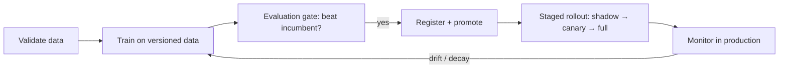

MLOps is the discipline of shipping and operating models reliably: the
lifecycle around a model, versioning, testing, deploying, monitoring, and
retraining, not the model itself. Review the Q&A, then take the concept
checks.

## Q&A

### What is MLOps, and how does it differ from traditional DevOps?

MLOps applies DevOps practices (automation, CI/CD, monitoring) to machine
learning, but with an extra moving part: **data**. A traditional app is
code plus config; an ML system is code plus **data** plus a **trained
model**, and all three must be versioned, tested, and reproducible.
Models also **decay** as the world changes even when the code is frozen,
so continuous monitoring and retraining are first-class concerns that
plain DevOps doesn't address.

### What do you need to version to reproduce a model?

Four things: the **code** (in git), the **data** (a snapshot or query
pinned to a timestamp), the **config** (hyperparameters, random seeds,
feature definitions), and the resulting **model artifact**. Reproducibility
means regenerating the exact same artifact from the same code, data, and
config. Container images pin the environment so library versions don't
drift underneath you.

### What is a model registry?

A centralized store that versions trained model artifacts alongside their
metadata: training-data version, hyperparameters, evaluation metrics, and
deployment history. It enforces a promotion workflow (staging →
production), gives you a single source of truth for "what's deployed," and
makes rollback a lookup rather than a rebuild. Examples: MLflow Model
Registry, SageMaker Model Registry, Vertex AI Model Registry.

### What is a feature store, and what problem does it solve?

A feature store centrally defines, stores, and serves features for both
training and serving. It solves two problems: **reuse** (teams share
vetted feature definitions) and **train/serve consistency** (one
transformation path backs both), which is the main defense against
training–serving skew. The **offline store** (warehouse/lake) holds
historical values for building training sets; the **online store**
(Redis, DynamoDB) serves the latest values at low latency for inference.

### What is training–serving skew?

When a feature is computed **differently** at training time than at
serving time, different code, data source, or timing, so the model
receives inputs in production it never saw in training. Offline metrics
look healthy while production quietly underperforms. The fix is a single
shared feature-computation path (a feature store or shared transform
library) rather than reimplementing the logic in the serving service.

### Batch vs online inference, and how do you choose?

**Batch** precomputes predictions on a schedule and stores them, cheap and
high-throughput but stale and unable to use request-time context.
**Online** serves per request behind a low-latency service, fresh and
contextual but you own latency, scaling, and availability. Choose by the
freshness and latency the product needs; a common hybrid caches batch
features and does light online scoring on top.

### What are the stages of a CI/CD pipeline for models?

Continuous integration and delivery for ML typically runs: (1) **data
validation** on new data; (2) **unit/integration tests** for feature
transforms and preprocessing; (3) a **training run** on a versioned
dataset; (4) an **evaluation gate**, the candidate must beat the incumbent
on a holdout set before it advances; (5) **registry promotion**; (6) a
**staged rollout** (shadow, then canary, then full). The whole thing is
triggered by code, data, or schedule changes.

### What is an evaluation gate, and why is it essential?

An evaluation gate is an automated check that a newly trained model must
pass, typically beating the current production model on a fixed holdout
set (and clearing minimum thresholds on fairness or slice metrics), before
it can be promoted. Without it, an automated retraining pipeline could
silently ship a regression. It turns "is the new model actually better?"
into a build-breaking test rather than a manual judgment call.

### What is continuous training (CT)?

Continuous training automates retraining as new data arrives or the model
decays, so the pipeline, not a person, produces fresh model versions. It's
triggered by a schedule, a drift alert, a performance drop, or accumulated
labeled data, and always routes the candidate through the same evaluation
gate and staged rollout. CT is what distinguishes a mature MLOps setup
from one-off manual retraining.

### How do you monitor a model in production?

Track two layers. **Operational** health: latency (p50/p95/p99), error
rate, throughput, resource use. **Model** health: input feature
distributions (data drift), the prediction distribution, and, once labels
arrive, live accuracy/precision/recall. Log inputs and predictions for
debugging and replay, alert on drift and degradation, and wire alerts to a
retraining and rollback path.

### Data drift vs concept drift vs performance degradation?

**Data drift** is the input distribution shifting (a new user segment,
a changed sensor unit). **Concept drift** is the input→label relationship
shifting (fraud tactics evolve, so the same features now mean something
different). **Performance degradation** is the measurable accuracy drop
that either can cause. Drift is the leading indicator you can watch before
labels arrive; degradation is confirmed once they do.

### How do you detect drift when labels are delayed or unavailable?

Watch distributions instead of accuracy. Compare production feature and
prediction distributions against a training reference using the
**population stability index (PSI)**, KL divergence, or a
Kolmogorov–Smirnov test per feature. A PSI above ~0.2 signals a meaningful
shift worth acting on. These proxy signals fire before the true labels
(chargebacks, conversions) come back days or weeks later.

### What is a shadow deployment?

A shadow (mirror) deployment routes live production traffic to both the
current model and a challenger simultaneously, but the challenger's
predictions are **logged, never returned to users**. It lets you compare
output distributions, latency, and error rates under real traffic with
zero user risk, making it the lowest-risk pre-release validation step.

### What is a canary deployment?

A canary routes a small fraction of traffic (1–5%) to the new version
while the rest stays on the incumbent. You watch guardrail metrics
(business and model health) and ramp traffic up only if they hold; if they
degrade, you immediately shift back. It's the standard step after shadow
validation and before a full rollout.

### How does blue/green deployment apply to models?

Blue/green keeps two full environments: **blue** (current) serves all
traffic while **green** (new) is deployed and warmed up. You flip traffic
to green in one switch; if anything breaks, you flip back to blue
instantly. It gives near-zero-downtime releases and trivial rollback, at
the cost of running two environments during the cutover. Canary is a
finer-grained, gradual variant of the same idea.

### How do you roll back a model safely?

Keep the previous artifact and its serving config in the registry. Most
platforms (SageMaker, Vertex, Kubernetes + Seldon) support weighted or
blue/green traffic switching, so rollback is a **config change, not a
redeploy**. Account for downstream state, feature-store writes, A/B
assignment logs, and caches, that a rolled-back model may interact with.
Rehearse rollback so it's a boring, well-understood operation.

### How do you version training data?

**DVC** tracks dataset snapshots alongside git commits; warehouse
time-travel (Delta Lake, Iceberg) lets you query data as-of a past
timestamp; immutable, date-partitioned object-store paths give simple
versioning. The goal is to reconstruct the exact training set behind any
past model version, both for reproducibility and for debugging a
regression back to a specific data change.

### What tools support experiment tracking, and why does it matter?

Tools like **MLflow** and **Weights & Biases** log every run's
hyperparameters, metrics, code version, and artifacts so experiments are
comparable and reproducible rather than lost in notebooks. Without
tracking, you can't reliably answer "which configuration produced the
model in production?" or reproduce a good result weeks later. Tracking is
the audit trail that ties a deployed model back to how it was made.

### How do you package a model for deployment?

Serialize the trained artifact (pickle/joblib, SavedModel,
TorchScript/ONNX), pin the runtime and dependencies, and wrap it in a
container so the serving environment matches training exactly. Exporting
to a framework-neutral format like **ONNX** decouples the model from the
training framework and enables optimized runtimes (ONNX Runtime,
TensorRT). The container plus a versioned artifact is the promotable unit.

### What is a champion/challenger setup?

The **champion** is the model currently serving production; one or more
**challengers** run alongside it, in shadow or on a small canary slice, to
prove they're better on live traffic before being promoted. It formalizes
continuous improvement: every candidate must beat the reigning champion on
real data, not just an offline benchmark, to take its place.

## Concept checks

<MultipleChoice
  markdown={`Your model scores well offline but underperforms in production. Investigation shows a feature is computed one way in the training pipeline and another way in the serving service. What is this, and the fix?

- Concept drift; retrain more frequently.
  > Drift is the world changing over time. Here the feature *computation* differs between train and serve, a static mismatch.
- [o] Training–serving skew; unify the feature-computation path (e.g. a feature store or shared transform library).
  > Identical feature logic at train and serve time eliminates the discrepancy; a shared path is the standard fix.
- Overfitting; add regularization.
  > Overfitting shows as a train/validation gap offline, not a train-vs-serve mismatch.
- Data leakage; drop the leaking feature.
  > Leakage is using future/target information as a feature, a different failure mode.`}
/>

<MultipleChoice
  markdown={`An automated retraining pipeline pushes a new model to production every week. What single safeguard best prevents it from silently shipping a worse model?

- Increase the training-data size each week.
  > More data may help quality but doesn't verify the new model is actually better before it ships.
- [o] An evaluation gate: the candidate must beat the incumbent on a fixed holdout set before promotion.
  > The gate turns "is it better?" into a build-breaking test, blocking regressions from reaching users automatically.
- Deploy directly and rely on users to report problems.
  > That exposes users to regressions and detects failures only after harm; a gate catches them pre-deploy.
- Retrain less often to reduce risk.
  > Slower cadence doesn't guarantee quality; you still need an objective check on each candidate.`}
/>

<MultipleChoice
  markdown={`You want to validate a new model on real production traffic with zero risk to users before exposing anyone to it. Which rollout step fits?

- Full deployment, then monitor closely.
  > That exposes 100% of users immediately, the opposite of zero-risk validation.
- [o] Shadow deployment, mirror live traffic to the challenger and log its predictions without returning them.
  > Users only see the champion; you compare the challenger's outputs, latency, and errors under real load risk-free.
- Canary at 50% of traffic.
  > A 50% canary already exposes half your users; canary is a later, gradual step after shadow validation.
- A/B test tied to revenue.
  > An A/B test shows real users the challenger's predictions, which isn't zero user exposure.`}
/>

## Go deeper

- [Machine Learning with scikit-learn](/courses/machine-learning-scikit-learn)
- [Scientific Computing with Python](/courses/scientific-computing-python)
