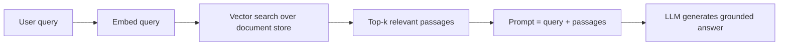

Large language models are now a standard interview topic even for
non-NLP roles. Expect questions on how text becomes vectors, how attention
and transformers work, and how you adapt, prompt, ground, and evaluate an
LLM. Review the Q&A, then take the concept checks.

<Figure
  slug="interview-machine-learning-engineer-nlp-and-llms-cutout"
  alt="A row of blank tiles on a platform with thin links fanning from one tile to every other tile, and a side drawer feeding extra retrieved tiles into the row"
/>

## Q&A

### What is tokenization, and why is subword tokenization standard?

Tokenization splits text into the units a model actually consumes.
Word-level tokenization has huge vocabularies and no way to handle
out-of-vocabulary words; character-level keeps sequences very long.
**Subword** schemes, byte-pair encoding (BPE), WordPiece, SentencePiece,
strike the balance: frequent words stay whole, rare words split into
reusable pieces, so any string is representable with a fixed, modest
vocabulary.

```python
# Illustrative: subword tokenization splits rare words into pieces
"tokenization" -> ["token", "ization"]
"unhappiness"  -> ["un", "happiness"]
# Common words stay whole; rare ones decompose into known subwords.
```

### What are word embeddings? Contrast word2vec and GloVe.

Embeddings are dense vectors where similar words land near each other, so
the model works with meaning rather than arbitrary ids. **word2vec** learns
them predictively, skip-gram predicts context words from a target (or CBOW
does the reverse), via a shallow network. **GloVe** learns them by
factorizing a global word co-occurrence matrix. Both produce **static**
vectors capturing analogies like `king - man + woman ≈ queen`.

### What is the difference between static and contextual embeddings?

A static embedding (word2vec, GloVe) gives a word **one** vector regardless
of context, so "bank" (river vs money) collapses into a single point.
**Contextual** embeddings from transformers (ELMo, BERT) produce a
**different** vector for each occurrence, computed from the surrounding
words, so the two senses of "bank" get different representations. This
context-sensitivity is a big reason transformers outperformed earlier
methods.

### What is self-attention?

Self-attention lets each token look at every other token and pull in the
information it needs. Each token is projected into a **query**, **key**, and
**value**; the weight from one token to another is the scaled dot product of
their query and key, softmax-normalized, and the output is the weighted sum
of values:

$$\text{Attention}(Q, K, V) = \text{softmax}\!\left(\frac{QK^\top}{\sqrt{d_k}}\right)V$$

The $\sqrt{d_k}$ scaling keeps dot products from saturating the softmax.
Every pair of positions is one hop apart, so long-range dependencies are
easy, at $O(n^2)$ cost in sequence length.

### What is multi-head attention, and why use it?

Rather than one attention over the full dimension, multi-head attention
splits the representation into several subspaces and runs attention in each
in parallel, then concatenates. Different heads specialize, one might track
syntax, another coreference, giving the model several relationship "views"
at roughly the same cost as single-head attention.

### Describe the transformer architecture.

A transformer stacks blocks of **multi-head self-attention** and a
position-wise **feed-forward network**, each wrapped in a **residual
connection** and **layer normalization**. Since attention ignores order,
**positional encodings** inject sequence position. Encoder-only models
(BERT) use bidirectional attention for understanding; decoder-only models
(GPT) use causal masking for generation; encoder-decoder models (T5) do
sequence-to-sequence. Dropping recurrence makes training parallel across
all positions.

### Why did transformers replace RNNs for most NLP?

RNNs process tokens sequentially and pass information through a single
hidden state, which throttles both training speed and long-range memory
(gradients vanish over many steps). Transformers process all positions in
parallel and connect any two tokens directly through attention, so they
train far faster on modern hardware and capture long-range dependencies
much better. The trade-off is attention's quadratic cost in sequence
length.

### What is pretraining, and what objectives are used?

Pretraining trains a model on a huge unlabeled corpus with a
self-supervised objective, learning general language structure before any
task. **Masked language modeling (MLM)**, used by BERT, hides tokens and
predicts them from both sides. **Causal (autoregressive) language
modeling**, used by GPT, predicts the next token from the left context
only, which is what enables generation.

### What is the difference between pretraining and fine-tuning?

**Pretraining** is the expensive, once-per-model phase that learns general
language ability from massive unlabeled data. **Fine-tuning** cheaply
adapts that pretrained model to a specific task or domain on a much smaller
labeled dataset. **Instruction tuning** and **RLHF** (reinforcement
learning from human feedback) are later alignment stages that make a base
model follow instructions and match human preferences.

### What is parameter-efficient fine-tuning (e.g., LoRA)?

Full fine-tuning updates every weight, expensive to train and store per
task. **LoRA** (low-rank adaptation) freezes the base model and learns
small low-rank update matrices injected into the attention layers, so you
train and ship a few million parameters instead of billions. Adapters and
prefix tuning are similar ideas: adapt with a tiny fraction of the
parameters while keeping the backbone frozen and shareable.

### What is prompting, and what are zero-shot, few-shot, and chain-of-thought?

Prompting steers a frozen model with the input text alone, no weight
updates. **Zero-shot** just describes the task; **few-shot** includes a few
worked examples in the prompt so the model infers the pattern in-context;
**chain-of-thought** asks the model to reason step by step, which improves
multi-step and arithmetic tasks. Prompt design is often the cheapest lever
before reaching for fine-tuning.

### What is retrieval-augmented generation (RAG), and why use it?

RAG grounds an LLM in external knowledge: the query is embedded, a vector
store returns the most relevant documents (by cosine similarity), and those
passages are inserted into the prompt as context for the model to answer
from. It reduces hallucination, supplies up-to-date or private knowledge
without retraining, and lets you cite sources.



### When would you choose RAG over fine-tuning, and vice versa?

Use **RAG** when the model needs **knowledge**, facts that change, are
private, or are too large to memorize, since you can update the document
store without retraining and get citations. Use **fine-tuning** when you
need to change **behavior or format**, a consistent style, a domain
vocabulary, or a structured output the base model doesn't produce. They
compose: fine-tune for behavior, retrieve for facts.

### What is a context window, and why does its size matter?

The context window is the maximum number of tokens (prompt plus generation)
a model can attend to at once. Everything the model "knows" for a request,
instructions, retrieved documents, conversation history, must fit inside
it. It matters because self-attention scales **quadratically** with
sequence length, so longer windows cost more compute and memory, and
information beyond the limit is simply invisible to the model.

### What causes hallucination, and how do you mitigate it?

LLMs are trained to produce fluent, probable text, not to verify facts, so
they confidently generate plausible but false statements, especially
outside their training distribution or on niche facts. Mitigations:
**ground** the model with RAG and require citations, lower the sampling
**temperature** for factual tasks, add verification or self-consistency
checks, and constrain outputs. No method eliminates hallucination entirely,
so keep humans in the loop for high-stakes uses.

### How do you control an LLM's output randomness?

**Temperature** scales the logits before softmax: near 0 is nearly greedy
and deterministic; higher values flatten the distribution for more
diverse, creative output. **Top-k** sampling restricts choices to the k
most likely tokens; **top-p (nucleus)** sampling keeps the smallest set of
tokens whose cumulative probability exceeds p. Use low temperature for
factual/extraction tasks and higher for brainstorming.

### How do you evaluate an LLM or NLP model?

It depends on the task. **Perplexity** measures language-modeling quality
intrinsically. Generation uses reference-overlap metrics, **BLEU** for
translation, **ROUGE** for summarization, plus **exact match** and **F1**
for extractive QA. Because overlap metrics miss meaning, teams increasingly
rely on **human evaluation** and **LLM-as-judge** (a strong model scores
outputs against a rubric), ideally on a held-out, task-representative set.

### What are embeddings used for beyond input representation?

Sentence and document embeddings power **semantic search**, retrieval,
clustering, deduplication, and recommendation: encode items into vectors
and compare them with cosine similarity or nearest-neighbor search in a
vector database. This is the retrieval half of RAG and the backbone of
"find things similar to this" features, no labels required.

### Why is attention's cost a scaling bottleneck for long documents?

Self-attention compares every token with every other, so compute and memory
grow as $O(n^2)$ in sequence length $n$. Doubling the context roughly
quadruples the attention cost, which is why very long contexts are
expensive and motivate efficient variants (sparse, sliding-window, or
linear attention) and retrieval instead of stuffing everything into the
prompt.

## Concept checks

<MultipleChoice
  markdown={`Why do modern LLMs use subword tokenization (BPE, WordPiece) instead of splitting on whole words?

- [o] It represents any string, including rare and unseen words, with a fixed vocabulary by decomposing them into known pieces.
  > Whole-word vocabularies can't handle out-of-vocabulary words; subwords keep the vocab bounded while covering everything.
- Subword tokens make the sequences shorter than word tokens.
  > Subword sequences are usually *longer* than word-level; length isn't the motivation.
- It makes the model case-insensitive.
  > Casing is a separate preprocessing choice, unrelated to subword splitting.
- It removes the need for embeddings.
  > Tokens are still mapped to embeddings; tokenization only decides the units.`}
/>

<MultipleChoice
  markdown={`Your assistant must answer questions about your company's constantly-changing internal docs and cite sources. What's the most appropriate approach?

- Raise the temperature so the model is more creative.
  > Higher temperature increases randomness and hallucination, the opposite of grounded, sourced answers.
- [o] Retrieval-augmented generation: embed the query, retrieve relevant passages, and put them in the prompt.
  > RAG injects fresh, private knowledge at query time without retraining and lets you cite the retrieved sources.
- Increase the context window and paste the entire document store into every prompt.
  > That's expensive (attention is quadratic) and often exceeds the window; retrieval selects only what's relevant.
- Fine-tune the base model nightly on the latest docs.
  > Retraining daily is costly, slow to update, and still doesn't produce citations for retrieved facts.`}
/>

<MultipleChoice
  markdown={`Why does doubling an LLM's context length more than double the attention compute?

- [o] Self-attention compares every token with every other, so cost grows quadratically, roughly 4x for 2x the length.
  > Each of n tokens attends to all n tokens, giving O(n^2) compute and memory in sequence length.
- Because the vocabulary size doubles with the context.
  > Vocabulary is fixed and independent of sequence length.
- It doesn't; attention cost is linear in length.
  > Standard self-attention is quadratic; that quadratic cost is exactly the long-context bottleneck.
- Because the model adds more layers for longer inputs.
  > Layer count is fixed by the architecture, not by the input length.`}
/>

## Go deeper

- [Natural Language Processing with Python](/courses/natural-language-processing-python)
- [Machine Learning with scikit-learn](/courses/machine-learning-scikit-learn)
