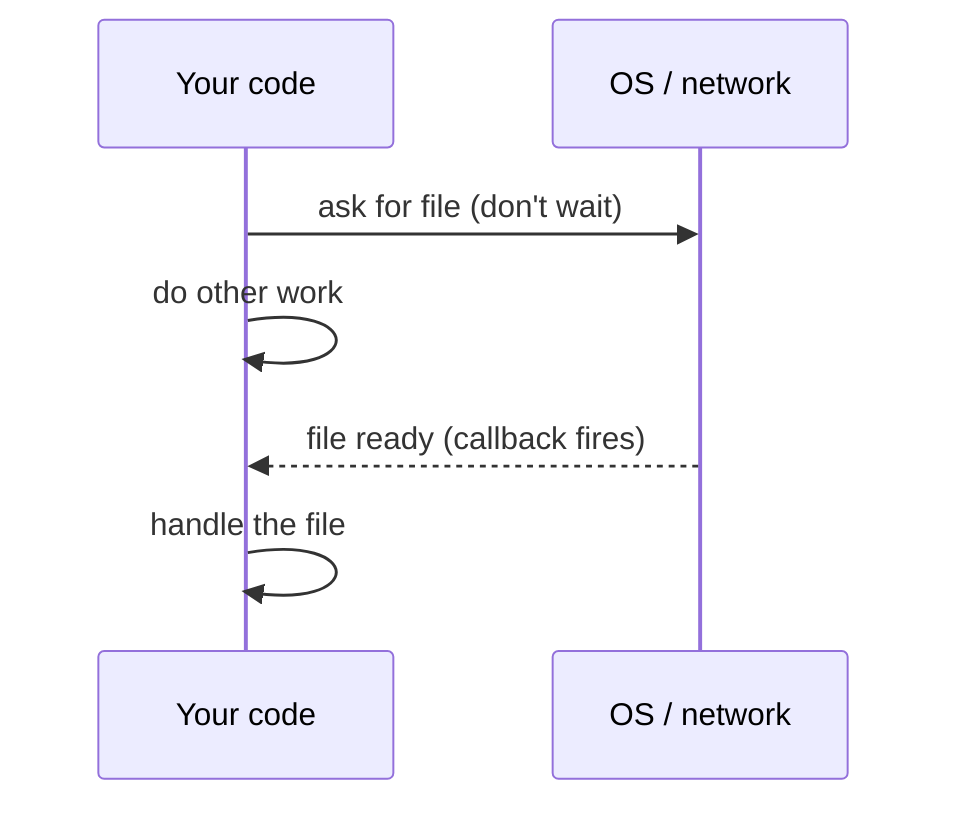

Most of the code you've written so far executes top-to-bottom,
one line after another. Asynchronous code breaks that rule —
some work is *started now* but *finishes later*. To use it
effectively, you need a different mental model.

This chapter builds the intuition first, without the syntax. The
next chapter introduces Promises and `async`/`await`.

## Why async exists at all

Many real things take time:

- Reading a file from disk.
- Asking another computer for data (an HTTP request).
- Waiting for the user to click a button.
- Waiting for a timer to fire.

A synchronous version of "fetch some data" would mean: *stop the
entire program* until the data arrives. With a single-threaded
language like JavaScript, that's catastrophic — the UI freezes,
no other code runs, and your one CPU sits idle waiting.

The async philosophy is:

> Start the slow work, *don't wait*, do something else, and
> arrange to be notified when it's done.

A program that adopts this style stays *responsive*. It can
overlap many slow operations without blocking, even on a single
thread.

## A non-blocking everyday metaphor

Imagine ordering at a café:

- **Synchronous (bad):** you order, then *stand at the counter
  staring*, refusing to move until your drink is ready. No one
  else can be served.
- **Asynchronous (good):** you order, get a buzzer, sit down, and
  do something else. The buzzer fires when your drink is ready.

JavaScript's runtime is the café. Your code is the customer. The
buzzer is a **callback** or a **promise**.

## Callbacks: "tell me when you're done"

A **callback** is a function you give to another function so it
can be called back later. Many older async APIs use this pattern.

<CodeBlock
  adapter="javascript"
  starterCode={`console.log("1: requesting");

setTimeout(() => {
  console.log("3: timer fired");
}, 200);

console.log("2: kept going");
`}
/>

Read the output carefully: `1`, `2`, `3`. The arrow function we
gave `setTimeout` is a **callback**. We didn't *call* it ourselves
— we *gave* it to `setTimeout` to call later.

This is the heart of async thinking:

> You're not writing code that "fetches data". You're writing
> code that says **"when the data arrives, do this."**

### A simulated fetch

Real fetching needs the network. We can simulate the *shape* with
a timer.

<CodeBlock
  adapter="javascript"
  starterCode={`function fakeFetchUser(id, callback) {
  console.log("Pretending to call API...");
  setTimeout(() => {
    // Pretend this is the response from the server.
    callback(null, { id, name: "User " + id });
  }, 300);
}

fakeFetchUser(42, (err, user) => {
  if (err) {
    console.error("Failed:", err);
    return;
  }
  console.log("Got user:", user);
});

console.log("Request is in flight; doing other work...");
`}
/>

A few important conventions in the old-style callback world:

- The callback is the **last parameter**.
- The first argument is the **error** (or `null` if there wasn't one).
- The remaining arguments are the **result**.

This is called the *Node-style* or *error-first* callback pattern.

## The pain: callback hell

Callbacks scale poorly. When one async result feeds the next, you
end up with deeply nested code.

<CodeBlock
  adapter="javascript"
  starterCode={`function later(value, ms, cb) {
  setTimeout(() => cb(null, value), ms);
}

// Pretend each step depends on the previous result.
later("step 1", 100, (err, a) => {
  if (err) return console.error(err);
  later(a + " -> step 2", 100, (err, b) => {
    if (err) return console.error(err);
    later(b + " -> step 3", 100, (err, c) => {
      if (err) return console.error(err);
      later(c + " -> step 4", 100, (err, d) => {
        if (err) return console.error(err);
        console.log(d);
      });
    });
  });
});
`}
/>

This "rightward drift" is famously called **callback hell** or
the **pyramid of doom**. Worse, error handling has to be repeated
at every level. Promises (next chapter) were invented specifically
to flatten this.

## Concurrency without parallelism

<Illustration name="async-handoff" />

A subtle but important word distinction:

- **Concurrent**: many tasks are *in progress* during overlapping
  periods of time. They don't have to *run* simultaneously.
- **Parallel**: many tasks literally run *at the same time* on
  separate CPU cores.

JavaScript gives you *concurrency* on a single thread. While one
async task is "in flight" (waiting for the host to do something),
your code can start another one. They make progress together,
but only one bit of JS is executing at any given moment.

```mermaid
gantt
    title One thread, many concurrent async operations
    dateFormat  X
    axisFormat  %s
    section JS thread
    sync code    :a1, 0, 1
    callback A   :a2, 4, 1
    callback B   :a3, 6, 1
    section Async work (host does this)
    waiting for A  :crit, 1, 3
    waiting for B  :crit, 2, 4
```

The JS thread is only ever busy in the *short* bursts; the *long*
waits happen elsewhere.

## Order is not what it looks like

This is the biggest mental shift. The order code is *written* in
isn't always the order it *runs* in.

<CodeBlock
  adapter="javascript"
  starterCode={`console.log("A");

setTimeout(() => console.log("B"), 0);

console.log("C");

setTimeout(() => console.log("D"), 0);

console.log("E");
`}
/>

Output is `A C E B D`. The `setTimeout` callbacks wait until the
synchronous code finishes. *Reading* this requires you to mentally
split the code into:

- the synchronous "now" part: A, C, E
- the asynchronous "later" parts: B, D

If your prediction was `A B C D E`, you were reading the code as
a story. Async code isn't a story — it's a *schedule*.

## A "do N things and then continue" pattern

A common need: start several async tasks, do something once
they're *all* done. With callbacks alone, this requires manual
counting.

<CodeBlock
  adapter="javascript"
  starterCode={`function loadAll(urls, done) {
  const results = new Array(urls.length);
  let remaining = urls.length;

  urls.forEach((url, i) => {
    fakeFetch(url, (err, data) => {
      if (err) return done(err);
      results[i] = data;
      remaining--;
      if (remaining === 0) done(null, results);
    });
  });
}

function fakeFetch(url, cb) {
  setTimeout(() => cb(null, "data for " + url), Math.random() * 200);
}

loadAll(["/a", "/b", "/c"], (err, results) => {
  if (err) console.error(err);
  else console.log("All done:", results);
});
`}
/>

Counting-down patterns like `remaining--` are easy to get wrong.
That's another problem Promises solve: `Promise.all` does this
counting for you.

## Mental model checklist

Before you write any async code, ask:

1. **What slow thing am I waiting for?**
   (timer, network, file, user input, another promise…)
2. **What should run when it finishes successfully?**
3. **What should run if it fails?**
4. **Does anything else depend on it being done?**

If you can answer those four questions, you can almost always
sketch the async code, regardless of the syntax in front of you.

## Multi-file: a tiny event bus

Async thinking goes beyond fetching. Many systems use an
**event bus**: parts of the program register interest ("call me
when X happens"), and another part publishes events. This is
callback-driven by design.

<CodeBlock
  adapter="javascript"
  entryFilename="index.js"
  files={[
    {
      filename: "index.js",
      initialContent: `const { createBus } = require("./bus");

const bus = createBus();

// Subscribers register a callback for an event name.
bus.on("user-login", (user) => console.log("welcome banner:", user.name));
bus.on("user-login", (user) => console.log("analytics: login by", user.name));

// Later, some other code emits the event:
setTimeout(() => bus.emit("user-login", { name: "Ada" }), 200);
setTimeout(() => bus.emit("user-login", { name: "Linus" }), 400);

console.log("main: subscriptions registered, waiting for events...");
`,
    },
    {
      filename: "bus.js",
      initialContent: `function createBus() {
  const listeners = {}; // eventName -> array of callbacks

  function on(event, cb) {
    (listeners[event] = listeners[event] || []).push(cb);
  }

  function emit(event, payload) {
    const cbs = listeners[event] || [];
    for (const cb of cbs) cb(payload);
  }

  return { on, emit };
}

module.exports = { createBus };
`,
    },
  ]}
/>

There's no Promise here — just callbacks. This is the same
pattern the DOM uses (`element.addEventListener`), Node uses
(`EventEmitter`), and many libraries use internally.

## Challenge

<ChallengeCard
  adapter="javascript"
  title="Sequence callbacks"
  instructions={`Write a function \`runSequentially(tasks, done)\` where:

- \`tasks\` is an array of functions. Each function takes a single argument: a callback \`cb(err, result)\`.
- Your function should run them ONE AT A TIME (not in parallel), passing each result into an accumulator array.
- When the last task finishes, call \`done(null, results)\` where \`results\` is an array of every result, in order.
- If any task calls its callback with an error, call \`done(err)\` immediately and run no more tasks.

This is a small but realistic exercise in "callback orchestration".`}
  starterCode={`function runSequentially(tasks, done) {
  // your code here
}

// Demo:
const tasks = [
  (cb) => setTimeout(() => cb(null, "a"), 50),
  (cb) => setTimeout(() => cb(null, "b"), 30),
  (cb) => setTimeout(() => cb(null, "c"), 10),
];

runSequentially(tasks, (err, results) => {
  if (err) console.error(err);
  else console.log(results); // ["a","b","c"]
});
`}
  solutionCode={`function runSequentially(tasks, done) {
  const results = [];
  let i = 0;

  function next() {
    if (i === tasks.length) {
      done(null, results);
      return;
    }
    tasks[i]((err, value) => {
      if (err) return done(err);
      results.push(value);
      i++;
      next();
    });
  }

  next();
}

const tasks = [
  (cb) => setTimeout(() => cb(null, "a"), 50),
  (cb) => setTimeout(() => cb(null, "b"), 30),
  (cb) => setTimeout(() => cb(null, "c"), 10),
];

runSequentially(tasks, (err, results) => {
  if (err) console.error(err);
  else console.log(results);
});
`}
  tests={[
    {
      id: "happy_path",
      name: "Runs all tasks and collects results in order",
      description: "['a','b','c']",
      code: `(function () {
  const tasks = [
    (cb) => setTimeout(() => cb(null, "a"), 20),
    (cb) => setTimeout(() => cb(null, "b"), 10),
    (cb) => setTimeout(() => cb(null, "c"), 5),
  ];
  return new Promise((resolve, reject) => {
    runSequentially(tasks, (err, results) => {
      if (err) return reject(err);
      try {
        if (JSON.stringify(results) !== JSON.stringify(["a","b","c"])) {
          throw new Error("expected ['a','b','c'] got " + JSON.stringify(results));
        }
        resolve();
      } catch (e) { reject(e); }
    });
  });
})();`,
    },
    {
      id: "error_short_circuits",
      name: "Stops on first error",
      description: "Calls done(err) without finishing",
      code: `(function () {
  let ran3 = false;
  const tasks = [
    (cb) => setTimeout(() => cb(null, "a"), 5),
    (cb) => setTimeout(() => cb(new Error("nope")), 5),
    (cb) => { ran3 = true; cb(null, "c"); },
  ];
  return new Promise((resolve, reject) => {
    runSequentially(tasks, (err) => {
      try {
        if (!err) throw new Error("expected an error");
        if (ran3) throw new Error("must not run later tasks after an error");
        resolve();
      } catch (e) { reject(e); }
    });
  });
})();`,
    },
    {
      id: "sequential_not_parallel",
      name: "Tasks run sequentially",
      description: "Task 2 starts only after task 1 finishes",
      code: `(function () {
  const events = [];
  const tasks = [
    (cb) => { events.push("1-start"); setTimeout(() => { events.push("1-end"); cb(null, 1); }, 20); },
    (cb) => { events.push("2-start"); setTimeout(() => { events.push("2-end"); cb(null, 2); }, 5); },
  ];
  return new Promise((resolve, reject) => {
    runSequentially(tasks, () => {
      try {
        if (JSON.stringify(events) !== JSON.stringify(["1-start","1-end","2-start","2-end"])) {
          throw new Error("tasks must run one at a time; got " + JSON.stringify(events));
        }
        resolve();
      } catch (e) { reject(e); }
    });
  });
})();`,
    },
  ]}
/>

---

<MultipleChoice
  markdown={`Why does JavaScript provide asynchronous APIs even though it runs on a single thread?

- Because it makes code faster on multi-core CPUs
  > JavaScript runs on a single thread and cannot use multiple CPU cores simultaneously; async APIs exist to avoid blocking that single thread, not to exploit parallelism.
- Because the language standard requires it
  > The ECMAScript specification defines the language itself; the decision to provide async APIs is a practical choice driven by the single-threaded execution model, not a mandate from the spec.
- [o] Because it lets the single thread stay busy on other work while waiting for slow operations, instead of blocking
  > Async is about *concurrency*, not parallelism. While the host is doing something slow (timers, network, disk), the JS thread is free to handle other code. Without async, every slow operation would freeze the entire program — including, in a browser, the UI.
- Because asynchronous code is always easier to read
  > Async code is often harder to read, especially with callbacks. The reason async exists is runtime efficiency, not readability.

JavaScript still runs one piece of code at a time — async simply lets it *choose* what to run instead of being stuck waiting.`}
/>
