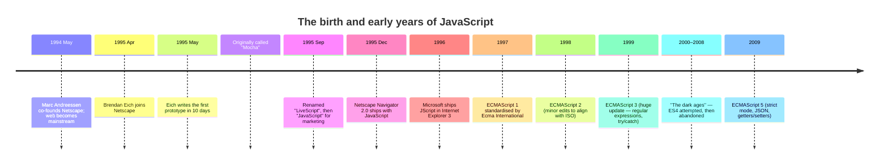

In April 1995, a programmer named **Brendan Eich** joined **Netscape
Communications**, the company that made the dominant web browser of
the day. Within weeks, he was handed an assignment that, in
hindsight, sounds absurd:

> *Design and implement a new programming language for the next
> release of Netscape Navigator. It must be embeddable directly in
> HTML pages. It must look familiar to Java programmers. It must be
> small and forgiving enough for amateurs and designers. We need a
> working prototype in ten days.*

Eich was 33 years old. He had a background in operating systems and
compilers, and a deep interest in *functional* and *object-oriented*
language design. He liked elegant, mathematically grounded languages
like **Scheme** (a tiny, beautiful descendant of Lisp). He was about
to invent something very different.

<Illustration
  name="ten-day-sprint"
  caption="Under real deadline pressure, Brendan Eich designed and built the first JavaScript prototype in just ten days in April 1995."
/>

## The constraints, in detail

Several decisions had already been made for him before he wrote a
single line of code:

1. **It must look like Java.** Java was the buzz of the industry,
   and Netscape's marketing wanted to ride that wave. The syntax —
   curly braces, semicolons, `if`, `while`, `for`, `function` — was
   essentially mandatory.
2. **It must be tiny.** It would live inside an `<script>` tag, run
   in milliseconds, and not require a separate compiler.
3. **It must never crash the browser.** A bug in a script on some
   random web page must not bring down Navigator. The language had
   to be *forgiving* — silent coercions instead of hard errors,
   defaults for missing values, no risky pointer operations.
4. **It must ship in weeks.** There was no time to design a clean,
   minimalist language and revise it for years. Whatever Eich
   shipped would be locked in by deployment to millions of users.

These are not the conditions under which a beautiful language gets
designed. They are the conditions under which a *useful, weird,
incredibly successful* language gets designed.

## The first prototype

Eich worked feverishly. In **ten days in May 1995**, he produced a
working prototype. The language was internally called **Mocha**, then
**LiveScript**, and finally — for marketing reasons, to ride Java's
hype — **JavaScript**.

The choice of name was, in hindsight, one of the most consequential
marketing decisions in software history. JavaScript and Java are
**not the same language**. They are not from the same family. They
share little more than curly braces. But the name "JavaScript" stuck
forever, and to this day beginners ask *"is Java like JavaScript?"*
and seasoned programmers grit their teeth.

Inside Mocha/LiveScript/JavaScript, Eich smuggled in ideas that had
nothing to do with Java:

- **First-class functions** from Scheme. A function in JavaScript is
  a value — you can store it in a variable, pass it as an argument,
  return it from another function. This is the bedrock of modern
  JavaScript style.
- **Prototype-based objects** from a niche language called **Self**.
  Instead of classes-as-blueprints (as in Java), JavaScript objects
  inherit directly from other objects.
- **Dynamic typing** from a long lineage of scripting languages.
  Variables don't have a fixed type; values do.
- **A tiny set of primitive types** (number, string, boolean, null,
  undefined) and one universal container (the object).

The Java-flavoured syntax was the **disguise**. The Scheme-and-Self
soul was the **substance**. To this day, learning JavaScript well
means slowly noticing the Scheme/Self ideas peeking out from behind
the Java-shaped curly braces.

## The first JavaScript program in the wild

By the end of 1995, **Netscape Navigator 2.0** shipped with
JavaScript built in. Web designers could now write things like this
directly inside their HTML:

```html
<script>
  // Validate before submitting!
  function checkForm() {
    if (document.forms[0].email.value === "") {
      alert("Please enter your email.");
      return false;
    }
    return true;
  }
</script>
```

This looks unremarkable now. In late 1995, it was magical. A web
page could *react* to the user without asking the server. Designers
who had never written software in their lives could make their
pages come alive.

Microsoft, watching from across the industry, panicked. In 1996, they
reverse-engineered JavaScript and shipped their own version inside
Internet Explorer 3. They called it **JScript**, partly to avoid
trademark issues with the name "Java", and partly because Microsoft
was Microsoft. The two implementations were similar but not
identical — and the great browser wars began, with web developers
caught in the middle.

To bring order to the chaos, Netscape and Microsoft both submitted
the language to a standards body called **Ecma International**. The
standardised version of the language was called **ECMAScript**
(yes, an ugly name — "JavaScript" was a trademark held by Sun, and
politics required a different word). To this day, the *language* is
formally ECMAScript and **JavaScript** is the popular name for it.



## What the language actually was

Strip away the marketing and the lawsuits, and that first JavaScript
was a tiny language with a few simple ingredients:

- A handful of **primitive values**: numbers, strings, `true`,
  `false`, and a couple of "absence" values (`null` and `undefined`).
- A single composite shape: the **object** — a bag of named values.
- **Functions** as first-class citizens, able to be stored, passed,
  and returned.
- A small set of **control structures** — `if`, `while`, `for`,
  `return`.
- Automatic memory management — you never write `malloc` or `free`.
- And a single, surprisingly powerful idea: **almost anything can be
  reshaped at runtime.** You can add properties to objects, change
  the behaviour of functions, even modify built-in types.

Notice what is *not* in that list:

- No types you have to declare ahead of time.
- No separate compile step.
- No threading.
- No file system access (it was a browser language!).
- No standard way to import code from other files (that came much,
  much later).

Almost every later feature of JavaScript — classes, modules,
`async`/`await`, destructuring, template literals — is something
added *on top of* that original tiny core, in a backward-compatible
way. The language has grown enormously since 1995, but it has never
been allowed to break the millions of web pages already in the wild.

## A taste of "1995-style" JavaScript

The original JavaScript was small, but it could already do a lot.
Here is a flavour of the kind of code that was being written back
then — and that still runs, unchanged, today.

<CodeBlock
  adapter="javascript"
  starterCode={`// A function is just a value with a name.
function greet(name) {
  return "Hello, " + name + "!";
}

// An object is just a bag of named values.
const user = {
  name: "Ada",
  age: 28,
};

console.log(greet(user.name));
console.log("Age:", user.age);

// You can add properties to an object at any time —
// JavaScript will not stop you.
user.email = "ada@example.com";
console.log("Email:", user.email);

// A function can be stored in a variable
// (and called via that variable).
const shout = function (text) {
  return text.toUpperCase() + "!!!";
};

console.log(shout("javascript was born in 1995"));
`}
/>

Notice the patterns:

- We declared a function, then later used it.
- We made an object with two properties, then *added a third one
  later*. JavaScript is happy to let us do that.
- We stored a function in a variable as if it were a number or a
  string. (That is the **first-class function** idea from Scheme.)

Every one of those design choices was made in those frantic ten days
in 1995, and every one of them shaped how the entire web works
today.

## Why this language, of all languages, took over

It is worth pausing to ask: **why** did this hurried, ten-day,
designed-by-pressure language end up running on every device
connected to the internet?

A few reasons, none of which are about elegance:

1. **It shipped first, and shipped in the most important place** —
   the world's most-used browser, at the exact moment the web was
   exploding.
2. **It was forgiving.** Beginners could ignore many subtleties,
   make mistakes, and still see something work. That accessibility
   pulled in millions of people who would never have learned a more
   strict language.
3. **It was light.** A tiny script in a tag could change a page —
   no installer, no plugin, no virtual machine to set up.
4. **It was universal.** No matter which browser, no matter which
   operating system, JavaScript was *there*. For a long time, it
   was the **only** programming language with that property.

JavaScript did not win because it was the best language. It won
because it was the **right language in the right place at the right
time**, and because nobody had a chance to replace it before it
became too entrenched.

Once JavaScript was everywhere, something interesting happened:
people started using it for things it was never designed for. That
is the next part of our story.

---

<MultipleChoice
  markdown={`Which of these statements best describes the design situation when Brendan Eich created JavaScript in 1995?

- He had several years to design and refine the language carefully
- [o] He had about ten days to ship a working prototype, with rigid constraints (look like Java, embed in HTML, never crash the browser, be friendly to beginners)
  > JavaScript was designed under extreme time pressure with externally imposed constraints. Many of the language's quirks — and its great strengths, like first-class functions and forgiving runtime behaviour — come directly from those conditions.
- He copied the language directly from an existing language called LiveScript
- He designed it as a pure functional language modelled on Haskell

Knowing this history makes JavaScript's mix of Java-flavoured syntax and Scheme-style flexibility much easier to understand.`}
/>
