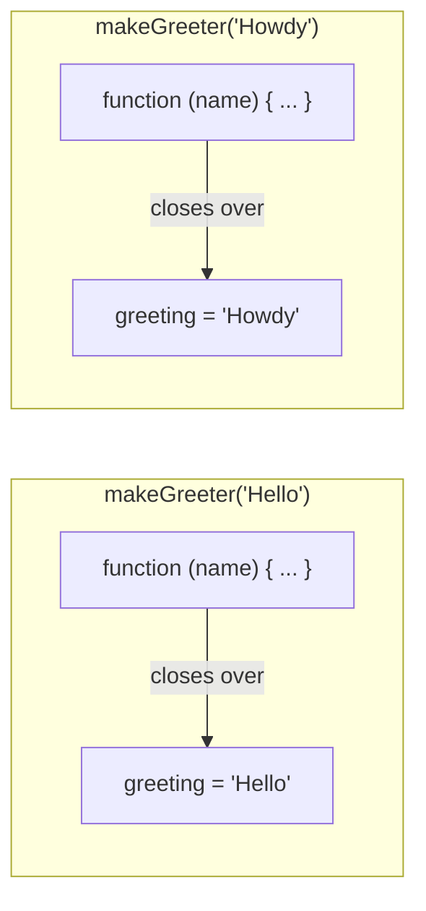
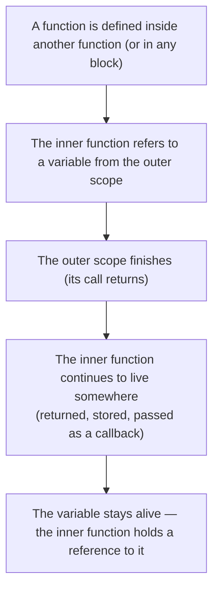

A **closure** is what you get when a function "remembers" the
variables from the scope where it was defined, even after that
scope has finished. Closures are one of the most powerful and
useful ideas in JavaScript, and once you see them clearly, an
enormous amount of real-world code starts to make sense.

## The simplest closure

Watch this carefully:

<CodeBlock
  adapter="javascript"
  starterCode={`function makeGreeter(greeting) {
  return function (name) {
    return greeting + ", " + name + "!";
  };
}

const hello = makeGreeter("Hello");
const howdy = makeGreeter("Howdy");

console.log(hello("Ada"));
console.log(hello("Linus"));
console.log(howdy("Grace"));
`}
/>

`makeGreeter` runs, then returns. Yet the inner function `hello`
remembers the value of `greeting` (`"Hello"`) that was in scope
when it was created. Even more impressively, `howdy` independently
remembers its *own* `greeting` (`"Howdy"`). The two are
completely separate.

That memory is the **closure**: the function `hello` "closed
over" the variable `greeting` from `makeGreeter`'s scope.

Each call to `makeGreeter` creates a separate "scope record"
holding its own `greeting`. The returned function carries a
reference to that record, keeping it alive.

## Closures and state

Closures let a function carry **private state** that survives
across calls, without exposing it to the outside world.

<CodeBlock
  adapter="javascript"
  starterCode={`function makeCounter() {
  let count = 0;            // private — no one else can see it directly
  return function () {
    count = count + 1;
    return count;
  };
}

const tick = makeCounter();
console.log(tick());   // 1
console.log(tick());   // 2
console.log(tick());   // 3

const tock = makeCounter();
console.log(tock());   // 1 — independent counter
console.log(tick());   // 4 — tick keeps going
`}
/>

This is huge. The counter behaves like a tiny object with private
data, built entirely out of a function. No `class`, no `this`,
no global variable.

## Why closures exist (the mechanics)

Earlier we said each call to a function creates a new scope, and
the local variables vanish when the call returns. **That second
part is not quite true.** A scope's variables vanish only when
*nothing* still references them. If a returned function still
points at those variables, the runtime keeps the scope alive in
memory.

This is one of the gifts of JavaScript's garbage collector. You
don't have to think about *when* the scope is freed; the runtime
does the bookkeeping. You just write the function and trust it.

## Closures over loop variables

A classic closure puzzle:

<CodeBlock
  adapter="javascript"
  starterCode={`// Build an array of functions, one per number 0..4.
const fs = [];
for (let i = 0; i < 5; i++) {
  fs.push(function () {
    return i;
  });
}

console.log(fs[0]());   // 0
console.log(fs[1]());   // 1
console.log(fs[2]());   // 2
console.log(fs[3]());   // 3
console.log(fs[4]());   // 4
`}
/>

Because we declared `i` with `let`, each iteration of the loop
gets its own fresh `i`. Each function closes over *that
iteration's* `i`. The functions print `0`, `1`, `2`, `3`, `4` —
just as you would expect.

Now try the same thing with the old `var` (which is
function-scoped, not block-scoped):

<CodeBlock
  adapter="javascript"
  starterCode={`const fs = [];
for (var i = 0; i < 5; i++) {
  fs.push(function () {
    return i;
  });
}

console.log(fs[0]());   // 5  (!)
console.log(fs[1]());   // 5
console.log(fs[2]());   // 5
console.log(fs[3]());   // 5
console.log(fs[4]());   // 5
`}
/>

Now every function shares the *same* `i`, the one declared by
`var` at the top of the enclosing function (the script). By the
time the loop ends, `i` is `5`, and every closure sees that
single, shared value.

This puzzle is one of the historical reasons we now use `let` for
loop counters. It is also a real test of your scope and closure
mental model.

## Practical closures: configuration and partial application

Closures are how JavaScript expresses many practical patterns.

### A configurable function

<CodeBlock
  adapter="javascript"
  starterCode={`function makeTaxCalculator(rate) {
  return function (amount) {
    return amount + amount * rate;
  };
}

const addUKTax = makeTaxCalculator(0.20);
const addUSCal = makeTaxCalculator(0.0725);

console.log(addUKTax(100));      // 120
console.log(addUSCal(100));      // 107.25
console.log(addUKTax(50));       // 60
`}
/>

`addUKTax` and `addUSCal` are two specialised versions of the same
underlying logic, each carrying its own rate. The rate is baked
into the closure once and never has to be passed again.

### Memoisation: remember past answers

<CodeBlock
  adapter="javascript"
  starterCode={`function memoize(fn) {
  const cache = new Map();
  return function (x) {
    if (cache.has(x)) {
      console.log("(cache hit for", x, ")");
      return cache.get(x);
    }
    const result = fn(x);
    cache.set(x, result);
    return result;
  };
}

function slowSquare(n) {
  console.log("  computing...");
  return n * n;
}

const fastSquare = memoize(slowSquare);

console.log(fastSquare(4));   // computes
console.log(fastSquare(4));   // cache hit
console.log(fastSquare(5));   // computes
console.log(fastSquare(5));   // cache hit
console.log(fastSquare(4));   // cache hit
`}
/>

The `cache` lives inside `memoize`'s call and is *only* accessible
through the returned function. It is a tiny, private piece of
state. No part of the program can corrupt it from outside.

## Closures and modules

Modules — collections of related functions and private data —
are essentially a use of closures. The "module pattern" in
pre-2015 JavaScript used closures explicitly:

<CodeBlock
  adapter="javascript"
  starterCode={`const counterModule = (function () {
  let count = 0;            // private state
  function increment() { count += 1; }
  function value() { return count; }
  function reset() { count = 0; }
  return { increment, value, reset };
})();

counterModule.increment();
counterModule.increment();
counterModule.increment();
console.log(counterModule.value());   // 3
counterModule.reset();
console.log(counterModule.value());   // 0
// counterModule.count       // undefined — count is private!
`}
/>

This pattern — called the **IIFE** ("immediately invoked function
expression") — was once everywhere. Modern code uses real
modules (we will see them later) instead, but the underlying idea
is still closures.

## A multi-file closure example

Closures cross module boundaries cleanly: an exported function
can carry private state inside it. The caller never has to see the
state directly.

<CodeBlock
  adapter="javascript"
  entryFilename="index.js"
  files={[
    {
      filename: "index.js",
      initialContent: `const { makeRateLimiter } = require("./rateLimiter");

const limiter = makeRateLimiter(3);

console.log(limiter("first"));    // allow
console.log(limiter("second"));   // allow
console.log(limiter("third"));    // allow
console.log(limiter("fourth"));   // deny
console.log(limiter("fifth"));    // deny
`,
    },
    {
      filename: "rateLimiter.js",
      initialContent: `// Returns a function that allows up to \`max\` calls, then denies the rest.
// The state (call count) lives in the closure — no globals, no leaks.
function makeRateLimiter(max) {
  let calls = 0;
  return function (label) {
    calls += 1;
    if (calls > max) {
      return label + ": DENY (limit " + max + " exceeded)";
    }
    return label + ": ALLOW (" + calls + "/" + max + ")";
  };
}

module.exports = { makeRateLimiter };
`,
    },
  ]}
/>

`index.js` has no way to read or reset the `calls` counter
directly. The only way it can interact with the state is to call
the returned function. That is **encapsulation** — and it's free,
just from how closures work.

## Closures, summarised

If you see a function holding onto values from where it was
created, you are looking at a closure.

## Challenge

<ChallengeCard
  adapter="javascript"
  title="Build your own counter factory"
  instructions={`Write a function \`makeCounter(start)\` that returns an *object* with three methods:

- \`increment()\` — increase the internal counter by 1 and return the new value.
- \`decrement()\` — decrease the internal counter by 1 and return the new value.
- \`value()\` — return the current value without changing it.

The starting value of the counter is the \`start\` argument (default \`0\`). Each call to \`makeCounter\` should produce an independent counter.`}
  starterCode={`function makeCounter(start = 0) {
  // your code here — keep \`count\` private via closure.
  return {
    increment() { return 0; },
    decrement() { return 0; },
    value()     { return 0; },
  };
}

const c = makeCounter(10);
console.log(c.value());      // 10
console.log(c.increment());  // 11
console.log(c.increment());  // 12
console.log(c.decrement());  // 11
console.log(c.value());      // 11
`}
  solutionCode={`function makeCounter(start = 0) {
  let count = start;
  return {
    increment() { count += 1; return count; },
    decrement() { count -= 1; return count; },
    value()     { return count; },
  };
}

const c = makeCounter(10);
console.log(c.value());
console.log(c.increment());
console.log(c.increment());
console.log(c.decrement());
console.log(c.value());
`}
  tests={[
    {
      id: "start_value",
      name: "Start value",
      description: "makeCounter(7).value() === 7",
      code: `const c = makeCounter(7);
if (c.value() !== 7) throw new Error("expected 7");`,
    },
    {
      id: "default_start",
      name: "Default start is 0",
      description: "makeCounter().value() === 0",
      code: `const c = makeCounter();
if (c.value() !== 0) throw new Error("expected 0");`,
    },
    {
      id: "increment_returns",
      name: "increment returns new value",
      description: "10 → 11",
      code: `const c = makeCounter(10);
if (c.increment() !== 11) throw new Error("expected 11");`,
    },
    {
      id: "decrement_returns",
      name: "decrement returns new value",
      description: "10 → 9",
      code: `const c = makeCounter(10);
if (c.decrement() !== 9) throw new Error("expected 9");`,
    },
    {
      id: "independent",
      name: "Counters are independent",
      description: "Two counters should not share state",
      code: `const a = makeCounter(0);
const b = makeCounter(100);
a.increment(); a.increment();
b.decrement();
if (a.value() !== 2) throw new Error("a should be 2");
if (b.value() !== 99) throw new Error("b should be 99");`,
    },
  ]}
/>

---

<MultipleChoice
  markdown={`What is a "closure" in JavaScript?

- A way to close (terminate) a function early
- A keyword that hides a variable from the outside world
- [o] A function that "remembers" the variables from the scope where it was defined, even after that scope has finished
  > When an inner function refers to a variable from its enclosing scope, JavaScript keeps that variable alive for as long as the inner function exists. This lets us create private state, configurable functions, memoisation caches, modules, and many other powerful patterns — all built on the same underlying mechanism.
- A way to copy values into a function

Closures are arguably the single most important idea to understand in JavaScript. Once you see them clearly, an enormous amount of "magic" in libraries and frameworks turns into ordinary code.`}
/>
