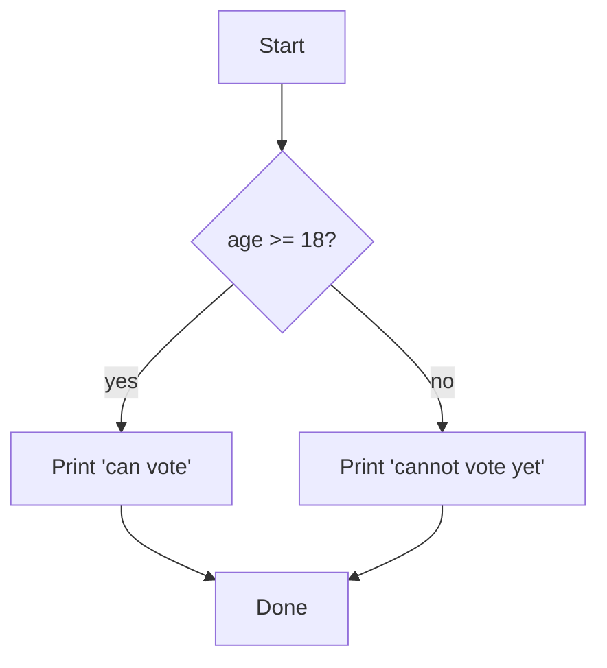
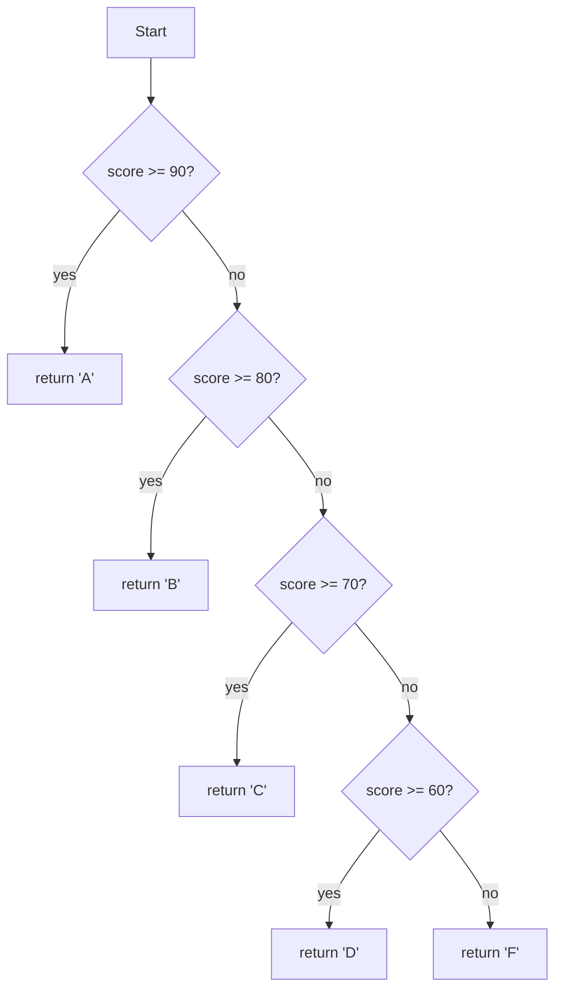

So far our programs have run their statements straight through from
top to bottom. Every line, every time. The instant a program starts
making **decisions** — *"if the user is logged in, show their name;
otherwise show 'Sign in'"* — it starts looking like real software.

That capacity for decision-making is called **control flow**, and
the most fundamental tool for it is the `if` statement.

## The `if` statement

The basic shape:

```javascript
if (condition) {
  // statements that run only if condition is truthy
}
```

The `condition` is any expression. If its value is truthy, the
block runs; otherwise it is skipped entirely.

<CodeBlock adapter="javascript">

```
const age = 17;

if (age >= 18) {
  console.log("You can vote.");
}

console.log("Done.");
```

</CodeBlock>

Run the program. Then change `age` to `19` and run again. The
`console.log("You can vote.")` line is skipped or executed
depending entirely on the condition.

## `if`/`else`

To do one thing when a condition is true and a *different* thing
otherwise, add `else`:

<CodeBlock
  adapter="javascript"
  starterCode={`const age = 17;

if (age >= 18) {
  console.log("You can vote.");
} else {
  console.log("You cannot vote yet.");
}
`}
/>

Visually:



That diamond is a **decision point** in the flow of the program.
Every conditional in your code corresponds to one of these
diamonds.

## `if`/`else if`/`else`

When there are several mutually exclusive cases:

<CodeBlock
  adapter="javascript"
  starterCode={`function describeScore(score) {
  if (score >= 90) {
    return "A";
  } else if (score >= 80) {
    return "B";
  } else if (score >= 70) {
    return "C";
  } else if (score >= 60) {
    return "D";
  } else {
    return "F";
  }
}

console.log(describeScore(95));
console.log(describeScore(82));
console.log(describeScore(73));
console.log(describeScore(64));
console.log(describeScore(50));
`}
/>

The runtime checks each condition top-to-bottom. The *first one
that is true* runs; all the rest are skipped. The final `else` (no
condition) catches everything left over.



**Order matters.** If you wrote the conditions starting from
`score >= 60` first, every passing score would be labelled "D"
because that condition matches first.

## Guard clauses: prefer early returns

A common pattern in modern code is to write **guard clauses** at
the top of a function — handle the "bad" or "trivial" cases first
and return early, so the main logic stays at the top level
without a giant pyramid of nested `if`s.

Compare. Both functions compute the same thing.

<CodeBlock
  adapter="javascript"
  starterCode={`// Nested style — hard to read past a few levels.
function shippingCost1(weight, distance, isPriority) {
  let cost;
  if (weight > 0) {
    if (distance > 0) {
      cost = weight * 0.5 + distance * 0.1;
      if (isPriority) {
        cost *= 1.5;
      }
    } else {
      cost = 0;
    }
  } else {
    cost = 0;
  }
  return cost;
}

// Guard-clause style — flat and easy to follow.
function shippingCost2(weight, distance, isPriority) {
  if (weight <= 0) return 0;
  if (distance <= 0) return 0;
  let cost = weight * 0.5 + distance * 0.1;
  if (isPriority) cost *= 1.5;
  return cost;
}

console.log(shippingCost1(2, 50, false));
console.log(shippingCost2(2, 50, false));
console.log(shippingCost1(2, 50, true));
console.log(shippingCost2(2, 50, true));
console.log(shippingCost1(0, 50, true));
console.log(shippingCost2(0, 50, true));
`}
/>

The second version is far easier to read, especially as logic
grows. Use guard clauses whenever you can.

## Boolean style: don't compare to `true`

A small but important style point:

```javascript
// awkward
if (isLoggedIn === true) { ... }

// clear
if (isLoggedIn) { ... }
```

Booleans are *already* booleans — you don't need to test whether
they equal `true`. Same for the negation: write `if (!isLoggedIn)`,
not `if (isLoggedIn === false)`.

## `switch`

When you are dispatching on the value of a single variable, the
`switch` statement is sometimes a clearer alternative to a long
`if`/`else if` chain:

<CodeBlock
  adapter="javascript"
  starterCode={`function describeDay(day) {
  switch (day) {
    case "Mon":
    case "Tue":
    case "Wed":
    case "Thu":
    case "Fri":
      return "Weekday";
    case "Sat":
    case "Sun":
      return "Weekend";
    default:
      return "Unknown day";
  }
}

console.log(describeDay("Mon"));
console.log(describeDay("Sat"));
console.log(describeDay("Xyz"));
`}
/>

A few things to know about `switch`:

- The comparison is **strict equality** (`===`), so the *type*
  matters: `case "1"` is not the same as `case 1`.
- Without a `break` (or `return`), execution **falls through** to
  the next `case`. This is sometimes useful (as above, where
  several days share one outcome), but it is a common source of
  bugs.
- The `default` clause is optional and acts like `else`.

Many modern codebases avoid `switch` and use plain `if`/`else if`
or a lookup object. Use it if it makes a particular piece of code
clearer; otherwise, regular conditionals are fine.

## A lookup table: a "no-if" alternative

When all your `if/else if` arms do the same shape of thing
(returning a value), an **object lookup** is often cleaner than
any of the above. Build a small table, look up the answer.

<CodeBlock
  adapter="javascript"
  starterCode={`const ROLES_TO_GREETING = {
  admin: "Welcome, administrator.",
  member: "Welcome back!",
  guest: "Hello, guest.",
};

function greetRole(role) {
  return ROLES_TO_GREETING[role] ?? "Hello there.";
}

console.log(greetRole("admin"));
console.log(greetRole("member"));
console.log(greetRole("guest"));
console.log(greetRole("alien")); // falls through to the default
`}
/>

This pattern scales well. Adding a new role is a one-line edit to
the table; no code changes.

## Combining conditions

You will often need to test more than one thing at once. That is
where the logical operators from the previous chapter come in.

<CodeBlock
  adapter="javascript"
  starterCode={`function canRent(age, hasLicence, hasCard) {
  if (age < 25) return "Too young.";
  if (!hasLicence) return "Need a driving licence.";
  if (!hasCard) return "Need a credit card.";
  return "Approved.";
}

console.log(canRent(30, true, true));
console.log(canRent(22, true, true));
console.log(canRent(30, false, true));
console.log(canRent(30, true, false));
`}
/>

Three guard clauses, each handling one failure case in turn. This
is much easier to read than one big condition like
`if (age >= 25 && hasLicence && hasCard) { ... } else { ... }`
because the *reason* for the rejection is preserved.

## Putting it together: a FizzBuzz warm-up

The classic beginner exercise: print the numbers 1 to 30, but
replace multiples of 3 with `"Fizz"`, multiples of 5 with
`"Buzz"`, and multiples of both with `"FizzBuzz"`.

<CodeBlock
  adapter="javascript"
  starterCode={`for (let n = 1; n <= 30; n++) {
  let out;
  if (n % 15 === 0) {
    out = "FizzBuzz";
  } else if (n % 3 === 0) {
    out = "Fizz";
  } else if (n % 5 === 0) {
    out = "Buzz";
  } else {
    out = n;
  }
  console.log(out);
}
`}
/>

The **order** of the conditions is critical: we test the most
specific case (`% 15 === 0`) first, then the more general cases.
If we reversed the order, every multiple of 15 would print `"Fizz"`
and the most specific case would never run.

(We have not formally met `for` loops yet — that is the next page.
For now, just take it on faith that the body runs once for each
`n` from `1` to `30`.)

## Challenge

<ChallengeCard
  adapter="javascript"
  title="Traffic light response"
  instructions={`Write a function \`action(color)\` that returns:

- \`"stop"\` if the colour is \`"red"\`
- \`"slow down"\` if the colour is \`"yellow"\`
- \`"go"\` if the colour is \`"green"\`
- \`"unknown signal"\` for anything else (including the empty string)

Use comparisons and conditionals, not a lookup table — practise the syntax.`}
  starterCode={`function action(color) {
  // your code here
  return "";
}

console.log(action("red"));
console.log(action("yellow"));
console.log(action("green"));
console.log(action("purple"));
`}
  solutionCode={`function action(color) {
  if (color === "red") return "stop";
  if (color === "yellow") return "slow down";
  if (color === "green") return "go";
  return "unknown signal";
}

console.log(action("red"));
console.log(action("yellow"));
console.log(action("green"));
console.log(action("purple"));
`}
  tests={[
    {
      id: "red",
      name: "red → stop",
      description: "",
      code: `if (action("red") !== "stop") throw new Error("expected 'stop'");`,
    },
    {
      id: "yellow",
      name: "yellow → slow down",
      description: "",
      code: `if (action("yellow") !== "slow down") throw new Error("expected 'slow down'");`,
    },
    {
      id: "green",
      name: "green → go",
      description: "",
      code: `if (action("green") !== "go") throw new Error("expected 'go'");`,
    },
    {
      id: "other",
      name: "anything else → unknown signal",
      description: "",
      code: `if (action("purple") !== "unknown signal") throw new Error("expected 'unknown signal'");
if (action("") !== "unknown signal") throw new Error("empty string should also be unknown");`,
    },
  ]}
/>

---

<MultipleChoice
  markdown={`Why do programmers often prefer "guard clauses" (early returns at the top of a function) over deeply nested \`if\` statements?

- Guard clauses run faster
- Guard clauses use less memory
- [o] Guard clauses keep the main logic at the top indent level, making the function easier to read and easier to extend
  > Each guard clause handles an edge case and exits, so the "happy path" stays flat and obvious. Deeply nested \`if\` blocks hide the main logic inside a pyramid and make it painful to add new conditions later.
- Guard clauses are the only way to return from a function

Guard clauses are a style choice that consistently makes code more readable in practice, with no performance trade-off.`}
/>
