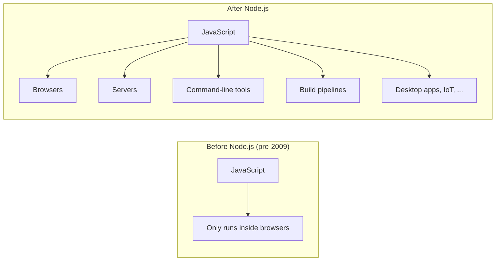

By the late 1990s JavaScript was *everywhere* — but it was still
mostly used for small things. A form validator here. A drop-down
menu there. A digital clock in the corner of a personal website.
Most "real" applications still lived on the server, written in
languages like PHP, Java, or Perl. JavaScript was a sprinkle on top.

That changed slowly, then suddenly.

## The middle years: pain and patience (1995–2005)

The first decade of JavaScript was, frankly, painful. Three browsers
(Netscape, Internet Explorer, and later Firefox) had subtly
different implementations. The same code might work in one browser
and silently fail in another. Programmers shipped huge amounts of
defensive code:

```javascript
// Pseudo-real code from the early 2000s
if (window.attachEvent) {
  element.attachEvent("onclick", handler);   // Internet Explorer
} else if (window.addEventListener) {
  element.addEventListener("click", handler); // Everyone else
}
```

Writing serious software in this environment felt like building a
house on shifting ground. People avoided JavaScript whenever they
could. The language itself was viewed as a toy, and the rough
ecosystem reinforced that view.

But three things were quietly happening:

1. **Browsers were getting faster.** Engines were rewritten,
   optimisations piled up, and JavaScript performance improved by
   orders of magnitude.
2. **Standards were tightening.** ECMAScript 3 (1999) and then
   ECMAScript 5 (2009) brought clarity and consistency. Browsers
   slowly converged.
3. **Web pages were getting more ambitious.** People wanted
   *applications*, not documents.

## The AJAX revolution (2004–2005)

In 2004 and 2005, two web applications shocked the industry:
**Gmail** and **Google Maps**.

Gmail looked like a desktop email client running inside a web
browser — instant feedback, no full-page reloads. Google Maps let
you drag a map smoothly with your mouse, while new tiles streamed
in as you moved.

The technical trick under both was the same: JavaScript could now
silently ask the server for new data **in the background**, using
an old, half-forgotten browser feature called `XMLHttpRequest`. The
page would update parts of itself without a full reload.

This pattern got a catchy name — **AJAX** (Asynchronous JavaScript
And XML) — and it instantly reframed JavaScript in everyone's mind:

> *Maybe JavaScript is not just a toy. Maybe it is the foundation
> of a new kind of software.*

Suddenly, the rest of the industry was paying attention.

## The library era: jQuery and friends (2006–2012)

Even after AJAX, raw JavaScript was rough. Different browsers still
had different bugs. Selecting elements, attaching event handlers,
animating things, and making network requests required tedious,
defensive code.

In 2006, a programmer named **John Resig** released **jQuery**, a
small library that smoothed all of this over. With jQuery, you
could write:

```javascript
// jQuery-style: terse, works everywhere
$(".menu li").on("click", function () {
  $(this).addClass("active");
});
```

…instead of fifty lines of cross-browser plumbing. jQuery became,
for years, the most-used library on the web. It is still on
millions of pages today.

jQuery proved something important: **JavaScript needed a layer of
libraries on top of it to be enjoyable.** And once one library
proved this, hundreds more followed:

- **Prototype**, **Mootools**, **YUI** — alternative "make
  JavaScript pleasant" libraries.
- **Underscore** (later **Lodash**) — utility belts of helpful
  functions for working with arrays and objects.
- **Moment.js** — handling dates, which JavaScript famously does
  badly.
- **D3.js** — beautiful data visualisations driven by JavaScript.

The pattern was clear: instead of waiting for the language itself to
improve, the community would build whatever was missing.

## Node.js: JavaScript escapes the browser (2009)

In 2009, a programmer named **Ryan Dahl** announced something
strange at a European conference: he had taken Google's
high-performance JavaScript engine (V8, used in Chrome) and wrapped
it so it could run **outside** the browser, on a server, or on your
laptop's command line.

He called the result **Node.js**.

This was a huge conceptual leap. Suddenly:

- You could write a **web server** in JavaScript.
- You could write a **command-line tool** in JavaScript.
- You could write a **build script** in JavaScript.
- You could share code between the *browser* and the *server* — the
  same function might run in both places.

Until Node.js, JavaScript was a language *trapped* inside a browser.
After Node.js, JavaScript was a **general-purpose programming
language** that happened to be especially good at the web.



Node.js also brought another revolution: **npm** — the **Node Package
Manager** — which gave the community a single, central place to
publish and share libraries. Today npm hosts over **two million
packages**, making it the largest software ecosystem in the world by
far.

## The framework era (2010–today)

Once JavaScript was a real platform, people started building **big**
applications in it — applications with thousands of interactive
elements, complex state, and many developers working on the same
codebase. Plain JavaScript and jQuery were no longer enough.

A new wave of **frameworks** appeared, each with opinions about how
to organise large amounts of JavaScript:

- **Backbone.js** (2010) — early structure for single-page apps.
- **AngularJS** (2010) — Google's opinionated framework.
- **Ember.js** (2011) — convention-heavy, "the right way" for
  ambitious apps.
- **React** (2013) — Facebook's idea: build interfaces from small,
  reusable, composable components, and let the framework figure out
  how to update the screen efficiently.
- **Vue.js** (2014) — a smaller, friendlier alternative inspired by
  Angular and React.
- **Svelte** (2016), **SolidJS**, **Qwik** — newer frameworks
  rethinking how interactive interfaces should work.

You do not need to know any of these to learn JavaScript. They are
*built on top* of JavaScript. The reason we mention them is to point
out: when people say "I'm learning JavaScript", they often actually
mean "I'm learning React" or "I'm learning Vue". This course is
deliberately the other way around — we are learning the language
itself, on which all those frameworks ultimately stand.

## Tooling: the build pipeline arrives

As applications grew, an entire industry of **build tools** appeared
to help manage them:

- **Babel** — translates new JavaScript features into older
  JavaScript that older browsers can understand.
- **Webpack, Rollup, Vite, esbuild** — *bundlers* that combine
  hundreds of small files into a few optimised files for the
  browser.
- **Linters** (ESLint), **formatters** (Prettier), **type checkers**
  (TypeScript) — tools that help teams keep code clean and correct.
- **Testing frameworks** (Jest, Vitest, Playwright) — automated
  ways to check your code still works after every change.

A modern JavaScript project pulls in dozens of these tools. This
sounds intimidating, and at the start, it kind of is. But again: you
don't need any of it to write and run real JavaScript. The
playground in this very page is a runtime, and it is more than
enough to learn the language.

## The Cambrian explosion of features

In parallel, the language itself was growing fast. After many quiet
years, **ECMAScript 2015 (ES6)** brought a huge wave of new
features:

- `let` and `const` for block-scoped variables.
- Arrow functions (`x => x * 2`).
- `class` syntax for object-oriented patterns.
- Template literals: `` `hello, ${name}` ``.
- Destructuring: `const { name, age } = user;`
- Modules: `import` and `export`.
- Promises for async work.
- Many new methods on arrays, strings, and objects.

Since ES6, the language has been on a yearly release cycle. Every
year brings small, careful additions. `async`/`await` (2017),
optional chaining `?.` (2020), nullish coalescing `??` (2020), and
many more.

Throughout, the language has kept a strict rule: **don't break the
web**. New features are added; old ones almost never disappear.
Every web page from 1996 should still run today. That is part of
why JavaScript looks a bit odd — it carries its entire history with
it, on purpose.

## A flavour of "modern" JavaScript

Here is a piece of code that uses several features that did **not**
exist in 1995. The shape of the language has evolved enormously,
even though the soul is the same.

<CodeBlock
  adapter="javascript"
  files={[
    {
      filename: "main.js",
      starterCode: `// 'const' makes a binding you cannot reassign.
const users = [
  { name: "Ada", role: "admin", active: true },
  { name: "Linus", role: "member", active: true },
  { name: "Grace", role: "admin", active: false },
];

// Arrow function + .filter() + destructuring + template literal:
const activeAdmins = users
  .filter(({ role, active }) => role === "admin" && active)
  .map(({ name }) => \`Active admin: \${name}\`);

console.log(activeAdmins);

// Optional chaining: safely read a deeply nested value
// without crashing if something in the middle is missing.
const first = users[0]?.name?.toUpperCase();
console.log("First user (shouting):", first);
`,
    },
  ]}
/>

If this looks like magic, that is *expected*. We will earn each of
these features over the course of the rest of this guide — `.filter`,
`.map`, destructuring, optional chaining, arrow functions, all of it.
For now, the point is just: modern JavaScript is a *much* bigger,
much more pleasant language than the one Brendan Eich shipped in
1995, even though it is the very same language underneath.

---

<MultipleChoice
  markdown={`Why was Node.js such a big deal when it appeared in 2009?

- It made JavaScript faster inside the browser
  > Node.js runs outside the browser entirely; browser JavaScript engine speed was already being improved by the V8 project, but that was separate from what Node.js introduced.
- It replaced the JavaScript language with a new one
  > Node.js uses the same ECMAScript language as the browser; it didn't change the language, it changed *where* that language could run.
- [o] It let JavaScript run outside the browser, turning it into a general-purpose programming language used on servers, command lines, and build tools
  > By packaging the V8 engine outside the browser, Node.js opened up entirely new domains for JavaScript — servers, scripts, build tools, desktop apps. Combined with npm, it transformed JavaScript from a "browser thing" into the most widely used language on the planet.
- It removed the need for HTML and CSS on the web
  > Node.js runs on the server side and has no bearing on how browsers render HTML and CSS; those technologies are still required for web pages.

Before Node.js, JavaScript was tied to the browser. After Node.js, you could legitimately call yourself a "JavaScript developer" without writing a single line of HTML.`}
/>
