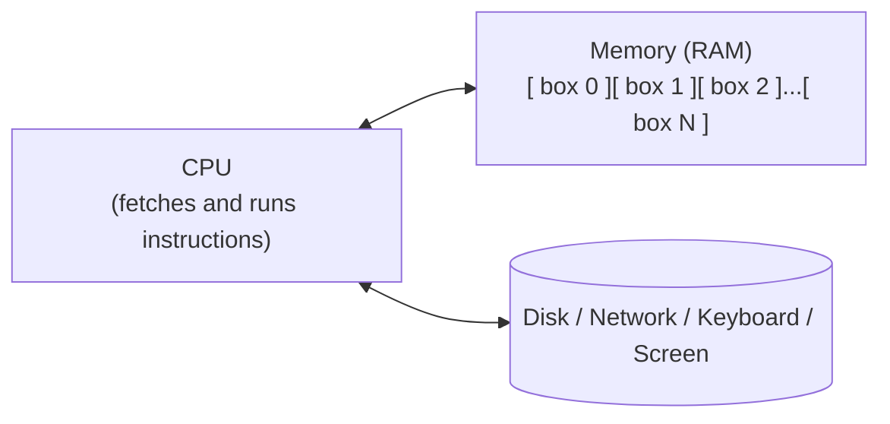
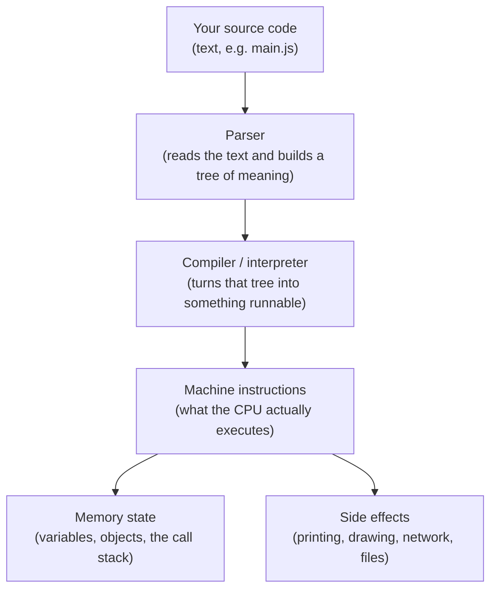
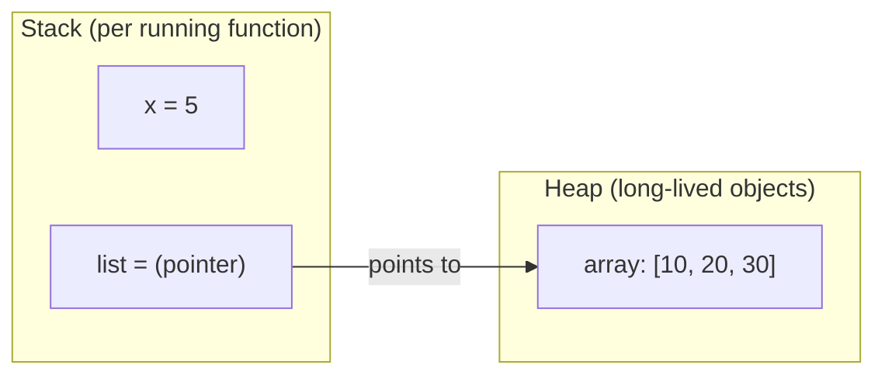

You can write a lot of code without knowing exactly what a computer
is doing under the hood. But a beginner who builds a *correct mental
model* of program execution will progress faster — and will be far
better at debugging — than one who just memorises syntax.

This page builds that mental model from scratch. We are going to
zoom out, look at a computer the way it really is, and watch a
program run from the inside.

## Three things a computer fundamentally has

Strip away the screen, the keyboard, and the operating system, and
*every* computer in your life is made of three things:

1. **A CPU** — a tiny machine that, in a loop, reads instructions
   and carries them out. Billions of times per second.
2. **Memory (RAM)** — a vast row of numbered "boxes", each of which
   can hold a small chunk of data (often, one byte = 8 bits).
3. **A bus** — the wiring between the CPU and the memory, plus
   everything else (disk, network, keyboard, screen).

That's it. Every program in the world is, at the bottom, a
sequence of instructions the CPU executes, manipulating values in
memory.



When you write `const x = 5`, what eventually happens is something
like: *the runtime allocates a box somewhere in memory, writes the
number `5` into it, and remembers that the name `x` points to that
box*. When you later write `console.log(x)`, the runtime reads the
value from that box and hands it to whatever knows how to display
text.

## The fetch-decode-execute loop

The CPU itself, ignoring all complexity, runs the same tiny loop
forever:

1. **Fetch** the next instruction from memory.
2. **Decode** what it means (add, compare, jump, load, store…).
3. **Execute** it (do the operation, update some registers, maybe
   write to memory).
4. Go to step 1.

A modern CPU does this billions of times per second, with a lot of
clever tricks (pipelining, branch prediction, caches). But the
*shape* of the loop is unchanged from the very first computers.

A "program" is, at this level, just a long list of instructions in
memory that the CPU fetches and runs.

## So where does JavaScript fit?

JavaScript code is **not** a list of CPU instructions. It is *text*.
The CPU has no idea what `function` or `console.log` mean.

The bridge between them is the **JavaScript runtime**. When you run
a JavaScript program, here is roughly what happens:



The first stage, called **parsing**, reads your text and turns it
into a structured tree — the way you might diagram a sentence in
school. The next stage, often called **compilation** (modern engines
use a mix of **interpretation** and **just-in-time compilation**),
turns that tree into machine-level instructions the CPU can run.

You never see any of this. You just type `console.log("hello")` and
the word `hello` appears. But knowing the layers exist explains a
lot.

## A simpler mental model for everyday programming

For day-to-day programming, you do not need to think about CPUs and
caches. A simpler, very useful model is this:

> **A JavaScript program is a list of statements that the runtime
> executes, one after another, from top to bottom, while keeping
> track of variables in memory.**

That's it. Five things to internalise:

1. Programs are read **top to bottom**.
2. Each **statement** does something — declare a variable, change a
   value, print, call a function, decide whether to continue.
3. The runtime keeps a **set of variables**, each bound to some
   **value**.
4. **Control flow** (`if`, `while`, `for`, function calls) can
   change *which* statement runs next.
5. **Side effects** (printing, drawing, reading files, talking to
   the network) are how a program affects the outside world.

That mental model is enough to read 95% of all JavaScript you will
ever see.

## A walkthrough: watching a tiny program execute

Let's trace, step by step, what a runtime is doing while executing
this very short program. We are going to imagine ourselves *as the
runtime*.

```javascript
let a = 2;
let b = 3;
let sum = a + b;
console.log("sum is", sum);
```

The runtime walks the program from top to bottom:

| Step | Line | What the runtime is doing | Variables after the step |
| ---: | --- | --- | --- |
| 1 | `let a = 2;` | Allocate a slot named `a`. Store the value `2` in it. | `a = 2` |
| 2 | `let b = 3;` | Allocate a slot named `b`. Store `3`. | `a = 2`, `b = 3` |
| 3 | `let sum = a + b;` | Read the value of `a` (2) and `b` (3). Compute `2 + 3` = `5`. Allocate `sum`. Store `5`. | `a = 2`, `b = 3`, `sum = 5` |
| 4 | `console.log("sum is", sum);` | Read the value of `sum` (5). Call the `console.log` function with the arguments `"sum is"` and `5`. This produces a side effect: text appears in the output. | unchanged |

Try it yourself. You should see exactly that output:

<CodeBlock
  adapter="javascript"
  initialCode={`let a = 2;
let b = 3;
let sum = a + b;
console.log("sum is", sum);
`}
/>

This kind of step-by-step trace is the single most useful skill you
can develop in early programming. When code does something
unexpected, **pretend you are the runtime** and walk through it line
by line, writing down the value of each variable after each step.
Nine bugs out of ten reveal themselves immediately.

## The shape of memory: stack vs heap (very gentle introduction)

You will, eventually, see the words **stack** and **heap** thrown
around. The simple version, sufficient for now:

- The **stack** is where the runtime keeps track of *which function
  is currently running* and the small, short-lived variables that
  belong to it.
- The **heap** is a big general pool where the runtime stores
  longer-lived things — most importantly, **objects and arrays**.

When you write:

```javascript
const x = 5;
const list = [10, 20, 30];
```

`x` is a small number that fits comfortably "on the stack" with the
running function. `list` refers to an array of three numbers, and
that array itself lives "on the heap", with `list` holding a kind
of address pointing to it.



You will not need to think about this every day. But it explains
some real behaviour later — for example, why two variables can
point to the *same* array and changing it through one variable
seems to change the other.

## What "running a program" actually feels like

Putting it all together, the experience of "running" a JavaScript
program goes like this:

1. The runtime reads your source code (text).
2. It parses and compiles it (you don't see any of this).
3. It starts executing statements from the top.
4. As it goes, it sets up variables, runs functions, makes
   decisions, repeats blocks.
5. Side effects (printing, drawing, network) leak out into the
   world as they happen.
6. When all statements have been processed, the program ends —
   unless it has scheduled future work (a timer, a network request,
   an event handler), in which case the runtime sticks around
   waiting for those.

Hold this picture in your head. We will refer back to it constantly.

## Try the trace yourself

Below is a slightly bigger program. Before you press Run, *mentally
walk through it* and predict what each `console.log` will print.
Then run it and check whether you were right. Doing this exercise
honestly is worth more than any amount of passive reading.

<CodeBlock
  adapter="javascript"
  initialCode={`let x = 10;
let y = x;       // y is set to the *current* value of x, which is 10.
x = 99;          // We change x. Does y change too?

console.log("x =", x);
console.log("y =", y);

let count = 0;
count = count + 1;
count = count + 1;
count = count + 1;
console.log("count =", count);
`}
/>

If `y` printed `99` and you were surprised, *that surprise is
gold*. Lean into it: the surprise marks the exact spot where your
mental model needs to be updated. (Spoiler: `y` does *not* change,
because when we wrote `let y = x;`, the value `10` was copied into
`y` at that moment. After that, `x` and `y` are independent boxes.)

---

<MultipleChoice
  markdown={`What is the single most useful debugging skill described on this page?

- Memorising all of JavaScript's built-in functions
- [o] "Pretending to be the runtime" — walking through the program one line at a time, writing down the value of each variable after each step
  > When a program does something unexpected, the fastest way to figure out why is to simulate the runtime yourself, step by step. Most bugs reveal themselves the moment you do this carefully.
- Restarting your computer
- Adding more \`console.log\` statements until the bug fixes itself

Step-by-step manual tracing is the bedrock of all debugging skill. We will return to this throughout the course.`}
/>
