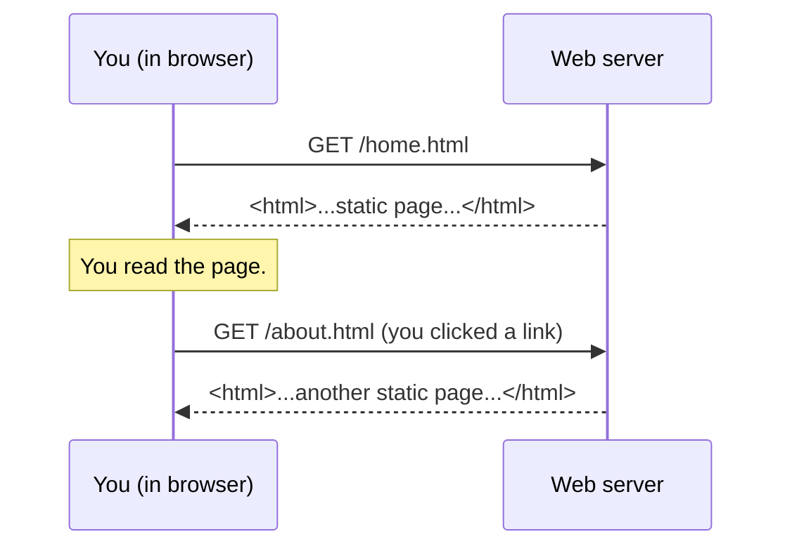
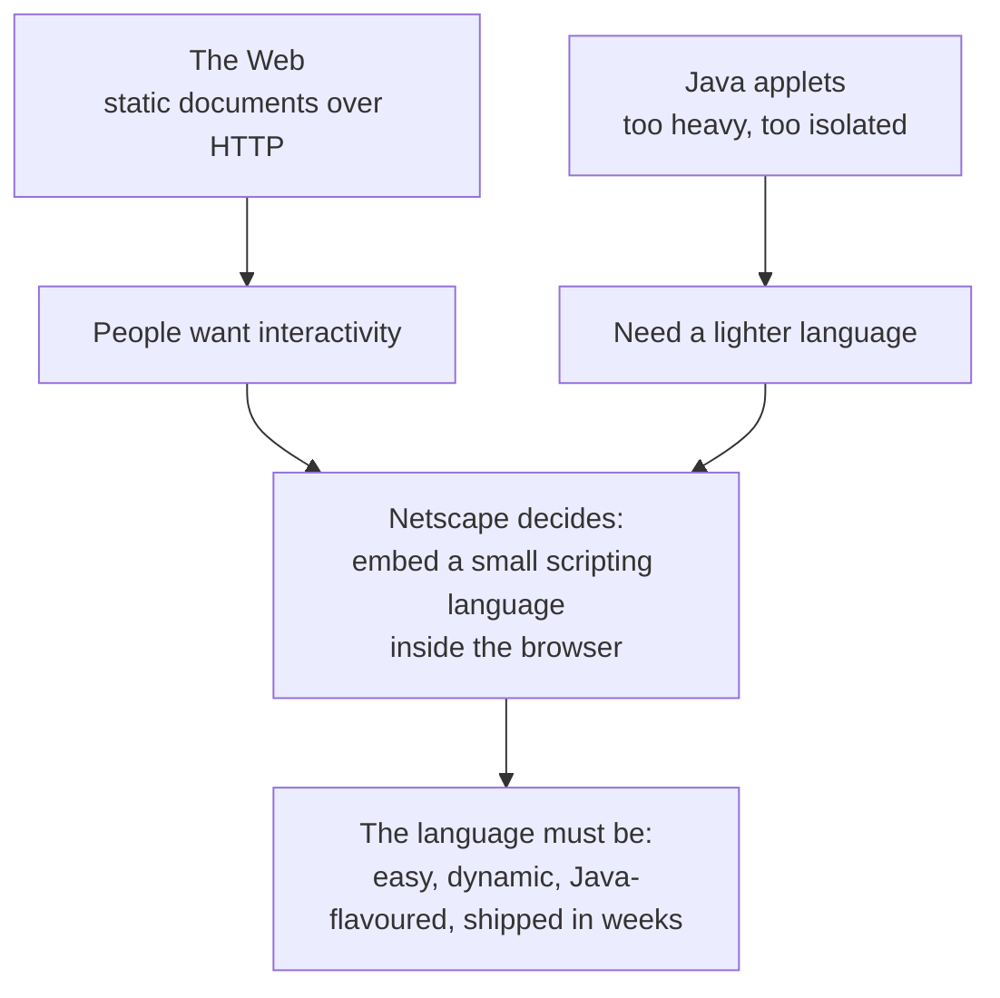

To understand why JavaScript exists, you have to picture the web
*before* JavaScript existed. It is a stranger picture than most
people remember.

## The web as a library

In the late 1980s, a researcher at CERN named **Tim Berners-Lee**
designed a system for sharing scientific documents. He wanted
physicists in different countries to be able to read each other's
papers without negotiating which file format, which operating
system, or which transfer protocol to use.

His solution had three pieces that we still use today:

- **HTML** — a way to write documents with headings, paragraphs,
  lists, and most importantly **links** to other documents.
- **HTTP** — a way for one computer to ask another computer for a
  document.
- **URLs** — a way to name any document anywhere on the system.

That is *all the early web was*: a global, hyperlinked, shared
**library of documents**. You opened a browser. It downloaded a
page. The page was static — just text, headings, and images,
exactly as the author had written it. If you wanted to do anything
"interactive", you submitted a form to the server, which generated a
brand new page and sent it back to you.

Notice what is missing from that picture: **the browser is not doing
anything intelligent**. It is just rendering whatever HTML the
server hands it.

## The pain of "talk to the server for everything"

Now imagine building a form on a page from the early 1990s. The
user types their name and email and clicks "Submit". The browser
sends the entire form to the server. The server checks: *is the
email address valid? did they fill in their name?* If not, it
generates a brand new page that says "please fix these errors" and
sends it back. The user fixes the form and resubmits. Another round
trip. Another fresh page.

Every check, every interaction, every visual change required a
**full round trip to the server**, and a **new page** to be sent
back. Networks were slow. Pages took seconds to load. The experience
felt like passing notes through a closed door.

People wanted something better:

- **Immediate feedback.** If a user types an invalid email, tell
  them *right away*, not after a five-second round trip.
- **Reactive interfaces.** Sliders, calculators, image galleries,
  drop-down menus that work without reloading the page.
- **Live content.** A page that updates a clock, a stock ticker, or
  a chat window without forcing the reader to refresh.

To do any of this, the **browser itself** needed to be able to run
small programs locally — programs that could read the current page,
modify it, and react to the user.

In other words: the browser needed to host a **scripting language**.

## A short detour: Java, applets, and the dream of "code in a page"

The first big attempt at "programs inside web pages" was not
JavaScript at all. It was **Java applets**.

Java, released by Sun Microsystems in 1995, was a serious,
statically typed language. Its big idea was *write once, run
anywhere*: a Java program was compiled to a special format called
**bytecode**, and a Java Virtual Machine on each computer ran that
bytecode. In theory, the same Java program would behave identically
on Windows, Mac, and Linux.

Sun and Netscape made a deal: Netscape Navigator (the dominant
browser of the era) would embed a Java Virtual Machine, and web
pages could include small Java programs — **applets** — that would
run inside the page. Suddenly your browser could show calculators,
animations, and tiny games.

But applets had serious problems:

- They were **heavy** — each one had to download a chunk of code
  and start up a virtual machine.
- They were **isolated** — an applet lived in its own little box,
  largely separate from the rest of the page.
- They needed a **plugin** to be installed, and they were a constant
  source of security problems.
- Java was, frankly, **too big** for the *small* scripts a typical
  page actually needed. Validate a form? Animate a menu? You did not
  need a virtual machine for that.

Netscape recognised the gap. Java would be the big, serious
language inside the page. They needed a **small, friendly
scripting language** sitting next to it — something a graphic
designer could pick up in an afternoon, something that lived
*directly* inside the HTML.

That decision is what set the stage for JavaScript.

## What the new language had to be

Netscape's leadership wrote down (informally) what this scripting
language needed:

1. **Embeddable in HTML.** You should be able to drop a small piece
   of code right into a page.
2. **Easy to learn.** Aimed at designers and amateur programmers,
   not systems engineers.
3. **Forgiving.** Mistakes should not crash the whole browser.
4. **Dynamic.** No long compile step. Edit, refresh, see the result.
5. **Familiar-looking.** It should *look* a bit like Java, so people
   who knew Java (or C) would recognise the syntax.
6. **Available right now.** Netscape was racing competitors. The
   language had to ship in the next browser release — *within
   weeks*.

That last constraint is critical. The language was designed under
enormous time pressure. There was no luxury for years of careful
research. Whatever they shipped, the world would be stuck with.

## Connecting the dots

Up to this point, the world had:

- **A new global medium** — the web — that was static and clunky.
- **A clear need** for small interactive programs running inside the
  browser.
- **A failed first attempt** (Java applets) that was too heavy.
- **A clear design target** for a *light, embedded, forgiving,
  vaguely Java-looking* scripting language.

All that was missing was someone to actually design and build it,
ridiculously fast.

That someone was a programmer named **Brendan Eich**.

## A small reminder, in code

In the next page, we will meet Eich and watch JavaScript get born.
Before we do, here is one more reminder of what we are building
towards: a real little JavaScript program that does the kind of
thing the early web designers desperately wanted to be able to do —
**react to data without asking the server first**.

<CodeBlock
  adapter="javascript"
  initialCode={`// Pretend this is form input from the user.
const userEmail = "ada@example";  // Note: this email is missing a domain.

// A tiny check we can do right here, with no server round-trip.
function looksLikeEmail(text) {
  // Very rough: must have an "@" and a "." after it.
  const atIndex = text.indexOf("@");
  const dotIndex = text.lastIndexOf(".");
  return atIndex > 0 && dotIndex > atIndex + 1;
}

if (looksLikeEmail(userEmail)) {
  console.log("Looks like a valid email:", userEmail);
} else {
  console.log("That email doesn't look right:", userEmail);
}
`}
/>

In 1994, doing that kind of check required *sending the data to the
server* and waiting for a reply. JavaScript, even in its earliest
form, let it happen right in the browser. That alone was a small
revolution.

---

<MultipleChoice
  markdown={`Why did the early web need a scripting language embedded in the browser?

- Because HTML could not display images
- Because servers were unable to validate user input
- [o] Because every interaction had to round-trip to the server, which was slow and clunky — the browser needed to run small programs locally to respond immediately
  > Without an in-browser language, every form check, every menu, every reactive behaviour required a full request/response cycle. A scripting language let the browser handle small interactions on its own, instantly.
- Because Java applets were faster than native code

Embedding a small scripting language in the browser meant interactions could happen in milliseconds, not seconds, without involving the server at all.`}
/>
