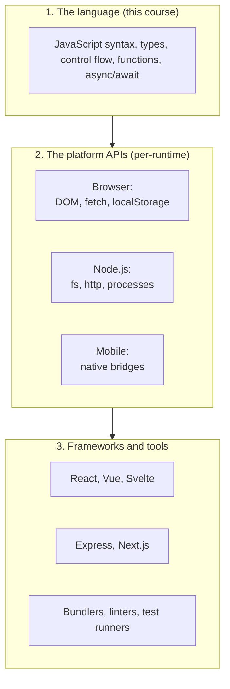

We have walked through how JavaScript came to be. Now let's pin down
what it actually *is*, today, in 2025 — and why it is a good first
programming language to learn deeply.

## What JavaScript is, in one sentence

> **JavaScript is a dynamic, multi-paradigm, garbage-collected
> programming language that runs almost everywhere, with first-class
> functions, mutable objects, and a single-threaded asynchronous
> execution model.**

That sentence is dense. Let's pull it apart.

### Dynamic

"Dynamic" means decisions about what a value *is* are made while the
program is running, not before. A variable can hold a number on one
line and a string on the next. A function can be passed a number
where it expected a string and it will not refuse — it will try to
do something reasonable (sometimes too reasonable).

This makes JavaScript flexible and easy to start. It also means
some classes of bug — like calling `.toLowerCase()` on something
that turned out to be `undefined` — can only be caught at runtime.

### Multi-paradigm

A "paradigm" is a style of organising programs. The big ones are:

- **Imperative** — give the computer step-by-step instructions
  ("first do this, then do that").
- **Procedural** — group instructions into procedures (functions)
  that can be called repeatedly.
- **Object-oriented** — group data and behaviour together into
  objects.
- **Functional** — treat computation as the application of
  functions, mostly without changing state.

JavaScript supports all four. You can write tight imperative loops,
elegant functional pipelines, classical class hierarchies, or any
mix. Different parts of the same codebase often use different styles
on purpose. We will see all of them in this course.

### Garbage-collected

You never have to explicitly free memory in JavaScript. When you
create an object, the runtime keeps it alive as long as something
in your program is referring to it. When nothing refers to it any
more, the runtime quietly reclaims that memory. The thing that does
the reclaiming is called a **garbage collector**, and it is a
hugely complex piece of engineering inside the runtime, but for you
as the programmer, it is **invisible**.

This is a beginner-friendly choice. In a language like C, forgetting
to free memory is a common, frustrating, security-sensitive class
of bug. In JavaScript, the whole category just does not exist.

### First-class functions

Functions in JavaScript are values, like numbers and strings. You
can:

- Store a function in a variable.
- Pass a function as an argument to another function.
- Return a function from a function.
- Put functions inside arrays and objects.

This may sound abstract; it is actually one of JavaScript's most
practical and important features. Every modern JavaScript library
uses it constantly. We have a whole later chapter on it.

### Mutable objects

Once you make an object, you can usually change it in place — add a
property, change a value, remove a field. This is convenient and
can also be a source of subtle bugs (different parts of a program
might share an object and step on each other). Modern JavaScript
encourages *avoiding* unnecessary mutation; we will see why and how.

### Single-threaded, asynchronous

This is a big one. By default, **JavaScript runs in a single
thread** — that is, it does one thing at a time. There is no
parallel `do this and that simultaneously` model baked into the
language at the basic level.

So how does JavaScript handle waiting for the network, reading a
file, or running a timer without freezing up? Through an
**asynchronous, event-driven** model. The runtime keeps a queue of
"things to do later", and your code says things like "*when this
network request finishes, run this function*". The runtime takes
care of scheduling.

We will spend an entire chapter on this. For now, just internalise:
**one thing at a time, but never block waiting**.

## What JavaScript is good at

- **Getting started fast.** Open a browser, open the console, type
  code, see results. No install, no setup.
- **Interactive software.** Web pages, dashboards, real-time
  collaborative tools.
- **Networked applications.** Both client and server, including
  real-time things like chat and collaborative editing.
- **Gluing things together.** Reading and reshaping data, calling
  APIs, transforming files.
- **Cross-platform code.** The same skill set works in browsers,
  on servers, on desktops, and on phones.

## What JavaScript is *not* especially good at

It is honest to acknowledge JavaScript's limits:

- **Raw numerical performance.** For heavy maths or simulations, C,
  Rust, Julia, or Fortran will outperform JavaScript significantly.
- **Strict correctness guarantees.** Type errors that languages like
  Rust or Haskell can prevent at compile time will, in JavaScript,
  often only show up at runtime. (TypeScript helps a lot here.)
- **Tiny memory footprints.** A JavaScript runtime is not as small
  as a C binary, so it is not the natural choice for the most
  constrained embedded systems.
- **Multi-threaded CPU-bound work.** JavaScript can do this (via
  workers), but languages built around threads from day one (Go,
  Rust, Java) have a much smoother story.

For most application programming, none of these limitations matter.
For some specialised domains, they do, and that is why other
languages will always exist.

## A useful mental model: "JavaScript the language" vs "everything around it"

A common source of confusion for beginners is that "learning
JavaScript" is sometimes used to mean three quite different things:

1. **The language itself.** Syntax, control flow, functions,
   closures, objects, async/await. This is what this course is
   about. Stable, well-defined, slow-changing.
2. **The platform APIs.** What you can *do* from JavaScript depends
   on where you run it. In a browser: the DOM, `fetch`,
   `localStorage`. In Node.js: the filesystem, child processes,
   HTTP servers. These differ between runtimes.
3. **The frameworks and tools.** React, Vue, Angular, Express,
   Next.js, Webpack, Vite, Babel, TypeScript, ESLint… an
   ever-changing landscape of libraries built **on top of** the
   language.

Layer 1 is the foundation. The things in layer 3 change every few
years. The things in layer 1 essentially never change. By focusing
this course on layer 1, we are giving you a skill that will not
expire.

## Why this is a great first programming language

A few reasons, in plain English:

- **You see results instantly.** Type, press Run, watch it happen.
- **The setup is zero.** Every device with a browser is a
  development environment.
- **The community is enormous.** Almost any question you have has
  been answered online.
- **The job market is huge.** JavaScript developers are needed
  everywhere, in every industry.
- **It teaches good ideas.** First-class functions, closures, and
  asynchronous programming are *real* programming concepts you will
  use again in every other language.
- **It scales with you.** Today you might write a 20-line script.
  Eventually you might work on a codebase with millions of lines.
  The same language handles both.

## One last warm-up

Let's run one more program before we leave the historical chapters
and start learning the language properly. This one prints a small
table — a hint of the kind of program you'll be writing yourself in
a few pages' time.

<CodeBlock
  adapter="javascript"
  starterCode={`// Show a small multiplication table.
// Don't worry about the syntax yet — we'll learn each piece.
function table(n) {
  console.log(\`Multiplication table for \${n}:\`);
  for (let i = 1; i <= 10; i++) {
    console.log(\`  \${n} x \${i} = \${n * i}\`);
  }
}

table(7);
console.log();
table(12);
`}
/>

If you understand even roughly what is happening here — *a function
called `table` is printing a table of multiplications for a given
number* — you already have the right intuition. The rest is detail.

That brings us to the end of the story chapters. From here on, we
**learn** JavaScript, properly, step by step, starting with the
most fundamental question of all: *what does it mean for a computer
to run a program?*

---

<MultipleChoice
  markdown={`What is the most important distinction to keep in mind as you learn JavaScript?

- The difference between Java and JavaScript
- The difference between Chrome and Firefox
- [o] The difference between the JavaScript *language* (stable, portable, this course's focus) and the *frameworks and tools* built on top of it (which change every few years)
  > The language itself is the durable, transferable skill. Frameworks like React, build tools like Webpack, and even runtime APIs like \`fetch\` come and go or differ between runtimes — but \`let\`, \`const\`, \`function\`, \`if\`, \`for\`, arrays, objects, closures, and \`async\`/\`await\` will be exactly the same a decade from now.
- The difference between \`==\` and \`===\`

The language is the bedrock. Once you know it well, picking up any framework or runtime API is a matter of reading documentation.`}
/>
