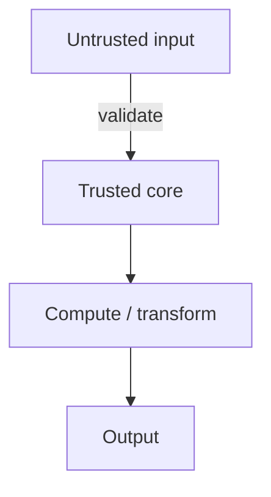

Code is read far more often than it's written. The code you write
today, your future self — and your teammates — will read for
years. *Maintainable code* is code that's easy to understand,
modify, and trust without re-deriving how it works.

There's no magic formula, but there are a handful of habits that
move you a long way. This chapter is a tour.

<Illustration name="tangle-vs-tidy" />

## Names are documentation

The single highest-leverage thing you can do is name things well.
A bad name forces every reader to figure out what a thing is. A
good name *tells them*.

<CodeBlock
  adapter="javascript"
  starterCode={`// HARD: every name is generic. The reader has to decode the math.
function f(a, b) {
  let t = 0;
  for (let i = 0; i < a.length; i++) {
    if (a[i].x === b) t += a[i].y;
  }
  return t;
}

// EASY: every name carries meaning. Reads like a sentence.
function totalSalesForCategory(items, category) {
  let total = 0;
  for (const item of items) {
    if (item.category === category) total += item.price;
  }
  return total;
}

const items = [
  { category: "book", price: 12 },
  { category: "book", price: 8 },
  { category: "pen", price: 2 },
];

console.log(totalSalesForCategory(items, "book"));
`}
/>

A few naming rules:

- **Be specific.** `users` is okay; `activeUsers` is better.
- **Booleans should read like questions.** `isReady`, `hasErrors`,
  `canEdit`.
- **Functions should be verbs.** `getUser`, `formatDate`,
  `validateInput`.
- **Constants in SCREAMING_SNAKE_CASE.**
- **Don't abbreviate** unless the abbreviation is a true standard
  (`url`, `id`, `db`).
- **Match the domain vocabulary.** If users call them "orders",
  don't call them "purchases" in the code.

> Naming is the closest thing programming has to writing prose.
> Good names *make the comments unnecessary*.

## Functions should do one thing

A function that fetches data, formats it, sends an email, and
updates a counter is hard to test, hard to read, and hard to
change. Split it.

<CodeBlock
  adapter="javascript"
  starterCode={`// HARD: one function juggling four jobs.
function processOrder(order) {
  if (order.amount <= 0) throw new Error("bad amount");
  const tax = order.amount * 0.1;
  const total = order.amount + tax;
  console.log("Sending email to", order.email, "for", total);
  return { ...order, tax, total, status: "processed" };
}

// EASY: small functions, each with one clear purpose.
function validateOrder(order) {
  if (order.amount <= 0) throw new Error("bad amount");
}

function calcTotal(amount, taxRate = 0.1) {
  const tax = amount * taxRate;
  return { tax, total: amount + tax };
}

function notifyCustomer(email, total) {
  console.log("Sending email to", email, "for", total);
}

function processOrderClean(order) {
  validateOrder(order);
  const { tax, total } = calcTotal(order.amount);
  notifyCustomer(order.email, total);
  return { ...order, tax, total, status: "processed" };
}

console.log(processOrderClean({ amount: 100, email: "a@b" }));
`}
/>

The smaller version is *more* lines, but each piece is testable,
nameable, and reusable. That's almost always the right trade.

## Avoid deep nesting with early returns

Pyramids of `if`s are exhausting to read. **Early returns** —
also called *guard clauses* — flatten the code.

<CodeBlock
  adapter="javascript"
  starterCode={`// HARD: rightward drift.
function checkout(cart, user) {
  if (cart) {
    if (cart.items.length > 0) {
      if (user) {
        if (user.isVerified) {
          return "ok: " + cart.items.length + " items";
        } else {
          return "error: user not verified";
        }
      } else {
        return "error: no user";
      }
    } else {
      return "error: cart empty";
    }
  } else {
    return "error: no cart";
  }
}

// EASY: each precondition handled and dismissed.
function checkoutClean(cart, user) {
  if (!cart) return "error: no cart";
  if (cart.items.length === 0) return "error: cart empty";
  if (!user) return "error: no user";
  if (!user.isVerified) return "error: user not verified";

  return "ok: " + cart.items.length + " items";
}

console.log(checkoutClean({ items: [1, 2] }, { isVerified: true }));
`}
/>

The "happy path" sits at the bottom, unindented. All the failures
are out of the way. This pattern is a *huge* readability win.

## Magic numbers and magic strings

A value that appears out of nowhere with no explanation is called
*magic*. Give it a name.

<CodeBlock
  adapter="javascript"
  starterCode={`// HARD: what is 0.0825? why 86400000?
function withTax(price) {
  return price * 1.0825;
}

function isExpired(timestamp) {
  return Date.now() - timestamp > 86400000;
}

// EASY:
const SALES_TAX_RATE = 0.0825;
const ONE_DAY_MS = 24 * 60 * 60 * 1000;

function withTaxClean(price) {
  return price * (1 + SALES_TAX_RATE);
}

function isExpiredClean(timestamp) {
  return Date.now() - timestamp > ONE_DAY_MS;
}

console.log(withTaxClean(100));
`}
/>

Now changing the tax rate is a one-line edit, not a hunt through
the codebase.

## Comments: when and how

Comments are *not* a substitute for clear code, but they're
invaluable in three situations:

1. **Why, not what.** "We retry up to 3 times because the upstream
   API flakes ~5% of calls." The code shows *what* happens; the
   comment explains *why*.
2. **Warnings to future readers.** "Don't add `await` here — it
   would cause a deadlock with the lock above."
3. **Public API documentation.** A function exposed to other
   modules deserves a short description of its purpose, inputs,
   and outputs.

Bad comments to avoid:

```javascript
// Increment i by 1
i++;

// Loop through users
for (const user of users) { ... }
```

If the code says it, the comment is noise. Worse, comments
*lie* — when the code changes, comments rot.

## Consistent style

Most teams adopt a style guide and a formatter (Prettier, ESLint)
that applies it automatically. The specific rules matter less
than the *consistency*. Two strong personal habits:

- **One concept per line.** Don't pack multiple statements onto
  one line.
- **Group related code.** Variables used together should be
  declared together; imports of similar things should sit next to
  each other.

## Handle errors meaningfully

Two anti-patterns to avoid:

<CodeBlock
  adapter="javascript"
  starterCode={`// BAD: swallow the error silently. You'll never know it happened.
function fetchData(url) {
  try {
    // ... pretend network call
    throw new Error("boom");
  } catch (e) {
    // (nothing here)
  }
}

// BAD: re-throw without context. Hard to debug later.
async function loadUser(id) {
  try {
    return await fetch("/users/" + id);
  } catch (e) {
    throw e;
  }
}

// GOOD: catch only what you can handle; log or wrap the rest.
async function loadUserClean(id) {
  try {
    return await fetch("/users/" + id);
  } catch (cause) {
    throw new Error("loadUser(" + id + ") failed", { cause });
  }
}

console.log(typeof fetchData, typeof loadUser, typeof loadUserClean);
`}
/>

Two principles:

- If you catch an error, *do something* with it — log, wrap,
  recover. Don't silently discard.
- Add *context* when re-throwing: which operation? which inputs?
  Future-you will thank present-you.

## Don't comment out code — delete it

Modern version control (Git) keeps your old code safe. Leaving
big blocks of commented-out code makes files harder to read and
nobody trusts them anyway. Delete fearlessly.

## Boundaries: trust the inside, check the outside

A useful pattern is to think of every module as having an
*outside* (where data comes from untrusted sources) and an
*inside* (where data has already been validated).



Validate at the boundary, then *trust* inside. This avoids
sprinkling defensive checks throughout your logic.

<CodeBlock
  adapter="javascript"
  starterCode={`// At the boundary: validate.
function parseAge(raw) {
  const n = Number(raw);
  if (!Number.isInteger(n) || n < 0 || n > 150) {
    throw new Error("invalid age: " + JSON.stringify(raw));
  }
  return n;
}

// Inside: trust. No defensive checks needed.
function isAdult(age) {
  return age >= 18;
}

console.log(isAdult(parseAge("42")));
try {
  isAdult(parseAge("oops"));
} catch (e) {
  console.log(e.message);
}
`}
/>

## The Boy Scout Rule

> *"Always leave the code a little better than you found it."*

If you touch a file to fix a bug, rename a confusing variable
along the way. If you add a feature, delete the dead code next to
it. Small, opportunistic improvements compound; large rewrites
rarely pay off.

## Multi-file: the same code, refactored

Before:

<CodeBlock
  adapter="javascript"
  entryFilename="index.js"
  files={[
    {
      filename: "index.js",
      initialContent: `// Before refactor: everything in one file, no clear shape.
function doStuff(arr, x) {
  let r = 0;
  for (let i = 0; i < arr.length; i++) {
    if (arr[i].t === x && arr[i].s === "ok") {
      r += arr[i].p * arr[i].q;
    }
  }
  return r * 1.1;
}

const data = [
  { t: "a", s: "ok", p: 10, q: 2 },
  { t: "a", s: "bad", p: 99, q: 1 },
  { t: "b", s: "ok", p: 5, q: 3 },
  { t: "a", s: "ok", p: 3, q: 4 },
];

console.log(doStuff(data, "a"));
`,
    },
  ]}
/>

After — same behaviour, far clearer:

<CodeBlock
  adapter="javascript"
  entryFilename="index.js"
  files={[
    {
      filename: "index.js",
      initialContent: `const { totalWithTaxForType } = require("./reporting");

const orders = [
  { type: "a", status: "ok", price: 10, qty: 2 },
  { type: "a", status: "cancelled", price: 99, qty: 1 },
  { type: "b", status: "ok", price: 5, qty: 3 },
  { type: "a", status: "ok", price: 3, qty: 4 },
];

console.log(totalWithTaxForType(orders, "a"));
`,
    },
    {
      filename: "reporting.js",
      initialContent: `const TAX_RATE = 0.1;

function lineTotal(order) {
  return order.price * order.qty;
}

function totalForType(orders, type) {
  return orders
    .filter((o) => o.type === type && o.status === "ok")
    .reduce((sum, o) => sum + lineTotal(o), 0);
}

function totalWithTaxForType(orders, type) {
  return totalForType(orders, type) * (1 + TAX_RATE);
}

module.exports = { lineTotal, totalForType, totalWithTaxForType };
`,
    },
  ]}
/>

Both versions return the same number. The second one is something
you can come back to in six months and understand at a glance.

## Challenge

<ChallengeCard
  adapter="javascript"
  title="Refactor for readability"
  instructions={`Below is a function that "works" but is hard to read. Refactor it into a function called \`enrollStudent\` that:

- Returns a string starting with \`"OK: "\` followed by the student's name when the enrollment is allowed.
- Returns a string starting with \`"ERROR: "\` followed by a short reason otherwise.

Apply at least:
- early-return / guard clauses (no deep nesting)
- meaningful names
- a named constant for the minimum age (\`MIN_AGE = 16\`)

Rules:
- Reject if \`student\` is missing → \`"ERROR: no student"\`
- Reject if \`student.name\` is missing → \`"ERROR: no name"\`
- Reject if \`student.age < 16\` → \`"ERROR: too young"\`
- Reject if \`student.consent !== true\` → \`"ERROR: no consent"\`
- Otherwise → \`"OK: <name>"\``}
  starterCode={`function enrollStudent(student) {
  // your refactor here
}

console.log(enrollStudent({ name: "Ada", age: 18, consent: true }));
console.log(enrollStudent({ name: "Tim", age: 12, consent: true }));
console.log(enrollStudent(null));
`}
  solutionCode={`const MIN_AGE = 16;

function enrollStudent(student) {
  if (!student) return "ERROR: no student";
  if (!student.name) return "ERROR: no name";
  if (student.age < MIN_AGE) return "ERROR: too young";
  if (student.consent !== true) return "ERROR: no consent";
  return "OK: " + student.name;
}

console.log(enrollStudent({ name: "Ada", age: 18, consent: true }));
console.log(enrollStudent({ name: "Tim", age: 12, consent: true }));
console.log(enrollStudent(null));
`}
  tests={[
    {
      id: "ok",
      name: "Valid student",
      description: "Returns OK with name",
      code: `if (enrollStudent({ name: "Ada", age: 18, consent: true }) !== "OK: Ada") throw new Error("expected 'OK: Ada'");`,
    },
    {
      id: "no_student",
      name: "Missing student",
      description: "Rejects null",
      code: `if (enrollStudent(null) !== "ERROR: no student") throw new Error("expected 'ERROR: no student'");`,
    },
    {
      id: "no_name",
      name: "Missing name",
      description: "Rejects empty name",
      code: `if (enrollStudent({ age: 20, consent: true }) !== "ERROR: no name") throw new Error("expected 'ERROR: no name'");`,
    },
    {
      id: "too_young",
      name: "Under minimum age",
      description: "Rejects age < 16",
      code: `if (enrollStudent({ name: "T", age: 12, consent: true }) !== "ERROR: too young") throw new Error("expected 'ERROR: too young'");`,
    },
    {
      id: "no_consent",
      name: "Missing consent",
      description: "Rejects when consent !== true",
      code: `if (enrollStudent({ name: "T", age: 20 }) !== "ERROR: no consent") throw new Error("expected 'ERROR: no consent'");`,
    },
  ]}
/>

---

<MultipleChoice
  markdown={`Which of these is the strongest sign that a function is doing too much?

- It is more than 10 lines long
  > Line count is a noisy heuristic; a ten-line function can be perfectly cohesive, and a five-line function can be doing three unrelated things — the true signal is whether the function has a single, clear purpose.
- It uses both \`if\` and \`for\`
  > Using multiple control flow constructs is completely normal and says nothing about whether a function is doing too much; many single-purpose functions naturally contain both conditions and loops.
- [o] You can't describe its purpose in a single short sentence without using the word "and"
  > Length is a rough proxy, not the real signal. The real signal is *cohesion*: a function should do one thing. If you need an "and" to describe it ("fetches data AND formats AND sends an email"), that's two or three functions packed into one. Splitting them makes each piece testable, nameable, and reusable.
- It uses arrow function syntax
  > Arrow function syntax is a style choice with no bearing on how much a function is doing; an arrow function can be tiny and focused or large and sprawling just like any other function.

A clear, single-sentence purpose is the gold standard for whether a function is the right size.`}
/>
