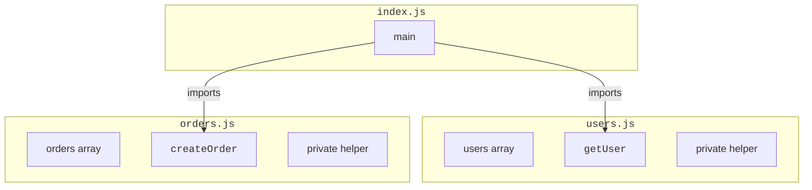
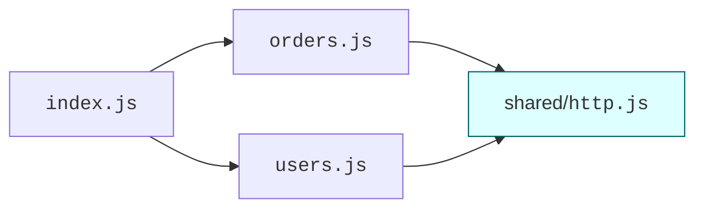

Every program starts as a single file. Then it grows. At some
point — usually around a few hundred lines — that single file
becomes painful to navigate, and you split it. *How* you split it
is what we mean by **modular organization**.

Good module boundaries make a codebase navigable for years. Bad
ones make it a tangled mess. The good news is that a few
principles take you 90% of the way.

<svg
  viewBox="0 0 640 230"
  role="img"
  aria-label="Colorful building bricks with studs floating just above a base brick, dotted guides showing where each one snaps in"
  style={{ display: "block", width: "100%", maxWidth: "640px", height: "auto", margin: "2.5rem auto" }}
>
  <g style={{ color: "var(--ds-blue-500)" }} fill="currentColor">
    <circle cx="230" cy="150" r="9" />
    <circle cx="290" cy="150" r="9" />
    <circle cx="350" cy="150" r="9" />
    <rect x="200" y="150" width="180" height="50" rx="10" />
  </g>
  <g style={{ color: "var(--ds-green-500)" }} fill="currentColor">
    <circle cx="170" cy="80" r="9" />
    <circle cx="210" cy="80" r="9" />
    <circle cx="250" cy="80" r="9" />
    <rect x="140" y="80" width="140" height="50" rx="10" />
  </g>
  <g style={{ color: "var(--ds-yellow-500)" }} fill="currentColor">
    <circle cx="360" cy="70" r="9" />
    <circle cx="420" cy="70" r="9" />
    <rect x="330" y="70" width="120" height="50" rx="10" />
  </g>
  <g style={{ color: "var(--ds-red-500)" }} fill="currentColor">
    <circle cx="492" cy="140" r="8" />
    <circle cx="538" cy="140" r="8" />
    <rect x="470" y="140" width="90" height="46" rx="10" />
  </g>
  <g fill="currentColor" opacity="0.3">
    <circle cx="210" cy="136" r="3" />
    <circle cx="210" cy="144" r="3" />
    <circle cx="250" cy="140" r="3" />
    <circle cx="390" cy="128" r="3" />
    <circle cx="390" cy="140" r="3" />
    <circle cx="360" cy="134" r="3" />
    <circle cx="412" cy="166" r="3" />
    <circle cx="430" cy="166" r="3" />
    <circle cx="448" cy="166" r="3" />
  </g>
</svg>

## What is a module?

A **module** is a file (or package) that:

- has its own private scope, and
- explicitly chooses which names it shares with the outside world.

Two modules can both declare a variable called `helper` without
clashing, because each name only exists inside its own file. That
isolation is the entire point.



`users.js` and `orders.js` both have a private `helper` — neither
file knows about the other's.

## Two module systems in JavaScript

JavaScript has, historically, two module systems you'll see in
the wild:

1. **CommonJS (CJS)** — older, used by Node.js by default for
   years. Uses `require()` and `module.exports`.
2. **ES Modules (ESM)** — the official language standard, used by
   browsers and now widely by Node. Uses `import` and `export`.

The runtime used in these lessons (`almostnode`) uses CommonJS,
so all the multi-file challenges have looked like this:

```javascript
// math.js
function add(a, b) { return a + b; }
module.exports = { add };

// index.js
const { add } = require("./math");
console.log(add(2, 3));
```

ES Modules look like this:

```javascript
// math.js
export function add(a, b) { return a + b; }

// index.js
import { add } from "./math.js";
console.log(add(2, 3));
```

The *ideas* are identical: define a public surface, import from
other modules. Most projects today use ESM for new code. CommonJS
is still everywhere because of legacy and Node defaults.

### Quick mapping

| CommonJS | ES Modules |
| --- | --- |
| `const x = require("./mod")` | `import x from "./mod.js"` |
| `const { a, b } = require("./mod")` | `import { a, b } from "./mod.js"` |
| `module.exports = something` | `export default something` |
| `module.exports = { a, b }` | `export { a, b }` |
| `module.exports.a = ...` | `export const a = ...` |

A subtle but important difference: ES module imports are
**static** (resolved before any code runs), CommonJS requires are
**dynamic** (executed as the line is reached). This is why ESM
can do tree-shaking and CJS generally can't.

## Designing a module: public vs. private

A module's *public surface* is everything it exports. Everything
else is *private* — usable only from inside the file. The
golden rule:

> **Export the minimum.** Internal helpers stay internal.

Why? Because anything you export becomes a *promise* to callers.
Renaming or removing it might break them. The smaller your
surface, the freer you are to change the internals.

<CodeBlock
  adapter="javascript"
  entryFilename="index.js"
  files={[
    {
      filename: "index.js",
      starterCode: `const { format } = require("./currency");

console.log(format(1234.5, "USD"));
console.log(format(99, "EUR"));

// We DON'T expose the helpers — and we can't even reach them.
try {
  require("./currency").pad;
} catch (e) {}
console.log("pad exposed?", typeof require("./currency").pad === "function");
`,
    },
    {
      filename: "currency.js",
      starterCode: `// PRIVATE helper: not exported.
function pad(n) {
  return n.toFixed(2);
}

// PRIVATE helper: not exported.
const SYMBOLS = { USD: "$", EUR: "€", GBP: "£" };

// PUBLIC: only this one function escapes.
function format(amount, code) {
  const symbol = SYMBOLS[code] || code + " ";
  return symbol + pad(amount);
}

module.exports = { format };
`,
    },
  ]}
/>

Inside `currency.js`, `pad` and `SYMBOLS` exist; outside, they
don't. We could rename them tomorrow and nothing else breaks.

## Cohesion and coupling

Two related ideas guide *what* belongs in a module:

- **Cohesion** — how related the things inside a module are.
  High cohesion = good.
- **Coupling** — how dependent two modules are on each other.
  Low coupling = good.

A module that does "user authentication and PDF rendering" has
**low cohesion** — unrelated concerns crammed together. Split
it.

Two modules where each one constantly reaches into the other's
internals are **tightly coupled**. Hide the internals; make the
collaboration go through a small, named API.

The phrase: *high cohesion, loose coupling*. Repeat it until you
believe it.

## File layout patterns

For small projects, this is plenty:

```
src/
  index.js
  config.js
  users.js
  orders.js
  utils.js
```

As things grow, group by **feature**, not by **technical type**.

Anti-pattern (grouped by type):

```
src/
  components/   # 200 unrelated files
  utils/        # 100 unrelated files
  models/       # 80 unrelated files
```

Better (grouped by feature):

```
src/
  users/
    index.js
    api.js
    validation.js
  orders/
    index.js
    api.js
    pricing.js
  shared/
    http.js
    config.js
```

When you change "the orders feature", almost all the code lives
in `orders/`. You don't have to spelunk across the whole tree.

## Dependency direction

Modules should form a **directed acyclic graph** — A may depend
on B, B may depend on C, but C must not depend on A.



`shared/http.js` is depended on by feature modules; it never
depends on them. This forms layers:

1. **Shared utilities** (lowest layer) — depended on by everything.
2. **Feature modules** — depended on by entry points.
3. **Entry points** (highest layer) — depend on features.

A **circular dependency** — A imports B and B imports A —
usually means a third module is hiding between them, waiting to
be extracted.

## A bigger multi-file example

Let's wire up a tiny CLI-ish app that demonstrates layering and
re-exports.

<CodeBlock
  adapter="javascript"
  entryFilename="index.js"
  files={[
    {
      filename: "index.js",
      starterCode: `// Top-level entry. Imports each feature's public API.
const { listActiveUsers, addUser } = require("./users");
const { createOrder, totalRevenue } = require("./orders");

addUser({ id: 1, name: "Ada", active: true });
addUser({ id: 2, name: "Linus", active: false });
addUser({ id: 3, name: "Grace", active: true });

createOrder({ userId: 1, amount: 50 });
createOrder({ userId: 1, amount: 30 });
createOrder({ userId: 3, amount: 80 });

console.log("active users :", listActiveUsers());
console.log("total revenue:", totalRevenue());
`,
    },
    {
      filename: "users.js",
      starterCode: `const { getAll, add } = require("./shared/store");

const COLLECTION = "users";

function addUser(user) {
  add(COLLECTION, user);
}

function listActiveUsers() {
  return getAll(COLLECTION).filter((u) => u.active);
}

module.exports = { addUser, listActiveUsers };
`,
    },
    {
      filename: "orders.js",
      starterCode: `const { getAll, add } = require("./shared/store");

const COLLECTION = "orders";

function createOrder(order) {
  if (typeof order.amount !== "number" || order.amount <= 0) {
    throw new Error("invalid amount");
  }
  add(COLLECTION, { ...order, createdAt: Date.now() });
}

function totalRevenue() {
  return getAll(COLLECTION).reduce((s, o) => s + o.amount, 0);
}

module.exports = { createOrder, totalRevenue };
`,
    },
    {
      filename: "shared/store.js",
      starterCode: `// Tiny in-memory key-value collection store.
const collections = {};

function add(name, value) {
  (collections[name] = collections[name] || []).push(value);
}

function getAll(name) {
  return [...(collections[name] || [])]; // copy to discourage mutation
}

module.exports = { add, getAll };
`,
    },
  ]}
/>

A few things to notice:

- `users.js` and `orders.js` are *peers* — neither imports the
  other.
- Both depend on `shared/store.js`, which depends on nothing.
- `index.js` is the only place where everything comes together.

You could replace `shared/store.js` with a database tomorrow, and
the feature modules wouldn't care — they only depend on the
`{ add, getAll }` shape.

## Re-exports: a single front door per package

A common pattern in bigger projects is for each "feature" folder
to have an `index.js` that re-exports its public surface:

```javascript
// users/index.js
const { addUser, listActiveUsers } = require("./api");
module.exports = { addUser, listActiveUsers };

// elsewhere
const { addUser } = require("./users");   // not ./users/api
```

Outside callers go through `./users`, never `./users/api`. The
folder itself becomes the module boundary.

## Project-wide rules of thumb

- One concept per file. If a file does two things, split it.
- Long files are a smell. Past ~300 lines, ask whether anything is
  trying to escape.
- Imports go at the top, side by side, in groups (third-party
  first, then local).
- A module shouldn't reach across directories to grab another
  module's *internals* — only its public exports.
- If two modules keep needing to know about the same thing,
  extract that thing into a third module.

## Challenge

<ChallengeCard
  adapter="javascript"
  title="Split into modules"
  instructions={`Build a tiny budget tracker across two files.

In \`budget.js\`, implement and export:
- \`addExpense(amount, category)\` — records an expense.
- \`addIncome(amount)\` — records income.
- \`balance()\` — returns income minus the sum of all expenses.
- \`expensesByCategory()\` — returns an object mapping each category to its total.

In \`index.js\`, require those functions and run a quick demo.

Rules:
- All four functions must be exported from \`budget.js\`.
- Internal storage (the array of records) MUST NOT be exported.
- \`addExpense\` should throw if amount is not a positive number.
- \`balance()\` for a fresh module (no entries) returns \`0\`.

The tests will require \`./budget\` and call the exported functions.`}
  entryFilename="index.js"
  files={[
    {
      filename: "index.js",
      starterCode: `const budget = require("./budget");

budget.addIncome(1000);
budget.addExpense(120, "food");
budget.addExpense(80, "food");
budget.addExpense(60, "books");

console.log("balance:", budget.balance());
console.log("by category:", budget.expensesByCategory());
`,
      solutionCode: `const budget = require("./budget");

budget.addIncome(1000);
budget.addExpense(120, "food");
budget.addExpense(80, "food");
budget.addExpense(60, "books");

console.log("balance:", budget.balance());
console.log("by category:", budget.expensesByCategory());
`,
    },
    {
      filename: "budget.js",
      starterCode: `// Implement the four functions here and export them.
// Keep your storage private to this file.
`,
      solutionCode: `let income = 0;
const expenses = [];

function addIncome(amount) {
  income += amount;
}

function addExpense(amount, category) {
  if (typeof amount !== "number" || amount <= 0) {
    throw new Error("amount must be a positive number");
  }
  expenses.push({ amount, category });
}

function balance() {
  const spent = expenses.reduce((s, e) => s + e.amount, 0);
  return income - spent;
}

function expensesByCategory() {
  return expenses.reduce((acc, e) => {
    acc[e.category] = (acc[e.category] || 0) + e.amount;
    return acc;
  }, {});
}

module.exports = { addIncome, addExpense, balance, expensesByCategory };
`,
    },
  ]}
  tests={[
    {
      id: "exports",
      name: "All four functions are exported",
      description: "addIncome, addExpense, balance, expensesByCategory",
      code: `const b = require("./budget");
for (const k of ["addIncome", "addExpense", "balance", "expensesByCategory"]) {
  if (typeof b[k] !== "function") throw new Error("missing export: " + k);
}`,
    },
    {
      id: "balance_math",
      name: "balance() = income - total expenses",
      description: "1000 - (120+80+60) = 740",
      code: `const b = require("./budget");
b.addIncome(1000);
b.addExpense(120, "food");
b.addExpense(80, "food");
b.addExpense(60, "books");
if (b.balance() !== 740) throw new Error("expected 740, got " + b.balance());`,
    },
    {
      id: "by_category",
      name: "expensesByCategory groups correctly",
      description: "food=200, books=60",
      code: `const b = require("./budget");
const bc = b.expensesByCategory();
if (bc.food !== 200 || bc.books !== 60) throw new Error("expected food=200, books=60, got " + JSON.stringify(bc));`,
    },
    {
      id: "validation",
      name: "addExpense rejects bad amounts",
      description: "throws on 0 or negative",
      code: `const b = require("./budget");
let threw = false;
try { b.addExpense(-1, "x"); } catch (e) { threw = true; }
if (!threw) throw new Error("must throw for negative amount");`,
    },
  ]}
/>

---

<MultipleChoice
  markdown={`What's the main reason to keep a module's public surface (its exports) as small as possible?

- Smaller exports make the program run faster
  > The size of a module's public API has no bearing on runtime performance; tree-shaking in bundlers can eliminate unused exports, but keeping exports small is a design concern, not a speed concern.
- Files with fewer exports use less memory
  > Memory usage is determined by the code and data that actually runs, not by how many names are exported; exports are essentially just references and have negligible memory cost.
- [o] Anything you export becomes a commitment — callers can rely on it, so the more you expose, the less freedom you have to change the internals later
  > Module exports define a *contract*. Once other code starts using \`pad\` or \`SYMBOLS\`, renaming or removing them risks breaking callers. Keeping internals private leaves you free to refactor without breaking anyone, which is one of the biggest long-term wins of good modular design.
- Smaller exports look nicer in editors
  > Editor presentation is a minor aesthetic point; the real reason to minimise exports is the engineering principle of information hiding and the freedom it gives you to change internal implementation later.

Modules are about *information hiding*. The less you expose, the easier the code is to evolve.`}
/>
