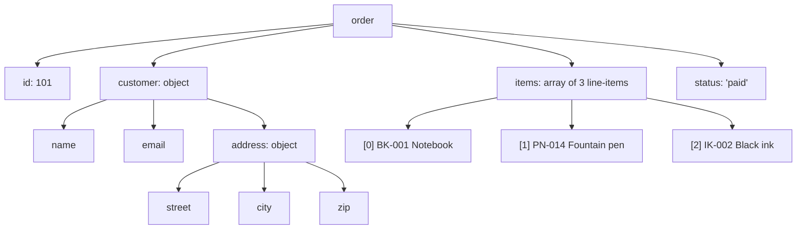

A single object or array can only get you so far. Real-world data
almost always has *structure inside structure*: an order has line
items, each line item has a product, each product has tags. Once
you can navigate and update nested data confidently, you can model
just about anything.

## Mental model: shapes inside shapes

<Illustration name="nested-tree" />

Take a moment to read this object slowly:

<CodeBlock
  adapter="javascript"
  starterCode={`const order = {
  id: 101,
  customer: {
    name: "Ada Lovelace",
    email: "ada@example.com",
    address: {
      street: "10 Babbage Lane",
      city: "London",
      zip: "EC1A 1AA",
    },
  },
  items: [
    { sku: "BK-001", title: "Notebook", qty: 2, price: 4.5 },
    { sku: "PN-014", title: "Fountain pen", qty: 1, price: 35.0 },
    { sku: "IK-002", title: "Black ink", qty: 3, price: 8.0 },
  ],
  status: "paid",
};

console.log(order.customer.address.city);
console.log(order.items[1].title);
console.log(order.items.length, "line items");
`}
/>

That single value packs a lot of information. The skill is being
able to *picture* its shape — to know where things live.



## Reading deep paths

To read a value from a deeply nested structure, chain dots and
brackets:

```javascript
order.customer.address.city          // "London"
order.items[0].title                 // "Notebook"
order.items[order.items.length - 1]  // last line item
```

The hazard is **missing intermediate values**. If `order.customer`
is `undefined`, then `order.customer.address` will throw a
`TypeError: Cannot read properties of undefined (reading 'address')`.
A classic source of beginner crashes.

### Optional chaining: `?.`

Modern JavaScript has a special operator for safe navigation. If
the value before `?.` is `null` or `undefined`, the whole
expression returns `undefined` instead of throwing.

<CodeBlock
  adapter="javascript"
  starterCode={`const noisy = { user: { profile: { name: "Ada" } } };
const sparse = { user: null };

console.log(noisy.user?.profile?.name); // "Ada"
console.log(sparse.user?.profile?.name); // undefined — no crash!
console.log(sparse.user?.profile?.name ?? "anonymous"); // "anonymous"

// Works for arrays too:
const orders = [];
console.log(orders[0]?.items); // undefined, no crash

// And for method calls:
const maybeFn = null;
maybeFn?.(); // does nothing, returns undefined
`}
/>

The pair of `?.` and `??` (nullish coalescing) is the modern
JavaScript way to safely read possibly-missing data and fall back
to a default. Together they replace many lines of defensive
`if (x && x.y && x.y.z)` checks.

## Walking nested data

The natural way to walk nested data is **nested loops** (or
recursion). Let's add up the total cost of the order above:

<CodeBlock
  adapter="javascript"
  starterCode={`const order = {
  id: 101,
  items: [
    { sku: "BK-001", qty: 2, price: 4.5 },
    { sku: "PN-014", qty: 1, price: 35.0 },
    { sku: "IK-002", qty: 3, price: 8.0 },
  ],
};

let total = 0;
for (const item of order.items) {
  const subtotal = item.qty * item.price;
  console.log(item.sku, "->", subtotal);
  total += subtotal;
}
console.log("Total:", total);
`}
/>

That is just an "accumulator over a list" loop, walking one level
of nesting. The same pattern scales to any depth.

## A two-level example: students and grades

<CodeBlock
  adapter="javascript"
  starterCode={`const class1 = [
  { name: "Ada", grades: [82, 95, 78] },
  { name: "Linus", grades: [60, 70, 65] },
  { name: "Grace", grades: [91, 88, 100] },
];

for (const student of class1) {
  let total = 0;
  for (const g of student.grades) total += g;
  const avg = total / student.grades.length;
  console.log(student.name, "-> average", avg.toFixed(1));
}
`}
/>

Outer loop walks each student. Inner loop walks that student's
grades. Two levels of nesting; two `for` loops. The pattern is
mechanical once you see it.

## Immutable updates: deep edits without mutation

Earlier we praised the *immutable update* style:

```javascript
const updated = { ...original, name: "new name" };
```

That works perfectly for a one-level object. What about updating
something deep inside a nested structure?

<CodeBlock
  adapter="javascript"
  starterCode={`const order = {
  id: 101,
  customer: { name: "Ada", email: "ada@example.com" },
  status: "pending",
};

// Goal: produce a new order with status "paid", without mutating the original.
const paid = { ...order, status: "paid" };
console.log("original:", order.status);
console.log("paid:    ", paid.status);

// Goal: produce a new order with customer.email updated, without mutating.
const reMailed = {
  ...order,
  customer: { ...order.customer, email: "ada@cs.org" },
};
console.log("original email:", order.customer.email);
console.log("new email:     ", reMailed.customer.email);
`}
/>

Notice we had to spread *each level* we wanted to copy. The
remaining nested objects are shared (still by reference), which is
fine — they're unchanged.

Real codebases sometimes use helper libraries (like Immer) to make
deep updates pleasant. For a first pass, the explicit spread style
is clearest.

## Updating an item inside an array

Updating one element of an array, immutably, is a common task. Use
`.map` to produce a new array where one element is changed:

<CodeBlock
  adapter="javascript"
  starterCode={`const items = [
  { sku: "BK-001", qty: 2 },
  { sku: "PN-014", qty: 1 },
  { sku: "IK-002", qty: 3 },
];

// Increase the quantity of the "PN-014" line by 1.
const updated = items.map((item) =>
  item.sku === "PN-014" ? { ...item, qty: item.qty + 1 } : item,
);

console.log("original:", items);
console.log("updated: ", updated);
`}
/>

The unchanged elements pass through `.map` unmodified. The
matching element is replaced by a new object via spread.

## JSON: data as text

A nested structure of objects, arrays, numbers, strings, booleans,
and `null` is precisely the set of things you can store as **JSON**
(JavaScript Object Notation). JSON is the universal exchange
format of the web — every API you'll ever call either accepts or
returns JSON.

JavaScript ships with two functions for converting between JSON
text and live values:

<CodeBlock
  adapter="javascript"
  starterCode={`const order = {
  id: 101,
  customer: { name: "Ada", email: "ada@example.com" },
  items: [{ sku: "BK-001", qty: 2 }],
  status: "paid",
};

// Object -> JSON text
const text = JSON.stringify(order);
console.log(text);

// JSON text -> object
const back = JSON.parse(text);
console.log(back.customer.name);
console.log(back === order); // false — it's a brand-new object
console.log(JSON.stringify(back) === text); // true — equivalent contents

// Pretty-printed JSON:
console.log(JSON.stringify(order, null, 2));
`}
/>

A neat side-effect: `JSON.parse(JSON.stringify(x))` is a
quick-and-dirty way to make a **deep copy** of plain data. It
won't handle functions, dates, or circular structures, but for
pure data it's a useful trick.

## Common shapes you'll meet

It helps to recognise a few recurring shapes:

- **Array of objects** (a table-like dataset)

  ```javascript
  const users = [
    { id: 1, name: "Ada" },
    { id: 2, name: "Linus" },
  ];
  ```

- **Object of arrays** (data grouped by category)

  ```javascript
  const grouped = {
    admins:  ["Ada", "Grace"],
    members: ["Linus"],
  };
  ```

- **Map-like object** (key-keyed lookups)

  ```javascript
  const usersById = {
    1: { id: 1, name: "Ada" },
    2: { id: 2, name: "Linus" },
  };
  ```

Almost every API response, configuration file, or database row you
ever encounter is some combination of these.

## A multi-file nested-data example

A small program that reads a list of orders, computes totals per
customer, and prints a tidy summary. The shape of the data is
non-trivial; the code is straightforward because we keep each step
small.

<CodeBlock
  adapter="javascript"
  entryFilename="index.js"
  files={[
    {
      filename: "index.js",
      initialContent: `const { ordersByCustomer, lineTotal } = require("./orders");

const orders = [
  {
    id: 1,
    customer: "Ada",
    items: [
      { price: 10, qty: 2 },
      { price: 5, qty: 1 },
    ],
  },
  { id: 2, customer: "Linus", items: [{ price: 20, qty: 3 }] },
  { id: 3, customer: "Ada", items: [{ price: 8, qty: 4 }] },
];

const byCustomer = ordersByCustomer(orders);
for (const [customer, customerOrders] of Object.entries(byCustomer)) {
  let total = 0;
  for (const order of customerOrders) {
    for (const item of order.items) total += lineTotal(item);
  }
  console.log(\`\${customer}: \${customerOrders.length} orders, total $\${total}\`);
}
`,
    },
    {
      filename: "orders.js",
      initialContent: `function lineTotal(item) {
  return item.price * item.qty;
}

function ordersByCustomer(orders) {
  const out = {};
  for (const order of orders) {
    if (!out[order.customer]) out[order.customer] = [];
    out[order.customer].push(order);
  }
  return out;
}

module.exports = { lineTotal, ordersByCustomer };
`,
    },
  ]}
/>

Notice the inner nested loops (`for order... for item...`) — they
mirror the *shape* of the data. When the data has two levels of
nesting, the loop usually does too.

## Challenge

<ChallengeCard
  adapter="javascript"
  title="Safely read a nested property"
  instructions={`Write a function \`getPath(obj, path, defaultValue)\` that:

- Takes an object \`obj\`, a path string like \`"customer.address.city"\`, and a default value.
- Returns the value at that nested path, or the default if any step is missing.
- Must not throw, even if intermediate properties are missing or null.

Examples:
- \`getPath({ a: { b: { c: 42 } } }, "a.b.c", 0)\` → \`42\`
- \`getPath({ a: { b: {} } }, "a.b.c", 0)\` → \`0\`
- \`getPath({ a: null }, "a.b.c", "n/a")\` → \`"n/a"\`
- \`getPath({}, "x", "n/a")\` → \`"n/a"\``}
  starterCode={`function getPath(obj, path, defaultValue) {
  // your code here
  return defaultValue;
}

console.log(getPath({ a: { b: { c: 42 } } }, "a.b.c", 0));
console.log(getPath({ a: { b: {} } }, "a.b.c", 0));
console.log(getPath({ a: null }, "a.b.c", "n/a"));
console.log(getPath({}, "x", "n/a"));
`}
  solutionCode={`function getPath(obj, path, defaultValue) {
  const parts = path.split(".");
  let current = obj;
  for (const key of parts) {
    if (current == null || typeof current !== "object") return defaultValue;
    current = current[key];
  }
  return current === undefined ? defaultValue : current;
}

console.log(getPath({ a: { b: { c: 42 } } }, "a.b.c", 0));
console.log(getPath({ a: { b: {} } }, "a.b.c", 0));
console.log(getPath({ a: null }, "a.b.c", "n/a"));
console.log(getPath({}, "x", "n/a"));
`}
  tests={[
    {
      id: "present",
      name: "Path exists",
      description: "{a:{b:{c:42}}}, 'a.b.c' → 42",
      code: `if (getPath({ a: { b: { c: 42 } } }, "a.b.c", 0) !== 42) throw new Error("expected 42");`,
    },
    {
      id: "missing_leaf",
      name: "Missing leaf",
      description: "{a:{b:{}}}, 'a.b.c' → default",
      code: `if (getPath({ a: { b: {} } }, "a.b.c", 0) !== 0) throw new Error("expected 0");`,
    },
    {
      id: "null_in_middle",
      name: "Null in the middle",
      description: "{a:null}, 'a.b.c' → default",
      code: `if (getPath({ a: null }, "a.b.c", "n/a") !== "n/a") throw new Error("expected 'n/a'");`,
    },
    {
      id: "empty",
      name: "Empty object",
      description: "{}, 'x' → default",
      code: `if (getPath({}, "x", "n/a") !== "n/a") throw new Error("expected 'n/a'");`,
    },
    {
      id: "falsy_value",
      name: "Falsy but defined value",
      description: "0 should not be replaced by default",
      code: `if (getPath({ a: { b: 0 } }, "a.b", 99) !== 0) throw new Error("expected 0 to be kept, got default");`,
    },
  ]}
/>

---

<MultipleChoice
  markdown={`Why is optional chaining (\`a?.b?.c\`) so useful when reading deeply nested data?

- It runs faster than ordinary property access
  > Optional chaining is slightly slower than ordinary property access because the runtime must check for \`null\`/\`undefined\` at each step; its value is safety, not speed.
- It automatically creates missing properties
  > Optional chaining does *not* create properties; it short-circuits to \`undefined\` when a link is missing. Creating a missing property requires an explicit assignment.
- [o] It safely returns \`undefined\` if any link in the chain is \`null\` or \`undefined\`, instead of throwing a \`TypeError\` and crashing the program
  > Real-world data is often partial — some fields are missing, optional, or not yet loaded. \`?.\` lets you write \`user?.address?.city\` and get back \`undefined\` for any missing link, instead of an exception. Combined with \`??\` for defaults, it replaces many lines of defensive \`if\` checks.
- It is a faster form of array indexing
  > \`?.\` can be used with bracket notation (\`arr?.[0]\`) but it is not an indexing optimisation; it adds a null check, which is the opposite of a speed-up.

Optional chaining is one of the most quietly useful additions to modern JavaScript. Once you've used it, going back to nested \`&&\` checks feels archaic.`}
/>
