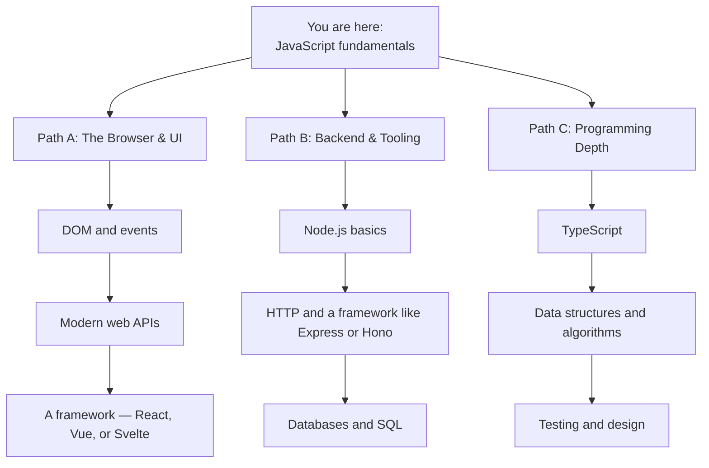

If you've worked through every chapter, paused on the challenges,
and predicted the output of a few async puzzles — congratulations.
You now have the **programming foundations** most developers spend
years building. JavaScript is one specific shape they take, but
the same ideas (variables, control flow, functions, scope, data
structures, async, modules) carry into every modern language.

This last chapter is a roadmap. Pick the path that matches what
you want to *build*.

<svg
  viewBox="0 0 640 235"
  role="img"
  aria-label="Three dotted trails lead from a rising sun on the horizon toward three distant circles under a few faint stars"
  style={{ display: "block", width: "100%", maxWidth: "640px", height: "auto", margin: "2.5rem auto" }}
>
  <g fill="currentColor">
    <rect x="40" y="196" width="560" height="4" rx="2" opacity="0.15" />
    <circle cx="80" cy="44" r="3" opacity="0.25" />
    <circle cx="560" cy="36" r="2.5" opacity="0.25" />
    <circle cx="600" cy="84" r="3" opacity="0.2" />
  </g>
  <g style={{ color: "var(--ds-blue-500)" }} fill="currentColor">
    <path d="M240 196 A80 80 0 0 1 400 196 Z" fillOpacity="0.18" />
    <path d="M272 196 A48 48 0 0 1 368 196 Z" fillOpacity="0.32" />
    <circle cx="518" cy="72" r="16" />
  </g>
  <g fill="currentColor" opacity="0.3">
    <circle cx="264" cy="166" r="3.5" />
    <circle cx="228" cy="142" r="3.5" />
    <circle cx="192" cy="118" r="3.5" />
    <circle cx="156" cy="94" r="3.5" />
    <circle cx="320" cy="162" r="3.5" />
    <circle cx="320" cy="132" r="3.5" />
    <circle cx="320" cy="102" r="3.5" />
    <circle cx="320" cy="76" r="3.5" />
    <circle cx="376" cy="166" r="3.5" />
    <circle cx="412" cy="142" r="3.5" />
    <circle cx="448" cy="118" r="3.5" />
    <circle cx="484" cy="94" r="3.5" />
  </g>
  <g style={{ color: "var(--ds-green-500)" }} fill="currentColor">
    <circle cx="122" cy="72" r="16" />
  </g>
  <g style={{ color: "var(--ds-yellow-500)" }} fill="currentColor">
    <circle cx="320" cy="48" r="16" />
  </g>
  <g style={{ color: "var(--ds-red-500)" }} fill="currentColor">
    <circle cx="200" cy="36" r="4" fillOpacity="0.8" />
  </g>
</svg>

## A short reality check

You are not going to remember every syntax detail. Nobody does.
What you should now be able to do, after a *little* re-reading,
is:

- Read unfamiliar JavaScript code and understand its shape.
- Write small programs by breaking a problem into functions.
- Reason about why code prints what it prints — including async.
- Recognise a bug from a stack trace and a few `console.log`s.
- Decide where to split a file when it gets too big.

That's a real skill. Now you grow it by *building things*.

## Three paths from here

You don't have to choose one. Most working developers eventually
touch all three. But choosing one to focus on *first* will be more
satisfying than skimming all three at once.

### Path A — The browser and user interfaces

This is what people usually mean by "frontend." JavaScript runs
in the browser, manipulating the page in response to user actions.

In order:

1. **The DOM.** The page is a tree of nodes; JS can read and
   modify it. Learn `document.querySelector`, `addEventListener`,
   creating elements, and updating text/classes.
2. **Modern web APIs.** `fetch` for network requests,
   `localStorage` for tiny persistence, `URL`, `FormData`. The
   browser provides hundreds.
3. **A framework.** Once your "DIY DOM" code gets unwieldy, a
   framework (React, Vue, Svelte, Solid…) is a relief. They all
   share core ideas: components, props, state, render trees.

### Path B — Backend and tooling with Node.js

The same JavaScript runs outside the browser, on servers and in
build tools.

1. **Node.js basics.** Reading files, command-line arguments,
   environment variables, the module system. Building a small CLI
   is a great first project.
2. **HTTP.** The protocol of the web. Write a small HTTP server
   from scratch using `http.createServer`, then graduate to a
   framework like Express, Fastify, or Hono.
3. **Databases.** Learn SQL on its own (it's its own language and
   well worth learning) and pair it with a client library. Try
   SQLite first — no setup, no server. The
   [SQL playground in this site](/playground/sqlite) is a good
   place to start.

### Path C — Programming depth

If you're hungry for more *programming*, regardless of language:

1. **TypeScript.** Adds a static type system on top of JS.
   Catches a huge class of bugs at write time. The site has a
   dedicated [TypeScript course](/learn/typescript-from-scratch) that picks up
   right where this one leaves off.
2. **Data structures and algorithms.** Lists, sets, maps, stacks,
   queues, trees, graphs; sorting, searching, recursion,
   complexity. Don't aim for "interview prep" — aim for
   *intuition*. The classic book is *Introduction to Algorithms*
   (Cormen et al.), but any good resource works.
3. **Testing and design.** Write tests. Learn what "unit",
   "integration", and "end-to-end" mean. Read about SOLID,
   functional design, and domain-driven design — not as rules,
   but as vocabulary.

## Build, build, build

Reading and watching teach concepts. *Building* teaches you what
they actually mean.

A few starter project ideas, increasing in difficulty:

- A command-line **to-do list** that stores items in a JSON file.
- A **password generator** with options for length, symbols, etc.
- A **Markdown-to-HTML converter** for a single file.
- A **simple HTTP server** that returns "hello, world" and grows
  into a tiny REST API.
- A **single-page web app** that fetches data from a public API
  (try jokes, weather, or a Pokémon API) and renders it.
- A **link shortener** with a database, a few endpoints, and a
  minimal UI.
- A **chat application** with a server and a browser client.

For each project: write the smallest version that works, *use
it*, then add one feature at a time. The "use it" step is the one
beginners skip — and it's where you learn the most.

## Habits worth cultivating

A small list, gathered from years of watching what separates
people who keep improving from people who stall:

- **Read other people's code.** Open source projects you use are
  the best textbooks. You'll be surprised how much is just
  patterns you already know.
- **Type, don't copy.** When you're learning, type code by hand
  rather than pasting. Your fingers learn the syntax; your eyes
  catch your own typos.
- **Embrace not understanding.** Healthy reaction to a confusing
  bit of code: "I don't get this *yet*." Look it up, ask, sit
  with it. Don't pretend it makes sense.
- **Write things down.** Tiny notes — "today I learned that
  `map` skips holes in sparse arrays" — compound over months.
- **Ship.** Finished, deployed, used-by-someone projects teach
  *more* than ten times as much code that lives only on your
  laptop.

## Resources to bookmark

Three references most JS developers keep open:

- **MDN Web Docs** (`developer.mozilla.org`). The canonical reference
  for the language and browser APIs. Search "MDN" plus whatever
  you're looking for.
- **You Don't Know JS, Yet** by Kyle Simpson. Free, online,
  deeper dive into the trickier corners of JavaScript.
- **JavaScript: The Definitive Guide** by David Flanagan. A
  weighty paperback worth owning if you prefer books.

## A closing thought

You started this course not fully sure how programs run. You now
know how a single thread executes statements, how the event loop
schedules tasks, why pure functions help, what closures capture,
how Promises chain, and how to split code into modules. That
mental model is more important than any specific framework.

JavaScript will keep evolving. New runtimes, new APIs, new ways
to write the same ideas. Your foundation — *programs are data
plus instructions plus scheduling* — won't change. Carry it with
you.

Now stop reading, and go build something. Good luck. 🚀

---

<MultipleChoice
  markdown={`You've just finished the foundations. Which of the following is the *single most useful* thing you can do next to keep growing?

- Watch as many video tutorials as possible
  > Tutorials are useful for discovering concepts, but watching is passive consumption; actual programming skill grows through writing code, encountering real errors, and solving them yourself.
- Read several JavaScript books cover to cover before writing more code
  > Reading builds background knowledge but is no substitute for practice; waiting until you've read several books before writing code delays the feedback loop that accelerates learning fastest.
- [o] Pick a small project you'd actually use, build the smallest possible version that works, then add one feature at a time
  > Programming is a *practice*. Tutorials and books are scaffolding, but real skill is built by writing, debugging, and shipping small things — especially things you'll use yourself, because then you naturally notice what's missing or wrong. The "start small, grow by one feature" loop is exactly how working developers learn the rest of their careers.
- Memorise every method on \`Array.prototype\` and \`String.prototype\`
  > Memorising API methods is lower-value than practice; the methods are one search away, and you'll naturally learn the ones you use frequently just by building things.

You don't grow into a strong developer by accumulating facts. You grow by repeatedly building, breaking, and fixing real things.`}
/>
