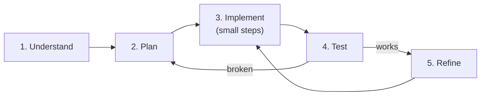

In the previous page we met four mental moves: decomposition,
pattern matching, abstraction, and algorithm design. This page
turns those moves into a concrete, repeatable **process** you can
apply to any programming problem, from a tiny exercise to a
multi-week feature.

Most beginners get stuck not because they "can't program" but
because they sit down in front of an empty editor and try to write
the answer in one shot. There is a better way.

## The five steps



1. **Understand** — re-state the problem in your own words. List the
   inputs, outputs, and edge cases.
2. **Plan** — sketch the algorithm in plain language or
   pseudo-code, *before* you touch the keyboard.
3. **Implement** — write code in small increments. Run after each.
4. **Test** — check the easy cases, the edge cases, the weird
   cases.
5. **Refine** — clean up names, extract helpers, remove duplication.

Cycle through them. When a test fails, you go back to plan or
implement. When the program works, you go to refine. Refine often
exposes new things to test.

## Worked example: shopping cart total with discount

Here is the problem we will solve, end to end, using the five
steps:

> *Given a list of items in a shopping cart (each with a price and
> a quantity) and a discount code, compute the final total. Two
> discount codes are valid: `SAVE10` for 10% off the subtotal, and
> `FLAT5` for $5 off the subtotal (but never below zero). Any
> other code (or no code) means no discount.*

### Step 1: Understand

Re-state the problem to yourself:

- **Input:** a list of `{ price, quantity }` items, and a string
  (the discount code, possibly empty).
- **Output:** a single number — the final total, in dollars.

What are the **edge cases**?

- The cart is empty.
- A quantity is zero (or negative? probably not allowed, but worth
  noticing).
- The discount code is not recognised.
- `FLAT5` is applied to a tiny cart whose subtotal is below $5 —
  the total should be `0`, not negative.

Already, before writing any code, we have learned a lot about the
problem. Beginners *skip* this step. Don't.

### Step 2: Plan

Write the algorithm in plain English, indented like code:

```
function finalTotal(items, code):
    subtotal = 0
    for each item in items:
        subtotal += item.price * item.quantity

    if code == "SAVE10":
        discount = subtotal * 0.10
    else if code == "FLAT5":
        discount = 5
    else:
        discount = 0

    total = subtotal - discount
    if total < 0:
        total = 0
    return total
```

That is a complete plan. We have not used JavaScript syntax yet,
but the *shape* of the program is decided.

Notice we did the **decomposition** (compute subtotal, then apply
discount, then clamp at zero) and chose the right **algorithm**
(loop and accumulate, conditional discount) before any keys were
pressed.

### Step 3: Implement (in small steps)

Now we type. But not all at once. We translate one chunk at a time
and **run** after each. We start with the simplest piece: just the
subtotal.

<CodeBlock
  adapter="javascript"
  initialCode={`function finalTotal(items, code) {
  let subtotal = 0;
  for (const item of items) {
    subtotal += item.price * item.quantity;
  }
  // TODO: discount
  // TODO: clamp at zero
  return subtotal;
}

const cart = [
  { price: 10.00, quantity: 2 },
  { price: 4.50,  quantity: 1 },
  { price: 1.20,  quantity: 5 },
];

console.log(finalTotal(cart, ""));
`}
/>

Run it. If the subtotal looks right, we move on. We add the
discount logic:

<CodeBlock
  adapter="javascript"
  initialCode={`function finalTotal(items, code) {
  let subtotal = 0;
  for (const item of items) {
    subtotal += item.price * item.quantity;
  }

  let discount = 0;
  if (code === "SAVE10") {
    discount = subtotal * 0.10;
  } else if (code === "FLAT5") {
    discount = 5;
  }

  let total = subtotal - discount;
  if (total < 0) total = 0;
  return total;
}

const cart = [
  { price: 10.00, quantity: 2 },
  { price: 4.50,  quantity: 1 },
  { price: 1.20,  quantity: 5 },
];

console.log("No code:    ", finalTotal(cart, ""));
console.log("SAVE10:     ", finalTotal(cart, "SAVE10"));
console.log("FLAT5:      ", finalTotal(cart, "FLAT5"));
console.log("FLAT5 small:", finalTotal([{ price: 2, quantity: 1 }], "FLAT5"));
console.log("Unknown:    ", finalTotal(cart, "BADCODE"));
console.log("Empty cart: ", finalTotal([], "SAVE10"));
`}
/>

We **ran after each addition**. That is the most important habit
in this whole course. The smaller the gap between "wrote new code"
and "saw it work", the faster you find bugs.

### Step 4: Test the edge cases

Look at the output. Check every line against your expectations.

- Subtotal of the example cart: `2*10 + 1*4.5 + 5*1.2 = 30.5`. ✓
- `SAVE10` → 10% off = `30.5 - 3.05 = 27.45`. ✓
- `FLAT5` → `30.5 - 5 = 25.50`. ✓
- `FLAT5` on a $2 cart → clamped to `0`. ✓
- Unknown code → full subtotal. ✓
- Empty cart → `0`. ✓

If any of those had been wrong, we would go back to **plan** or
**implement** and figure out where the discrepancy is. That is the
loop in the diagram above.

### Step 5: Refine

The code works. Now, **without changing its behaviour**, we
improve it.

- Extract the discount logic into its own function so the top-level
  reads more clearly.
- Extract the subtotal logic into its own function too.

<CodeBlock
  adapter="javascript"
  initialCode={`function subtotal(items) {
  let s = 0;
  for (const item of items) s += item.price * item.quantity;
  return s;
}

function discountFor(code, subtotalAmount) {
  if (code === "SAVE10") return subtotalAmount * 0.10;
  if (code === "FLAT5")  return 5;
  return 0;
}

function clampZero(n) {
  return n < 0 ? 0 : n;
}

function finalTotal(items, code) {
  const s = subtotal(items);
  const d = discountFor(code, s);
  return clampZero(s - d);
}

// Same tests as before — behaviour is unchanged.
const cart = [
  { price: 10.00, quantity: 2 },
  { price: 4.50,  quantity: 1 },
  { price: 1.20,  quantity: 5 },
];

console.log("No code:    ", finalTotal(cart, ""));
console.log("SAVE10:     ", finalTotal(cart, "SAVE10"));
console.log("FLAT5:      ", finalTotal(cart, "FLAT5"));
console.log("FLAT5 small:", finalTotal([{ price: 2, quantity: 1 }], "FLAT5"));
console.log("Unknown:    ", finalTotal(cart, "BADCODE"));
console.log("Empty cart: ", finalTotal([], "SAVE10"));
`}
/>

Look at the new `finalTotal`. It reads almost like the original
problem statement: "compute the subtotal, work out the discount,
subtract, clamp at zero". That is what good code looks like.

## Why refine matters

It is tempting to skip step 5 ("it works, move on"). Don't. Two
big reasons:

- **Refining makes future bugs visible.** Clean code is easier to
  trace. When something breaks next month, you will silently thank
  past-you.
- **Refining is how you learn.** The very act of "this looks ugly —
  let me make it nicer" trains your taste. Over time, you will
  write the cleaner version on the first try.

## When you are stuck

Sometimes a problem just doesn't yield. Some moves to try, in
order:

1. **Re-read the question.** Slowly. Underline every concrete
   noun and verb. Beginners often solve the wrong problem.
2. **Solve a smaller version first.** Don't tackle "tax for any
   country and any product" — tackle "tax for one country and one
   product".
3. **Solve it by hand for one example.** Take a single input and
   work out, on paper, exactly what the answer should be. Now your
   algorithm only has to do what your paper did.
4. **Add `console.log` everywhere.** Print the values at every
   step. The bug is rarely where you think it is.
5. **Explain it to someone (or something).** Out loud. To a friend,
   a colleague, or a rubber duck. The act of explaining often
   reveals what you don't yet understand.
6. **Walk away.** Take a five-minute break. Your brain finishes
   the work in the background more often than you would think.

Programming is mostly thinking, with a little typing on the side.
If you are typing furiously and getting nowhere, *stop typing*.

## A multi-file challenge

Real code lives in multiple files. Here is a challenge that uses
the same shopping-cart problem, split into two files. Your job is
to fill in the missing function.

<ChallengeCard
  adapter="javascript"
  title="Cart total across multiple files"
  instructions={`The file \`cart.js\` defines \`finalTotal(items, code)\` partially — the discount logic is missing. Fill it in so the totals match what the tests expect.

The rules:
- \`SAVE10\` → 10% off the subtotal.
- \`FLAT5\` → $5 off the subtotal, but never less than \`0\`.
- Any other code (including empty string) → no discount.`}
  entryFilename="index.js"
  files={[
    {
      filename: "index.js",
      initialContent: `const { finalTotal } = require("./cart");

const cart = [
  { price: 10.00, quantity: 2 },
  { price: 4.50,  quantity: 1 },
  { price: 1.20,  quantity: 5 },
];

console.log("No code:    ", finalTotal(cart, ""));
console.log("SAVE10:     ", finalTotal(cart, "SAVE10"));
console.log("FLAT5:      ", finalTotal(cart, "FLAT5"));
console.log("FLAT5 small:", finalTotal([{ price: 2, quantity: 1 }], "FLAT5"));
`,
    },
    {
      filename: "cart.js",
      initialContent: `function subtotal(items) {
  let s = 0;
  for (const item of items) s += item.price * item.quantity;
  return s;
}

function finalTotal(items, code) {
  const s = subtotal(items);
  // TODO: compute the discount based on \`code\`.
  // TODO: subtract the discount, but never return less than 0.
  return s;
}

module.exports = { finalTotal };
`,
    },
  ]}
  solutionCode={`// In cart.js:
function subtotal(items) {
  let s = 0;
  for (const item of items) s += item.price * item.quantity;
  return s;
}

function finalTotal(items, code) {
  const s = subtotal(items);
  let d = 0;
  if (code === "SAVE10") d = s * 0.10;
  else if (code === "FLAT5") d = 5;
  const total = s - d;
  return total < 0 ? 0 : total;
}

module.exports = { finalTotal };
`}
  tests={[
    {
      id: "no_code",
      name: "No code",
      description: "Subtotal of the example cart",
      code: `const { finalTotal } = require("./cart");
const cart = [
  { price: 10.00, quantity: 2 },
  { price: 4.50,  quantity: 1 },
  { price: 1.20,  quantity: 5 },
];
if (Math.abs(finalTotal(cart, "") - 30.5) > 0.001) throw new Error("expected 30.5");`,
    },
    {
      id: "save10",
      name: "SAVE10",
      description: "10% off subtotal",
      code: `const { finalTotal } = require("./cart");
const cart = [
  { price: 10.00, quantity: 2 },
  { price: 4.50,  quantity: 1 },
  { price: 1.20,  quantity: 5 },
];
if (Math.abs(finalTotal(cart, "SAVE10") - 27.45) > 0.001) throw new Error("expected 27.45");`,
    },
    {
      id: "flat5",
      name: "FLAT5",
      description: "$5 off subtotal",
      code: `const { finalTotal } = require("./cart");
const cart = [
  { price: 10.00, quantity: 2 },
  { price: 4.50,  quantity: 1 },
  { price: 1.20,  quantity: 5 },
];
if (Math.abs(finalTotal(cart, "FLAT5") - 25.5) > 0.001) throw new Error("expected 25.5");`,
    },
    {
      id: "flat5_clamp",
      name: "FLAT5 clamps to 0",
      description: "Small cart, FLAT5 → 0",
      code: `const { finalTotal } = require("./cart");
if (finalTotal([{ price: 2, quantity: 1 }], "FLAT5") !== 0) throw new Error("expected 0");`,
    },
  ]}
/>

---

<MultipleChoice
  markdown={`According to this page, what is the most common mistake beginners make when given a programming problem?

- They use the wrong text editor
- [o] They sit down and try to write the complete answer in one shot, instead of working in small understand → plan → implement → test → refine cycles
  > Correct. Trying to write the answer in one go almost always leads to confusion and frustration. Taking small, deliberate steps — and *running* after each one — is dramatically more productive.
- They use too many functions
- They write too many tests

Working in small, verifiable steps is the single most important habit you can build.`}
/>
