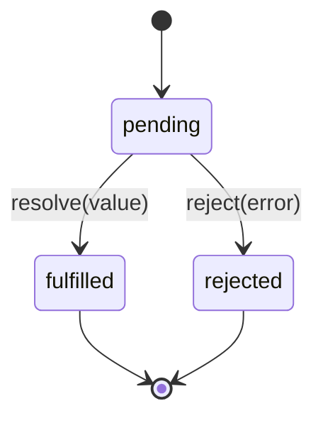
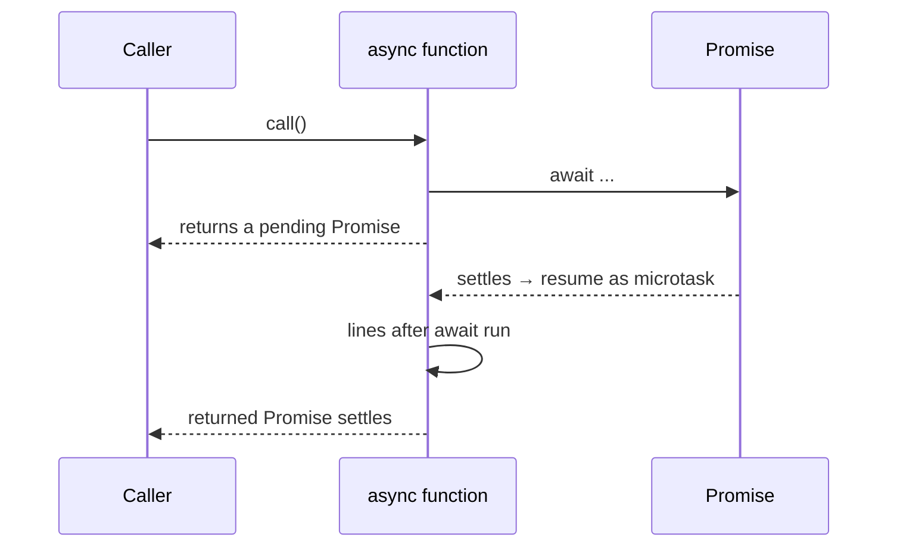

The previous chapter taught you the *idea* of asynchronous code
using plain callbacks. Modern JavaScript wraps that idea in two
much nicer tools:

- **Promises** — objects that represent a future value.
- **`async`/`await`** — syntax that lets you write Promise-based
  code as if it were synchronous.

By the end of this chapter, you'll be able to read and write
real-world async code.

## A Promise is a placeholder

When you start a slow operation, a Promise is the thing you
*immediately* get back. It's a placeholder for a value that isn't
ready yet. Later, the Promise will either be:

- **fulfilled** with a value, or
- **rejected** with an error.

Once a Promise is settled (fulfilled or rejected), it never
changes.



## Creating and consuming a Promise

You usually *consume* promises returned by other functions, but
occasionally you create one yourself.

<CodeBlock
  adapter="javascript"
  files={[
    {
      filename: "main.js",
      starterCode: `function wait(ms) {
  return new Promise((resolve) => {
    setTimeout(resolve, ms);
  });
}

console.log("A");
wait(300).then(() => console.log("B (after 300ms)"));
console.log("C");
`,
    },
  ]}
/>

`new Promise((resolve, reject) => { ... })` calls your function
immediately, passing in two functions. You call `resolve(value)`
when the work succeeds, or `reject(error)` if it fails.

You *consume* a promise with `.then()` (for success), `.catch()`
(for failure), and `.finally()` (always).

<CodeBlock
  adapter="javascript"
  files={[
    {
      filename: "main.js",
      starterCode: `function fetchUser(id) {
  return new Promise((resolve, reject) => {
    setTimeout(() => {
      if (id <= 0) reject(new Error("Invalid id"));
      else resolve({ id, name: "User " + id });
    }, 100);
  });
}

fetchUser(7)
  .then((user) => console.log("Got:", user))
  .catch((err) => console.error("Failed:", err.message))
  .finally(() => console.log("Done."));

fetchUser(-1)
  .then((user) => console.log("Got:", user))
  .catch((err) => console.error("Failed:", err.message))
  .finally(() => console.log("Done."));
`,
    },
  ]}
/>

## Chaining replaces nesting

Remember callback hell? Here it is with Promises instead.

<CodeBlock
  adapter="javascript"
  files={[
    {
      filename: "main.js",
      starterCode: `function later(value, ms) {
  return new Promise((resolve) => setTimeout(() => resolve(value), ms));
}

later("step 1", 100)
  .then((a) => later(a + " -> step 2", 100))
  .then((b) => later(b + " -> step 3", 100))
  .then((c) => later(c + " -> step 4", 100))
  .then((d) => console.log(d))
  .catch((err) => console.error(err));
`,
    },
  ]}
/>

No more rightward drift. Each `.then` returns a *new* promise, so
chains compose naturally. A single `.catch` at the end catches
any error in any step.

A vital rule: **return** the next promise from inside `.then`. If
you don't, the chain has no idea to wait for it.

## `async`/`await`: promise-based code that reads top-to-bottom

`async`/`await` is just syntactic sugar over Promises — but it's
the syntax most modern code uses.

- A function marked `async` *always* returns a Promise.
- Inside an `async` function, `await somePromise` pauses the
  function until that promise settles, then evaluates to its
  fulfilled value (or throws its rejection).

<CodeBlock
  adapter="javascript"
  files={[
    {
      filename: "main.js",
      starterCode: `function later(value, ms) {
  return new Promise((resolve) => setTimeout(() => resolve(value), ms));
}

async function pipeline() {
  const a = await later("step 1", 100);
  const b = await later(a + " -> step 2", 100);
  const c = await later(b + " -> step 3", 100);
  const d = await later(c + " -> step 4", 100);
  return d;
}

pipeline().then((result) => console.log(result));
`,
    },
  ]}
/>

That code does the same thing as the previous example, but it
reads like a recipe. This is why `async`/`await` quickly became
the default style.

### Error handling with try/catch

`await` *throws* on rejected promises, so you can use plain
`try`/`catch`.

<CodeBlock
  adapter="javascript"
  files={[
    {
      filename: "main.js",
      starterCode: `function fetchUser(id) {
  return new Promise((resolve, reject) => {
    setTimeout(() => {
      if (id <= 0) reject(new Error("Invalid id"));
      else resolve({ id, name: "User " + id });
    }, 100);
  });
}

async function main() {
  try {
    const u1 = await fetchUser(1);
    console.log("ok:", u1);

    const u2 = await fetchUser(-1); // rejects -> throws
    console.log("never printed:", u2);
  } catch (err) {
    console.error("caught:", err.message);
  } finally {
    console.log("done");
  }
}

main();
`,
    },
  ]}
/>

Try, catch, finally — the same shapes you already know from
synchronous code. That's the magic of `async`/`await`: async code
that *looks* like the synchronous code you've been writing all
along.

## Running things in parallel: `Promise.all`

`await` waits for one thing at a time. Sometimes you want to
start *several* operations at once and wait for all of them.

<CodeBlock
  adapter="javascript"
  files={[
    {
      filename: "main.js",
      starterCode: `function fakeFetch(url, ms) {
  return new Promise((resolve) =>
    setTimeout(() => resolve("data for " + url), ms),
  );
}

async function sequential() {
  const a = await fakeFetch("/a", 300);
  const b = await fakeFetch("/b", 300);
  const c = await fakeFetch("/c", 300);
  return [a, b, c];
}

async function inParallel() {
  // Start them all FIRST, then await.
  const pa = fakeFetch("/a", 300);
  const pb = fakeFetch("/b", 300);
  const pc = fakeFetch("/c", 300);
  return Promise.all([pa, pb, pc]);
}

(async () => {
  let t = Date.now();
  await sequential();
  console.log("sequential took", Date.now() - t, "ms");

  t = Date.now();
  await inParallel();
  console.log("parallel took", Date.now() - t, "ms");
})();
`,
    },
  ]}
/>

`sequential` takes ~900ms; `inParallel` takes ~300ms. The
difference is when you `await`: starting *all* the promises before
the first `await` lets the host work on them concurrently.

A common bug: writing the parallel version like this —

```javascript
const a = await fakeFetch("/a", 300);
const b = await fakeFetch("/b", 300);
```

— which is *sequential*, because each `await` blocks before the
next call starts.

### `Promise.allSettled`, `Promise.race`, `Promise.any`

A quick tour of the other combinators:

<CodeBlock
  adapter="javascript"
  files={[
    {
      filename: "main.js",
      starterCode: `const p = (v, ms, fail = false) =>
  new Promise((res, rej) =>
    setTimeout(() => (fail ? rej(new Error(v)) : res(v)), ms),
  );

(async () => {
  // all: rejects if ANY rejects
  try {
    const r = await Promise.all([p("a", 50), p("b", 100, true), p("c", 150)]);
    console.log("all:", r);
  } catch (e) {
    console.log("all rejected with:", e.message);
  }

  // allSettled: never rejects; gives you a result for each
  const settled = await Promise.allSettled([p("a", 50), p("b", 100, true)]);
  console.log("allSettled:", settled);

  // race: settles as soon as the first settles
  const first = await Promise.race([p("slow", 200), p("fast", 50)]);
  console.log("race winner:", first);

  // any: first FULFILLED wins; rejects only if ALL reject
  const firstOk = await Promise.any([p("err", 30, true), p("ok", 60)]);
  console.log("any winner:", firstOk);
})();
`,
    },
  ]}
/>

When you need to call several independent APIs, `Promise.all` (or
`allSettled` if you want to keep going past errors) is almost
always what you want.

## Common pitfalls

A short list of "gotchas" that catch beginners.

### Forgetting to `await`

<CodeBlock
  adapter="javascript"
  files={[
    {
      filename: "main.js",
      starterCode: `async function fetchValue() {
  return 42;
}

async function broken() {
  const v = fetchValue(); // NO await
  console.log(typeof v, v); // "object" Promise { 42 }
}

async function fixed() {
  const v = await fetchValue();
  console.log(typeof v, v); // "number" 42
}

broken().then(fixed);
`,
    },
  ]}
/>

If a variable holding "the value" turns out to be a Promise, you
forgot an `await`.

### Using `await` inside a `forEach`

`forEach` ignores the promise that an `async` arrow returns, so
your code doesn't wait.

<CodeBlock
  adapter="javascript"
  files={[
    {
      filename: "main.js",
      starterCode: `function wait(ms) {
  return new Promise((r) => setTimeout(r, ms));
}

async function broken() {
  ["a", "b", "c"].forEach(async (x) => {
    await wait(100);
    console.log("forEach:", x);
  });
  console.log("forEach: finished?"); // logs BEFORE the loops
}

async function fixed() {
  for (const x of ["a", "b", "c"]) {
    await wait(100);
    console.log("for-of:", x);
  }
  console.log("for-of: finished."); // logs AFTER the loops
}

(async () => {
  await broken();
  await wait(500);
  await fixed();
})();
`,
    },
  ]}
/>

The rule: when you need to `await` inside iteration, prefer a
plain `for...of` loop (sequential) or `Promise.all(arr.map(...))`
(parallel).

### Unhandled rejections

A rejected promise that has no `.catch` (and isn't `await`ed in a
`try/catch`) becomes an *unhandled rejection*. Always handle
errors *somewhere* — at the top of your chain at minimum.

## Mental model: `await` is a "pause point"

When the engine hits `await expression`, it:

1. Evaluates `expression`. If it isn't a Promise, wraps it in
   `Promise.resolve(...)`.
2. Suspends the async function.
3. Attaches the *rest of the function* as a microtask reaction.
4. Returns to whatever called the async function.
5. Later, when the promise settles, the microtask runs and the
   function continues at the line after `await`.



Holding this picture in mind makes the printed-output puzzles
predictable.

## Multi-file: a tiny client

<CodeBlock
  adapter="javascript"
  entryFilename="index.js"
  files={[
    {
      filename: "index.js",
      starterCode: `const { getUserAndPosts } = require("./client");

(async () => {
  try {
    const result = await getUserAndPosts(7);
    console.log("user:", result.user);
    console.log("posts:", result.posts);
  } catch (err) {
    console.error("Failed:", err.message);
  }
})();
`,
    },
    {
      filename: "client.js",
      starterCode: `// Simulated network helpers — both return Promises.

function delay(ms, value) {
  return new Promise((res) => setTimeout(() => res(value), ms));
}

function fetchUser(id) {
  if (id <= 0) return Promise.reject(new Error("Invalid id"));
  return delay(100, { id, name: "User " + id });
}

function fetchPosts(userId) {
  return delay(150, [
    { id: 1, userId, title: "Hello world" },
    { id: 2, userId, title: "Async is fun" },
  ]);
}

async function getUserAndPosts(id) {
  // The user lookup must happen first because posts depend on it.
  const user = await fetchUser(id);

  // But once we have it, the next two fetches could be parallel.
  // (In this toy version, fetchPosts is the only follow-up.)
  const posts = await fetchPosts(user.id);

  return { user, posts };
}

module.exports = { getUserAndPosts };
`,
    },
  ]}
/>

## Challenge

<ChallengeCard
  adapter="javascript"
  title="Retry an async operation"
  instructions={`Write an async function \`retry(fn, attempts)\` that calls \`fn()\` (which returns a Promise).

- If it fulfils, return its value.
- If it rejects, try again, up to \`attempts\` total times.
- If all attempts fail, reject with the *last* error.
- Assume \`attempts\` is a positive integer.

Hints:
- Use a \`for\` loop with \`try/catch\`.
- Keep track of the last error so you can throw it at the end.`}
  files={[
    {
      filename: "main.js",
      starterCode: `async function retry(fn, attempts) {
  // your code here
}

// Demo:
let calls = 0;
function flaky() {
  return new Promise((res, rej) => {
    calls++;
    if (calls < 3) rej(new Error("fail #" + calls));
    else res("succeeded on call " + calls);
  });
}

retry(flaky, 5)
  .then(console.log)
  .catch((e) => console.error("gave up:", e.message));
`,
      solutionCode: `async function retry(fn, attempts) {
  let lastErr;
  for (let i = 0; i < attempts; i++) {
    try {
      return await fn();
    } catch (e) {
      lastErr = e;
    }
  }
  throw lastErr;
}

let calls = 0;
function flaky() {
  return new Promise((res, rej) => {
    calls++;
    if (calls < 3) rej(new Error("fail #" + calls));
    else res("succeeded on call " + calls);
  });
}

retry(flaky, 5)
  .then(console.log)
  .catch((e) => console.error("gave up:", e.message));
`,
    },
  ]}
  tests={[
    {
      id: "returns_value",
      name: "Returns value when fn fulfils",
      description: "succeeds on first call",
      code: `(async () => {
  const r = await retry(() => Promise.resolve(42), 3);
  if (r !== 42) throw new Error("expected 42 got " + r);
})();`,
    },
    {
      id: "retries_on_failure",
      name: "Retries failing fn until success",
      description: "fails twice, succeeds on third",
      code: `(async () => {
  let i = 0;
  const r = await retry(() => {
    i++;
    if (i < 3) return Promise.reject(new Error("nope"));
    return Promise.resolve("ok-" + i);
  }, 5);
  if (r !== "ok-3") throw new Error("expected ok-3, got " + r);
})();`,
    },
    {
      id: "rejects_after_all_attempts",
      name: "Rejects with last error after all attempts fail",
      description: "fails 3 times when attempts=3",
      code: `(async () => {
  let i = 0;
  try {
    await retry(() => { i++; return Promise.reject(new Error("e" + i)); }, 3);
    throw new Error("should have rejected");
  } catch (e) {
    if (e.message !== "e3") throw new Error("expected last error e3, got " + e.message);
    if (i !== 3) throw new Error("expected 3 calls, got " + i);
  }
})();`,
    },
  ]}
/>

---

<MultipleChoice
  markdown={`Which snippet runs the two fetches *concurrently* (overlapping in time)?

*Hint: look for the version where both \`fetch\` calls are *started* before any \`await\` pauses execution.*

- 
  \`\`\`javascript
  const a = await fetchA();
  const b = await fetchB();
  \`\`\`
  > The \`await\` on the first line pauses until \`fetchA()\` fully settles, and only then does \`fetchB()\` even start. The two never overlap, so this is sequential.
- [o] 
  \`\`\`javascript
  const pa = fetchA();
  const pb = fetchB();
  const [a, b] = await Promise.all([pa, pb]);
  \`\`\`
  > Both \`fetchA()\` and \`fetchB()\` are *called* before any \`await\` runs, so the host kicks off both right away. \`Promise.all\` then waits for both to settle. The first snippet, by contrast, only starts \`fetchB()\` after \`fetchA()\` has fully fulfilled — that's sequential, not concurrent.
- 
  \`\`\`javascript
  await fetchA();
  await fetchB();
  \`\`\`
  > Same problem as the first snippet: the \`await\` in front of \`fetchA()\` blocks until it finishes before \`fetchB()\` starts. The results are discarded, but the timing is still one-after-the-other.
- 
  \`\`\`javascript
  fetchA().then((a) => fetchB().then((b) => ...));
  \`\`\`
  > Nesting \`fetchB()\` inside \`fetchA()\`'s \`.then\` means \`fetchB()\` is only started once \`fetchA()\` has resolved. The promises run in sequence, not concurrently.

The trick to concurrent awaits: *start* all the promises first, *then* await them together. If you write \`await\` in front of each call, you've serialised them.`}
/>
