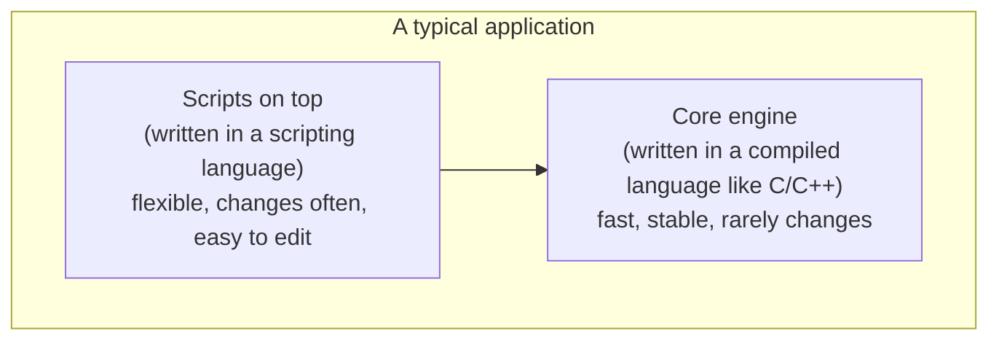

By the 1970s and 1980s, computers were everywhere — in research
labs, banks, telephone exchanges, factories, and a growing number of
homes. Most "serious" software was written in heavyweight,
**compiled** languages like C, COBOL, or FORTRAN. These languages
were fast and powerful, but they had a heavy ceremony around them:

1. Write the code in a text editor.
2. Run a **compiler** to translate it into machine code.
3. **Link** that machine code with other libraries.
4. Run the resulting program.
5. If something is wrong, edit the source and repeat from step 2.

For building an operating system or a database, this is fine — those
programs are huge, live for decades, and need every ounce of speed.
But many programming tasks are *small*:

- Rename 500 files in a folder.
- Take this log file and count how many times "ERROR" appears.
- Glue this command-line tool to that one by passing output between them.
- Generate a daily report by querying a database and emailing the result.

For tasks like these, the compile-link-run cycle is overkill. People
started asking: *can we have a faster, simpler kind of language —
one made specifically for gluing things together and writing quick,
useful programs?*

<svg
  viewBox="0 0 640 200"
  role="img"
  aria-label="Two large solid blocks joined by a winding trail of small dots — a script gluing big systems together"
  style={{ display: "block", width: "100%", maxWidth: "640px", height: "auto", margin: "2.5rem auto" }}
>
  <g style={{ color: "var(--ds-blue-500)" }} fill="currentColor">
    <rect x="60" y="60" width="140" height="90" rx="16" />
    <rect x="440" y="50" width="140" height="100" rx="16" />
  </g>
  <g style={{ color: "var(--ds-green-500)" }} fill="currentColor">
    <circle cx="216" cy="118" r="7" />
    <circle cx="238" cy="130" r="8" />
    <circle cx="260" cy="134" r="9" />
    <circle cx="282" cy="128" r="10" />
    <circle cx="304" cy="114" r="10" />
    <circle cx="326" cy="98" r="9" />
    <circle cx="348" cy="86" r="10" />
    <circle cx="370" cy="82" r="11" />
    <circle cx="392" cy="88" r="10" />
    <circle cx="414" cy="100" r="8" />
  </g>
  <g style={{ color: "var(--ds-yellow-500)" }} fill="currentColor">
    <circle cx="300" cy="62" r="5" />
    <circle cx="342" cy="54" r="6" />
    <circle cx="384" cy="60" r="5" />
  </g>
  <g style={{ color: "var(--ds-red-500)" }} fill="currentColor">
    <circle cx="428" cy="124" r="6" />
  </g>
</svg>

## What "scripting" actually means

The word **script** comes from the theatre: a script is a sequence of
lines an actor follows. In computing, a script is a sequence of
instructions that some larger system (an operating system, a
database, a web browser) "follows" — usually one at a time, as it
reads them.

A **scripting language** has, traditionally, a few common traits:

- **Interpreted, not compiled.** A program called an **interpreter**
  reads your source code and executes it directly. There is no
  separate compile step you have to remember.
- **Dynamically typed.** You don't usually have to declare in
  advance whether a variable holds a number or a piece of text — the
  language figures it out as it goes.
- **High level.** Many tedious low-level concerns (memory layout,
  pointer arithmetic) are handled for you.
- **Quick feedback.** Change a line, re-run, see the result. No
  build pipeline.
- **Good at gluing things together.** Strings, files, processes,
  network requests — the bread and butter of automation.

The difference shows up in how many steps stand between editing and
running. A **compiled language** (e.g. C) makes you:

1. Edit source.
2. Compile.
3. Link.
4. Run the program.

A **scripting language** (e.g. JS) collapses that to:

1. Edit source.
2. Run the interpreter on the source.

That last bullet — *gluing things together* — is why scripting
languages exploded. A scripting language is rarely the *centre* of a
system. It is the **connective tissue** that lets a small amount of
code wield enormous amounts of pre-built power.

## A small parade of scripting languages

A few names you may have heard of, and what each one was originally
*for*:

- **shell** (sh, bash, zsh): scripting the operating system itself.
  Run programs, move files, chain commands. Born in the early 1970s.
- **AWK** (1977) and **sed**: tiny languages dedicated to slicing
  and reshaping text files line by line.
- **Perl** (1987): "the Swiss Army chainsaw" of system
  administrators. Excellent at text processing, file manipulation,
  and gluing tools together.
- **Tcl** (1988): designed specifically to be **embedded** inside
  larger applications, so users could script those applications.
- **Python** (1991): a scripting language with a strong emphasis on
  *readability*. Grew far beyond scripting to dominate data science
  and machine learning.
- **Ruby** (1995): designed for "programmer happiness", a beautiful
  language that powered the early modern web (Rails).
- **JavaScript** (1995): originally designed to be a scripting
  language **inside a web browser**.
- **Lua** (1993): a tiny scripting language designed to be embedded
  inside other applications — used everywhere from video games to
  routers.

Notice the pattern: scripting languages were not invented to *replace*
big compiled languages. They were invented to **live alongside
them**, to script the things those big systems could do.

## The "two-language" pattern

For a long time, professional software development settled into a
comfortable rhythm called the **two-language pattern**:

- A **systems language** (like C or C++) for the heavy, fast, core
  parts of an application — the database engine, the rendering
  pipeline, the operating system, the game engine.
- A **scripting language** layered on top, for the parts that
  change often — the high-level logic, the configuration, the
  user-facing behaviour.

A video game is a great example. The 3D engine, physics simulation,
and graphics card communication are written in C++ for raw speed.
But the *rules* of the game — what happens when the player picks up
a sword, how a quest unfolds — are often written in **Lua** or a
similar scripting language so designers can change them without
recompiling the entire engine.

Web browsers, as we will see, followed exactly this pattern. The
browser itself is enormous, written in C++. But pages need a tiny
bit of logic — *"when the user clicks here, do this"* — and that
logic should be small, safe, and easy to write. The natural answer:
embed a scripting language inside the browser.

That scripting language was JavaScript.

## Why "easy to learn" was the whole point

Scripting languages share an unusual goal that compiled languages
often did not have: they were meant to be used by **people who do
not consider themselves programmers**.

System administrators writing shell scripts. Scientists writing
Python to process experimental data. Web designers writing a little
JavaScript to make a form behave. Game designers writing Lua to
tweak enemy behaviour. None of these people necessarily wanted to
learn about pointers, memory management, or the difference between
the stack and the heap.

That is why scripting languages tend to feel "lighter":

- Fewer compulsory declarations.
- Forgiving rules about what types fit together.
- Big batteries-included standard libraries.
- An interactive prompt where you can type one line and see what it
  does.

This is also why scripting languages get a bad reputation in some
circles. The same flexibility that helps a beginner ship something
in an afternoon can let a careless team build an unmaintainable
monster by year three. We will come back to that tension many times,
because it is the central story of JavaScript itself.

## A scripting language in action

Here is a small piece of JavaScript that does what scripting
languages do best — read some data, reshape it, and print a result.
Don't try to read every character; just notice how *short* it is for
how much it does.

<CodeBlock
  adapter="javascript"
  files={[
    {
      filename: "main.js",
      starterCode: `// A small script that pretends to summarise a server log.
const log = [
  { time: "10:00", level: "INFO", message: "started" },
  { time: "10:01", level: "INFO", message: "user logged in" },
  { time: "10:02", level: "WARN", message: "slow response" },
  { time: "10:03", level: "ERROR", message: "database down" },
  { time: "10:04", level: "INFO", message: "user logged out" },
  { time: "10:05", level: "ERROR", message: "database down" },
];

// Count how many lines of each level there are.
const counts = {};
for (const entry of log) {
  counts[entry.level] = (counts[entry.level] || 0) + 1;
}

console.log("Log summary:", counts);
console.log("Errors:");
for (const entry of log) {
  if (entry.level === "ERROR") {
    console.log("  ", entry.time, "-", entry.message);
  }
}
`,
    },
  ]}
/>

In a compiled systems language, the same script would be twice as
long, would require declaring the type of every variable, and would
need a compile step before it ran. As a scripting language,
JavaScript lets you type the idea and immediately see the result.

## What we have so far

The world had:

1. **Compiled, low-level languages** great for fast, long-lived core
   systems but heavy to use for small jobs.
2. **Scripting languages** great for gluing things together, writing
   small programs, and letting non-specialists automate their work.

It was a natural division of labour. And then, in the early 1990s,
a completely new kind of system started to spread through the
world — one that desperately needed exactly this kind of light,
embedded scripting language: the **World Wide Web**.

That is the next stop on our story.

---

<MultipleChoice
  markdown={`What is the main reason scripting languages became popular alongside compiled languages?

- They run faster than compiled languages
  > Scripting languages are typically *slower* than compiled languages because they are interpreted or JIT-compiled at runtime rather than compiled ahead of time to native machine code; their appeal is ease of use and rapid iteration, not speed.
- [o] They let people write small, useful programs and "glue" larger systems together without a heavy compile/link cycle
  > Scripting languages are designed for fast iteration, simple syntax, and embedding inside larger systems. They rarely *replace* compiled languages — they sit on top of them, letting people automate, customise, and extend large systems with relatively little code.
- They produce smaller machine code than compiled languages
  > Scripting languages usually execute via an interpreter or virtual machine, producing no machine code directly; their output is not smaller native binaries than compiled languages.
- They are the only languages that support functions
  > Functions exist in virtually every programming language, including compiled languages like C, C++, and Fortran that predate or coexisted with scripting languages.

Scripting languages thrive in the role of connective tissue: text processing, configuration, automation, and customising larger applications.`}
/>
