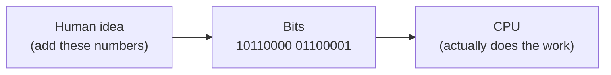
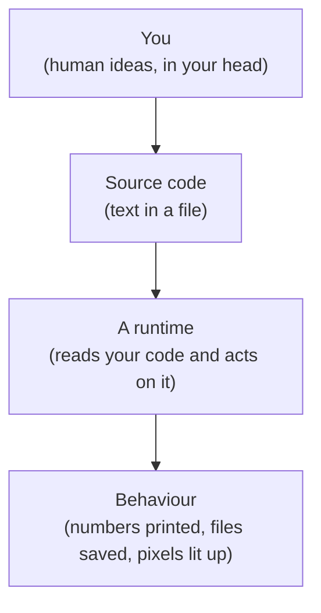

Before we write a single line of JavaScript, it helps to know **why**
programming languages exist. The story is short, surprising, and
explains almost everything about how modern code feels.

## The machine underneath

A computer, at its absolute lowest level, does not understand
"JavaScript", "Python", "English", or even "math". A computer is, in
the end, a vast collection of tiny switches. Each switch is either
**on** or **off** — `1` or `0`. Patterns of `1`s and `0`s flow
through wires, and special circuits react to those patterns.

Some patterns mean "add two numbers". Some mean "read the value at
this position in memory". Some mean "if this register is zero, jump
to that instruction". These patterns of bits are called **machine
code**, and they are the *only* thing a CPU truly understands.

Here is what a single instruction might look like in raw bits:

```
10110000 01100001
```

That is genuinely how the earliest computers were programmed: by
typing 1s and 0s, flipping physical switches, or punching holes in
cards. A "program" was a stack of cards.



That works, but it is **brutal**. A single mistake means combing
through thousands of bits. You could not share programs easily.
Every kind of computer had its own bit patterns, so a program written
for one machine would not run on another. Most importantly: humans
are *terrible* at reading bits.

## Assembly: the first translation

The first big breakthrough was the realisation that we could write
**short names** for each bit pattern and have another program — an
**assembler** — translate those names back into bits for us.

So instead of `10110000 01100001`, a programmer could write:

```
MOV AL, 0x61
```

This is **assembly language**. It is still extremely close to the
machine — every line corresponds to roughly one machine instruction
— but it is enormously easier to read. Suddenly, programs could be
written, edited, and shared.

But assembly has two big problems:

1. It is still **specific to one kind of CPU**. Assembly for an Intel
   chip will not run on an ARM chip.
2. It is still **very low level**. To add two numbers in a list, you
   write many tiny steps: load this, load that, add, store, increment
   the position, check if done, jump back. A simple idea takes
   dozens of lines.

We needed languages that were closer to how humans *think*.

## High-level languages: thinking, not bookkeeping

In the late 1950s, languages like **FORTRAN** and **COBOL** appeared.
They let programmers write things like:

```
SUM = A + B
PRINT SUM
```

A new kind of program — a **compiler** — took these human-friendly
instructions and translated them into machine code. The same source
code could now produce machine code for many different CPUs. A whole
new world opened up.

Over the next few decades, languages multiplied. Each one was an
experiment in making computers easier, safer, or more powerful to
program:

- **C** (1972): a small, fast, portable language for building
  operating systems. Most of the world's infrastructure still runs
  on C and its descendants.
- **Smalltalk, C++, Java**: experiments in organising programs
  around **objects** — bundles of data with the operations that
  belong to them.
- **Lisp, ML, Haskell**: experiments in treating programs as
  **mathematical expressions**, where functions take inputs and
  return outputs with no hidden surprises.

Each language carries a philosophy: a particular set of opinions
about how humans should *think* about programs.

## Why so many languages?

A question every beginner asks: *why aren't there just one or two
programming languages?* The honest answer is that programming
languages are designed to make certain things **easy** and other
things **possible**, and the trade-offs are real.

Consider just three dimensions:

| Dimension | Question | Examples on each end |
| --- | --- | --- |
| **Speed** | How fast does the program run? | C / Rust (very fast) ↔ Python / Ruby (slower, but flexible) |
| **Safety** | How many mistakes does the compiler catch? | Haskell / Rust (lots) ↔ JavaScript / Python (fewer) |
| **Learning curve** | How fast can a beginner get something working? | Python / JavaScript (very fast) ↔ C++ / Rust (slow climb) |

JavaScript, as we will see, sits firmly on the side of *easy to
learn* and *very flexible*, at some cost to raw speed and
strictness. That is not an accident — it is a direct consequence of
where it came from.

## What is a program, really?

It will help, for the rest of this course, to hold this simple
picture in your mind:



**Source code** is just text. By itself, text does nothing — it is
ink, or pixels. The magic happens when a **runtime** (an interpreter
or a compiled executable produced by a compiler) reads that text and
makes the machine actually *do* something.

JavaScript is a particular dialect for writing source code, and
modern JavaScript **runtimes** (the V8 engine inside Chrome and
Node.js, SpiderMonkey inside Firefox, JavaScriptCore inside Safari)
are the programs that read your code and bring it to life.

## A first taste

Below is a real, runnable JavaScript program. Don't worry about
understanding every symbol — we will spend the whole course on
that. For now, just notice:

- The code is text. Just letters, numbers, and punctuation.
- Press *Run*, and a runtime in your browser reads that text and
  *does* something.

<CodeBlock
  adapter="javascript"
  starterCode={`// Anything after // on a line is a "comment" — JavaScript ignores it.
// This program adds two numbers and prints the result.

const a = 3;
const b = 4;
const sum = a + b;

console.log("The sum of", a, "and", b, "is", sum);
`}
/>

You just ran a program. There was a runtime, it read your text, and
the text caused something to happen (output appeared). That is the
entire story of computing, in miniature.

## Where this story is going

For the next several pages we will continue the historical
narrative — how programming languages split into different families,
where *scripting* languages came from, how the internet changed the
shape of software, and how a programmer named Brendan Eich, given
ten days and a strange constraint, accidentally created the most
widely used programming language on Earth.

After that, we settle in and learn JavaScript properly, starting
from "what is a value".

---

<MultipleChoice
  markdown={`Why were high-level programming languages (like FORTRAN, C, and later JavaScript) invented?

- To make programs run faster than assembly
  > High-level language code typically runs *slower* than hand-tuned assembly because the compiler or interpreter adds translation overhead; the motivation for high-level languages was programmer productivity and expressiveness, not raw speed.
- [o] To let humans express ideas closer to how they think, and let a translator turn those ideas into machine code
  > High-level languages exist so people can describe *what they want* in a way humans can read, write, and maintain. A compiler or interpreter does the tedious work of turning those descriptions into machine code the CPU can execute.
- To make every CPU support the same set of instructions
  > CPUs each have their own instruction sets; a high-level language doesn't change that — a compiler just targets different instruction sets. Portability is a *benefit* of high-level languages, but it's not why they were invented.
- To replace mathematics in programming
  > Mathematics remains central to programming; high-level languages are built *on* mathematical foundations (Boolean algebra, lambda calculus, formal grammars) rather than replacing them.

High-level languages don't change what the CPU does — they change what the *programmer* writes. The translation step (compiler or interpreter) bridges human ideas and machine instructions.`}
/>
