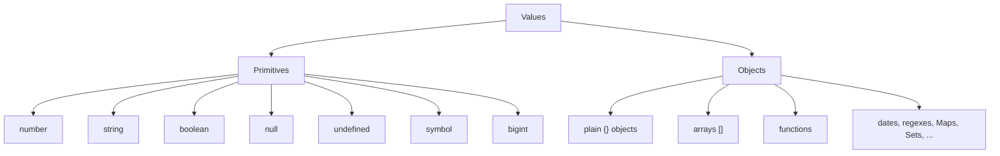

Before you can write meaningful programs, you have to know what
your programs are made of. The answer, at the bottom, is
**values**. Programs create values, combine values, compare values,
and move values around. Everything else is plumbing.

This page is the most fundamental of the whole course. Take your
time with it.

## A value is "a piece of information"

A **value** is a piece of information your program has at some
moment. Some examples:

- The number `42`.
- The text `"hello"`.
- The truth-value `true`.
- The "nothing here" marker `null`.
- A list of three things, `[1, 2, 3]`.
- A small record, `{ name: "Ada", age: 28 }`.

A value, on its own, just *is*. It is the runtime's job to keep
track of values, and your job as a programmer to decide what to do
with them.

You can ask the runtime to print a value with `console.log`. The
runtime hands the value to `console.log`, which converts it to text
and displays it.

<CodeBlock
  adapter="javascript"
  starterCode={`console.log(42);
console.log("hello");
console.log(true);
console.log(null);
console.log([1, 2, 3]);
console.log({ name: "Ada", age: 28 });
`}
/>

Each of these calls hands a value to `console.log`, which prints it
in a sensible way for its kind.

## A type is "the kind of value"

Every value has a **type** — the *kind* of value it is. JavaScript
has a small set of built-in types, and you can ask the runtime
what type any value has with the `typeof` operator:

<CodeBlock
  adapter="javascript"
  starterCode={`console.log(typeof 42); // "number"
console.log(typeof 3.14); // "number"
console.log(typeof "hello"); // "string"
console.log(typeof true); // "boolean"
console.log(typeof undefined); // "undefined"
console.log(typeof null); // "object" (a famous historical bug — see below)
console.log(typeof [1, 2, 3]); // "object"
console.log(typeof { x: 1 }); // "object"
console.log(typeof function () {}); // "function"
`}
/>

The output tells us JavaScript's main types are:

| Type | What it represents | Example values |
| --- | --- | --- |
| `number` | All numbers, integers and decimals alike | `0`, `42`, `-7`, `3.14`, `-0.001` |
| `string` | Text | `"hello"`, `'world'`, `` `hi ${name}` `` |
| `boolean` | Truth values | `true`, `false` |
| `undefined` | "no value yet" | `undefined` |
| `null` | "deliberately empty" | `null` |
| `object` | Composite values (records, arrays, dates, etc.) | `{}`, `[]`, `new Date()` |
| `function` | Things you can call | `function(){}`, `x => x + 1` |
| `symbol` | A unique label (advanced) | `Symbol("id")` |
| `bigint` | Arbitrary-precision integers (advanced) | `42n`, `9999999999999999n` |

For most of this course, the first six are all that matter. We will
meet symbols and bigints much later, if at all.

<Callout type="info" title={`Why does typeof null say "object"?`}>
This is one of JavaScript's oldest, most famous bugs. In the very
first implementation in 1995, the way `null` was represented under
the hood happened to look like an object, and `typeof` reported
`"object"`. By the time anyone wanted to fix it, fixing it would
have broken too many web pages. So it stays — forever.

If you ever need to check for `null` specifically, write
`value === null`.
</Callout>

## Primitive vs object types

The types divide into two large families:

- **Primitive types**: `number`, `string`, `boolean`, `undefined`,
  `null`, `symbol`, `bigint`. These are *simple* values: small,
  copied by value, and immutable.
- **Object types**: arrays, plain objects, functions, dates, and
  more. These are *composite* values: they have parts, they live in
  the heap, and they are referred to by reference.

We will spend the next several pages on the primitives, then build
up to objects later.

## What "immutable" means for primitives

When we say a primitive is **immutable**, we mean: *the value itself
cannot be changed*. The number `5` will always be the number `5`.
The string `"hello"` will always be the string `"hello"`. You
cannot reach inside `5` and turn it into `6`.

You can, of course, *replace* the value stored in a variable. But
that does not change the old value; it just makes the variable
point to a new one.

<CodeBlock
  adapter="javascript"
  starterCode={`let greeting = "hello";
console.log(greeting); // "hello"

greeting = greeting + " world";
console.log(greeting); // "hello world"

// We did not "modify" the original string "hello".
// The expression  greeting + " world"  produced a brand-new string
// "hello world", and we then made the variable point at it.
`}
/>

This sounds like a pedantic distinction. It will matter enormously
later, when we get to *objects*, which behave the opposite way:
objects *can* be modified in place, and that has consequences.

## Conversions: when types meet

JavaScript will frequently *convert* a value from one type to
another, sometimes silently. This is one of the most surprising
parts of the language for beginners.

<CodeBlock
  adapter="javascript"
  starterCode={`console.log("5" + 3); // "53"  — number 3 was converted to the string "3", then strings were joined.
console.log("5" - 3); // 2     — string "5" was converted to the number 5, then subtracted.
console.log(5 + null); // 5     — null became 0.
console.log(5 + undefined); // NaN — "Not a Number". undefined cannot meaningfully become a number.
console.log("hello" * 2); // NaN — string "hello" cannot become a number.

console.log(Boolean(0)); // false  — 0 is "falsy"
console.log(Boolean("")); // false  — empty string is falsy
console.log(Boolean(" ")); // true   — non-empty string is truthy
console.log(Boolean("0")); // true   — the *string* "0" is truthy!
`}
/>

There are two kinds of conversion:

- **Implicit** conversion: JavaScript decides, behind your back.
  Most of the surprising examples above use implicit conversion.
- **Explicit** conversion: you ask for the conversion using a
  built-in function or operator: `Number("42")`, `String(42)`,
  `Boolean(0)`, etc.

The single best piece of advice on this topic: **always be
explicit**. If you mean "treat this string as a number", say
`Number(text)`. Don't rely on subtraction silently doing it. Your
future self will thank you when you read the code six months later
and don't have to ask "why does this work?".

## Comparing values: `==` vs `===`

JavaScript has two equality operators:

- `===` (strict equality) — compares values *and* requires the
  same type. `5 === "5"` is `false`.
- `==`  (loose equality) — converts as needed before comparing.
  `5 == "5"` is `true`.

**Always use `===`** (and its partner `!==`). Loose equality is
full of historical surprises (`null == undefined` is `true`, but
`null == 0` is `false`; the rules are an ancient swamp). Strict
equality is predictable.

<CodeBlock
  adapter="javascript"
  starterCode={`console.log(5 === 5); // true
console.log(5 === "5"); // false  (different types — good!)
console.log("a" === "a"); // true
console.log(true === 1); // false  (boolean vs number — good!)

// Compare with the loose ==, which is full of footguns:
console.log(5 == "5"); // true   (silent conversion — confusing)
console.log(null == undefined); // true
console.log("" == 0); // true
console.log("0" == 0); // true

// Stick with === and !==.
`}
/>

## `null` vs `undefined`

These two look similar but have slightly different intent:

- `undefined` means *"no value has been assigned"*. JavaScript itself
  gives you `undefined` in many situations: a variable declared but
  never set, a function parameter that wasn't passed, a property
  that doesn't exist on an object.
- `null` means *"a value of nothing was deliberately put here"*.
  When you the programmer want to mark "this slot is intentionally
  empty", you write `null`.

In practice many codebases use one or the other consistently;
either is fine, as long as you are deliberate.

<CodeBlock
  adapter="javascript"
  starterCode={`let x; // declared but not assigned
console.log(x); // undefined
console.log(typeof x); // "undefined"

const user = { name: "Ada" };
console.log(user.email); // undefined — property doesn't exist

function greet(name) {
  console.log("Hello,", name);
}
greet(); // logs "Hello, undefined" — no argument given

const middleName = null; // deliberately: this user has no middle name
console.log(middleName); // null
console.log(typeof middleName); // "object"  (historic bug)
`}
/>

## "Truthy" and "falsy" values

JavaScript inherits, from its scripting roots, the idea that *every
value can be treated as if it were a boolean*. The values that
behave like `false` in conditions are called **falsy**; the rest are
**truthy**.

The falsy values are exactly these (memorise this list — it's
short):

- `false`
- `0` (and `-0`, and `0n`)
- `""` (empty string)
- `null`
- `undefined`
- `NaN`

*Everything else* is truthy. This includes `"0"`, `" "`, `[]`,
`{}`, and the string `"false"`. They all behave as `true` in a
boolean context.

<CodeBlock
  adapter="javascript"
  starterCode={`function describe(value) {
  if (value) {
    console.log(JSON.stringify(value), "is TRUTHY");
  } else {
    console.log(JSON.stringify(value), "is FALSY");
  }
}

describe(false);
describe(0);
describe("");
describe(null);
describe(undefined);
describe(NaN);

describe(1);
describe(-1);
describe("hello");
describe(" ");
describe("0"); // truthy (non-empty string)
describe([]); // truthy (an object)
describe({}); // truthy (an object)
`}
/>

This is incredibly useful in practice — `if (name) { ... }` is a
common idiom for "if name is set to something non-empty". It can
also bite you (an empty array `[]` is truthy even though it
"feels" empty). We will see it constantly.

## A multi-file taste of how values move around

In a real program, values are the things that flow between
functions and files. Here is a small two-file example: one file
defines a couple of pure functions that take values and return
values, the other uses them.

<CodeBlock
  adapter="javascript"
  entryFilename="index.js"
  files={[
    {
      filename: "index.js",
      initialContent: `const { square, isEven, describe } = require("./numbers");

console.log(square(7)); // 49
console.log(isEven(4)); // true
console.log(isEven(5)); // false

console.log(describe(0));
console.log(describe(-3));
console.log(describe(42));
`,
    },
    {
      filename: "numbers.js",
      initialContent: `// Each function takes a value, returns a value.
// No side effects, no surprises.

function square(n) {
  return n * n;
}

function isEven(n) {
  return n % 2 === 0;
}

function describe(n) {
  if (n === 0) return "zero";
  if (n < 0) return "negative";
  return "positive";
}

module.exports = { square, isEven, describe };
`,
    },
  ]}
/>

Notice: every function takes a *value* (a number) and returns a
*value* (another number, or a boolean, or a string). The functions
have no idea where the input came from, and no idea what will
happen to the output. They just transform values. **This is the
core mental model of programming.**

---

<MultipleChoice
  markdown={`Which equality operator should you almost always use in JavaScript, and why?

- \`==\` because it is more forgiving and converts types automatically
- [o] \`===\` because it compares values *and* types, giving predictable behaviour without surprising conversions
  > \`===\` (and \`!==\`) avoid the long list of historic, surprising rules built into \`==\`. They give you exactly what most programmers actually want: "true if these two values are the same kind of thing and equal in value".
- \`=\` because it is the assignment operator and works for everything
- It doesn't matter — they behave identically

In modern JavaScript, \`===\` is the standard. Reserve \`==\` for the very specific case of "I want to treat \`null\` and \`undefined\` as the same thing", and even then, prefer \`value == null\` deliberately.`}
/>
