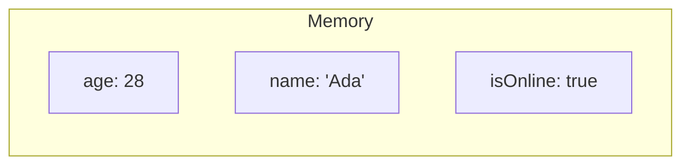

A program made only of values would be useless. The interesting
thing programs do is **remember**. A variable is how a program
remembers a value and gives it a name.

## What a variable really is

A **variable** is a named slot that holds a value. You can think of
it as a labelled box:



When you write:

```javascript
const age = 28;
```

…you are telling the runtime: *create a box, label it `age`, and
put the value `28` inside it*. From now on, anywhere your code
mentions `age`, the runtime looks in that box and uses what it
finds.

## The three keywords: `const`, `let`, `var`

JavaScript has three keywords for declaring variables. In modern
code, only two are commonly used:

- `const` — declares a variable whose *binding* cannot be
  reassigned.
- `let` — declares a variable whose binding can be reassigned.
- `var` — the old, original keyword, kept for backwards
  compatibility. Avoid it in new code.

The rule of thumb is simple and powerful:

> **Use `const` by default. Use `let` only when you actually need
> to reassign. Never use `var`.**

The reason is that `const` documents your *intent*. When a reader
sees `const`, they know the binding will never change. That makes
the program easier to reason about.

<CodeBlock
  adapter="javascript"
  files={[
    {
      filename: "main.js",
      starterCode: `const PI = 3.14159;
// PI = 3.14;  // TypeError: Assignment to constant variable.

let counter = 0;
counter = counter + 1; // OK with let
counter = counter + 1;
console.log("counter:", counter);

// 'const' protects the binding, NOT the value:
const list = [1, 2, 3];
// list = [4, 5];   // Would be an error — reassignment.
list.push(4); // Fine — we are mutating the array itself.
console.log("list:", list);
`,
    },
  ]}
/>

That last block is important. `const` makes the *variable* immutable
(you cannot point it at a different value), but it does **not**
freeze the value inside. If the value is a mutable object (like an
array), you can still change its contents.

## Declaration vs initialisation vs assignment

Three words that beginners often mix up:

- **Declaration** — telling JavaScript a variable exists. `let x;`
- **Initialisation** — giving the variable its first value at
  declaration. `let x = 5;`
- **Assignment** — changing the value of an already-declared
  variable. `x = 7;` (no `let`/`const` keyword).

<CodeBlock
  adapter="javascript"
  files={[
    {
      filename: "main.js",
      starterCode: `let x; // declaration only — x is undefined
console.log(x); // undefined

x = 5; // assignment
console.log(x); // 5

let y = 10; // declaration + initialisation in one line
y = y + 1; // assignment
console.log(y); // 11
`,
    },
  ]}
/>

## Naming variables

Good variable names are the single biggest factor in code
readability. Some rules and conventions:

1. **Names must start with a letter, `_`, or `$`.** They can then
   contain letters, digits, `_`, or `$`. No spaces, no hyphens.
2. **JavaScript is case-sensitive.** `userName` and `username` are
   different names.
3. **The standard style is `camelCase`** for variables and
   functions: `userName`, `totalPrice`, `currentItem`.
4. **Constants that are truly fixed** (like configuration values)
   are often `SCREAMING_SNAKE_CASE`: `MAX_RETRIES`, `PI`.
5. **Names should describe the *value*, not the *type*.** Write
   `users`, not `userArray`. Write `count`, not `countNumber`.
6. **Avoid single letters except as loop counters** (`i`, `j`,
   `k`) or for very short mathematical formulas.

<CodeBlock
  adapter="javascript"
  files={[
    {
      filename: "main.js",
      starterCode: `// Bad: one-letter names everywhere
const a = 84.5;
const b = 0.18;
const c = a + a * b;
console.log(c);

// Good: names describe meaning
const bill = 84.5;
const tipRate = 0.18;
const total = bill + bill * tipRate;
console.log(total);
`,
    },
  ]}
/>

Both programs do exactly the same work. One reads itself out loud.
One requires the reader to *guess* what each letter means. **The
first kind of code is debt; the second kind is an asset.**

## Program state: variables changing over time

The collection of all the variables a program has at any moment,
together with the values inside them, is called the **state** of the
program. As the program runs, the state changes: variables get new
values, new variables are created, old ones go away.

A useful exercise is to draw a **state table** as a program runs.
Each row is a snapshot after one statement. Each column is a
variable.

Take this program:

```javascript
let x = 5;
let y = 10;
let z = x + y;
x = z;
y = x - 1;
```

| After line | `x` | `y` | `z` |
| ---: | ---: | ---: | ---: |
| 1 | 5 | — | — |
| 2 | 5 | 10 | — |
| 3 | 5 | 10 | 15 |
| 4 | 15 | 10 | 15 |
| 5 | 15 | 14 | 15 |

This kind of bookkeeping looks tedious, but it is the *exact same
thing* the runtime is doing internally. Practising it on small
examples teaches you to "see" state.

Run the program and confirm:

<CodeBlock
  adapter="javascript"
  files={[
    {
      filename: "main.js",
      starterCode: `let x = 5;
let y = 10;
let z = x + y;
x = z;
y = x - 1;

console.log("x =", x);
console.log("y =", y);
console.log("z =", z);
`,
    },
  ]}
/>

## Block scope: where a variable lives

A `let` or `const` declared inside `{ ... }` only exists inside
those braces. This is called **block scope**.

<CodeBlock
  adapter="javascript"
  files={[
    {
      filename: "main.js",
      starterCode: `const outside = "I am global to this script";

if (true) {
  const inside = "I only exist inside the if-block";
  console.log(inside);
  console.log(outside); // still visible
}

console.log(outside);
// console.log(inside);  // ReferenceError: inside is not defined.
`,
    },
  ]}
/>

This may look pedantic, but block scoping prevents an entire
category of bugs. A variable used only inside a loop should not
"leak" out of the loop. A temporary value in an `if` should not
pollute the rest of the function.

We will spend an entire later chapter on scope; this is just a
first taste.

## Why `var` is discouraged

`var` was the original variable keyword. It has two surprising
behaviours that `let` and `const` were designed to fix:

1. **`var` is function-scoped, not block-scoped.** A `var` declared
   inside an `if` is still visible *outside* the `if`.
2. **`var` is "hoisted"**, meaning the declaration is silently
   moved to the top of the enclosing function. You can refer to a
   `var` before it appears in the source, and you'll get
   `undefined` instead of an error.

These behaviours are surprising, error-prone, and rarely what you
want. New code essentially never uses `var`. You may see it in old
codebases, and that's fine; you just don't need to write it.

## Constants of convenience vs constants of meaning

It is worth distinguishing two reasons to use `const`:

- **Constants of meaning**: values that are *fundamentally fixed* by
  the problem. `const PI = 3.14159;` `const MAX_USERS = 100;`
  Usually given `SCREAMING_SNAKE_CASE` names.
- **Constants of convenience**: ordinary variables that happen not
  to be reassigned in this function. `const total = bill + tip;`
  Standard `camelCase` is fine.

The second kind is far more common in modern code. Most local
variables don't *need* to be reassigned, so they are declared with
`const`.

## A small example tying it together

Let's track a tiny "user session" with three variables, and see how
state evolves over the program.

<CodeBlock
  adapter="javascript"
  files={[
    {
      filename: "main.js",
      starterCode: `// Initial state.
let userName = "guest";
let isLoggedIn = false;
let actionCount = 0;

console.log("Before login:", userName, isLoggedIn, actionCount);

// "User logs in"
userName = "ada";
isLoggedIn = true;
console.log("After login: ", userName, isLoggedIn, actionCount);

// "User does a few things"
actionCount += 1;
actionCount += 1;
actionCount += 1;
console.log("After 3 actions:", userName, isLoggedIn, actionCount);

// "User logs out" — back to (almost) the initial state.
userName = "guest";
isLoggedIn = false;
// We deliberately keep actionCount, to remember the session.
console.log("After logout:", userName, isLoggedIn, actionCount);
`,
    },
  ]}
/>

That is a tiny **state machine**: three variables, evolving over
time, in response to events. Almost every interactive program in
the world — your email client, your phone's home screen, a video
game, this very web page — is, at its core, a much bigger version
of this.

## Challenge

<ChallengeCard
  adapter="javascript"
  title="Bank account state"
  instructions={`The harness defines a starting balance of \`100\` and asks you to perform a series of operations on it.

Write the code so that after running the operations in order, the variables \`balance\`, \`deposits\`, and \`withdrawals\` end up with the expected values:

1. Deposit \`50\` (balance up, deposits += 50).
2. Deposit \`30\` (balance up, deposits += 30).
3. Withdraw \`40\` (balance down, withdrawals += 40).
4. Withdraw \`10\` (balance down, withdrawals += 10).

After all four steps:
- \`balance\` should be \`130\`
- \`deposits\` should be \`80\`
- \`withdrawals\` should be \`50\``}
  files={[
    {
      filename: "main.js",
      starterCode: `let balance = 100;
let deposits = 0;
let withdrawals = 0;

// Step 1: deposit 50

// Step 2: deposit 30

// Step 3: withdraw 40

// Step 4: withdraw 10

console.log({ balance, deposits, withdrawals });
`,
      solutionCode: `let balance = 100;
let deposits = 0;
let withdrawals = 0;

balance += 50;
deposits += 50;
balance += 30;
deposits += 30;
balance -= 40;
withdrawals += 40;
balance -= 10;
withdrawals += 10;

console.log({ balance, deposits, withdrawals });
`,
    },
  ]}
  tests={[
    {
      id: "balance",
      name: "Final balance",
      description: "balance should be 130",
      code: `if (balance !== 130) throw new Error("expected balance to be 130, got " + balance);`,
    },
    {
      id: "deposits",
      name: "Total deposits",
      description: "deposits should be 80",
      code: `if (deposits !== 80) throw new Error("expected deposits to be 80, got " + deposits);`,
    },
    {
      id: "withdrawals",
      name: "Total withdrawals",
      description: "withdrawals should be 50",
      code: `if (withdrawals !== 50) throw new Error("expected withdrawals to be 50, got " + withdrawals);`,
    },
  ]}
/>

---

<MultipleChoice
  markdown={`Which of the following best describes the recommended way to declare variables in modern JavaScript?

- Always use \`var\` for backwards compatibility
  > \`var\` is function-scoped (not block-scoped) and is hoisted in a way that can cause surprising bugs; \`let\` and \`const\` were introduced precisely to replace it, and all modern code should use them instead.
- Use \`let\` for everything to keep things flexible
  > Using \`let\` everywhere hides intent: a reader can't tell which bindings are expected to change. \`const\` communicates "this won't be reassigned" and catches accidental reassignments at compile time.
- [o] Use \`const\` by default; switch to \`let\` only when you actually need to reassign; avoid \`var\`
  > \`const\` documents that the binding won't change, which makes code easier to read and reason about. \`let\` is reserved for the cases where you really do reassign. \`var\` is kept only for legacy reasons.
- Use \`const\` for primitives and \`let\` for objects
  > The primitive-vs-object distinction is the wrong criterion; the right question is whether you intend to reassign the variable. \`const\` works perfectly for objects and arrays — it just prevents rebinding the variable to a different object, not mutating the object itself.

The right rule has nothing to do with the value's type — it's about whether you intend to reassign the variable.`}
/>
