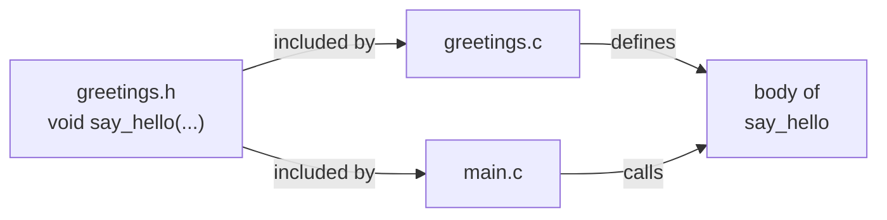

You have just run a C program. In the browser, it felt instantaneous:
type, click *Run*, see output. Behind that magic is a four-stage
pipeline called the **C toolchain**. Understanding it will save you
hours of confusion later, because most "weird" errors in C trace back
to one specific stage.

## The four stages

The pipeline runs **`hello.c` → Preprocessor → Compiler → Assembler → Linker → Executable**, and then the operating system loads and runs that executable.

| Stage         | Input              | Output             | Job                                                  |
|---------------|--------------------|--------------------|------------------------------------------------------|
| Preprocessor  | `.c` + `.h` files  | one big `.c` file  | Handle `#include`, `#define`, `#ifdef`, comments     |
| Compiler      | preprocessed `.c`  | assembly text      | Check syntax and types; emit assembly for the target |
| Assembler     | assembly text      | object file `.o`   | Translate assembly to machine code                   |
| Linker        | one or more `.o`   | final executable   | Connect all the pieces; resolve `printf` and friends |

In real life, you usually invoke all four stages with one command,
like `clang hello.c -o hello`. The compiler driver runs the rest
behind the scenes. But each stage has its own kind of error message.
Recognizing which stage is angry at you is half the debugging battle.

## Stage 1: the preprocessor

The preprocessor is a **text-only** tool. It does not understand C
syntax. It only knows three things:

1. **`#include`** — paste the contents of a header file here.
2. **`#define`** — perform text substitution (`#define MAX 100`
   replaces every later `MAX` with `100`).
3. **`#if` / `#ifdef` / `#endif`** — conditionally include or omit
   chunks of code.

It also strips comments.

<CodeBlock
  adapter="c"
  starterCode={`#include <stdio.h>

#define GREETING "Hello"
#define TIMES 3

int main(void) {
  for (int i = 0; i < TIMES; i++) {
    printf("%s, world #%d!\\n", GREETING, i);
  }
  return 0;
}
`}
/>

Before the compiler sees this code, the preprocessor expands it to
roughly:

```c
// ... thousands of lines from stdio.h, declaring printf, FILE, etc.

int main(void) {
    for (int i = 0; i < 3; i++) {
        printf("%s, world #%d!\n", "Hello", i);
    }
    return 0;
}
```

`GREETING` and `TIMES` are simply gone — they were replaced.

<Callout type="warn" title="Macros are textual">
\`#define DOUBLE(x) x * 2\` looks fine, but \`DOUBLE(1 + 1)\` expands
to \`1 + 1 * 2\`, which is \`3\`, not \`4\`. Always wrap macro arguments
and the macro body in parentheses: \`#define DOUBLE(x) ((x) * 2)\`.
</Callout>

## Stage 2: the compiler

The compiler is the largest and smartest piece of the toolchain. It:

- **Parses** your code into a tree.
- Checks that every name you use is **declared**.
- Checks that **types** match (you can't add an `int` to a string).
- Reports errors and warnings.
- Generates **assembly language** for the target CPU.

Most error messages you see while learning C come from this stage:

```text
hello.c:5:9: error: use of undeclared identifier 'printff'
    printff("hi\n");
    ^
```

The compiler points at the column and explains what went wrong. Read
the *first* error first — later errors are often cascading
consequences of the first.

## Stage 3: the assembler

The assembler translates the compiler's assembly text into a binary
**object file** (`.o`). Object files contain machine code plus
metadata: a list of **defined symbols** (functions and globals
provided here) and **undefined symbols** (names referenced here but
not yet provided).

You almost never see errors from the assembler directly. If you do,
something has gone very wrong, probably in the compiler.

## Stage 4: the linker

The linker stitches all the `.o` files together into one executable.
It also pulls in the **standard library** (which contains the
compiled machine code for `printf`, `malloc`, and friends).

The linker's job is to resolve every undefined symbol. If it can't,
you see errors like:

```text
undefined reference to `sqrt'
```

This means your code called `sqrt`, but the linker never found a
machine-code definition for it. The cure is usually to link the math
library: `clang program.c -lm`.

Or:

```text
undefined reference to `greet'
```

You declared `greet` in a header and called it, but you forgot to
include its `.c` file (or `.o`) in the build.

## Multi-file builds: how big programs are organized

Real programs are split across many files. The convention is:

- **Headers (`.h`)** declare what exists: function signatures, struct
  definitions, constants. They are *included* by other files.
- **Source files (`.c`)** define what those declarations *do*: the
  function bodies. They are *compiled* into object files.

The header is the *interface*. The source file is the
*implementation*.

The browser sandbox supports multi-file builds. Edit any tab below
and click *Run* — both files are compiled and linked together.

<CodeBlock
  adapter="c"
  entryFilename="main.c"
  files={[
    {
      filename: "main.c",
      initialContent: `#include "greetings.h"
#include <stdio.h>

int main(void) {
  say_hello("world");
  say_hello("C");
  return 0;
}
`,
    },
    {
      filename: "greetings.h",
      initialContent: `#ifndef GREETINGS_H
#define GREETINGS_H

void say_hello(const char *name);

#endif
`,
    },
    {
      filename: "greetings.c",
      initialContent: `#include "greetings.h"
#include <stdio.h>

void say_hello(const char *name) { printf("Hello, %s!\\n", name); }
`,
    },
  ]}
/>

Notice three patterns:

- `main.c` calls `say_hello` *because the header `greetings.h` told
  the compiler what its signature is*.
- The actual code for `say_hello` lives in `greetings.c`.
- `greetings.h` is wrapped in `#ifndef GREETINGS_H / #define / #endif`
  to make sure including it twice doesn't redefine everything. This
  is called an **include guard**.

## Declaration vs definition

This distinction trips up beginners constantly:

- A **declaration** says *something with this name exists*. Headers
  contain declarations. They are needed by *every file that uses the
  thing*.
- A **definition** is the actual implementation (the body of a
  function, or the storage for a global variable). It must exist
  **exactly once** across the whole program.

The compiler is happy with just declarations. The linker demands at
least one definition per used symbol — no more, no less.



## A challenge with two files

<ChallengeCard
  adapter="c"
  title="Add a `say_goodbye` function"
  instructions={`Add a function \`void say_goodbye(const char *name);\` declared in \`farewell.h\` and defined in \`farewell.c\`. It should print \`Goodbye, <name>!\` followed by a newline. \`main.c\` already calls it once with the name \`"Bell Labs"\`, so when the program runs, the entire stdout should be exactly:

\`Goodbye, Bell Labs!\``}
  entryFilename="main.c"
  files={[
    {
      filename: "main.c",
      initialContent: `#include "farewell.h"

int main(void) {
  say_goodbye("Bell Labs");
  return 0;
}
`,
    },
    {
      filename: "farewell.h",
      initialContent: `#ifndef FAREWELL_H
#define FAREWELL_H

// declare say_goodbye here

#endif
`,
      solutionContent: `#ifndef FAREWELL_H
#define FAREWELL_H

void say_goodbye(const char *name);

#endif
`,
    },
    {
      filename: "farewell.c",
      initialContent: `#include "farewell.h"
#include <stdio.h>

// define say_goodbye here
`,
      solutionContent: `#include "farewell.h"
#include <stdio.h>

void say_goodbye(const char *name) { printf("Goodbye, %s!\\n", name); }
`,
    },
  ]}
  tests={[
    {
      id: "stdout",
      name: "Prints the farewell line",
      description: "stdout equals `Goodbye, Bell Labs!`",
      expect: { stdoutEquals: "Goodbye, Bell Labs!" },
    },
  ]}
/>

<MultipleChoice
  markdown={`Which stage of the C toolchain replaces \`#include\` directives with the contents of header files?

- [o] The preprocessor.
  > \`#include\` is handled before the compiler proper ever sees your code.
- The compiler.
- The assembler.
- The linker.

The preprocessor is a text-only stage. It handles \`#include\`, \`#define\`, conditional compilation, and comment stripping.`}
/>

<MultipleChoice
  markdown={`You compile a project with two files, \`main.c\` and \`util.c\`. \`main.c\` calls a function \`compute()\` declared in \`util.h\`, but you forget to pass \`util.c\` to the compiler. Which error are you most likely to see?

- A preprocessor error about a missing header.
- A compiler error about an unknown function.
  > The compiler is happy: it has the declaration from \`util.h\`. The problem appears later.
- [o] A linker error: \`undefined reference to \`compute'\`.
  > The header gave the compiler the declaration, so the call type-checks. But the linker has no \`.o\` file containing the definition of \`compute\`, so it can't resolve the symbol.
- A runtime error when \`compute()\` is first called.

Remember: declarations satisfy the compiler; *definitions* are what the linker needs.`}
/>
