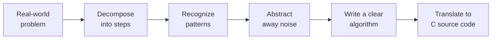

A computer is incredibly fast and incredibly literal. It will do
*exactly* what you tell it, no more and no less. The hard part of
programming is rarely "how do I write a `for` loop?" The hard part is
**figuring out what to tell the computer in the first place**.

This skill is called **computational thinking**, and it long predates
computers themselves. Once you have it, every programming language
becomes easier.

## The four habits of computational thinking

Researchers usually break computational thinking into four
overlapping habits:

1. **Decomposition** — break a big problem into smaller problems.
2. **Pattern recognition** — notice when two small problems are
   really the same problem.
3. **Abstraction** — strip away unnecessary detail; describe the
   problem in terms a computer can handle.
4. **Algorithm design** — write down a precise, step-by-step recipe
   for solving the problem.



Let's walk through a tiny, concrete example.

## Example: "Tell me the largest test score"

Suppose a teacher hands you a stack of paper tests and says: *"Tell
me which student got the highest score."*

A human can do this without thinking. But let's pretend you have to
explain it to a small, very fast, very literal robot named **Cee**
who knows nothing about students, paper, or numbers.

### Step 1: Decompose

What sub-tasks are involved?

- Look at the first test. Remember its score.
- Look at the next test. Compare its score to the one you
  remembered. Keep whichever is larger.
- Repeat until there are no more tests.
- Announce the score (and student name) you ended up remembering.

### Step 2: Recognize the pattern

Steps 2 and 3 are *the same step, applied again and again*. That is
a **loop**. Once you spot the loop, the description shrinks:

- Remember the first score.
- For each remaining test, if its score is bigger than what you
  remember, update what you remember.
- Announce the final remembered score.

### Step 3: Abstract

Cee doesn't care about paper or graphite. The essence of the problem
is "given a list of numbers, find the maximum". The word "student" is
flavor.

### Step 4: Write the algorithm

In plain English (called **pseudocode**), the algorithm is:

```text
let best = the first number in the list
for each remaining number n in the list:
    if n > best:
        best = n
print best
```

That's it. That short recipe will work for 3 numbers, or 3 million,
in any programming language. **The hard work was the thinking, not
the typing.**

## A first taste of C — but read it like a recipe

Here is the same algorithm in C. **Don't worry about the syntax**.
Just read it and check that it matches the pseudocode line by line.
We'll re-derive every bit of it in later chapters.

<CodeBlock
  adapter="c"
  initialCode={`#include <stdio.h>

int main(void) {
    int scores[] = {72, 88, 65, 91, 77, 83};
    int n = 6;

    int best = scores[0];
    for (int i = 1; i < n; i++) {
        if (scores[i] > best) {
            best = scores[i];
        }
    }

    printf("The highest score is %d\\n", best);
    return 0;
}
`}
/>

Notice the line-by-line match with the pseudocode:

| Pseudocode                    | C code                            |
|-------------------------------|-----------------------------------|
| let best = first number       | `int best = scores[0];`           |
| for each remaining number n   | `for (int i = 1; i < n; i++)`     |
| if n > best: best = n          | `if (scores[i] > best) best = scores[i];` |
| print best                    | `printf("...", best);`            |

If you can write the pseudocode, the C is mostly translation.

## A second example: rock, paper, scissors

Let's design a tiny game. **Plain English first**:

- The player picks rock, paper, or scissors.
- The computer also picks rock, paper, or scissors.
- Apply the rules: rock beats scissors, scissors beats paper, paper
  beats rock. If they match, it's a tie.
- Print the result.

### Decompose

Sub-tasks:

1. Get the player's choice.
2. Generate the computer's choice.
3. Compare the two.
4. Print "you win", "you lose", or "tie".

### Recognize the pattern

The comparison has nine possible combinations (3 × 3), but they fall
into three cases: *tie*, *player wins*, *computer wins*.

### Abstract

We can encode each move as a number: `0 = rock`, `1 = paper`,
`2 = scissors`. Then "X beats Y" becomes a pure arithmetic statement.
With the encoding above, X beats Y exactly when `(X - Y + 3) % 3 == 1`.
(Don't worry, we'll explain the `%` operator later — for now,
appreciate that *thinking* about the problem turned a tangle of `if`s
into a clean formula.)

### Algorithm

```text
read player's move (0, 1, or 2)
pick computer's move at random in {0, 1, 2}
if player == computer:
    print "tie"
else if (player - computer + 3) % 3 == 1:
    print "you win"
else:
    print "you lose"
```

Computational thinking didn't write the code for us. But it told us
**what code to write**, which is the harder half of the job.

## Why this matters before we touch syntax

Many beginners get stuck because they jump straight to "what's the
syntax for X in language Y?" without first asking "what do I want the
computer to do?" The questions are not the same.

When you sit down with a new problem, before opening any editor:

1. **State the problem in one sentence.** If you can't, you don't
   understand it yet.
2. **Write or draw the steps in plain words.** Use boxes and arrows
   if helpful.
3. **Look for repetition.** That's a loop.
4. **Look for choices.** That's an `if`.
5. **Look for "this thing has a name and properties."** That's a
   variable, or eventually a struct.

Only then translate to code. You will write fewer bugs and you will
understand them faster when they happen.

## Practice: trace the algorithm by hand

Take a small list of numbers — for example `[7, 2, 9, 4, 9, 6]` —
and run the "find the maximum" pseudocode by hand. After each step,
write down what `best` holds:

```text
list = [7, 2, 9, 4, 9, 6]
best = 7
n = 2:  2 > 7?  no, best stays 7
n = 9:  9 > 7?  yes, best becomes 9
n = 4:  4 > 9?  no, best stays 9
n = 9:  9 > 9?  no, best stays 9
n = 6:  6 > 9?  no, best stays 9
print 9
```

That tiny table — sometimes called a **trace table** — is one of the
most powerful tools in a programmer's arsenal. We will use it many
times in this course. When a program confuses you, build a trace
table. The bug usually exposes itself by row three.

<MultipleChoice
  markdown={`Which of the following is the **best** description of *decomposition* in computational thinking?

- Removing all comments from a program to make it run faster.
- Renaming variables so the code is easier to read.
- [o] Breaking a large problem into smaller, more manageable sub-problems.
  > Correct! Decomposition is exactly this: chopping a big, fuzzy goal into small concrete steps that you can solve and combine.
- Writing the same code in multiple languages to compare them.

Decomposition is the first habit of computational thinking, because *you cannot tell a computer how to do something until you have first told yourself how to do it*.`}
/>

<MultipleChoice
  markdown={`A teacher writes the following pseudocode:

\`\`\`text
let total = 0
for each number n in the list:
    total = total + n
print total
\`\`\`

What does this algorithm compute?

- The largest number in the list.
- The number of items in the list.
- [o] The sum of all numbers in the list.
  > Correct! The variable \`total\` starts at zero and accumulates each value it sees.
- The average of the numbers in the list.
  > To get an average, you would also need to divide by the count after the loop.

This is the canonical *accumulator* pattern, one of the most common patterns in programming. We will use it in many forms throughout this course.`}
/>
