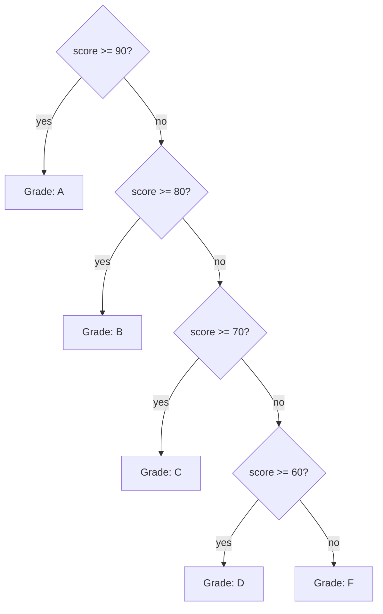

A program that always does the same thing isn't very interesting.
**Conditionals** let a program look at a value and decide what to do
next. They are the second pillar of computation, after sequence.

<Illustration
  prompt={`Decorative flat-vector hero for conditionals: a path that reaches a fork and splits into two diverging routes, with a simple diamond decision marker at the junction and small directional arrows down each branch. Conveys a program choosing between paths. Arrows as solid filled shapes, no outline strokes. Transparent background, legible in both light and dark mode. Palette: blue #148CFF, green #20C621, yellow #FFDD6C, red #FF4F59. No text.`}
  ratio="16 / 9"
/>

## The `if` statement

The basic form is:

```c
if (condition) {
    // run this if condition is true (non-zero)
}
```

The condition is any expression. C treats `0` as false and **any
non-zero value** as true.

<CodeBlock
  adapter="c"
  starterCode={`#include <stdio.h>

int main(void) {
  int age = 20;

  if (age >= 18) {
    printf("You can vote.\\n");
  }
  return 0;
}
`}
/>

Change `age` to `15` and rerun. The line should disappear from the
output.

## `if` ... `else`

To do *one or the other*:

<CodeBlock
  adapter="c"
  starterCode={`#include <stdio.h>

int main(void) {
  int age = 15;

  if (age >= 18) {
    printf("You can vote.\\n");
  } else {
    printf("Not quite yet — wait %d more years.\\n", 18 - age);
  }
  return 0;
}
`}
/>

## `else if` chains

For more than two branches, chain them:

<CodeBlock
  adapter="c"
  starterCode={`#include <stdio.h>

int main(void) {
  int score = 78;

  if (score >= 90) {
    printf("Grade: A\\n");
  } else if (score >= 80) {
    printf("Grade: B\\n");
  } else if (score >= 70) {
    printf("Grade: C\\n");
  } else if (score >= 60) {
    printf("Grade: D\\n");
  } else {
    printf("Grade: F\\n");
  }
  return 0;
}
`}
/>

The branches are checked **top to bottom**. The first one whose
condition is true runs, and the rest are skipped.

## Comparison operators

| Operator | Meaning                  |
|----------|--------------------------|
| `==`     | equal to                 |
| `!=`     | not equal to             |
| `<`      | less than                |
| `<=`     | less than or equal       |
| `>`      | greater than             |
| `>=`     | greater than or equal    |

<Callout type="warn" title="`=` is assignment, `==` is comparison">
This is the most famous typo in C history:

```c
if (x = 5)  { /* ALWAYS true; also sets x to 5! */ }
if (x == 5) { /* what you meant */ }
```

The first version *assigns* 5 to `x`, then uses 5 as the condition
(non-zero, therefore true). Most modern compilers will warn you, but
the bug has burned countless programmers. Turn on warnings
(`-Wall`).
</Callout>

## Logical operators

Combine conditions with logical operators:

| Operator | Meaning           |
|----------|-------------------|
| `&&`     | AND (both true)   |
| `\|\|`     | OR (at least one) |
| `!`      | NOT (inverts)     |

<CodeBlock
  adapter="c"
  starterCode={`#include <stdio.h>

int main(void) {
  int age = 25;
  int has_license = 1; // 1 means true

  if (age >= 18 && has_license) {
    printf("You may drive.\\n");
  } else {
    printf("Not allowed to drive.\\n");
  }
  return 0;
}
`}
/>

`&&` and `||` are **short-circuiting**: if the result is already
determined after evaluating the left side, the right side is **not
evaluated**. This lets you write safe checks like
`if (p != NULL && p->value == 0)` — the dereference on the right
never runs when `p` is null.

<Illustration
  prompt={`Informative flat-vector illustration of the three logical operators as simple gate-like tiles: AND (two inputs, both lit, produce a lit output), OR (either input lit produces a lit output), and NOT (a single input flipped to its opposite). Use lit-versus-dim states, green for true and red for false. Flat vector, no outlines or strokes, transparent background, legible in both light and dark mode. Palette: blue #148CFF, green #20C621, yellow #FFDD6C, red #FF4F59. No words; tiny symbols only.`}
  alt="The AND, OR, and NOT logical operators shown as simple gates"
  ratio="16 / 9"
/>

## Truth values: what counts as true?

In C, anything non-zero is true. `0` is false. There is no separate
boolean unless you `#include <stdbool.h>`.

```c
if (count)       { ... }  // true if count != 0
if (!count)      { ... }  // true if count == 0
if (str)         { ... }  // true if str is not the NULL pointer
```

This is concise, but explicit comparisons are easier to read:

```c
if (count != 0)  { ... }
if (str != NULL) { ... }
```

Prefer clarity over cleverness, especially while learning.

## Nested conditionals

You can put `if` inside `if`:

<CodeBlock
  adapter="c"
  starterCode={`#include <stdio.h>

int main(void) {
  int x = 7;

  if (x > 0) {
    if (x % 2 == 0) {
      printf("positive even\\n");
    } else {
      printf("positive odd\\n");
    }
  } else if (x < 0) {
    printf("negative\\n");
  } else {
    printf("zero\\n");
  }
  return 0;
}
`}
/>

Deep nesting is hard to read. When it grows past two levels, it's
usually a sign to refactor — split a chunk into a separate function,
or rewrite with `&&` and `||`.

## The dangling-else pitfall

```c
if (a)
    if (b)
        printf("both\n");
else
    printf("not a\n");      // BUG: this else binds to the inner if, not the outer
```

Indentation lies. The `else` always binds to the **nearest unmatched
`if`**. **Always use braces**, even for single statements:

```c
if (a) {
    if (b) {
        printf("both\n");
    }
} else {
    printf("not a\n");
}
```

This rule is so important that many style guides make braces
mandatory. Make it your default.

## The `switch` statement

When you have many branches on a single integer value, `switch` is
sometimes clearer than a long `if/else if` chain.

<CodeBlock
  adapter="c"
  starterCode={`#include <stdio.h>

int main(void) {
  int day = 3;

  switch (day) {
  case 1:
    printf("Monday\\n");
    break;
  case 2:
    printf("Tuesday\\n");
    break;
  case 3:
    printf("Wednesday\\n");
    break;
  case 4:
    printf("Thursday\\n");
    break;
  case 5:
    printf("Friday\\n");
    break;
  case 6:
  case 7:
    printf("Weekend\\n");
    break;
  default:
    printf("Not a day\\n");
    break;
  }
  return 0;
}
`}
/>

Three things to remember:

- The `case` value must be a compile-time integer constant.
- Execution **falls through** to the next case unless you `break`.
  This is sometimes useful (notice cases 6 and 7 both run `Weekend`)
  and sometimes a bug. Always write `break` unless you want
  fall-through.
- `default` runs if none of the cases matched. It is optional but
  good practice to include one.

<Illustration
  prompt={`Decorative flat-vector illustration of a switch statement as a railway junction: a single incoming track meeting a multi-way track switch that routes a little train car onto one of several parallel sidings, with one siding set apart as the default. Clean and playful. Flat vector, no outlines or strokes, transparent background, legible in both light and dark mode. Palette: blue #148CFF, green #20C621, yellow #FFDD6C, red #FF4F59. No text.`}
  ratio="16 / 9"
/>

## Decision tree, visualized



A diagram like this makes it obvious why **order matters** when the
ranges overlap. If you wrote `if (score >= 60)` first, everyone with
a score of 95 would get a D!

## Challenge: leap year

A year is a leap year if it is divisible by 4, **except** that years
divisible by 100 are *not* leap years, *unless* they are also
divisible by 400.

<ChallengeCard
  adapter="c"
  title="Is it a leap year?"
  instructions={`A variable \`year\` is set to \`2000\`. Print exactly one line: \`leap\` if the year is a leap year, otherwise \`not leap\`.

Test cases the grader uses internally (you don't need to handle multiple inputs — \`year\` is fixed at \`2000\`):

- 2000 → leap (divisible by 400)
- 1900 → not leap (divisible by 100 but not 400)
- 2024 → leap (divisible by 4, not 100)
- 2023 → not leap`}
  starterCode={`#include <stdio.h>

int main(void) {
  int year = 2000;
  // print "leap" or "not leap"
  return 0;
}
`}
  solutionCode={`#include <stdio.h>

int main(void) {
  int year = 2000;
  int is_leap = (year % 4 == 0 && year % 100 != 0) || (year % 400 == 0);
  printf("%s\\n", is_leap ? "leap" : "not leap");
  return 0;
}
`}
  tests={[
    {
      id: "leap",
      name: "Prints `leap` for year 2000",
      description: "stdout equals `leap`",
      expect: { stdoutEquals: "leap" },
    },
  ]}
/>

<MultipleChoice
  markdown={`What does this print?

\`\`\`c
#include <stdio.h>
int main(void) {
    int x = 5;
    if (x = 10) {
        printf("hello\\n");
    }
    printf("x = %d\\n", x);
    return 0;
}
\`\`\`

*Hint: a single \`=\` is assignment, not comparison. An assignment expression evaluates to the value that was assigned.*

- Nothing, because \`if (x = 10)\` is a compile error.
  > A single \`=\` inside an \`if\` is legal C (it is an assignment, not a comparison), so this compiles and runs.
- \`x = 5\`, because the assignment doesn't take effect.
  > The assignment does take effect: \`x = 10\` stores \`10\` into \`x\`, so the final value is \`10\`, not \`5\`.
- [o] \`hello\` followed by \`x = 10\`.
  > \`x = 10\` is an assignment expression whose value is \`10\` (non-zero, therefore true). The body of the \`if\` runs, and \`x\` is now \`10\`.
- \`hello\` followed by \`x = 5\`.
  > The \`if\` body does run, but the same assignment that made the condition true also changed \`x\` to \`10\`, so \`x\` is no longer \`5\`.

A single \`=\` is assignment; a double \`==\` is comparison. Most modern compilers will warn you when an assignment appears as an \`if\` condition.`}
/>

<MultipleChoice
  markdown={`A \`switch\` is missing a \`break\` between two cases:

\`\`\`c
switch (n) {
    case 1: printf("one ");
    case 2: printf("two ");  break;
    default: printf("other "); break;
}
\`\`\`

What does the program print when \`n\` is \`1\`?

- \`one \` only.
  > Without an explicit \`break\` after case 1, execution **falls through** to the next case.
- \`one other \`
  > Fall-through goes to the *next* case in order, which is \`case 2\`, not \`default\`. \`default\` only runs when no case matched.
- [o] \`one two \`
  > Execution falls through into \`case 2\`, prints \`two\`, then hits \`break\` and exits the switch.
- A compile-time error.
  > A missing \`break\` is legal C — fall-through is a real (if error-prone) feature, not a syntax error.

Switch fall-through is occasionally useful (when several cases share code), but it is a frequent source of bugs. Always write \`break\` unless you specifically want fall-through and you've commented why.`}
/>
