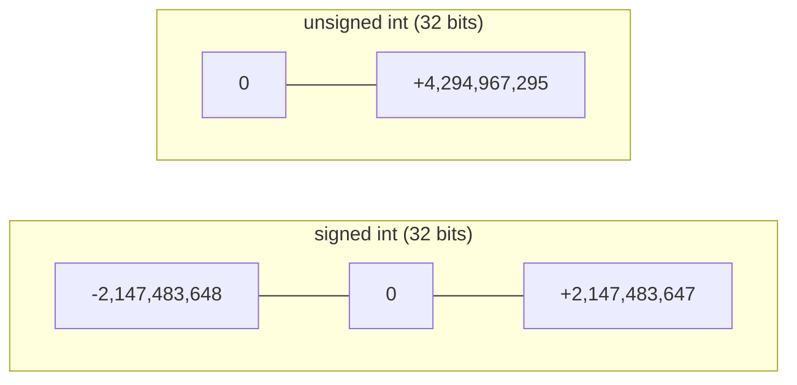

C is a **statically typed** language. Every variable, every function
parameter, and every return value has a type that is known at compile
time. The type controls three things:

- **How many bytes** are reserved.
- **How the bits are interpreted** (signed integer? floating point?
  character?).
- **What operations are legal** (you can add two `int`s; you can't
  add a function to a string).

<Illustration
  prompt={`Decorative flat-vector hero for C data types: a tidy family of differently sized rounded containers lined up — a tiny 1-byte cube, a medium 4-byte box, and a larger 8-byte box — each a different brand color, each with a small distinguishing emblem (a letter glyph, a whole-number dot cluster, a decimal-point sparkle). Clean and friendly. Flat vector, no outlines or strokes, transparent background, legible in both light and dark mode. Palette: blue #148CFF, green #20C621, yellow #FFDD6C, red #FF4F59. No words; a single small emblem per box only.`}
  ratio="16 / 9"
/>

## The fundamental types

| Type      | Typical size | What it stores                                                    |
|-----------|-------------:|-------------------------------------------------------------------|
| `char`    | 1 byte       | A single small integer; usually used to store one ASCII character |
| `short`   | 2 bytes      | A small integer                                                   |
| `int`     | 4 bytes      | The "default" integer; fast on most CPUs                          |
| `long`    | 4 or 8 bytes | A larger integer (size depends on the platform)                   |
| `long long` | 8 bytes    | At least 64 bits of integer                                       |
| `float`   | 4 bytes      | Single-precision floating point (~6–7 decimal digits)             |
| `double`  | 8 bytes      | Double-precision floating point (~15–16 decimal digits)           |

Sizes are not nailed down by the C standard — only **minimums** are
guaranteed. To find the exact size on your system, use `sizeof`:

<CodeBlock
  adapter="c"
  starterCode={`#include <stdio.h>

int main(void) {
  printf("sizeof(char)      = %zu\\n", sizeof(char));
  printf("sizeof(short)     = %zu\\n", sizeof(short));
  printf("sizeof(int)       = %zu\\n", sizeof(int));
  printf("sizeof(long)      = %zu\\n", sizeof(long));
  printf("sizeof(long long) = %zu\\n", sizeof(long long));
  printf("sizeof(float)     = %zu\\n", sizeof(float));
  printf("sizeof(double)    = %zu\\n", sizeof(double));
  return 0;
}
`}
/>

`%zu` is the printf format for `size_t`, the unsigned integer type
that `sizeof` returns.

## Signed and unsigned

Every integer type comes in two flavors:

- **Signed** (the default): can hold negative and positive values.
  The most significant bit acts as a sign.
- **Unsigned**: only non-negative values, but the range goes twice as
  high.

```c
int      a = -100;       // signed, default
unsigned int b = 100;    // non-negative only
```

A 32-bit signed `int` ranges from roughly −2.1 × 10⁹ to +2.1 × 10⁹.
A 32-bit unsigned `int` ranges from 0 to about 4.3 × 10⁹.



## Characters: a sneaky kind of integer

`char` is the smallest integer type in C. It is one byte. A `char` can
hold a number between roughly −128 and +127 (or 0–255 for `unsigned
char`). When you write a character literal `'A'`, you are writing a
small integer — the ASCII code for `A`, which is `65`.

<CodeBlock
  adapter="c"
  starterCode={`#include <stdio.h>

int main(void) {
  char letter = 'A';
  printf("As a character: %c\\n", letter);
  printf("As an integer:  %d\\n", letter);

  printf("'A' + 1 = %c (=%d)\\n", letter + 1, letter + 1);
  return 0;
}
`}
/>

`%c` says *interpret this number as an ASCII character*. `%d` says
*interpret this number as a decimal integer*. The bits in the
variable are identical either way — it is the *format string* that
decides how to display them.

<Illustration
  prompt={`Decorative flat-vector illustration showing that a char is secretly a small integer: a single tile flipping between two faces — one face shows a letter glyph, the other shows a number — joined by a small rotate/flip arrow, hinting that the same bits read either as a character or as its ASCII code. Arrow as a solid filled shape, no outline strokes. Transparent background, legible in both light and dark mode. Palette: blue #148CFF, green #20C621, yellow #FFDD6C, red #FF4F59. Minimal text — a single letter and a single number are acceptable.`}
  alt="The same byte read either as a character or as its numeric ASCII code"
  ratio="16 / 9"
/>

## Floating-point numbers

For numbers with a fractional part, use `float` (less precision) or
`double` (more precision). `double` is the default for fractional
literals like `3.14`, and is what most code should use unless memory
is tight.

<CodeBlock
  adapter="c"
  starterCode={`#include <stdio.h>

int main(void) {
  double pi = 3.14159265358979;
  double radius = 5.0;
  double area = pi * radius * radius;

  printf("area of a circle with r = %.1f is %.5f\\n", radius, area);
  return 0;
}
`}
/>

`%.5f` says "print this `double` with 5 digits after the decimal
point". `%f` without modifiers uses 6 digits by default.

<Callout type="warn" title="Floating point is not exact">
Decimal fractions like \`0.1\` cannot be represented exactly in
binary floating point — just like \`1/3\` cannot be written exactly
in base 10. The number you store is a *very close approximation*.
This is why \`0.1 + 0.2\` is famously not exactly \`0.3\` in almost
every programming language.
</Callout>

<Illustration
  prompt={`Decorative flat-vector illustration of floating-point approximation: a clean number line or ruler where a target point sits just slightly off a tidy gridline, with a small magnifier highlighting the tiny gap, suggesting a value that is very close but not exact. Calm and precise-feeling. Flat vector, no outlines or strokes, transparent background, legible in both light and dark mode. Palette: blue #148CFF, green #20C621, yellow #FFDD6C, red #FF4F59. No text.`}
  ratio="16 / 9"
/>

<CodeBlock
  adapter="c"
  starterCode={`#include <stdio.h>

int main(void) {
  double sum = 0.1 + 0.2;
  printf("0.1 + 0.2 = %.20f\\n", sum);
  return 0;
}
`}
/>

For money, dates, or anything where exactness matters, do **not**
use floating point. Use integers and track the units yourself
(e.g. cents instead of dollars).

## Integer division vs floating-point division

Beware: in C, **dividing two integers produces an integer** —
fractional parts are thrown away.

<CodeBlock
  adapter="c"
  starterCode={`#include <stdio.h>

int main(void) {
  int a = 7, b = 2;
  int quotient = a / b;  // 3, not 3.5
  int remainder = a % b; // 1

  double real_quotient = (double)a / b; // cast a to double first

  printf("7 / 2  = %d (integer)\\n", quotient);
  printf("7 %% 2 = %d (remainder)\\n", remainder);
  printf("(double)7 / 2 = %f\\n", real_quotient);
  return 0;
}
`}
/>

`(double)a` is a **cast**: it temporarily reinterprets `a` as a
`double` for the purpose of the expression. The original `a` is
unchanged.

`%%` inside a format string is how you print a single literal `%`.

## Type conversions

C automatically converts between numeric types in many places (called
*implicit conversion*). Mostly it does what you want, but a few
patterns surprise beginners:

```c
int    n = 10;
double d = n;          // ok: 10 -> 10.0
int    m = 3.7;        // ok but lossy: m becomes 3 (truncated, not rounded)
```

To make a conversion explicit (and to silence compiler warnings), use
a cast `(type)expression`:

```c
double price = 9.99;
int    dollars = (int)price;   // 9
```

## A note on `bool`

C originally had no boolean type — programmers used `int` with `0`
for false and any non-zero value for true. C99 added a real boolean
type via the header `<stdbool.h>`:

<CodeBlock
  adapter="c"
  starterCode={`#include <stdbool.h>
#include <stdio.h>

int main(void) {
  bool is_ready = true;
  bool is_done = false;

  if (is_ready && !is_done) {
    printf("Let's go!\\n");
  }
  return 0;
}
`}
/>

You may still see older code use `int` for boolean values. Both work.

## Types and the bits they reserve

| Type     | Size     |
| -------- | -------- |
| `char`   | 1 byte   |
| `int`    | 4 bytes  |
| `double` | 8 bytes  |

Same memory, different sized chunks, different bit interpretations.
The CPU has separate instructions for integer arithmetic and
floating-point arithmetic — the type tells the compiler which to
emit.

<Illustration
  prompt={`Informative flat-vector illustration comparing how many bytes each type reserves: three horizontal bars built from small byte-squares — one square, four squares, and eight squares — stacked and left-aligned so the differing widths are obvious, each bar a different brand color. Flat vector, no outlines or strokes, transparent background, legible in both light and dark mode. Palette: blue #148CFF, green #20C621, yellow #FFDD6C, red #FF4F59. No words; tiny size numbers optional.`}
  alt="char reserves 1 byte, int reserves 4 bytes, and double reserves 8 bytes"
  ratio="5 / 2"
/>

## Challenge: average of three numbers

<ChallengeCard
  adapter="c"
  title="Average three integers, printed as a decimal"
  instructions={`Three variables \`a\`, \`b\`, and \`c\` are set to \`10\`, \`20\`, and \`33\`. Compute their average as a real number (not truncated to an integer) and print exactly:

\`average = 21.00\`

Use \`%.2f\` to format the result with two digits after the decimal point.`}
  starterCode={`#include <stdio.h>

int main(void) {
  int a = 10, b = 20, c = 33;
  double avg = 0.0;
  // compute avg here
  printf("average = %.2f\\n", avg);
  return 0;
}
`}
  solutionCode={`#include <stdio.h>

int main(void) {
  int a = 10, b = 20, c = 33;
  double avg = (a + b + c) / 3.0;
  printf("average = %.2f\\n", avg);
  return 0;
}
`}
  tests={[
    {
      id: "avg",
      name: "Prints `average = 21.00`",
      description: "stdout equals `average = 21.00`",
      expect: { stdoutEquals: "average = 21.00" },
    },
  ]}
/>

<MultipleChoice
  markdown={`What will this program print?

\`\`\`c
#include <stdio.h>
int main(void) {
    int a = 7, b = 2;
    printf("%d\\n", a / b);
    return 0;
}
\`\`\`

- 3.5
  > C's \`/\` between two \`int\`s does **integer** division — the result is itself an \`int\`, so there is no \`.5\`.
- 4
  > Rounding to the nearest integer would give 4, but C integer division truncates toward zero, dropping the fractional part entirely.
- [o] 3
  > Integer division truncates toward zero: \`7 / 2\` yields \`3\`.
- A compile-time error.
  > Dividing two \`int\`s is perfectly legal C; no error is produced at any stage.

To get a fractional result, at least one of the operands must be a floating-point value: \`(double)a / b\` or \`a / 2.0\`.`}
/>

<MultipleChoice
  markdown={`Which type would you choose to store the temperature of a refrigerator in degrees Celsius with one digit of precision (e.g. \`4.0\`, \`-1.5\`)?

- \`int\` — temperatures are whole numbers.
  > A refrigerator can be \`-1.5\`, which an \`int\` cannot represent.
- \`char\` — temperatures fit in one byte.
  > \`char\` can only hold whole integers in a small range; the fractional part would be lost.
- [o] \`double\` — for accurate fractional values.
  > \`double\` is the standard choice for general-purpose fractional numbers in C.
- \`unsigned int\` — temperatures are always positive.
  > Temperatures can be negative; \`unsigned\` types cannot hold negative values.

Integer types are great for counts and identifiers; for any quantity that can be fractional, use a floating-point type — typically \`double\` unless you have a specific reason to use \`float\`.`}
/>
