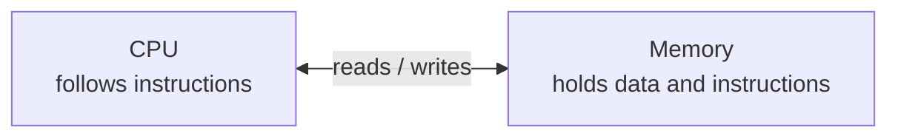
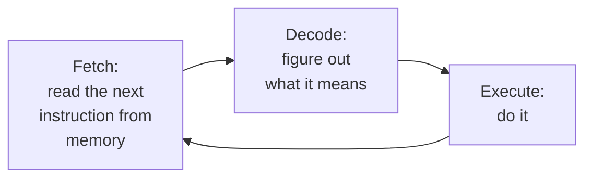
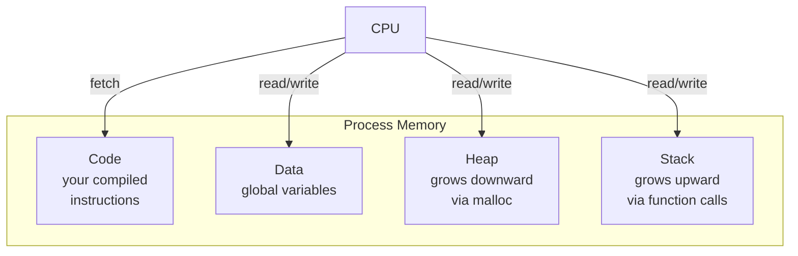

To program well in any language, you need a mental picture of what
the computer is doing while your program runs. The picture doesn't
have to be perfect. It just has to be **good enough that you can
predict what your code will do** before pressing Run.

This chapter builds that picture.

<Illustration
  prompt={`Decorative flat-vector hero showing a simple mental model of a computer: a friendly rounded CPU square with a subtle gear or pulse motif on the left, connected by two soft solid arrows (one for read, one for write) to a tall stack of numbered memory cells on the right. Clean and diagrammatic but warm. Arrows as solid filled shapes, no outline strokes. Transparent background, legible in both light and dark mode. Palette: blue #148CFF, green #20C621, yellow #FFDD6C, red #FF4F59. No text.`}
  ratio="16 / 9"
/>

## A computer has two main parts (for us)

For our purposes, every computer is made of two cooperating parts:



- **The CPU** (Central Processing Unit) is a small, very fast machine
  that can perform a fixed list of tiny operations: add two numbers,
  compare two numbers, move data from one place to another, decide
  whether to jump to a different instruction.
- **Memory** (RAM) is a giant array of numbered storage cells. Each
  cell holds 8 bits (one byte). Each cell has an **address**, which is
  itself just a number — like a house number on an infinitely long
  street.

That's it. Everything else — variables, functions, files, web
browsers, video games — is built on top of these two ideas.

## Memory as a row of mailboxes

It helps to picture RAM as a long row of numbered mailboxes:

```text
Address:   1000  1001  1002  1003  1004  1005  1006  1007  ...
Contents:   42   00    00    00    'H'   'i'   '!'   00    ...
```

Each mailbox holds one byte (a number between 0 and 255, or a
character). Larger values like a 32-bit integer occupy several
consecutive mailboxes — typically 4 bytes for an `int`.

<Illustration
  prompt={`Flat-vector illustration of RAM as a long horizontal row of numbered mailbox cells, each a small rounded rectangle butting against the next with no gaps. A few cells hold simple value blobs, and one run of four adjacent cells is highlighted together to show a single integer spanning several bytes. Friendly and orderly. Flat vector, no outlines or strokes, transparent background, legible in both light and dark mode. Palette: blue #148CFF, green #20C621, yellow #FFDD6C, red #FF4F59. Minimal text — small sparse address numbers optional.`}
  alt="Memory as a contiguous row of numbered byte-sized cells, with four cells grouped into one integer"
  ratio="5 / 2"
/>

When your C program declares a variable `int score = 42;`, the
compiler arranges for four mailboxes somewhere in RAM to hold the
number `42`. The variable name `score` is **purely a convenience for
you, the human**. The CPU only knows addresses.

<Callout type="info" title="Variables are nicknames">
A variable name is a label you (and the compiler) attach to a memory
location. The hardware doesn't know the word `score`. It only knows
"the four bytes starting at address 0x7ffeefbff5ac". The compiler is
the translator between your friendly names and the CPU's cold
addresses.
</Callout>

## The fetch-decode-execute cycle

The CPU works in a tight loop, billions of times per second:



1. **Fetch.** The CPU has a special register called the **program
   counter** (PC) that holds the address of the next instruction. It
   reads the instruction at that address from memory.
2. **Decode.** It looks at the bits of the instruction and figures out
   what kind it is: add, jump, load, store, etc.
3. **Execute.** It actually performs the operation — perhaps updating
   a register, perhaps writing to memory, perhaps changing the PC to
   jump elsewhere.

Then it goes back to step 1. That tiny loop is **the entire job of a
CPU**. Everything your computer does — running your operating system,
streaming a movie, rendering a 3D game — is some combination of those
three steps repeated trillions of times.

## What "running a program" actually means

When you double-click a program, here is the (simplified) sequence:

1. The **operating system** finds the executable file on disk.
2. It allocates a chunk of memory for the program — the **process**.
3. It copies the program's machine instructions into the
   **code segment** of that memory.
4. It sets up a place for the program's variables: the **data
   segment** (for variables known in advance) and the **stack** (for
   function-call bookkeeping).
5. It loads the address of the program's first instruction (often
   called `_start`, which then calls `main`) into the CPU's program
   counter.
6. The CPU begins fetching, decoding, and executing instructions from
   that address.



Don't worry about memorizing these regions yet — we'll come back to
the stack and the heap several times in this course. The important
thing is the **mental picture**: your program is a chunk of
instructions and data, sitting in memory, being chewed through by the
CPU one step at a time.

## A worked example, on paper

Let's say the CPU sees these three instructions in a row:

```text
LOAD  R1, [1000]    ; copy the value at address 1000 into register R1
ADD   R1, R1, 10    ; add 10 to R1
STORE [1000], R1    ; copy R1 back into address 1000
```

Suppose memory at address 1000 currently contains the number `42`.
Trace it by hand:

| Step | What happens                                  | Memory[1000] | R1 |
|-----:|-----------------------------------------------|-------------:|---:|
| 0    | start                                          | 42 | ?  |
| 1    | LOAD R1, [1000]                                | 42 | 42 |
| 2    | ADD R1, R1, 10                                 | 42 | 52 |
| 3    | STORE [1000], R1                               | 52 | 52 |

That is *exactly* what your computer does when you write
`x = x + 10;` in C, where `x` happens to live at address 1000. The C
compiler emits those three instructions for you.

## Why this matters for programming

When you understand the fetch-decode-execute cycle, several things
that confuse beginners become obvious:

- **Why is order important?** Because the CPU executes one
  instruction at a time, top to bottom (unless told to jump). The
  order you write statements is the order they happen.
- **Why do `if` and `while` work?** Because under the hood they're
  just "compare two numbers, then maybe jump to a different
  instruction". A loop is a conditional jump back to the top of the
  loop body.
- **Why are variables fast?** Because reading from a register or a
  nearby memory address is something the CPU can do in a few
  nanoseconds.
- **Why does running out of memory crash a program?** Because the
  program can't get more mailboxes to store things in.

## Programming, then, is just…

Programming is the art of **arranging a sequence of small operations
in memory** such that, when the CPU walks through them, something
useful happens at the end.

<Illustration
  prompt={`Decorative flat-vector illustration of programming as arranging small operations in memory: a neat left-to-right sequence of small colored instruction tiles laid inside a faint memory strip, with a tiny CPU marker walking along them and leaving a soft motion trail, ending in a small spark of useful output. Abstract and tidy. Flat vector, no outlines or strokes, transparent background, legible in both light and dark mode. Palette: blue #148CFF, green #20C621, yellow #FFDD6C, red #FF4F59. No text.`}
  ratio="16 / 9"
/>

Every language we use — Python, JavaScript, Rust, C — ultimately
exists to make it easier for humans to describe such arrangements.
Some hide the machine almost entirely (Python). Some keep it just out
of sight (Java). C keeps it **right at your fingertips**, which is
exactly why it's such a great teacher.

<MultipleChoice
  markdown={`In the fetch-decode-execute cycle, what is the role of the **program counter**?

- It counts how many programs are currently running on the computer.
  > That is an operating-system concept, not a CPU register. The program counter tracks the position within a single program's instructions.
- [o] It holds the address of the next instruction the CPU will fetch.
  > The PC is just a special register that points into memory at the next instruction. Jumps, function calls, and \`if\` statements all work by changing the PC.
- It records how many instructions a program has executed in total.
  > Some CPUs have performance counters for profiling, but the program counter is not a cumulative instruction count — it is an address, reset when the PC jumps.
- It stores the result of the most recent arithmetic operation.
  > That is the role of an accumulator or general-purpose register, not the program counter.

The CPU repeats: read the instruction at the address in PC, advance (or change) PC, then execute. That loop, with a few extras, is the entire job of the processor.`}
/>

<MultipleChoice
  markdown={`When you write \`int x = 42;\` in C, which statement is most accurate about what happens at the machine level?

- The CPU creates a brand-new memory chip labeled \`x\`.
  > Memory chips are fixed hardware; no new hardware is created at runtime. The compiler arranges for existing RAM to hold the value.
- The compiler stores \`x\` as the literal text \`"x"\` somewhere in memory.
  > Variable names exist only in the source code and debug symbols; at runtime, the CPU works with numeric addresses, not strings like \`"x"\`.
- [o] The compiler reserves a small region of memory (typically 4 bytes) to hold the value 42; the name \`x\` only exists in the source code.
  > Variable names are a human convenience. At runtime, the CPU sees only addresses. The compiler is the bridge between the two views.
- The number 42 is sent to the CPU directly, not stored in memory.
  > The value must be stored in a memory location (or register) so the CPU can retrieve it later; a bare immediate value sent once would have nowhere to live.

The hardware doesn't know variable names. The compiler maps each name to a specific memory location (or sometimes a register), and from then on the CPU just shuffles bits between addresses.`}
/>
