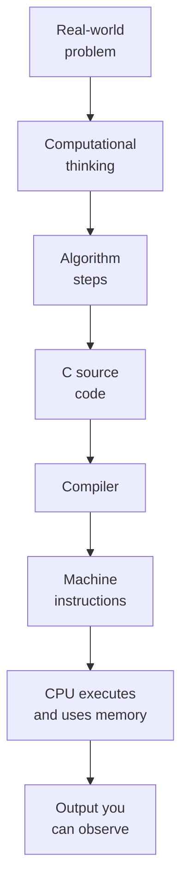

Welcome to **C Programming for Beginners**. This course was written for
people who have **never written a program before**, or who have dabbled
in a language like Python or JavaScript but never quite understood
what was happening *underneath*.

We are going to learn C — not to chase a job title, not to win a coding
contest, and not to ship the next big web app. We will learn C because
it is the language that most clearly reveals **how a computer
actually works**.

<Callout type="info" title="Who is this course for?">
- People who have never programmed before.
- Students who can write a few lines of Python or JavaScript but get
  confused when someone says "stack", "heap", or "pointer".
- Anyone who wants to *understand* programs, not just type them.
</Callout>

## What makes this course different

Most programming tutorials throw syntax at you on page one: "here is a
variable, here is an `if` statement, now write a calculator." That is
fine if you already think like a programmer. If you don't, it feels
like learning French by being handed a French dictionary.

We are going to do the opposite. We will start with **stories**:

1. The story of how computers were invented and how humans slowly
   learned to talk to them.
2. The story of UNIX, Dennis Ritchie, and the birth of C.
3. The story of how a program actually runs — what the CPU does, how
   memory is organized, and what "executing code" really means.

Only after that foundation do we open a code editor.

## How the interactive widgets work

Every C example on every page **runs in your browser**. There is
nothing to install. We use a real `clang` compiler that has itself been
compiled to WebAssembly, plus a tiny sandbox that lets the resulting
program read from input and write to output.

You will see three kinds of widgets:

1. **Code blocks.** Read them. Then click *Run*. Then **change a
   number** and run again. Curiosity is the engine of learning here.
2. **Challenge cards.** Small puzzles with hidden tests. Try, fail,
   try again. The point is the trying.
3. **Multiple-choice questions.** Quick checks at the end of most
   sections. Read every explanation — wrong answers are where the
   real learning happens.

<Callout type="warn" title="The browser is a sandbox">
The code runs in a safe, restricted environment (WASI). You cannot
read files from your computer, open network sockets, or break
anything. We will mention "real" system features when they matter, but
all runnable examples stay inside the sandbox.
</Callout>

## What you will be able to do at the end

By the time you reach the last page, you will:

- Read a small or medium-sized C program and **predict what it does**
  without running it.
- Trace variables and memory by hand.
- Draw a diagram of the call stack, the heap, and how a pointer fits
  in.
- Write a multi-file C program with headers and helper functions.
- Debug your own programs by reasoning, not by guessing.
- Have the vocabulary and intuition to learn **any other programming
  language** much faster than you would have otherwise.

## How to study

- **Don't rush.** This is not a race. A page that takes you two days
  to truly understand is a page well spent.
- **Type, don't paste.** Re-type the small examples by hand. Your
  fingers are part of the learning loop.
- **Predict before you run.** Look at a code block, *say out loud*
  what it will print, then run it. If you were wrong, that's the
  moment to learn.
- **Draw pictures.** Memory diagrams, arrows, boxes. Programming is a
  visual subject hiding inside a text editor.
