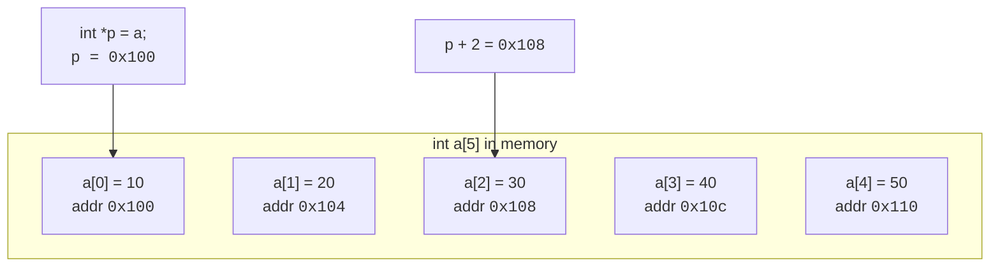

In C, **arrays and pointers are tangled together** in a way that
shocks newcomers and trips up old hands. The shock is the price of
admission. The payoff is a unified model in which traversing an
array, walking a string, and scanning a region of memory are all the
same idea.

## Array name as a pointer

When you mention an array name in most expressions, the compiler
silently converts it to **a pointer to its first element**. This is
called *array-to-pointer decay*.

```c
int a[5] = {10, 20, 30, 40, 50};
int *p = a;          // same as &a[0]
```

`p` and `a` point to the same byte. The differences are subtle but
real:

- `sizeof(a)` is `5 * sizeof(int)` — the total array size.
- `sizeof(p)` is the size of a pointer, typically 8.
- `a = somewhere_else;` — **forbidden**, an array name can't be
  reassigned.
- `p = somewhere_else;` — fine, pointers are just variables.

<CodeBlock
  adapter="c"
  starterCode={`#include <stdio.h>

int main(void) {
  int a[5] = {10, 20, 30, 40, 50};
  int *p = a;

  printf("a       = %p\\n", (void *)a);
  printf("&a[0]   = %p\\n", (void *)&a[0]);
  printf("p       = %p\\n", (void *)p);
  printf("a[2]    = %d\\n", a[2]);
  printf("p[2]    = %d\\n", p[2]);
  printf("*(p+2)  = %d\\n", *(p + 2));
  return 0;
}
`}
/>

`a[i]`, `p[i]`, and `*(p + i)` are **all the same thing**. The C
standard defines indexing in terms of pointer arithmetic.

## Pointer arithmetic

When you add `1` to a pointer, the compiler does not add `1` byte —
it adds the size of one element of the pointed-to type. So `p + 1`
on an `int *` advances `4` bytes (on a typical system), landing on
the next `int`.

| Expression | Points to     |
| ---------- | ------------- |
| `p`        | `a[0] = 10`   |
| `p + 1`    | `a[1] = 20`   |
| `p + 2`    | `a[2] = 30`   |
| `p + 3`    | `a[3] = 40`   |
| `p + 4`    | `a[4] = 50`   |

This is why arrays and pointers fit so neatly together. Walking an
array with a pointer is just incrementing the pointer.

<CodeBlock
  adapter="c"
  starterCode={`#include <stdio.h>

int main(void) {
  int a[5] = {10, 20, 30, 40, 50};

  // walk with an index
  for (int i = 0; i < 5; i++) {
    printf("%d ", a[i]);
  }
  printf("\\n");

  // walk with a pointer
  for (int *p = a; p < a + 5; p++) {
    printf("%d ", *p);
  }
  printf("\\n");

  return 0;
}
`}
/>

Both print `10 20 30 40 50`. Choose whichever style makes the
intent clearest. Idiomatic C often uses the pointer form for strings
and the index form for numeric arrays — but neither is "more
correct".

## The classic string-copy loop

Reading a null-terminated string with a pointer is the most famous
pointer-arithmetic loop in C:

<CodeBlock
  adapter="c"
  starterCode={`#include <stdio.h>

void my_puts(const char *s) {
  while (*s != '\\0') {
    putchar(*s);
    s++;
  }
  putchar('\\n');
}

int main(void) {
  my_puts("Hello, pointers!");
  return 0;
}
`}
/>

Each iteration:

1. Read the character at the pointer (`*s`).
2. If it's `\0`, stop.
3. Otherwise print it.
4. Advance the pointer to the next character.

The famous one-liner `while (*s) putchar(*s++);` does the same thing
even more compactly. *Familiarize yourself with the long form first*
— compactness is a reward you can earn later.

## Arrays as function parameters: revisited

Recall that when you pass an array to a function, the array decays
to a pointer:

```c
void show(int arr[], int n);    // these two declarations
void show(int *arr,  int n);    // are completely equivalent
```

Inside `show`, `arr` is a `int *`, and `sizeof(arr)` does **not**
give you the array's size — it gives the size of a pointer. The
length must always be passed explicitly. This is why you see
length-carrying APIs everywhere in C:

```c
size_t strlen(const char *s);
void *memcpy(void *dest, const void *src, size_t n);
```

Idiomatic C functions take a pointer to the first element **and** a
size. Always.

## Pointer subtraction

Subtracting two pointers into the same array gives the distance
between them, in elements:

<CodeBlock
  adapter="c"
  starterCode={`#include <stdio.h>
#include <string.h>

int main(void) {
  const char *s = "Hello, world!";
  const char *comma = strchr(s, ',');

  if (comma != NULL) {
    printf("comma is at offset %ld\\n", comma - s);
  }
  return 0;
}
`}
/>

`comma - s` is `5` — the offset of `,` from the start of the string.
Pointer subtraction is one of the cleanest ways to compute lengths
and positions.

## Walking a 2D array with pointers

A 2D array `int grid[ROWS][COLS]` lives in memory as one long row of
ints, row by row (row-major order). You can walk all `ROWS * COLS`
elements with a single pointer:

<CodeBlock
  adapter="c"
  starterCode={`#include <stdio.h>

int main(void) {
  int grid[3][4] = {
      {1, 2, 3, 4},
      {5, 6, 7, 8},
      {9, 10, 11, 12},
  };

  int *p = &grid[0][0];
  int total = 3 * 4;
  int sum = 0;
  for (int i = 0; i < total; i++) {
    sum += p[i];
  }
  printf("sum = %d\\n", sum);
  return 0;
}
`}
/>

Output: `sum = 78`. The 2D shape is a *convenient indexing scheme*
on top of a flat region of memory.

## Pointer pitfalls

Three rules that, if you follow them, dodge most pointer bugs:

1. **Don't point at things that have died.** Local variables
   evaporate when their function returns. Returning a pointer to a
   local is a guaranteed bug.
2. **Don't step outside an array.** Pointer arithmetic that wanders
   past the start or end of an array is undefined behavior.
3. **Set unused pointers to `NULL` and check before dereferencing.**

```c
int *make_a_bug(void) {
    int x = 5;
    return &x;            // BUG: x dies as this function returns
}
```

Most compilers will warn about this. Take the warning seriously.

## Visual: pointer arithmetic on an int array



Each cell is 4 bytes apart, but `p + 1` *adds 1 element* — the
arithmetic accounts for `sizeof(int)` for you.

## Challenge: sum an array via a pointer

<ChallengeCard
  adapter="c"
  title="Sum with pointer arithmetic"
  instructions={`Write a function \`int sum(const int *begin, const int *end)\` that adds together every element from \`begin\` (inclusive) up to \`end\` (**exclusive**). \`main\` calls it like this:

\`\`\`c
int a[] = {1, 2, 3, 4, 5};
int total = sum(a, a + 5);
printf("%d\\n", total);   // should print 15
\`\`\`

The program must print exactly \`15\`.`}
  starterCode={`#include <stdio.h>

int sum(const int *begin, const int *end) {
  // walk from begin up to (but not including) end
  return 0;
}

int main(void) {
  int a[] = {1, 2, 3, 4, 5};
  int total = sum(a, a + 5);
  printf("%d\\n", total);
  return 0;
}
`}
  solutionCode={`#include <stdio.h>

int sum(const int *begin, const int *end) {
  int total = 0;
  for (const int *p = begin; p < end; p++) {
    total += *p;
  }
  return total;
}

int main(void) {
  int a[] = {1, 2, 3, 4, 5};
  int total = sum(a, a + 5);
  printf("%d\\n", total);
  return 0;
}
`}
  tests={[
    {
      id: "sum",
      name: "Sum is 15",
      description: "stdout equals `15`",
      expect: { stdoutEquals: "15" },
    },
  ]}
/>

<MultipleChoice
  markdown={`If \`int a[5];\` and \`int *p = a;\`, which of the following is **not** equivalent to \`a[3]\`?

*Hint: \`a[3]\` is a value. Which option gives you an address instead?*

- \`p[3]\`
  > Since \`p\` points at \`a\`'s first element, \`p[3]\` indexes the same element as \`a[3]\` and yields its value.
- \`*(p + 3)\`
  > \`p + 3\` is the address of the fourth element; the leading \`*\` dereferences it, giving the same value as \`a[3]\`.
- \`*(a + 3)\`
  > This is the definition the compiler uses for \`a[3]\` itself: add \`3\`, then dereference. Same value.
- [o] \`a + 3\`
  > \`a + 3\` is the **address** of the fourth element, not its value. It has no dereference (\`*\`), so it is the one option that differs from \`a[3]\`.

The relationship \`a[i]\` ≡ \`*(a + i)\` is built into the C standard. Notice this also implies the bizarre legal expression \`3[a]\`, which evaluates to \`*(3 + a)\`, which is the same as \`a[3]\`. Just because something is legal doesn't mean it's a good idea.`}
/>

<MultipleChoice
  markdown={`Why does this function return a meaningless number for \`length\`?

\`\`\`c
void show(int arr[]) {
    int length = sizeof(arr) / sizeof(arr[0]);
    printf("%d\\n", length);
}
\`\`\`

- The compiler can't compute \`sizeof\` at runtime.
  > \`sizeof\` is evaluated at compile time, not runtime. The real issue is that the compile-time type of \`arr\` inside the function is already a pointer, so \`sizeof\` returns the pointer's size, not the array's.
- The function should declare \`arr\` as \`int *arr\` instead.
  > Actually \`int arr[]\` and \`int *arr\` mean exactly the same thing in a function parameter.
- [o] Inside the function, \`arr\` is a pointer, not an array. \`sizeof(arr)\` is the size of a pointer (typically 8), not the array's total size.
  > When an array is passed to a function, it decays to a pointer to its first element, and the size information is lost.
- C functions cannot compute the length of an array under any circumstances.
  > Functions can — but only if the caller passes the length explicitly.

This is why nearly every C function that takes an array also takes a length parameter, and why \`strlen\` is implemented by *scanning for \`\\0\`* rather than by reading a stored length.`}
/>
