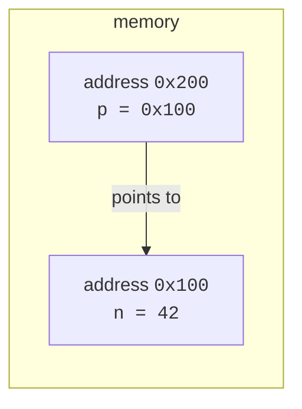

This is the chapter people are warned about. *"Pointers are hard."*
*"That's where C gets weird."* They are right that pointers are
where C reveals what is really going on. They are wrong that it has
to be confusing.

The trick is to keep the picture in front of you at all times.
Every pointer is just a **box that holds an address**. Once you draw
the boxes, everything else falls into place.

## What a pointer is

Every byte of RAM has an address — a number. A **pointer** is a
variable whose value is one of those addresses. We write the type of
a pointer-to-int as `int *`:

```c
int   n = 42;     // an ordinary int
int  *p = &n;     // a pointer that holds the address of n
```



Two new operators appeared:

- `&n` — the **address-of** operator. Read it as "the address of n".
- `int *p` — the type "pointer to int". Read the asterisk in
  declarations as "is a pointer to".

To **read or write through the pointer**, use `*` (the
**dereference** operator):

```c
*p          // the value at the address p holds, i.e. n
*p = 100;   // store 100 into the memory p points at, i.e. into n
```

<CodeBlock
  adapter="c"
  starterCode={`#include <stdio.h>

int main(void) {
  int n = 42;
  int *p = &n;

  printf("n          = %d\\n", n);
  printf("&n         = %p\\n", (void *)&n);
  printf("p          = %p\\n", (void *)p);
  printf("*p         = %d\\n", *p);

  *p = 100; // changing n through the pointer
  printf("after *p = 100, n = %d\\n", n);
  return 0;
}
`}
/>

The exact addresses printed will differ every run. That's fine —
**we care about the relationships**, not the specific numbers.

## The two operators, side by side

The most common beginner trap is reading the `*` in a declaration
the same way you read it in an expression. They mean different
things:

| Context        | Meaning                                                         |
|----------------|-----------------------------------------------------------------|
| `int *p;`      | declaration: *p is a pointer to int*                            |
| `*p`           | expression: *the value at the address stored in `p`*            |
| `&n`           | expression: *the address of `n`*                                |
| `int *p = &n;` | declare `p`, initialize it with the address of `n`              |

Once you internalize that, half of pointer confusion vanishes.

## Pictures, always pictures

Let's trace a tiny program in pictures.

```c
int n = 7;
int *p = &n;
*p = *p + 1;
```

**After line 1**: a box `n` exists, containing `7`.

```text
+-----+
|  n  |
+-----+
|  7  |
+-----+
```

**After line 2**: a new box `p` exists, containing the address of
`n`:

```text
+-----+        +-----+
|  p  | ---->  |  n  |
+-----+        +-----+
|0x100|        |  7  |
+-----+        +-----+
```

**After line 3**: `*p` reads the value at `n` (`7`), adds `1`, and
writes `8` back into the same address:

```text
+-----+        +-----+
|  p  | ---->  |  n  |
+-----+        +-----+
|0x100|        |  8  |
+-----+        +-----+
```

The value of `p` itself never changed. Only the value of the *thing
it pointed at* changed.

## Pointers as function parameters

Recall that C passes arguments **by value**: a function gets a copy
of each argument. If you want a function to *modify* a caller's
variable, you pass a **pointer** to it.

<CodeBlock
  adapter="c"
  starterCode={`#include <stdio.h>

void increment(int *x) { (*x)++; }

int main(void) {
  int n = 10;
  increment(&n);
  printf("n = %d\\n", n); // now 11
  return 0;
}
`}
/>

The parameter `x` is of type `int *`. `*x` is the int it points at.
`(*x)++` increments that int. The parentheses matter: `*x++` would
parse as `*(x++)`, which is a different (and much more confusing)
operation.

This pattern — "pass `&variable` so the function can change it" — is
how every `scanf`-style API works.

### Returning two values from a function

A function can return only one value, but it can also write to
several output parameters via pointers:

<CodeBlock
  adapter="c"
  starterCode={`#include <stdio.h>

void divmod(int a, int b, int *q, int *r) {
  *q = a / b;
  *r = a % b;
}

int main(void) {
  int q = 0, r = 0;
  divmod(23, 5, &q, &r);
  printf("23 / 5 = %d remainder %d\\n", q, r);
  return 0;
}
`}
/>

## The null pointer

A pointer that points to *nothing valid* should be set to `NULL`:

```c
int *p = NULL;
```

Dereferencing a `NULL` pointer is undefined behavior, but on most
systems it crashes loudly (a "segmentation fault"), which is much
better than silently corrupting memory. Check for `NULL` before
using a pointer that *might* be unset:

```c
if (p != NULL) {
    *p = 5;
}
```

A common idiom is `if (p)` / `if (!p)`, since `NULL` is zero (false).

## What happens if you forget to initialize a pointer

An uninitialized pointer holds whatever bits were in those bytes
already — an essentially random address. Dereferencing it could
crash, or could silently overwrite some unrelated piece of memory.

```c
int *p;     // p holds garbage
*p = 5;     // writing to a random address — very bad
```

**Always initialize**. Either point at something real with `&x`, or
set to `NULL` to mark "not yet pointing at anything".

## Pointer types matter

A `char *` and an `int *` are different types — they advance through
memory by different amounts when you do arithmetic on them, and they
read different numbers of bytes when you dereference. Mixing them
without intention is a bug.

```c
int n = 42;
int *pi = &n;
char *pc = (char *)&n;   // a deliberate cast — looking at n one byte at a time
```

We'll use this kind of cast deliberately in the chapter on memory
layout. For now, stick to pointer types that match what you're
pointing at.

## A walk through a function call

Here is a tiny but complete example that uses pointers to swap two
variables:

<CodeBlock
  adapter="c"
  starterCode={`#include <stdio.h>

void swap(int *a, int *b) {
  int tmp = *a;
  *a = *b;
  *b = tmp;
}

int main(void) {
  int x = 1, y = 2;
  printf("before: x = %d, y = %d\\n", x, y);
  swap(&x, &y);
  printf("after:  x = %d, y = %d\\n", x, y);
  return 0;
}
`}
/>

Trace it with pictures, before and after each line of `swap`. You
should see that `tmp` (a local variable inside `swap`) holds `x`'s
value, then `x` is overwritten by `y`, then `y` is overwritten from
`tmp`. The pointers `a` and `b` give `swap` access to `main`'s
variables without copying them.

## Challenge: in-place addition

<ChallengeCard
  adapter="c"
  title="Increase a variable through a pointer"
  instructions={`Write a function \`void add_to(int *value, int delta)\` that adds \`delta\` to whatever \`value\` points at. \`main\` uses it like this:

\`\`\`c
int x = 10;
add_to(&x, 7);
printf("%d\\n", x);   // should print 17
\`\`\`

The program must print exactly \`17\` and nothing else.`}
  starterCode={`#include <stdio.h>

void add_to(int *value, int delta) {
  // your code here
}

int main(void) {
  int x = 10;
  add_to(&x, 7);
  printf("%d\\n", x);
  return 0;
}
`}
  solutionCode={`#include <stdio.h>

void add_to(int *value, int delta) { *value = *value + delta; }

int main(void) {
  int x = 10;
  add_to(&x, 7);
  printf("%d\\n", x);
  return 0;
}
`}
  tests={[
    {
      id: "add_to",
      name: "Adds delta in place",
      description: "stdout is `17`",
      expect: { stdoutEquals: "17" },
    },
  ]}
/>

<MultipleChoice
  markdown={`Given:

\`\`\`c
int n = 5;
int *p = &n;
*p = 10;
\`\`\`

What is the value of \`n\` afterwards?

- 5
  > \`5\` was \`n\`'s value before the assignment; \`*p = 10\` overwrites it through the pointer.
- The address of \`n\`.
  > \`p\` holds \`n\`'s address, but \`*p = 10\` writes through \`p\`, storing the *value* \`10\` into \`n\`.
- [o] 10
  > \`*p = 10\` writes \`10\` into the memory location \`p\` points at, which is \`n\`'s memory.
- Undefined, because \`p\` was reassigned.
  > \`p\` was never reassigned — it still points at \`n\`. Only the value at \`n\` was changed, and that change is well-defined.

\`p\` is just a sticky note with \`n\`'s address on it; \`*p = 10\` follows the sticky note to \`n\` and writes \`10\` there.`}
/>

<MultipleChoice
  markdown={`What is the type of the expression \`&x\` if \`x\` is declared as \`double x;\`?

- \`double\`
  > \`x\` itself is a \`double\`, but \`&x\` is the *address* of \`x\`, which is a pointer type, not a plain \`double\`.
- \`int *\`
  > The target type follows the operand. \`x\` is a \`double\`, not an \`int\`, so \`&x\` is not an \`int *\`.
- \`void *\`
  > A \`double *\` can be *converted* to \`void *\`, but the type of the expression \`&x\` itself is the specific \`double *\`.
- [o] \`double *\`
  > The address-of operator yields a pointer whose target type is the same as the operand's type — so \`&x\` where \`x\` is a \`double\` is a \`double *\`.

The type of a pointer matters: a \`double *\` and an \`int *\` step through memory in different sized strides during pointer arithmetic, and reading or writing through them touches different numbers of bytes.`}
/>
