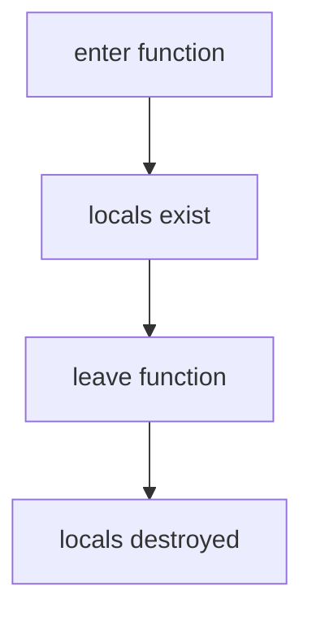
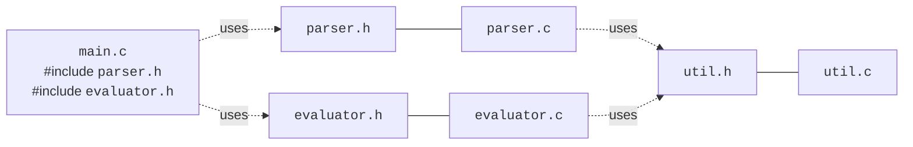

A program of any size eventually becomes too big to fit comfortably
in one file. To grow, you need two skills:

1. **Scope** — understanding *where* a name is visible.
2. **Modularity** — splitting the program into pieces that hide
   their internals from each other.

These are the engineering disciplines that turn working code into
**maintainable** code.

## What is a scope?

A **scope** is a region of source code in which a name (a variable, a
function) is meaningful. C's scopes are nested like Russian dolls.

```c
int g = 10;                   // file scope (a.k.a. "global")

int main(void) {
    int x = 1;                // function scope: visible inside main only
    {
        int y = 2;            // block scope: visible inside this block only
        printf("%d %d %d\n", g, x, y);
    }
    // y is not visible here
    printf("%d %d\n", g, x);
    return 0;
}
```

Three levels of scope appear above:

- **File scope** — declared outside any function. Visible from the
  declaration to the end of the file. `g` above.
- **Function / block scope** — declared inside `{ ... }`. Visible
  only until the matching closing brace. `x` and `y`.
- **Function-parameter scope** — parameters behave like local
  variables in the function body.

<CodeBlock
  adapter="c"
  files={[
    {
      filename: "main.c",
      starterCode: `#include <stdio.h>

int counter = 0; // file scope

void bump(void) {
  counter++; // any function can see file-scope names
}

int main(void) {
  bump();
  bump();
  bump();
  printf("counter = %d\\n", counter);
  return 0;
}
`,
    },
  ]}
/>

## Shadowing: inner names hide outer names

If an inner scope declares a name that already exists in an outer
scope, the inner one **shadows** the outer one until the inner scope
ends.

<CodeBlock
  adapter="c"
  files={[
    {
      filename: "main.c",
      starterCode: `#include <stdio.h>

int x = 100;

int main(void) {
  printf("outer x = %d\\n", x);
  {
    int x = 5; // shadows the file-scope x
    printf("inner x = %d\\n", x);
  }
  printf("outer x again = %d\\n", x);
  return 0;
}
`,
    },
  ]}
/>

Shadowing is occasionally useful (e.g. a tiny temporary) but more
often a source of bugs. Most real codebases adopt the rule: **don't
shadow**.

## Local variables are born and die

A local variable is born when execution enters its scope, and
**dies** when execution leaves. Its memory is the function's stack
frame, automatically allocated on entry and reclaimed on return.



You **must not** keep references (pointers) to a local variable after
its function returns. The memory may be reused for the next call. We
will hammer this point home in the chapter on pointers.

## `static`: keeping a local across calls

Sometimes you want a local variable that *remembers* its value
across calls — a counter, perhaps. Prefix it with `static`.

<CodeBlock
  adapter="c"
  files={[
    {
      filename: "main.c",
      starterCode: `#include <stdio.h>

int next_id(void) {
  static int id = 0; // initialized once, persists across calls
  id++;
  return id;
}

int main(void) {
  printf("id = %d\\n", next_id());
  printf("id = %d\\n", next_id());
  printf("id = %d\\n", next_id());
  return 0;
}
`,
    },
  ]}
/>

`static` at file scope means something else: "this name is visible
only inside this file". That's the usual way to mark a helper
function or global variable as **private** to the file:

```c
static int helper(int x) { ... }   // not visible to other .c files
```

## Real-world structure: one job per file

A typical small C project looks like:

```text
project/
  main.c          # entry point; ties everything together
  parser.c        # parses input
  parser.h        # public declarations of parser
  evaluator.c     # evaluates parsed structures
  evaluator.h     # public declarations of evaluator
  util.c          # tiny helpers shared by many files
  util.h
```

Each `.c` file is a **translation unit**. The compiler builds each
one into a `.o`. The linker stitches the `.o`s together.

The contract between files is the **header**. The header lists *what
the file offers*: function signatures, struct definitions, important
constants. It says nothing about *how* those things are implemented.



## A worked multi-file example

Below is a tiny "math toolbox" split across three files. Click *Run*
to compile and run all of them at once.

<CodeBlock
  adapter="c"
  entryFilename="main.c"
  files={[
    {
      filename: "main.c",
      starterCode: `#include "stats.h"
#include <stdio.h>

int main(void) {
  int data[] = {3, 1, 4, 1, 5, 9, 2, 6, 5, 3, 5};
  int n = (int)(sizeof(data) / sizeof(data[0]));

  printf("count   = %d\\n", n);
  printf("sum     = %d\\n", sum(data, n));
  printf("max     = %d\\n", max_value(data, n));
  printf("average = %.2f\\n", average(data, n));
  return 0;
}
`,
    },
    {
      filename: "stats.h",
      starterCode: `#ifndef STATS_H
#define STATS_H

int sum(const int *data, int n);
int max_value(const int *data, int n);
double average(const int *data, int n);

#endif
`,
    },
    {
      filename: "stats.c",
      starterCode: `#include "stats.h"

int sum(const int *data, int n) {
  int total = 0;
  for (int i = 0; i < n; i++) {
    total += data[i];
  }
  return total;
}

int max_value(const int *data, int n) {
  int best = data[0];
  for (int i = 1; i < n; i++) {
    if (data[i] > best)
      best = data[i];
  }
  return best;
}

double average(const int *data, int n) {
  if (n == 0)
    return 0.0;
  return (double)sum(data, n) / n;
}
`,
    },
  ]}
/>

Several rules of the craft are visible here:

- `stats.h` is the **public interface**. Only it is `#include`d by
  other files.
- `stats.c` implements that interface. Nothing else needs to know how.
- `main.c` uses the interface without ever seeing the implementation.
- The header has **include guards** so it can be `#include`d
  multiple times safely.

If you later replaced `stats.c` with a faster implementation,
nothing in `main.c` would need to change — as long as the header
contract stayed the same. That is the power of modularity.

## A challenge: split a calculator across files

<ChallengeCard
  adapter="c"
  title="Implement add() and multiply() in calc.c"
  instructions={`Open \`calc.c\` and implement two functions: \`int add(int a, int b)\` and \`int multiply(int a, int b)\`. \`main.c\` and \`calc.h\` are already wired up. When the program runs, it should print exactly:

\`\`\`
3 + 4 = 7
3 * 4 = 12
\`\`\``}
  entryFilename="main.c"
  files={[
    {
      filename: "main.c",
      starterCode: `#include "calc.h"
#include <stdio.h>

int main(void) {
  int a = 3, b = 4;
  printf("%d + %d = %d\\n", a, b, add(a, b));
  printf("%d * %d = %d\\n", a, b, multiply(a, b));
  return 0;
}
`,
    },
    {
      filename: "calc.h",
      starterCode: `#ifndef CALC_H
#define CALC_H

int add(int a, int b);
int multiply(int a, int b);

#endif
`,
    },
    {
      filename: "calc.c",
      starterCode: `#include "calc.h"

// implement add and multiply here
`,
      solutionCode: `#include "calc.h"

int add(int a, int b) { return a + b; }

int multiply(int a, int b) { return a * b; }
`,
    },
  ]}
  tests={[
    {
      id: "calc",
      name: "Prints the two expected lines",
      description: "stdout matches the expected output",
      expect: {
        stdoutLines: ["3 + 4 = 7", "3 * 4 = 12"],
        stdoutLinesExact: true,
      },
    },
  ]}
/>

<MultipleChoice
  markdown={`What is the most accurate description of \`static\` when applied to a variable inside a function?

- It makes the variable read-only.
  > \`const\` makes a variable read-only, not \`static\`. A \`static\` local variable can be both read and written; it simply persists between calls.
- It makes the variable visible to all functions in the file.
  > \`static\` at file scope restricts visibility to the file, but \`static\` inside a function does not change the variable's scope — it remains accessible only within that function.
- [o] It gives the variable a single, persistent storage location that retains its value across calls to the function.
  > \`static\` inside a function changes the variable's *lifetime* (whole program) and *initialization rules* (initialized once), but its *scope* is still that one function.
- It causes the variable to be initialized every time the function is called.
  > A \`static\` local is initialized only once — the first time the function is called — and retains its value thereafter. Ordinary (non-static) locals are initialized each call.

Compare two ideas: \`static\` *inside* a function gives a long lifetime + local scope. \`static\` *outside* any function (at file scope) restricts the linkage to the current file.`}
/>

<MultipleChoice
  markdown={`Why is it a bad idea to return a pointer to a local variable from a function?

- The compiler will refuse to build the program.
  > Most compilers warn, but it's syntactically valid.
- It would be slower than returning the value directly.
  > Speed is not the concern; the problem is correctness. Returning a pointer to a local variable is a correctness bug, not a performance one.
- [o] The local variable's memory is reclaimed when the function returns, so the pointer is left pointing at memory that may be overwritten at any time.
  > Local variables live on the stack. Once the function returns, that stack space is reused by the next call. Reading or writing through the returned pointer is undefined behavior.
- C functions cannot return any kind of pointer.
  > Functions can and regularly do return pointers — to heap memory, globals, or caller-supplied buffers. The restriction is only on returning pointers to the function's own local variables.

Functions can absolutely return pointers — to globals, to data on the heap (\`malloc\`), to memory the caller supplied. They just can't safely return pointers to their own stack-allocated locals.`}
/>
