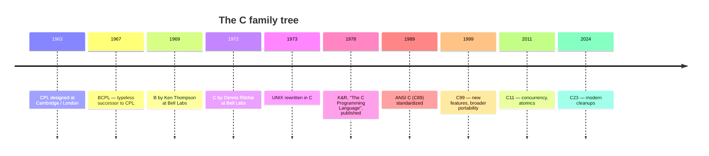
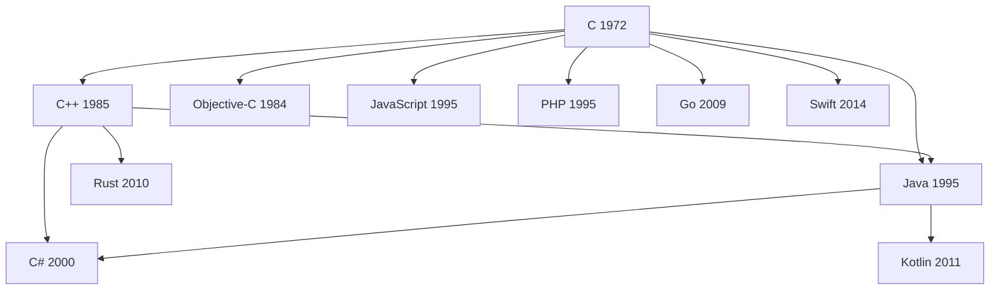

In 1969, in a small office at **Bell Telephone Laboratories** in New
Jersey, a programmer named **Ken Thompson** wanted to play a game.

The game was called *Space Travel*, and the only computer he could
sneak it onto was a discarded **PDP-7**: a refrigerator-sized machine
with about 9 KB of memory. To make the game playable, Ken started
writing a small operating system for the PDP-7 from scratch — with
help from a colleague named **Dennis Ritchie**. They jokingly named it
**UNIX**, a pun on a much bigger, much more troubled OS called
*Multics* that they had been working on.

That side project — half operating system, half playground — went on
to change computing forever.

<Illustration
  prompt={`Decorative flat-vector hero for the birth of C and UNIX. An abstract refrigerator-sized minicomputer block with two reel-to-reel tape circles and a small glowing terminal screen sits beside flowing rounded code brackets and a stylized letter C formed from a single simple arc. Clean, slightly retro research-lab mood. Flat vector, no outlines or strokes, transparent background, legible in both light and dark mode. Palette: blue #148CFF, green #20C621, yellow #FFDD6C, red #FF4F59; sparing neutral grays allowed. Minimal text — a single stylized letter C is acceptable.`}
  ratio="16 / 9"
/>

## Why a new language was needed

The first version of UNIX was written entirely in **assembly
language** for the PDP-7, then rewritten in assembly for a newer
machine called the **PDP-11**. Each time UNIX moved to a new computer,
the entire OS had to be re-translated by hand. This was painful and
fragile.

Ken Thompson tried to write UNIX in an existing high-level language
called **B** (itself derived from **BCPL**), but B had no notion of
data **types** — every value was a single machine word. That made it
hopeless for code that needed to deal with bytes, characters, and
structures of mixed-size data, which is most of what an operating
system does.

So between 1969 and 1973, Dennis Ritchie did something quietly
historic. He took B, added **types** (`int`, `char`, `float`, arrays,
pointers, structs), kept it small, and called the result **C**.

## Why C succeeded where others did not

Several deliberate decisions made C uniquely well suited to its job:

1. **It was small.** The entire language fits on a few dozen pages.
   You can hold all of C in your head. Compare this to the
   thousand-page specifications of modern languages.
2. **It mapped cleanly to hardware.** A C `int` is "a machine word".
   An `if` becomes a compare-and-jump. A function call becomes a
   stack frame. You can almost always *predict* what assembly the
   compiler will produce.
3. **It exposed memory.** Pointers gave programmers a way to talk
   about addresses directly. This is dangerous, but it is also
   *necessary* for writing operating systems, drivers, and runtimes.
4. **It was portable.** Once a C compiler existed for a new CPU, every
   C program — including the UNIX operating system itself — could be
   moved to that CPU. Suddenly UNIX could run on machines from many
   different vendors.

In 1973, Ken Thompson and Dennis Ritchie rewrote the UNIX kernel in
C. This was the first time anyone had written a serious operating
system in a high-level language. Most experts at the time said it
couldn't be done — the result, they predicted, would be too slow and
too bulky. They were wrong.

<Callout type="info" title="The book that taught the world">
In 1978, **Brian Kernighan and Dennis Ritchie** published a slim,
elegant book called *The C Programming Language*, now universally
known as **K&R**. For more than a decade it served as both the
tutorial and the de-facto specification of C. It is still in print and
still worth reading after this course.
</Callout>

## How C took over the world

Because C and UNIX were designed together, the spread of one helped
the spread of the other. Universities got UNIX (often free or for a
nominal license fee) and trained students who then walked into
industry already fluent in C. By the 1980s C was the default language
for systems programming everywhere.

Today, decades later, an astonishing amount of the software you use
every day is written in C — or in something built on top of C:

- **Operating system kernels.** Linux, the BSDs, the core of macOS
  (XNU), and large parts of Windows are written in C.
- **Embedded systems.** Microwaves, cars, pacemakers, satellites, and
  the firmware inside almost every electronic device.
- **Language runtimes.** The reference implementation of Python
  (CPython), the V8 JavaScript engine that powers Chrome and Node.js,
  the Ruby interpreter (MRI), the PHP interpreter — all written in C
  or C++.
- **Databases.** SQLite, PostgreSQL, MySQL, Redis — all C.
- **Compilers.** GCC and large parts of LLVM are written in C/C++.
- **Network infrastructure.** Web servers (nginx, Apache), TCP/IP
  stacks, OpenSSL, curl — all C.

When you load a web page, dozens of C programs collaborate to make
that happen.

<Illustration
  prompt={`Flat-vector illustration of C powering everything beneath modern software. A central simple letter-C arc (or small chip) from which thin solid connector lines radiate to abstract icons arranged in a balanced constellation: an operating-system kernel ring, a database cylinder, a network globe node, a tiny embedded chip, and a browser window. Conveys the idea that C sits underneath it all. Connectors as thin solid filled shapes, no outline strokes. Transparent background, legible in both light and dark mode. Palette: blue #148CFF, green #20C621, yellow #FFDD6C, red #FF4F59. No text.`}
  alt="C at the center of operating systems, databases, networks, embedded devices, and browsers"
  ratio="16 / 9"
/>

## How C influenced everything that came after

Almost every popular language in use today inherits ideas — and
syntax — from C:

The braces `{ }` you see in JavaScript, Java, C#, Go, Rust, and Swift?
Those came from C. The `if (...) { ... } else { ... }` shape? C. The
`for (int i = 0; i < n; i++)` loop? C. The `printf`-style format
strings? C. The way functions take typed parameters and return a
value? C. The `\n` for newline, the `==` for equality, the `&&` for
logical AND — all C.

When you learn C, you are learning the **grammar** that the rest of
the industry has been speaking — sometimes consciously, sometimes
not — for fifty years.

## Why learning C is worth your time

If you only want to ship a website by Friday, you should probably not
learn C first. Use Python, or JavaScript, or whatever your team uses.

But if you want to **understand programming itself**, C is unmatched.
Here is what learning C will give you that most other languages will
not:

- A real mental model of **memory** — what a variable is, where it
  lives, who owns it, when it disappears.
- An understanding of **what the CPU does** when you write a loop, a
  function call, or an `if` statement.
- An appreciation for what your favorite "easy" language is *hiding*
  from you, and at what cost.
- The vocabulary to read systems code: kernels, drivers,
  cryptographic libraries, virtual machines, language runtimes.
- A baseline for picking up other systems languages — C++, Rust, Go,
  Zig — much faster than you otherwise would.

<Callout type="success" title="The big idea">
C is the layer where the cleanly abstracted world of "variables and
functions" meets the messy physical world of "wires and voltages".
Learning C lets you stand on that border and look in both directions.
</Callout>

<Illustration
  prompt={`Decorative flat-vector illustration of standing at the border between two worlds. On one side, a clean abstract realm of floating rounded shapes representing variables and functions; on the other, a physical realm of circuit traces and wire/voltage motifs. A simple seam or slim bridge down the middle joins the two halves. Calm and conceptual. Flat vector, no outlines or strokes, transparent background, legible in both light and dark mode. Palette: blue #148CFF, green #20C621, yellow #FFDD6C, red #FF4F59. No text.`}
  ratio="16 / 9"
/>

## A short word from Dennis Ritchie

> *"C is quirky, flawed, and an enormous success."* — Dennis M. Ritchie

He was right on all three counts. C has rough edges. Some of its
defaults are dangerous. Modern languages fix many of its mistakes.
But the central idea — *a small, portable, low-level language that
treats memory honestly* — has never been seriously displaced. Fifty
years later, we are still building on top of it.

In the next chapter, we'll zoom into the machine itself: what happens
when a program runs. Then, finally, we'll write some code.

<MultipleChoice
  markdown={`Why was C originally created at Bell Labs?

- To replace FORTRAN as the language of scientific computing.
  > FORTRAN was designed for numerical and scientific computation. C was designed to write operating systems — a very different domain, requiring direct memory and hardware control.
- [o] To make it possible to rewrite the UNIX operating system in a portable, high-level language.
  > UNIX was originally written in assembly for the PDP-7 and PDP-11. C was designed to give Thompson and Ritchie a language high-level enough to be productive in, but low-level enough to write an operating system in.
- To teach programming in universities.
  > C was created at Bell Labs for practical systems work, not as a teaching language. Languages like Pascal and, later, Python were designed with pedagogy in mind.
- To compete with Microsoft Windows.
  > Windows wouldn't exist for another decade. C predates the personal computer revolution.

C's first big customer was UNIX itself: rewriting the UNIX kernel in C in 1973 was a turning point in operating-system history.`}
/>

<MultipleChoice
  markdown={`Which of the following is **not** typically written in C (or a direct descendant like C++)?

- The Linux kernel.
  > The Linux kernel is written almost entirely in C, so it is not the exception this question asks for.
- The reference Python interpreter (CPython).
  > CPython, the standard Python implementation, is written in C — that is why it is called *C*Python.
- The SQLite database engine.
  > SQLite is a well-known example of a database engine implemented in C.
- [o] An HTML web page.
  > HTML is a markup language for describing documents, not a programming language. The *browser* that renders HTML, on the other hand, is largely written in C++.

C and C++ dominate the layer of software that other software is built on top of: operating systems, databases, browsers, and language runtimes.`}
/>
