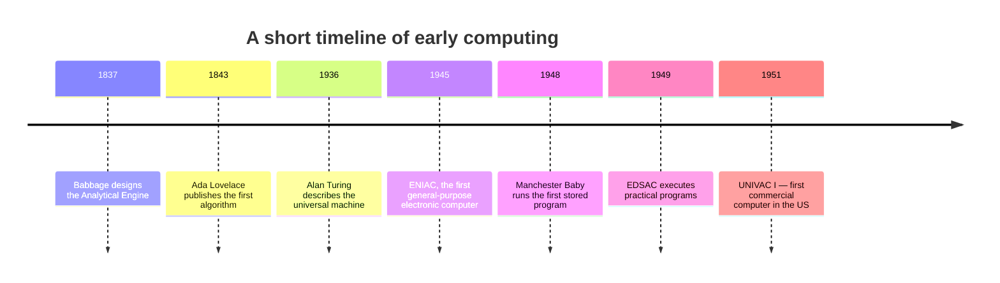
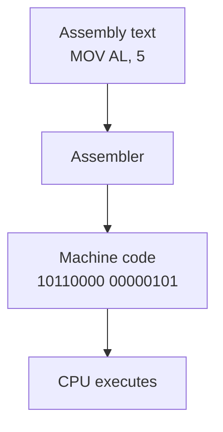

Before we write a single line of code, let's take a step back. A
**computer** is, at heart, a machine that follows instructions very
quickly. To appreciate why C exists — and why programming languages
exist at all — we need to understand the long, surprising road that
brought us here.

## Computing before electricity

For most of human history, "computing" meant moving beads on an abacus
or doing arithmetic on paper. In the 1800s, the English mathematician
**Charles Babbage** designed mechanical machines — the *Difference
Engine* and the *Analytical Engine* — that could in principle perform
calculations automatically by turning gears. His collaborator **Ada
Lovelace** wrote what is widely considered the world's first algorithm
intended for a machine: a procedure to compute Bernoulli numbers on
the Analytical Engine.

The machines were never fully built in their lifetime, but the **idea**
was planted: a single machine, fed a list of instructions, could
perform many different calculations.

## The electronic leap

The 1940s changed everything. Electricity made it possible to build
machines with no moving parts (beyond switches), and switches can
flip thousands or millions of times per second. Machines like
**ENIAC** (1945), **EDSAC** (1949), and the **Manchester Baby** (1948)
were the first electronic, general-purpose computers.



Crucially, these machines stored their programs in the same memory as
their data. This is called the **stored-program** architecture — the
idea that John von Neumann famously wrote down in 1945. Almost every
computer you have ever used follows this design.

<Callout type="info" title="Why does this matter for programmers?">
Because **a program is just data**. The thing you type into an editor
is text. The compiler turns it into a sequence of numbers (machine
instructions) which are loaded into the same memory chips that hold
your variables. Code and data live in the same building, on different
floors.
</Callout>

## Talking to a machine: ones and zeros

Inside a computer, every signal is either **on** or **off** — a 1 or a
0. A group of 8 bits is a **byte**, and bytes are how we measure
memory.

A CPU is a piece of silicon that can do a small set of operations:
add two numbers, compare two numbers, jump to a different instruction,
load a value from memory, store a value into memory. Each operation
is identified by a number — the **opcode** — and is followed by
numbers describing what to operate on (the **operands**).

To program the very first computers, humans wrote programs **directly
in those numbers**. For example, on a hypothetical CPU, the
instruction "add the number in register 1 to the number in register
2" might be the bit pattern `00010001 00000001 00000010`.

A program of any non-trivial size looks like this:

```text
01001000 11000111 11000000 00000001 00000000
00000000 00000000 01001000 11000111 11000111
00000001 00000000 00000000 00000000 00001111
00000101 00000000 ...
```

A human being is supposed to read that, debug that, modify that.
**It is no way to live.**

## Why machine code is unbearable

Imagine writing a 2000-line program in ones and zeros. Now imagine
changing the *third* instruction so that everything after it shifts
in memory — and every jump and address inside the program has to be
recalculated by hand. A single mistyped bit can crash the whole
program in ways that look identical to a hardware fault.

This was the daily reality of the first programmers. They were
brilliant, patient, and frustrated. Inevitably, they invented tools
to help themselves.

## Assembly language: giving the numbers names

The first big improvement was **assembly language**. Instead of
writing `10110000 00000101`, you write:

```text
MOV AL, 5     ; put the value 5 into register AL
ADD AL, 3     ; add 3 to AL
```

The text is much easier to read, but each line still corresponds to
**one machine instruction**. A small program called an *assembler*
mechanically translates the text into the matching bit patterns. The
human reads `MOV AL, 5`; the machine sees `10110000 00000101`. Same
thing, different presentation.



Assembly was a huge step up — but it is still tied to a specific CPU.
Assembly for an Intel chip will not run on an ARM chip. And you still
have to think in tiny, one-instruction-at-a-time steps. There is no
"if statement". There is no "function". You have to *build* those
ideas yourself out of jumps and labels.

## The dream of a high-level language

In the 1950s, people started asking a radical question: *what if we
wrote programs in something that looked more like math or English, and
let another program translate it into machine code for us?*

That "another program" is called a **compiler**.

The first widely used high-level language was **FORTRAN** (1957),
designed for scientific computing. **COBOL** (1959) targeted business
applications. **Lisp** (1958) explored symbolic computation. **ALGOL**
(1958/1960) introduced ideas — block structure, recursion, lexical
scope — that almost every later language borrowed.

A FORTRAN programmer could write:

```text
DO 10 I = 1, 100
   SUM = SUM + I
10 CONTINUE
```

…instead of dozens of assembly instructions. The same source code
could be **compiled for different CPUs**. Suddenly a program was no
longer locked to one machine.

<Callout type="info" title="What 'high-level' means">
"High-level" doesn't mean "advanced" or "fancy". It means **far from
the hardware**. A high-level language hides registers, addresses, and
opcodes behind friendlier ideas like variables, expressions, loops,
and functions.
</Callout>

## Why we still needed something better

Early high-level languages had limits. FORTRAN was great for crunching
numbers but awkward for almost anything else. COBOL was verbose. Lisp
was powerful but unfamiliar. None of them were suited to writing the
**software that runs the computer itself** — the operating system,
the compilers, the editors, the device drivers.

For decades, the answer to "what should I write a fast, low-level
program in?" was *assembly*. That kept operating-system development
slow, painful, and machine-specific. Porting an OS from one CPU to
another meant rewriting most of it.

By the late 1960s, the world was ready for a new kind of language:

- High-level enough to be **readable** and **portable**.
- Low-level enough to control memory and hardware **directly**.
- Small enough that one programmer could fit the whole language in
  their head.

That language was about to be invented at a small research lab in New
Jersey, by people trying to do something else entirely. We'll meet
them in the next chapter.

<MultipleChoice
  markdown={`What was the main problem with writing programs directly in machine code (binary)?

- It was too slow for the CPU to execute.
  > Machine code is literally what the CPU executes — speed of execution is not the issue. The issue is for humans, not the machine.
- It used too much electricity.
- [o] It was extremely difficult for humans to read, write, and debug.
  > The machine doesn't care, but human beings can barely look at long sequences of 1s and 0s without making mistakes. This is why assembly language was invented.
- It only worked on machines built after 1960.

Machine code is the native language of the CPU, so it always runs at full speed. The pain is on the human side: writing and maintaining anything non-trivial in raw bits is essentially impossible.`}
/>

<MultipleChoice
  markdown={`Which statement best describes the relationship between assembly language and machine code?

- Assembly is faster than machine code at runtime.
  > They are the same thing at runtime — assembly is just a text representation of machine code.
- Assembly runs on any CPU regardless of architecture.
  > Assembly is tied to a specific CPU architecture, just like machine code.
- [o] Each line of assembly typically corresponds to a single machine instruction; an assembler translates between them.
  > Assembly is essentially a human-readable spelling of machine code, with mnemonics like \`MOV\` and \`ADD\` instead of raw bit patterns.
- Assembly is a high-level language similar to FORTRAN.

Assembly languages give us names for opcodes and registers, but they do not abstract away the machine. A compiler for a high-level language, on the other hand, can generate machine code for many different CPU architectures from the same source.`}
/>
