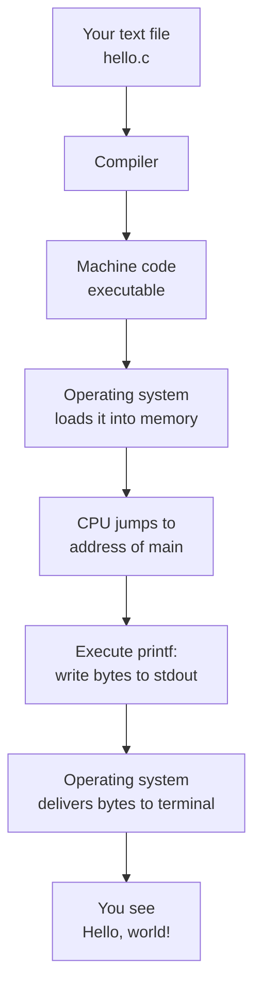

It is time. We have talked about hardware, history, and thinking.
Now let's write code.

The traditional first program in any language is one that prints the
words *"Hello, world!"*. This tradition started in **1974**, in an
internal memo by Brian Kernighan at Bell Labs, and it has remained
unbroken ever since.

## Hello, world

Here is the entire program. Click **Run**.

<CodeBlock
  adapter="c"
  initialCode={`#include <stdio.h>

int main(void) {
    printf("Hello, world!\\n");
    return 0;
}
`}
/>

You should see `Hello, world!` in the output panel. Eight words of
code; a complete, real C program.

Now **change the message** to your own name and run it again. Then
add a second `printf` line below the first to print a second message.
The compiler does not care what you put in the string, as long as the
quotes match.

## Reading the program line by line

Let's dissect it. Every character is there for a reason.

### `#include <stdio.h>`

Lines starting with `#` are not C statements; they are
**preprocessor** directives. They run before the real compilation
step. `#include <stdio.h>` means:

> "Paste the contents of the standard header file `stdio.h` here."

`stdio.h` (short for *standard input/output header*) is part of the
**C standard library**. It tells the compiler what `printf` is — its
type, the kinds of arguments it accepts, and so on. Without this
line, the compiler would not know what `printf` means.

### `int main(void) { ... }`

Every C program needs an entry point, and that entry point is a
function named `main`. The operating system, after loading your
program into memory, jumps to `main` and starts executing.

Let's break the signature apart:

- `int` — the return type. `main` returns an integer. By convention,
  `0` means "success" and any non-zero value means "something went
  wrong".
- `main` — the special name the C runtime looks for.
- `(void)` — the parameter list. `void` is an explicit way to say
  "this function takes no arguments". (You may sometimes see
  `int main(int argc, char *argv[])` instead — that version of `main`
  accepts command-line arguments, which we'll meet later.)
- `{ ... }` — the **function body**, a block of code that runs when
  `main` is called.

### `printf("Hello, world!\n");`

`printf` is a function from the standard library. It prints formatted
output. Here we're passing it a single argument — the string
`"Hello, world!\n"`.

The `\n` at the end is an **escape sequence**. It represents a single
character: a newline. Without it, the next thing printed would appear
on the same line.

The semicolon `;` at the end is mandatory. C uses semicolons to mark
the end of a statement. Forgetting one is the #1 source of "what did
I do wrong?" for beginners. It's also the first thing the compiler
will yell at you about.

### `return 0;`

This returns the value `0` from `main`, telling the operating system
the program finished successfully. Reach the closing `}` without an
explicit `return` and (since C99) `main` returns `0` automatically,
but explicit is better than implicit.

## What just happened, in pictures



In our browser sandbox, every step still happens — the compiler is
just bundled into the same web page you are reading, and the
"terminal" is a panel to the right of the editor.

## Two small experiments

The fastest way to learn syntax is to break it on purpose. Try each
of these in turn in the code block above; run; observe what the
compiler or runtime tells you; then fix it.

### Experiment 1 — remove the semicolon

```c
printf("Hello, world!\n")
```

You'll see an error like `expected ';' before 'return'`. The compiler
keeps reading until it sees something that *cannot* follow what came
before. That mismatch is what produces the error.

### Experiment 2 — remove the `\n`

```c
printf("Hello, world!");
```

Run it. The text still prints, but there's no newline at the end. In
the browser sandbox this is mostly cosmetic; in a real terminal, the
shell prompt would appear on the same line as your output. Subtle
bugs like this are why we use `\n`.

### Experiment 3 — print two things

```c
printf("Hello, ");
printf("world!\n");
```

Same output as before. Multiple `printf` calls just keep adding to
the same line until you print a `\n`.

## A slightly larger first program

Let's print a few numbers as well. Two new ideas appear:

1. The `%d` placeholder in a `printf` format string, replaced by the
   value of an integer argument.
2. A variable declaration: `int year = 1972;`.

<CodeBlock
  adapter="c"
  initialCode={`#include <stdio.h>

int main(void) {
    int year = 1972;
    printf("C was created around %d.\\n", year);
    printf("That makes it about %d years old in 2025.\\n", 2025 - year);
    return 0;
}
`}
/>

The `printf` function fills `%d` with the next integer argument in
order. The second call also shows that the argument can be a whole
**expression** like `2025 - year`, evaluated before printing.

## Comments

C ignores anything between `/* */` and anything from `//` to the end
of the line. Use comments to explain *why*, not *what*.

<CodeBlock
  adapter="c"
  initialCode={`#include <stdio.h>

int main(void) {
    // print a friendly greeting
    printf("Hi there!\\n");

    /*
     * Multi-line comments are useful for longer explanations
     * or temporarily disabling a chunk of code.
     */
    printf("Welcome to C.\\n");
    return 0;
}
`}
/>

## Your first challenge

<ChallengeCard
  adapter="c"
  title="Print your favorite number"
  instructions={`Print the line \`My favorite number is 7\` (exactly that text). The number must come from a variable, not be hard-coded into the format string.`}
  initialCode={`#include <stdio.h>

int main(void) {
    int favorite = 0;
    // change the value and use printf
    return 0;
}
`}
  solutionCode={`#include <stdio.h>

int main(void) {
    int favorite = 7;
    printf("My favorite number is %d\\n", favorite);
    return 0;
}
`}
  tests={[
    {
      id: "exact",
      name: "Prints the exact line",
      description: "stdout equals `My favorite number is 7`",
      expect: { stdoutEquals: "My favorite number is 7" },
    },
  ]}
/>

<MultipleChoice
  markdown={`What is the purpose of the line \`#include <stdio.h>\` at the top of a C program?

- It runs first when the program starts.
- It tells the operating system to use the standard input format.
- [o] It instructs the preprocessor to insert the declarations from \`stdio.h\` so the compiler knows about functions like \`printf\`.
  > Correct! \`#include\` is a textual paste handled before compilation. Without it, the compiler doesn't know what \`printf\` looks like.
- It compiles \`stdio.h\` into a separate executable.

The preprocessor literally copies the contents of \`stdio.h\` into your translation unit before the compiler ever looks at your code.`}
/>

<MultipleChoice
  markdown={`Which character ends every C statement?

- A period \`.\`
- A newline character
- [o] A semicolon \`;\`
  > Correct! C is *not* a whitespace-sensitive language; you can spread a statement across multiple lines or put many statements on one line, as long as each statement ends with a semicolon.
- The closing brace \`}\`

Forgetting semicolons is by far the most common syntax error for newcomers to C. Read your compiler's error messages carefully — they almost always point to the right line (or the line just after the missing semicolon).`}
/>
