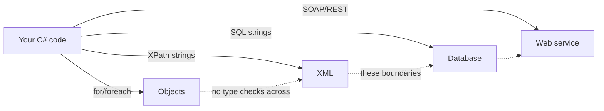
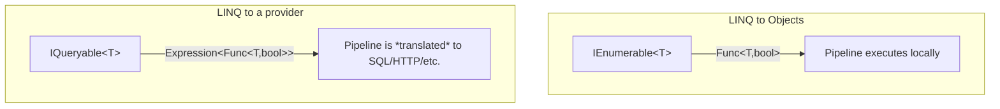

By the early 2000s, .NET developers were querying data in three or
four mutually incompatible ways. In the same application you might
loop over a `List<Customer>`, write an XPath expression to dig into
an XML config file, build a SQL string by hand for the database, and
call a SOAP web service that returned yet another shape. Each one had
its own syntax, its own errors, its own debugging story, and zero
overlap with the others.

LINQ — **L**anguage **In**tegrated **Q**uery — was the audacious
attempt to make a single query syntax that worked over **all of
them**, with the type checker on your side.

## The state of querying in 2005

Each arrow was a different language stitched into C#. None of them
could see the others. A typo inside a SQL string failed at runtime,
in production, sometimes hours after deployment.

The Microsoft Research team — led by Anders Hejlsberg, Erik Meijer,
and others — asked a deceptively simple question: *"What if `where`
and `select` were part of the C# language, and worked the same way
regardless of what they were querying?"*

## The features that had to ship first

LINQ could not exist in C# 2.0. Several language features had to land
together in C# 3.0 to make it possible. Each one is interesting on
its own.

| Feature | What it gave us | Without it… |
| --- | --- | --- |
| **Generics** (C# 2.0) | `IEnumerable<T>` instead of `IEnumerable` of `object` | Every query would be untyped |
| **Lambda expressions** | `n => n * 2` instead of named delegate methods | Inline predicates would be unbearable |
| **Extension methods** | `numbers.Where(...)` without modifying `IEnumerable<T>` | We'd need a `LinqHelper.Where(numbers, ...)` style |
| **Anonymous types** | `new { Name, Age }` mid-pipeline | Each projection would need a named class |
| **Expression trees** | `Expression<Func<T,bool>>` for translating to SQL | LINQ to SQL/EF would be impossible |
| **Query syntax** | `from x in xs where ... select ...` | Method-chain syntax only |
| **Type inference (`var`)** | Hide the long types pipelines produce | Variable declarations would be painful |

Each row above is a feature that lots of C# developers use today
without realizing it shipped *together* in 2007 specifically to make
LINQ feel like a built-in part of the language.

## The "unified query" idea

The big claim of LINQ was that the same query syntax should work
over *anything that produces a sequence of values*. Watch the same
shape of query target four different data sources.

<CodeBlock
  adapter="csharp"
  starterCode={`using System;
using System.Linq;
using System.Collections.Generic;
using System.Xml.Linq;

// 1. LINQ to Objects — over an in-memory collection.
var nums = new[] { 1, 2, 3, 4, 5 };
var doubled = nums.Where(n => n % 2 == 1).Select(n => n * 2);
Console.WriteLine("Objects: " + string.Join(", ", doubled));

// 2. LINQ to XML — same operators, over XML elements.
var xml = XElement.Parse(@"
  <people>
    

    

    

  </people>");

var youngNames = xml.Elements("p")
    .Where(e => (int)e.Attribute("age") < 35)
    .Select(e => (string)e.Attribute("name"));

Console.WriteLine("XML:     " + string.Join(", ", youngNames));

// 3. LINQ to Objects with grouping (a tiny taste of the rest of the course).
var ages = new[] { 36, 41, 29, 52, 33, 27 };
var bucketed = ages.GroupBy(a => a / 10 * 10)
                   .OrderBy(g => g.Key)
                   .Select(g => $"{g.Key}s: {g.Count()}");

Console.WriteLine("Group:   " + string.Join(" | ", bucketed));
`}
/>

Three different data sources. **The same operators.** That is the
LINQ idea in one screenshot.

In real applications you'd see two more:

- **LINQ to SQL / Entity Framework** — the same operators, translated
  into a `SELECT` statement and shipped to the database. The
  filtering happens on the database server, not in your process.
- **LINQ to Provider X** — `IQueryable` providers exist for MongoDB,
  Elasticsearch, in-memory event streams, you name it.

We will not spend time on EF specifically in this course (it's a big
topic of its own), but the *same mental model* — pipelines of
operators that describe a result — covers them all.

## The two faces of LINQ

There are two kinds of LINQ, and the difference matters.

- **LINQ to Objects** runs on `IEnumerable<T>`. Lambdas are
  `Func<T, ...>` — compiled to ordinary methods. The pipeline
  executes in your process, in CLR memory.
- **LINQ to Providers** (EF Core, etc.) runs on `IQueryable<T>`.
  Lambdas are `Expression<Func<T, ...>>` — *data structures*
  describing the lambda, which a provider walks and translates into
  another language (SQL, an HTTP query, etc.).

This course is about **LINQ to Objects** and the functional thinking
behind it. Once you have that mental model, `IQueryable` is a small
extra step.

## Why this was a big deal

The cultural shift LINQ produced was bigger than the technical one.
Before LINQ, querying was something *special* — a separate language
you bolted onto your "real" code. After LINQ:

- You could refactor a query the same way you refactor any other
  C# method.
- Types flowed end-to-end. If you renamed `Person.City` to
  `Person.Town`, the compiler caught every query that referenced it.
- The same person who wrote the domain model wrote the queries,
  using the same tools.
- Other languages followed: Scala, Kotlin, Java Streams, JavaScript
  array methods, Rust iterators, Swift sequence operations — all
  borrow heavily from LINQ's design.

## Why this matters for *this* course

The rest of the course is going to treat LINQ less as a feature and
more as **a way of thinking**. The historical note matters because
the design choices LINQ made (lazy by default, generic over any
sequence, composable through method chaining) are exactly the choices
that make functional collection processing work in *any* language.

If you internalize them in C#, you will recognize the same patterns
the next time you read a Kotlin `Sequence`, a Java `Stream`, or a
Rust `Iterator` pipeline.

<MultipleChoice
  markdown={`Which language feature, introduced in C# 3.0 alongside LINQ, allows methods like \`Where\` and \`Select\` to *appear* to be members of \`IEnumerable<T>\` without actually modifying that interface?

- Generics
  > Generics shipped in C# 2.0 and let \`IEnumerable<T>\` exist, but they don't add \`Where\` to it as a callable method.
- Anonymous types
  > Anonymous types let you build ad-hoc shapes mid-pipeline, but they have nothing to do with how \`Where\` attaches to \`IEnumerable<T>\`.
- [o] Extension methods
  > Extension methods let \`Enumerable.Where(this IEnumerable<T> source, …)\` be invoked as if \`Where\` were a member of \`IEnumerable<T>\`, even though the interface itself is untouched.
- Expression trees
  > Expression trees are what let LINQ to Providers translate lambdas into SQL — they are not how \`Where\` is attached to a collection.

Extension methods are the trick. \`Enumerable.Where\` is a static method
on the \`Enumerable\` class; the \`this\` modifier on its first parameter
makes the compiler accept \`numbers.Where(...)\` as if \`IEnumerable<T>\`
had grown a new method.`}
/>
