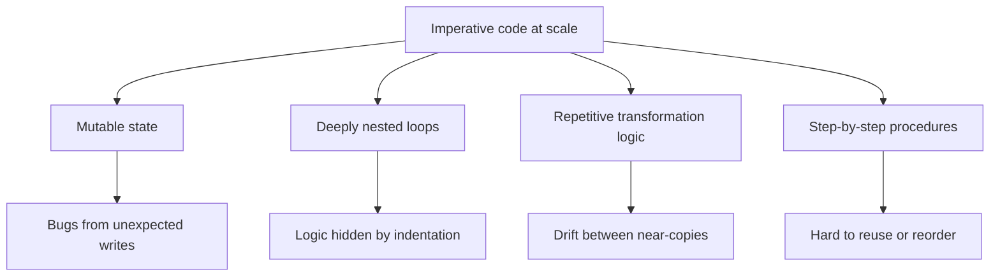
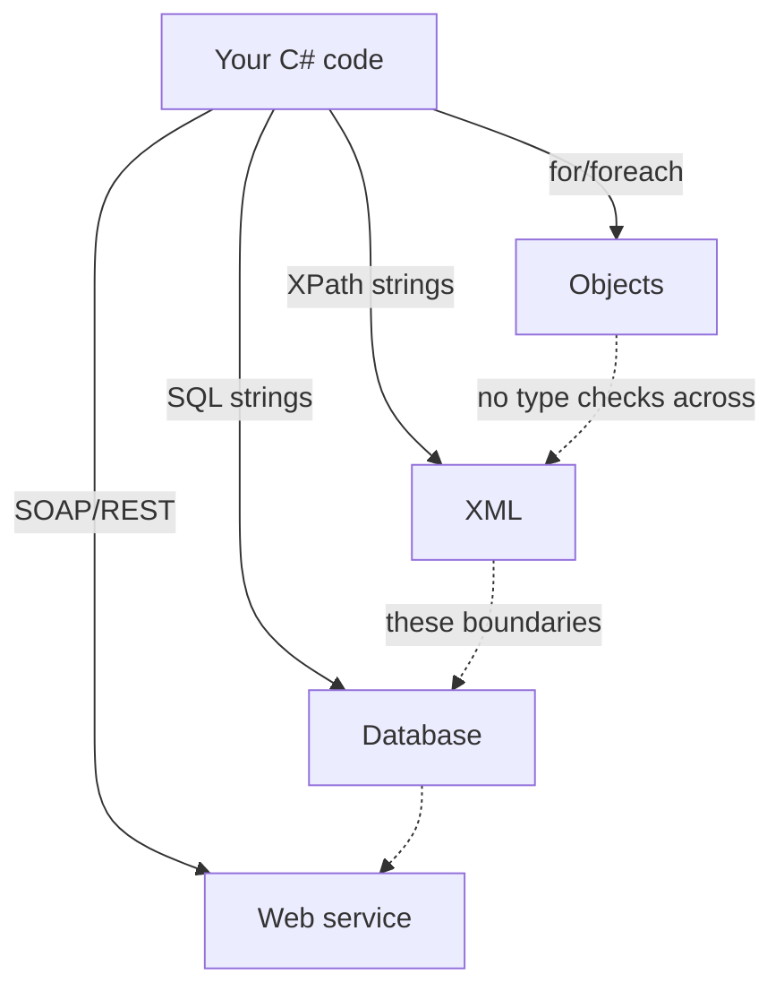
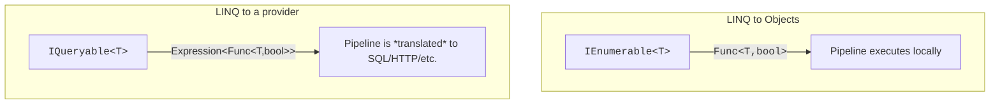

Before we touch LINQ, we have to understand the *problem* LINQ
solves. LINQ did not appear because Microsoft thought it would be
elegant. It appeared because real codebases — millions of lines of
object-oriented C# and C++ and Java — were drowning in a very
specific style of bug that had nothing to do with algorithms. The
bugs lived in the *shape* of the code itself.

That style of code has a name: **imperative**.

<svg
  viewBox="0 0 640 210"
  role="img"
  aria-label="A tangle of overlapping translucent loops with a dot lost inside, an arrow, and then the same journey as one straight line of evenly spaced dots"
  style={{ display: "block", width: "100%", maxWidth: "640px", height: "auto", margin: "2.5rem auto" }}
>
  <g style={{ color: "var(--ds-red-500)" }} fill="currentColor">
    <circle cx="120" cy="90" r="40" fillOpacity="0.18" />
    <circle cx="160" cy="120" r="34" fillOpacity="0.18" />
    <circle cx="110" cy="140" r="30" fillOpacity="0.18" />
    <circle cx="170" cy="70" r="26" fillOpacity="0.18" />
    <circle cx="140" cy="108" r="8" />
  </g>
  <g style={{ color: "var(--ds-yellow-500)" }} fill="currentColor">
    <circle cx="135" cy="130" r="24" fillOpacity="0.15" />
    <circle cx="175" cy="100" r="30" fillOpacity="0.12" />
  </g>
  <polygon points="260,95 260,125 290,110" fill="currentColor" opacity="0.25" />
  <g style={{ color: "var(--ds-green-500)" }} fill="currentColor">
    <circle cx="340" cy="110" r="6" />
    <circle cx="380" cy="110" r="6" />
    <circle cx="420" cy="110" r="6" />
    <circle cx="460" cy="110" r="6" />
    <circle cx="500" cy="110" r="6" />
    <circle cx="540" cy="110" r="6" />
  </g>
  <g style={{ color: "var(--ds-blue-500)" }} fill="currentColor">
    <circle cx="580" cy="110" r="12" />
  </g>
</svg>

## The shape of the problem

In an **imperative** program, you describe a computation as a
*sequence of statements that change state*. You declare variables,
you mutate them, you branch, you loop, you mutate some more, and
eventually a variable somewhere contains the answer.

Here is a tiny imperative task: *"Find the average age of people who
live in Berlin."*

<CodeBlock
  adapter="csharp"
  files={[
    {
      filename: "main.cs",
      starterCode: `using System;
using System.Collections.Generic;

var people = new List<Person> {
    new("Ada", "London", 36),   new("Bilal", "Berlin", 41),  new("Chiara", "Berlin", 29),
    new("Dmitri", "Paris", 52), new("Esther", "Berlin", 33),
};

int total = 0;
int count = 0;
foreach (var p in people)
{
    if (p.City == "Berlin")
    {
        total += p.Age;
        count += 1;
    }
}

double avg = count == 0 ? 0.0 : (double)total / count;
Console.WriteLine($"Average Berlin age: {avg:F1}");

record Person(string Name, string City, int Age);
`,
    },
  ]}
/>

Look at how much *bookkeeping* there is. The interesting idea is
"average age of Berliners", but two thirds of the code is about
manually maintaining `total`, `count`, dividing while avoiding a
divide-by-zero, and walking the list one element at a time. The
intent is buried.

At twenty lines, that's an annoyance. At scale it becomes four
compounding kinds of pain:



**Mutable state**: a variable that can change at any time, from any
place, is a variable nobody fully understands — the value of `total`
on line 130 depends on every prior line that touched it.
**Nesting**: as transformations grow, imperative code grows
*inward* — a filter-and-group becomes a `for` inside an `if` inside a
`foreach` inside a `try`. **Repetition**: the same
filter/project/aggregate loop shape gets copy-pasted with small
variations, and a year later a bug fix lands in three of the five
copies. **Non-composable procedures**: `ComputeReportA()` does seven
things in a fixed order, and `ComputeReportB()` — which needs steps
2, 4, and 6 — can only copy-paste or grow ten boolean parameters.

None of these costs show up in a textbook 20-line example. They all
show up by the time the codebase is 200,000 lines.

## How bad it gets, in one example

Consider a slightly bigger task: *"For each city, compute the average
age of residents, but only for cities with at least two residents,
sorted by average age descending."* One English sentence. Here is the
imperative version:

<CodeBlock
  adapter="csharp"
  files={[
    {
      filename: "main.cs",
      starterCode: `using System;
using System.Collections.Generic;

var people = new List<Person> {
    new("Ada", "London", 36),    new("Bilal", "Berlin", 41), new("Chiara", "Berlin", 29), new("Dmitri", "Paris", 52),
    new("Esther", "Berlin", 33), new("Farah", "London", 27), new("Gus", "Paris", 60),
};

// Step 1: group by city manually.
var byCity = new Dictionary<string, List<Person>>();
foreach (var p in people)
{
    if (!byCity.ContainsKey(p.City))
        byCity[p.City] = new List<Person>();
    byCity[p.City].Add(p);
}

// Step 2: compute averages.
var averages = new List<(string City, double Avg, int Count)>();
foreach (var kv in byCity)
{
    int sum = 0;
    foreach (var p in kv.Value)
        sum += p.Age;
    averages.Add((kv.Key, (double)sum / kv.Value.Count, kv.Value.Count));
}

// Step 3: filter to cities with >= 2 residents.
var filtered = new List<(string City, double Avg, int Count)>();
foreach (var row in averages)
    if (row.Count >= 2)
        filtered.Add(row);

// Step 4: sort descending by average.
filtered.Sort((a, b) => b.Avg.CompareTo(a.Avg));

foreach (var row in filtered)
    Console.WriteLine($"{row.City,-8} avg={row.Avg:F1} (n={row.Count})");

record Person(string Name, string City, int Age);
`,
    },
  ]}
/>

Forty lines, and every one of them is a place a bug can live. The
LINQ equivalent — which we'll learn to write properly over the
coming chapters — is *one expression*:

```csharp
var report = people
    .GroupBy(p => p.City)
    .Where(g => g.Count() >= 2)
    .Select(g => new { City = g.Key, Avg = g.Average(p => p.Age), Count = g.Count() })
    .OrderByDescending(r => r.Avg);
```

You don't have to *understand* that yet — just notice that the LINQ
version is the same length as the English sentence.

## The declarative idea

The style we want has a name: **declarative**. A program is
declarative when it describes **what** result you want, leaving the
**how** to the runtime, library, or compiler. You have already used
declarative systems, possibly without noticing:

- **SQL**: `SELECT city, AVG(age) FROM people GROUP BY city` — you
  do not write the loop that scans the table or the hash map that
  does the grouping. The database does.
- **HTML and CSS**: `<button class="primary">Save</button>` — you do
  not write the pixel-by-pixel rendering routine.

In both cases you describe *the shape of the answer* and the system
figures out the steps. The idea is much older than C# — it runs from
Lisp in 1958 through SQL in the 1970s to Haskell in 1990, a story we
keep for the [Interesting discussions
section](/learn/csharp-linq-functional/why-declarative-won) at the
end of the course.

Watch the shift happen in miniature, in C#. Four ways of saying
*"the even numbers, doubled, as a comma-separated string"* — run it
and check that all four agree:

<CodeBlock
  adapter="csharp"
  files={[
    {
      filename: "main.cs",
      starterCode: `using System;
using System.Collections.Generic;
using System.Text;
using System.Linq;

var nums = new[] { 1, 2, 3, 4, 5, 6 };

// 1. Fully imperative — index loop, manual string building.
var sb = new StringBuilder();
for (int i = 0; i < nums.Length; i++)
{
    if (nums[i] % 2 == 0)
    {
        if (sb.Length > 0)
            sb.Append(", ");
        sb.Append(nums[i] * 2);
    }
}
Console.WriteLine("v1: " + sb.ToString());

// 2. foreach — a slight step up.
var parts = new List<string>();
foreach (var n in nums)
    if (n % 2 == 0)
        parts.Add((n * 2).ToString());
Console.WriteLine("v2: " + string.Join(", ", parts));

// 3. LINQ method syntax — declarative pipeline.
var v3 = string.Join(", ", nums.Where(n => n % 2 == 0).Select(n => n * 2));
Console.WriteLine("v3: " + v3);

// 4. LINQ query syntax — looks like SQL.
var v4 = string.Join(", ",
    from n in nums where n % 2 == 0 select n * 2);
Console.WriteLine("v4: " + v4);
`,
    },
  ]}
/>

All four print `4, 8, 12`. They are **operationally equivalent**.
They are not **cognitively equivalent**. Each version, top to
bottom, moves further from "I am driving a CPU" toward "I am
describing a result" — and because the declarative versions are
built from named, independent steps, you can splice in a `.Skip(1)`
or reorder operators without rewriting anything around them. That
property is called **composability**, and it is the hidden
superpower this whole course is built on.

## The state of querying in 2005

So why did it take until 2007 for this style to land in C#? Because
the mid-2000s .NET developer was querying data in three or four
mutually incompatible ways *at once*. In the same application you
might loop over a `List<Customer>`, write an XPath expression to dig
into an XML config file, build a SQL string by hand for the
database, and call a SOAP service that returned yet another shape.



Each arrow was a different language stitched into C#. None of them
could see the others. A typo inside a SQL string failed at runtime,
in production, sometimes hours after deployment.

<IllustrationPrompt subject="Erik Meijer" photo />

The Microsoft team — with Anders Hejlsberg, C#'s lead architect, and
Erik Meijer among the central figures — asked a deceptively simple
question: *"What if `where` and `select` were part of the C#
language, and worked the same way regardless of what they were
querying?"* The answer shipped in C# 3.0 (2007) as **LINQ** —
**L**anguage **In**tegrated **Q**uery.

## The features that had to ship first

LINQ could not exist in C# 2.0. Several language features had to
land together to make it possible — and each one is now a pillar of
everyday C#:

| Feature | What it gave us | Without it… |
| --- | --- | --- |
| **Generics** (C# 2.0) | `IEnumerable<T>` instead of `IEnumerable` of `object` | Every query would be untyped |
| **Lambda expressions** | `n => n * 2` instead of named delegate methods | Inline predicates would be unbearable |
| **Extension methods** | `numbers.Where(...)` without modifying `IEnumerable<T>` | We'd need a `LinqHelper.Where(numbers, ...)` style |
| **Anonymous types** | `new { Name, Age }` mid-pipeline | Each projection would need a named class |
| **Expression trees** | `Expression<Func<T,bool>>` for translating to SQL | LINQ to SQL/EF would be impossible |
| **Query syntax** | `from x in xs where ... select ...` | Method-chain syntax only |
| **Type inference (`var`)** | Hide the long types pipelines produce | Variable declarations would be painful |

Each row is a feature that many C# developers use daily without
realizing it shipped *together* in 2007 specifically to make LINQ
feel like a built-in part of the language.

## One syntax, many sources

The big claim of LINQ was that the same query syntax should work
over *anything that produces a sequence of values*. Watch the same
shape of query target three different data sources:

<CodeBlock
  adapter="csharp"
  files={[
    {
      filename: "main.cs",
      starterCode: `using System;
using System.Linq;
using System.Collections.Generic;
using System.Xml.Linq;

// 1. LINQ to Objects — over an in-memory collection.
var nums = new[] { 1, 2, 3, 4, 5 };
var doubled = nums.Where(n => n % 2 == 1).Select(n => n * 2);
Console.WriteLine("Objects: " + string.Join(", ", doubled));

// 2. LINQ to XML — same operators, over XML elements.
var xml = XElement.Parse(@"
  <people>
    <p name='Ada' age='36' />
    <p name='Bilal' age='41' />
    <p name='Chiara' age='29' />
  </people>");

var youngNames = xml.Elements("p").Where(e => (int)e.Attribute("age") < 35).Select(e => (string)e.Attribute("name"));

Console.WriteLine("XML:     " + string.Join(", ", youngNames));

// 3. LINQ to Objects with grouping (a tiny taste of the rest of the course).
var ages = new[] { 36, 41, 29, 52, 33, 27 };
var bucketed = ages.GroupBy(a => a / 10 * 10).OrderBy(g => g.Key).Select(g => $"{g.Key}s: {g.Count()}");

Console.WriteLine("Group:   " + string.Join(" | ", bucketed));
`,
    },
  ]}
/>

Different data sources, **the same operators**. In real applications
you'd meet two more: **LINQ to SQL / Entity Framework**, where the
same operators are translated into a `SELECT` statement and executed
on the database server, and providers for MongoDB, Elasticsearch,
and other systems.

That translation trick rests on a distinction worth knowing from day
one. **LINQ to Objects** runs on `IEnumerable<T>`: lambdas compile
to ordinary methods, and the pipeline executes in your process.
**LINQ to providers** runs on `IQueryable<T>`: lambdas become
*expression trees* — data structures describing the lambda — which a
provider walks and translates into another language entirely.



This course is about **LINQ to Objects** and the functional thinking
behind it. Once you have that mental model, `IQueryable` is a small
extra step.

## What LINQ changed — and what it didn't

The cultural shift LINQ produced was bigger than the technical one.
Before LINQ, querying was something *special* — a separate language
bolted onto your "real" code. After LINQ, you could refactor a query
like any other C# method; types flowed end-to-end, so renaming
`Person.City` made the compiler catch every query that referenced
it; and the same person who wrote the domain model wrote the
queries. Other languages took note: Java Streams, Kotlin sequences,
Rust iterators, and JavaScript's array methods all echo LINQ's
design.

LINQ also rode a larger wave. Around the same time, two pressures
pushed the whole industry toward functional ideas: CPUs stopped
getting faster per-core and went multi-core (making shared mutable
state a concurrency hazard), and codebases grew tenfold (making
implicit data flow unmaintainable). Functional programming had spent
forty years answering exactly these problems, and mainstream
languages began absorbing the answers — immutability, pure
functions, higher-order functions, pipelines.

Two misconceptions are worth heading off right now, because they
will come up at work:

- *"Functional programming means no objects."* No. In a modern C#
  codebase you will still have services, interfaces, and classes.
  Functional patterns mostly target the *data-processing layer* —
  the place where most bugs live. The adoption is **additive**, not
  a rewrite.
- *"Declarative is slower."* In modern .NET, LINQ over arrays and
  lists is competitive with hand-written loops in the vast majority
  of code paths; where it isn't, the difference is usually tiny next
  to I/O. We'll look at the real performance model in
  [Deferred Execution](./deferred-execution).

Here is the scorecard this course will keep coming back to:

| Imperative pain point | Functional answer |
| --- | --- |
| Mutable state | Immutable values, returning new ones |
| Deeply nested loops | Flat pipelines of named operators |
| Repetitive transformation logic | Higher-order functions parameterized by behavior |
| Step-by-step procedures | Composed pure functions, each independently usable |

The next page tours the modern C# features — lambdas, records,
`yield`, pattern matching — that make those answers ergonomic.
After that, we build the toolkit from first principles, starting
with pure functions.

<MultipleChoice
  markdown={`Which language feature, introduced in C# 3.0 alongside LINQ, allows methods like \`Where\` and \`Select\` to *appear* to be members of \`IEnumerable<T>\` without actually modifying that interface?

- Generics
  > Generics shipped in C# 2.0 and let \`IEnumerable<T>\` exist, but they don't add \`Where\` to it as a callable method.
- Anonymous types
  > Anonymous types let you build ad-hoc shapes mid-pipeline, but they have nothing to do with how \`Where\` attaches to \`IEnumerable<T>\`.
- [o] Extension methods
  > Extension methods let \`Enumerable.Where(this IEnumerable<T> source, …)\` be invoked as if \`Where\` were a member of \`IEnumerable<T>\`, even though the interface itself is untouched.
- Expression trees
  > Expression trees are what let LINQ to Providers translate lambdas into SQL — they are not how \`Where\` is attached to a collection.

Extension methods are the trick. \`Enumerable.Where\` is a static method
on the \`Enumerable\` class; the \`this\` modifier on its first parameter
makes the compiler accept \`numbers.Where(...)\` as if \`IEnumerable<T>\`
had grown a new method.`}
/>

<MultipleChoice
  markdown={`Which of the following best describes how this course recommends adopting functional patterns in an existing C# codebase?

- Rewrite all classes as static functions and remove inheritance entirely.
  > That is a common caricature of functional programming, but it is not what this course teaches. Modern C# functional style is additive, not a rewrite.
- Use functional patterns only in greenfield F# projects.
  > Functional patterns belong in normal C# code, in normal OO codebases. This course is specifically about applying them in C#.
- [o] Apply functional patterns — immutability, pure functions, pipelines — primarily to the data-processing layers, while keeping the rest of the OO design.
  > The functional renaissance was additive: functional ideas mostly attack the place most bugs live (data transformation and state mutation), and coexist with OO services, interfaces, and classes.
- Avoid LINQ in production code because it is slower than imperative loops.
  > LINQ to Objects is competitive with hand loops in the vast majority of code paths, and the readability benefit is usually decisive.

Functional patterns in C# are a *layer*, not a *replacement*. The
biggest wins come from applying immutability and pipelines to the
data-processing parts of your system, where imperative bugs are most
expensive.`}
/>
