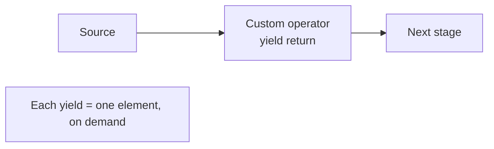
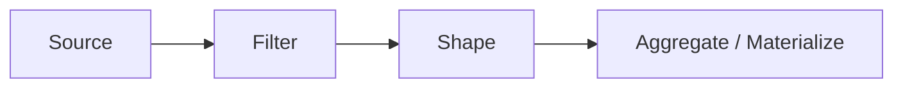

Once you're comfortable with LINQ, a new opportunity appears: you
can stop *copy-pasting* pipelines and start *naming* them. A pipeline
that returns `IEnumerable<T>` is itself a value you can hand around,
combine, and extend.

This page is about turning ad-hoc chains into a small, reusable
vocabulary tailored to your domain.

## The "every pipeline is a value" insight

Because LINQ operators return `IEnumerable<T>`, any chain of
operators is just a method that returns `IEnumerable<T>`.

```csharp
IEnumerable<Order> Active(IEnumerable<Order> orders) =>
    orders.Where(o => o.Status == "active");

IEnumerable<Order> Recent(IEnumerable<Order> orders, DateTime since) =>
    orders.Where(o => o.PlacedAt >= since);

IEnumerable<Order> HighValue(IEnumerable<Order> orders) =>
    orders.Where(o => o.Total > 1000);
```

You can now write the *intent* directly:

```csharp
var recentActiveHighValue = HighValue(Recent(Active(orders), DateTime.UtcNow.AddDays(-30)));
```

That's already clearer than a 4-line `.Where(...).Where(...).Where(...)`,
but we can do better.

## Extension methods: pipelines that *look* native

Extensions let your custom pipelines chain like built-in LINQ.

<CodeBlock
  adapter="csharp"
  initialCode={`using System;
using System.Collections.Generic;
using System.Linq;

public record Order(string Status, DateTime PlacedAt, decimal Total);

public static class OrderQueries
{
    public static IEnumerable<Order> Active(this IEnumerable<Order> source) =>
        source.Where(o => o.Status == "active");

    public static IEnumerable<Order> Recent(this IEnumerable<Order> source, DateTime since) =>
        source.Where(o => o.PlacedAt >= since);

    public static IEnumerable<Order> HighValue(this IEnumerable<Order> source, decimal min = 1000m) =>
        source.Where(o => o.Total > min);
}

var orders = new[]
{
    new Order("active",   DateTime.UtcNow.AddDays(-10), 1500m),
    new Order("active",   DateTime.UtcNow.AddDays(-40),  500m),
    new Order("inactive", DateTime.UtcNow.AddDays(-2),  9000m),
    new Order("active",   DateTime.UtcNow.AddDays(-5),  2400m),
};

var report = orders
    .Active()
    .Recent(DateTime.UtcNow.AddDays(-30))
    .HighValue()
    .Sum(o => o.Total);

Console.WriteLine($"Recent active high-value revenue: {report}");
`}
/>

The pipeline now *reads as English*: "active orders, recent, high
value, sum total." This is the heart of declarative code.

## Building custom operators with `yield`

You're not limited to combining existing operators. `yield return`
lets you implement entirely new ones, and they remain lazy.



A classic example: an operator that pairs each element with the
previous one.

<CodeBlock
  adapter="csharp"
  initialCode={`using System;
using System.Collections.Generic;
using System.Linq;

public static class Operators
{
    public static IEnumerable<(T prev, T curr)> Pairwise<T>(this IEnumerable<T> source)
    {
        using var e = source.GetEnumerator();
        if (!e.MoveNext()) yield break;
        var prev = e.Current;
        while (e.MoveNext())
        {
            yield return (prev, e.Current);
            prev = e.Current;
        }
    }
}

var prices = new[] { 100.0, 102.5, 101.0, 105.0, 110.0 };

var changes = prices
    .Pairwise()
    .Select(p => p.curr - p.prev);

foreach (var d in changes) Console.WriteLine($"change: {d:+0.0;-0.0}");
`}
/>

Notice the operator integrated *seamlessly* into the chain. Because
it uses `yield return`, it stays lazy: a million-element source
costs no extra memory.

## Anatomy of a composable pipeline

A well-composed pipeline tends to have four phases:



| Phase | Typical operators | Purpose |
| --- | --- | --- |
| Source | array, list, file lines, query | Where data comes from |
| Filter | `Where`, custom predicates | Discard what doesn't matter |
| Shape | `Select`, `SelectMany`, `OrderBy`, `GroupBy` | Reshape into the form the consumer wants |
| Aggregate | `Sum`, `Count`, `Aggregate`, `ToList` | Collapse into a single value or fixed collection |

Custom extension methods usually slot into the filter or shape
phases. Aggregations are usually one-line and don't need wrapping.

## Composing with higher-order helpers

You can also compose at the **lambda** level — building predicates
and selectors from smaller pieces.

<CodeBlock
  adapter="csharp"
  initialCode={`using System;
using System.Linq;

Func<int, bool> Positive = n => n > 0;
Func<int, bool> Even     = n => n % 2 == 0;

Func<Func<int, bool>, Func<int, bool>, Func<int, bool>> And =
    (p, q) => n => p(n) && q(n);

var nums = Enumerable.Range(-5, 11);   // -5..5
var matches = nums.Where(And(Positive, Even));
Console.WriteLine(string.Join(",", matches));   // 2,4
`}
/>

The same trick scales to selector composition (`Func<A, B>` plus
`Func<B, C>` = `Func<A, C>`), giving you a tiny algebra of functions
to combine before they ever touch LINQ.

## Practice: assemble a vocabulary

<ChallengeCard
  adapter="csharp"
  entryFilename="Program.cs"
  files={[
    {
      filename: "Program.cs",
      initialContent: `using System;
using System.Linq;

var events = new[]
{
    new LogEvent("INFO",  "boot",        DateTime.UtcNow.AddMinutes(-50)),
    new LogEvent("WARN",  "slow query",  DateTime.UtcNow.AddMinutes(-30)),
    new LogEvent("ERROR", "timeout",     DateTime.UtcNow.AddMinutes(-20)),
    new LogEvent("ERROR", "disk full",   DateTime.UtcNow.AddMinutes(-5)),
    new LogEvent("INFO",  "request 200", DateTime.UtcNow.AddMinutes(-3)),
};

// Compose: keep last-15-min ERROR events, take the messages, join them.
var headline = events
    .Recent(TimeSpan.FromMinutes(15))
    .OfLevel("ERROR")
    .Messages()
    .Join(", ");

Console.WriteLine($"Recent errors: {headline}");

public record LogEvent(string Level, string Message, DateTime At);
`,
      solutionContent: `using System;
using System.Linq;

var events = new[]
{
    new LogEvent("INFO",  "boot",        DateTime.UtcNow.AddMinutes(-50)),
    new LogEvent("WARN",  "slow query",  DateTime.UtcNow.AddMinutes(-30)),
    new LogEvent("ERROR", "timeout",     DateTime.UtcNow.AddMinutes(-20)),
    new LogEvent("ERROR", "disk full",   DateTime.UtcNow.AddMinutes(-5)),
    new LogEvent("INFO",  "request 200", DateTime.UtcNow.AddMinutes(-3)),
};

var headline = events
    .Recent(TimeSpan.FromMinutes(15))
    .OfLevel("ERROR")
    .Messages()
    .Join(", ");

Console.WriteLine($"Recent errors: {headline}");

public record LogEvent(string Level, string Message, DateTime At);
`,
    },
    {
      filename: "LogExtensions.cs",
      initialContent: `using System;
using System.Collections.Generic;
using System.Linq;

public static class LogExtensions
{
    // TODO: return events whose At is within the past 'window' from now.
    public static IEnumerable<LogEvent> Recent(this IEnumerable<LogEvent> src, TimeSpan window)
        => throw new NotImplementedException();

    // TODO: return only events whose Level matches.
    public static IEnumerable<LogEvent> OfLevel(this IEnumerable<LogEvent> src, string level)
        => throw new NotImplementedException();

    // TODO: project to the Message strings.
    public static IEnumerable<string> Messages(this IEnumerable<LogEvent> src)
        => throw new NotImplementedException();

    // TODO: join strings with the given separator.
    public static string Join(this IEnumerable<string> src, string sep)
        => throw new NotImplementedException();
}
`,
      solutionContent: `using System;
using System.Collections.Generic;
using System.Linq;

public static class LogExtensions
{
    public static IEnumerable<LogEvent> Recent(this IEnumerable<LogEvent> src, TimeSpan window)
    {
        var cutoff = DateTime.UtcNow - window;
        return src.Where(e => e.At >= cutoff);
    }

    public static IEnumerable<LogEvent> OfLevel(this IEnumerable<LogEvent> src, string level) =>
        src.Where(e => e.Level == level);

    public static IEnumerable<string> Messages(this IEnumerable<LogEvent> src) =>
        src.Select(e => e.Message);

    public static string Join(this IEnumerable<string> src, string sep) =>
        string.Join(sep, src);
}
`,
    },
  ]}
  tests={[
    {
      id: "vocab-pipeline",
      name: "Vocabulary methods compose into a readable pipeline",
      description: "Recent + OfLevel + Messages + Join produce expected line",
      expect: {
        stdoutEquals: "Recent errors: disk full\n",
      },
    },
  ]}
/>

Notice the *shape* of the solution: each method is tiny — typically
one line of LINQ. The power comes from naming the intent, not from
clever code.

## When NOT to wrap a pipeline

Composition is a tool, not an obligation.

- If a chain is used in only one place and is already clear, leave
  it inline.
- If the wrapper name is no shorter or clearer than the LINQ it
  hides, drop it.
- A wrapper that takes 8 parameters is not a wrapper, it's a
  configuration object pretending to be one.

The goal is to grow a *small* vocabulary that matches the domain —
not to abstract for abstraction's sake.

<MultipleChoice
  markdown={`Why is implementing a custom operator with \`yield return\` preferable to one that builds a \`List<T>\` internally?

- The \`yield\` version uses less heap memory because lists are reference types.
  > Both allocate; the real difference is *when* and *how much*. List-based operators allocate the entire list up front.
- The compiler refuses to chain List-returning operators in LINQ.
  > Any \`IEnumerable<T>\`-returning method (including those returning \`List<T>\`) chains fine in LINQ.
- [o] The \`yield\` version preserves laziness — downstream operators like \`Take(5)\` can stop the source early.
  > With \`yield\`, elements flow one at a time and short-circuit operators terminate the source mid-stream. A list-based version forces the entire upstream to materialize before any downstream operator sees an element.
- Lists cannot store generic types.
  > \`List<T>\` is generic by definition. This is simply false.

Lazy custom operators are the secret to composable, scalable pipelines.`}
/>
