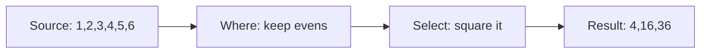
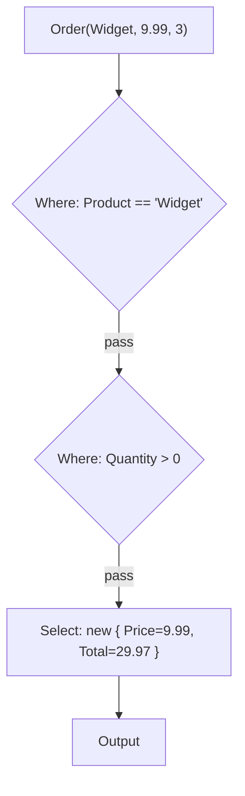

If you only learned two LINQ operators, you'd cover 80% of every
data-processing task you'll ever do:

- **`Where`** — keep the elements that satisfy a predicate.
- **`Select`** — transform each element into something else.

These two are the **filter** and **map** primitives that almost every
functional language has. In modern C#, they're extension methods on
`IEnumerable<T>`. This page walks through them carefully, because
understanding them shapes how you think about everything else.

## Mental model

Picture a sequence as data flowing through a pipe. Each operator is
a stage in the pipe.



`Where` is a sieve: things either pass through or don't. `Select` is
a converter: each thing that comes in becomes something else on the
way out. The shape of the sequence may change (different element
type), but the *order* is preserved.

## `Where` — filtering

`Where` takes a predicate (`Func<T, bool>`) and returns a sequence
containing only the elements for which the predicate is true.

<CodeBlock
  adapter="csharp"
  starterCode={`using System;
using System.Linq;

var nums = new[] { 1, 2, 3, 4, 5, 6, 7, 8, 9, 10 };

var evens = nums.Where(n => n % 2 == 0);
var bigOdds = nums.Where(n => n % 2 == 1 && n > 5);
var negatives = nums.Where(n => n < 0); // empty, not null

Console.WriteLine(string.Join(",", evens));
Console.WriteLine(string.Join(",", bigOdds));
Console.WriteLine($"negatives count = {negatives.Count()}");
`}
/>

Important: an "empty result" is an empty sequence, not `null`. You
can iterate it; you just get zero elements.

There is also a variant of `Where` that gives you the **index** of
each element:

<CodeBlock
  adapter="csharp"
  starterCode={`using System;
using System.Linq;

var names = new[] { "Ada", "Bilal", "Chiara", "Dmitri", "Esther" };

// Keep only items whose index is even (0th, 2nd, 4th).
var everyOther = names.Where((name, index) => index % 2 == 0);

Console.WriteLine(string.Join(", ", everyOther));
`}
/>

The two-argument lambda `(name, index) => ...` opts into the indexed
overload. Useful, but use it sparingly — most code is clearer
without indices.

## `Select` — projecting

`Select` takes a selector (`Func<TSource, TResult>`) and produces a
new sequence with the function applied to each element. This is
sometimes called `map` in other languages.

<CodeBlock
  adapter="csharp"
  starterCode={`using System;
using System.Linq;

var nums = new[] { 1, 2, 3, 4, 5 };
var doubled = nums.Select(n => n * 2);
var labels = nums.Select(n => $"#{n}");

Console.WriteLine(string.Join(",", doubled));
Console.WriteLine(string.Join(",", labels));

// Type may change — int -> string.
Console.WriteLine(labels.GetType().Name);
`}
/>

Note that the result type follows the lambda's return type. Project
ints into strings, strings into lengths, records into anonymous
objects — anything you want.

### Anonymous and tuple projections

A common pattern: project into a small ad-hoc shape mid-pipeline.

<CodeBlock
  adapter="csharp"
  starterCode={`using System;
using System.Linq;

record Person(string Name, int Age, string City);

var people = new[] {
    new Person("Ada", 36, "London"),
    new Person("Bilal", 41, "Berlin"),
    new Person("Chiara", 29, "Berlin"),
};

// Anonymous type — handy for the next stage only.
var summary1 = people.Select(p => new { p.Name, IsAdult = p.Age >= 18 });
foreach (var s in summary1)
    Console.WriteLine($"{s.Name} adult? {s.IsAdult}");

Console.WriteLine();

// Tuple projection — also works.
var summary2 = people.Select(p => (p.Name, Decade: p.Age / 10 * 10));
foreach (var (name, decade) in summary2)
    Console.WriteLine($"{name} → {decade}s");
`}
/>

Use **anonymous types** when the shape is consumed inside the same
expression. Use **records** when the shape is returned across a
method boundary or used in many places.

## Composing `Where` and `Select`

The real power shows up when you compose. Every pipeline you'll ever
write is some combination of *filter, then transform*.

<CodeBlock
  adapter="csharp"
  starterCode={`using System;
using System.Linq;

record Order(string Product, decimal Price, int Quantity);

var orders = new[] {
    new Order("Widget", 9.99m, 3), new Order("Gadget", 14.50m, 1), new Order("Widget", 12.00m, 2),
    new Order("Gizmo", 19.99m, 0), new Order("Widget", 8.50m, 4),
};

// All widget orders with at least one unit, projected to (price, total).
var widgetTotals = orders.Where(o => o.Product == "Widget")
                       .Where(o => o.Quantity > 0)
                       .Select(o => new { o.Price, Total = o.Price * o.Quantity });

foreach (var x in widgetTotals)
    Console.WriteLine($"price={x.Price,6:C}  total={x.Total,6:C}");
`}
/>

Two `Where` clauses chain naturally — they don't have to be combined
into one giant predicate. Each one expresses a *single intent*; the
pipeline as a whole reads top to bottom.

## Step-by-step walkthrough

Let's trace what happens for a single element flowing through the
pipeline above:



For an order with `Product = "Gizmo"`, the first `Where` rejects it
and *neither subsequent operator runs*. This is part of what makes
LINQ pipelines efficient — the work for "dropped" elements is
skipped entirely.

## `Select` is not a loop

A common beginner habit is to write code like:

```csharp
// Don't do this.
people.Select(p => { Console.WriteLine(p.Name); return p; }).ToList();
```

`Select` is for **transforming**, not for *doing*. If you want to
execute a side effect for each element, use a plain `foreach`. The
LINQ ecosystem leans into the idea that operators are pure and
side-effect-free.

<Callout type="warn" title="Don't use Select for side effects">
Using `Select` for side effects can produce surprising results because
LINQ is lazy: nothing happens until the sequence is enumerated. Pair
that with a `Select` whose lambda has side effects, and you'll get
weird "why did it run twice?" bugs.
</Callout>

## A multi-file challenge

<ChallengeCard
  adapter="csharp"
  title="Names of adults, uppercase"
  instructions={`In \`PeopleFilter.cs\`, implement
\`AdultNamesUpper(IEnumerable<Person> people)\` which returns the
uppercased \`Name\` of every person whose \`Age >= 18\`.

Use \`Where\` and \`Select\`. Do not use \`foreach\`.

\`Program.cs\` will call your method and print the result one per line.`}
  entryFilename="Program.cs"
  files={[
    {
      filename: "Program.cs",
      initialContent: `var people = new[]
{
    new Person("Ada", 36),
    new Person("Bilal", 12),
    new Person("Chiara", 17),
    new Person("Dmitri", 22),
    new Person("Esther", 41),
};

foreach (var name in PeopleFilter.AdultNamesUpper(people))
    System.Console.WriteLine(name);

public record Person(string Name, int Age);
`,
    },
    {
      filename: "PeopleFilter.cs",
      initialContent: `using System.Collections.Generic;

public static class PeopleFilter
{
    public static IEnumerable<string> AdultNamesUpper(IEnumerable<Person> people)
    {
        // your code here — use Where and Select
        return new string[0];
    }
}
`,
      solutionContent: `using System.Collections.Generic;
using System.Linq;

public static class PeopleFilter
{
    public static IEnumerable<string> AdultNamesUpper(IEnumerable<Person> people) =>
        people
            .Where(p => p.Age >= 18)
            .Select(p => p.Name.ToUpperInvariant());
}
`,
    },
  ]}
  tests={[
    {
      id: "adults_upper",
      name: "Prints ADA, DMITRI, ESTHER",
      description: "Filters age>=18 and uppercases the names",
      expect: { stdoutEquals: "ADA\nDMITRI\nESTHER" },
    },
  ]}
/>

<MultipleChoice
  markdown={`Given \`var result = nums.Where(n => n > 10).Select(n => n * 2);\`, which statement is correct?

- The pipeline runs immediately and \`result\` is a \`List<int>\`.
  > LINQ operators are deferred — nothing has been enumerated yet. \`result\` is an \`IEnumerable<int>\`, not a list.
- The \`Select\` lambda runs for every element of \`nums\`, regardless of the filter.
  > Pipelined operators only invoke later steps for elements that survive earlier steps; \`Select\` does not run for elements that \`Where\` rejected.
- [o] \`result\` is a deferred \`IEnumerable<int>\` — neither \`Where\` nor \`Select\` runs until something enumerates it (e.g. \`foreach\`, \`ToList\`, \`Sum\`).
  > LINQ is *pull-based*: the lambdas execute only when a consumer asks for elements.
- \`Where\` and \`Select\` can only be used on \`List<T>\` and arrays.
  > They are extension methods on \`IEnumerable<T>\`, which is implemented by virtually every collection in .NET and by hand-written iterators.

LINQ operators describe *what* you want; they don't perform the work
until something downstream actually consumes the sequence. We'll
cover this in detail in the [Deferred Execution](./deferred-execution)
page.`}
/>
