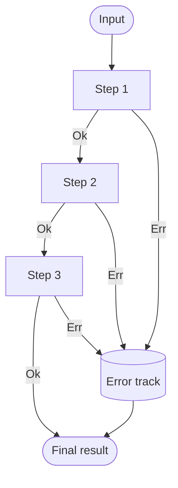
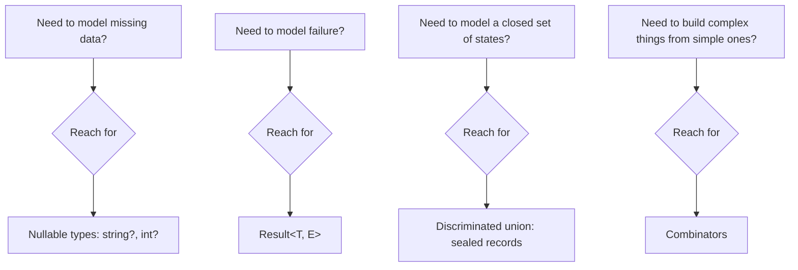

C# is not a "functional-first" language, but every meaningful
functional pattern has a clean translation into modern C#. This page
shows the patterns experienced functional developers reach for most
often, expressed in the idioms a C# reviewer would actually accept.

## Pattern 1: Option / Maybe

A `null` is a *runtime time bomb*: the type system swears the value
is there, the runtime says otherwise. The **Option** type makes the
"might-not-be-there"-ness *part of the type*.

C# has had nullable reference types (`string?`) since C# 8 and
nullable value types (`int?`) since C# 2. Combined with the null
operators, these give you most of what an `Option<T>` provides
elsewhere.

<CodeBlock
  adapter="csharp"
  starterCode={`#nullable enable
using System;
using System.Collections.Generic;
using System.Linq;

public record User(int Id, string Name, string? Email);

public static class Users
{
    private static readonly User[] All =
    {
        new(1, "Ada",  "ada@example.com"),
        new(2, "Bob",  null),
        new(3, "Cara", "cara@example.com"),
    };

    public static User? Find(int id) => All.FirstOrDefault(u => u.Id == id);
}

string Greet(int id) =>
    Users.Find(id)            // User?
        ?.Email               // string?
        ?.ToUpperInvariant()  // string?
        ?? "(no email)";       // string

Console.WriteLine(Greet(1));   // ADA@EXAMPLE.COM
Console.WriteLine(Greet(2));   // (no email)
Console.WriteLine(Greet(99));  // (no email)
`}
/>

The `?.` operator is *exactly* `Option.Map`. The `??` operator is
`Option.GetValueOrDefault`. The compiler will not let you call a
method on a nullable without acknowledging the null case. This is
the functional pattern, in C# clothing.

## Pattern 2: Result / Either

Operations can *fail*. Throwing an exception conflates control flow
with failure handling. A `Result<T, TError>` makes success and
failure *both* first-class.

<CodeBlock
  adapter="csharp"
  starterCode={`using System;

public abstract record Result<T, E>
{
    public sealed record Ok(T Value) : Result<T, E>;
    public sealed record Err(E Error) : Result<T, E>;

    public Result<U, E> Map<U>(Func<T, U> f) => this switch
    {
        Ok ok    => new Result<U, E>.Ok(f(ok.Value)),
        Err err  => new Result<U, E>.Err(err.Error),
        _ => throw new InvalidOperationException()
    };

    public Result<U, E> Bind<U>(Func<T, Result<U, E>> f) => this switch
    {
        Ok ok    => f(ok.Value),
        Err err  => new Result<U, E>.Err(err.Error),
        _ => throw new InvalidOperationException()
    };
}

Result<int, string> Parse(string s) =>
    int.TryParse(s, out var n)
        ? new Result<int, string>.Ok(n)
        : new Result<int, string>.Err($"not a number: '{s}'");

Result<int, string> Half(int n) =>
    n % 2 == 0
        ? new Result<int, string>.Ok(n / 2)
        : new Result<int, string>.Err($"odd: {n}");

void Show(Result<int, string> r) => Console.WriteLine(r switch
{
    Result<int, string>.Ok o  => $"ok: {o.Value}",
    Result<int, string>.Err e => $"err: {e.Error}",
    _ => "?"
});

Show(Parse("10").Bind(Half));    // ok: 5
Show(Parse("7").Bind(Half));     // err: odd: 7
Show(Parse("abc").Bind(Half));   // err: not a number: 'abc'
`}
/>

Notice: the failure cases *never throw*. The chain short-circuits
through `Bind`, carrying the first error along. This is the heart of
**railway-oriented programming**.

## Pattern 3: Railway-oriented programming

A pipeline of operations can succeed or fail at any step. Picture it
as two parallel tracks:

Each step either stays on the *success* track (continues to the next
step) or switches to the *failure* track (carries the original error
straight to the end). `Bind` is the switch operator that performs
this routing.

The benefits are huge:

- No `try/catch` clutter.
- Errors are values you can inspect and combine.
- Function signatures *truthfully advertise* failure.
- Easy to test: just feed an `Err` in and watch it propagate.

## Pattern 4: Currying and partial application

A curried function takes one argument at a time. Partial application
fixes some arguments early and returns a function asking for the
rest.

<CodeBlock
  adapter="csharp"
  starterCode={`using System;
using System.Linq;

// curried: (string sep) => (IEnumerable<string> xs) => string
Func<string, Func<System.Collections.Generic.IEnumerable<string>, string>>
    join = sep => xs => string.Join(sep, xs);

var joinCsv  = join(", ");
var joinPath = join("/");

Console.WriteLine(joinCsv(new[]  { "a", "b", "c" }));   // a, b, c
Console.WriteLine(joinPath(new[] { "usr", "bin", "x" }));  // usr/bin/x
`}
/>

This is the trick behind the *configurable* pipeline helpers in the
previous chapter. Instead of passing a separator to every call, you
build a specialized helper once and reuse it.

## Pattern 5: Pipeline as data — discriminated unions

Modeling *states of the world* with a discriminated union (a sealed
hierarchy of records) replaces brittle bool/enum flags. With C#
pattern matching, branching on them is exhaustive and clear.

<CodeBlock
  adapter="csharp"
  starterCode={`using System;

public abstract record Payment
{
    public sealed record Cash(decimal Amount) : Payment;
    public sealed record Card(decimal Amount, string Last4) : Payment;
    public sealed record Voucher(string Code) : Payment;
}

string Describe(Payment p) => p switch
{
    Payment.Cash c             => $"cash {c.Amount:C}",
    Payment.Card c             => $"card ****{c.Last4} {c.Amount:C}",
    Payment.Voucher v          => $"voucher #{v.Code}",
    _                          => "unknown"
};

Console.WriteLine(Describe(new Payment.Cash(20m)));
Console.WriteLine(Describe(new Payment.Card(150m, "0042")));
Console.WriteLine(Describe(new Payment.Voucher("XMAS24")));
`}
/>

If you add a new payment kind, the compiler can warn you about
non-exhaustive `switch` expressions — a small but lovely *FP-style*
safety net inside a C# program.

## Pattern 6: Combinators

A combinator builds a complex thing from simpler ones. We met one in
the previous page (`And` for predicates). Here's a tiny **validation
combinator** library.

<ChallengeCard
  adapter="csharp"
  entryFilename="Program.cs"
  files={[
    {
      filename: "Program.cs",
      initialContent: `using System;
using System.Linq;

var rule = Validator<string>.All(
    Validator<string>.NonEmpty("name"),
    Validator<string>.MaxLen("name", 10),
    Validator<string>.NoDigits("name")
);

foreach (var name in new[] { "Ada", "", "alongusername", "Ada1" })
{
    var errs = rule(name).ToList();
    Console.WriteLine(errs.Count == 0
        ? $"OK: {name}"
        : $"BAD '{name}': {string.Join("; ", errs)}");
}
`,
      solutionContent: `using System;
using System.Linq;

var rule = Validator<string>.All(
    Validator<string>.NonEmpty("name"),
    Validator<string>.MaxLen("name", 10),
    Validator<string>.NoDigits("name")
);

foreach (var name in new[] { "Ada", "", "alongusername", "Ada1" })
{
    var errs = rule(name).ToList();
    Console.WriteLine(errs.Count == 0
        ? $"OK: {name}"
        : $"BAD '{name}': {string.Join("; ", errs)}");
}
`,
    },
    {
      filename: "Validator.cs",
      initialContent: `using System;
using System.Collections.Generic;
using System.Linq;

public static class Validator<T>
{
    // A validator is a function from a value to a (possibly empty) list of error messages.
    public delegate IEnumerable<string> Rule(T value);

    // TODO: NonEmpty<string>: error "{field} is empty" iff value is null or empty string.
    public static Rule NonEmpty(string field) =>
        throw new NotImplementedException();

    // TODO: MaxLen<string>: error "{field} too long" iff value.Length > max.
    public static Rule MaxLen(string field, int max) =>
        throw new NotImplementedException();

    // TODO: NoDigits<string>: error "{field} contains digits" iff value has any digit char.
    public static Rule NoDigits(string field) =>
        throw new NotImplementedException();

    // TODO: All: combine rules; concatenate all their errors in argument order.
    public static Rule All(params Rule[] rules) =>
        throw new NotImplementedException();
}
`,
      solutionContent: `using System;
using System.Collections.Generic;
using System.Linq;

public static class Validator<T>
{
    public delegate IEnumerable<string> Rule(T value);

    public static Rule NonEmpty(string field) => v =>
        string.IsNullOrEmpty(v as string)
            ? new[] { $"{field} is empty" }
            : Enumerable.Empty<string>();

    public static Rule MaxLen(string field, int max) => v =>
        (v as string)?.Length > max
            ? new[] { $"{field} too long" }
            : Enumerable.Empty<string>();

    public static Rule NoDigits(string field) => v =>
        (v as string)?.Any(char.IsDigit) == true
            ? new[] { $"{field} contains digits" }
            : Enumerable.Empty<string>();

    public static Rule All(params Rule[] rules) => v =>
        rules.SelectMany(r => r(v));
}
`,
    },
  ]}
  tests={[
    {
      id: "validator-combinators",
      name: "Validator combinators accumulate errors in order",
      description: "All combines NonEmpty + MaxLen + NoDigits; errors concatenate",
      expect: {
        stdoutEquals: "OK: Ada\nBAD '': name is empty\nBAD 'alongusername': name too long\nBAD 'Ada1': name contains digits\n",
      },
    },
  ]}
/>

`All` is a combinator — it makes a bigger rule out of smaller rules.
Each individual rule stays focused. The library composes naturally
because every rule has the same type signature.

## Choosing patterns wisely

These patterns are *tools*, not laws. In real C# code:

- Use `string?` and `?.` for everyday "might be missing" cases.
  Don't import an Option library just to wrap two values.
- Use `Result<T, E>` when failure is *expected and frequent* (input
  parsing, validation, external calls). For "this should never
  happen" cases, exceptions are still appropriate.
- Use discriminated unions when you have a *closed* set of states.
- Use combinators when you're writing a small DSL.

When chosen carefully, these patterns make C# code dramatically more
expressive *without* abandoning the strengths of the OO model.

<MultipleChoice
  markdown={`In railway-oriented programming, what is the central role of \`Bind\` (also called \`FlatMap\` or \`SelectMany\`)?

- It runs all steps in parallel and collects every error at once.
  > That's *applicative* composition, a different combinator. \`Bind\` is sequential.
- It catches exceptions inside each step and converts them to errors.
  > A useful helper, but not what \`Bind\` itself does — it just propagates the existing \`Err\` value.
- [o] It chains an operation that *returns* a \`Result\` onto a previous \`Result\`, automatically short-circuiting on the first error.
  > \`Bind\` lets you write \`a.Bind(Step2).Bind(Step3)\` where each step may fail. As soon as one step returns \`Err\`, every subsequent \`Bind\` skips its function and threads the error to the end of the pipeline.
- It converts a synchronous result into an async one.
  > That's a separate concern (lifting into a \`Task\` / \`ValueTask\`), not the purpose of \`Bind\`.

\`Bind\` is the switch operator that defines the success/failure track topology of a pipeline.`}
/>
