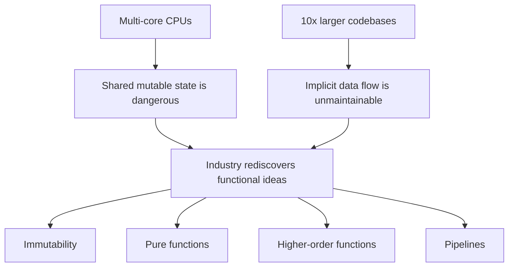

LINQ landed in C# in 2007, but it did not land alone. It rode a much
larger wave: a renewed interest in **functional programming** that
swept through every mainstream language in the 2010s. By 2020, every
serious general-purpose language — Java, JavaScript, Python, Swift,
Kotlin, Rust, C++, Scala, F#, Go — had absorbed ideas that had lived
inside Lisp, ML, and Haskell for decades.

This page is about *why* that happened, and *what those ideas
actually are* in terms a working C# developer cares about.

## The pressure that opened the door

The 2000s and 2010s put two new kinds of pressure on software:

1. **Multi-core CPUs.** Around 2005, Moore's law of single-thread
   speedups slowed dramatically. Performance gains started coming
   from more cores, not faster cores. Shared mutable state — the
   default in OO code — turned out to be a *catastrophic* default
   for concurrency.
2. **Massively larger codebases.** Smartphones, the cloud, and SaaS
   meant teams of dozens working on million-line codebases. The
   imperative bugs from the previous page stopped being theoretical
   and started costing real money.

Functional programming had spent forty years answering exactly these
problems. Mainstream languages started borrowing the answers.

## The core ideas (preview)

Each of these ideas gets its own page later. Here is the elevator
pitch for each.

### Pure functions

A function is **pure** if its output depends only on its inputs and
it has no side effects (no I/O, no mutation of outside state, no
randomness).

<CodeBlock
  adapter="csharp"
  initialCode={`using System;

static int Pure(int x, int y) => x + y;

static int Impure(int x)
{
    Console.Write("");                       // I/O
    return x + DateTime.Now.Millisecond;     // hidden input
}

Console.WriteLine(Pure(2, 3));   // always 5
Console.WriteLine(Impure(2));    // depends on the clock
`}
/>

Pure functions are **testable** (same input → same output),
**cacheable**, and safe to call from multiple threads.

### Immutability

An **immutable** value cannot change after it is constructed. To
"modify" it, you build a new one. C# records make this ergonomic.

<CodeBlock
  adapter="csharp"
  initialCode={`record Point(double X, double Y);

var p = new Point(1, 2);
var moved = p with { X = 10 };

System.Console.WriteLine($"p={p}, moved={moved}");
`}
/>

`p` is unchanged. `moved` is a brand-new value. Two threads can read
`p` forever and never race.

### Higher-order functions

A function is **higher-order** when it accepts a function as an
argument or returns one. Every LINQ operator is higher-order.

<CodeBlock
  adapter="csharp"
  initialCode={`using System;
using System.Linq;

var nums = new[] { 1, 2, 3, 4, 5 };

// .Where receives a function (n => n % 2 == 0) as an argument.
var evens = nums.Where(n => n % 2 == 0).ToArray();

System.Console.WriteLine(string.Join(", ", evens));
`}
/>

Higher-order functions let you parameterize *behavior*, not just
data. They are the engine of code reuse in functional style.

### Composition

Small, pure, named transformations can be glued together end to end.
Each one is reusable. The whole pipeline reads top to bottom.

<CodeBlock
  adapter="csharp"
  initialCode={`using System;
using System.Linq;

static bool IsEven(int n) => n % 2 == 0;
static int  Square(int n) => n * n;

var nums = Enumerable.Range(1, 10);

int answer = nums.Where(IsEven).Select(Square).Sum();

System.Console.WriteLine(answer); // 220
`}
/>

`IsEven` and `Square` are named, testable, reusable. They can be
combined into many pipelines, not just this one.

## What this style fixed

Mapping back to the four pain points from
[The Limits of Imperative Programming](./limits-of-imperative):

| Pain point | Functional answer |
| --- | --- |
| Mutable state | Immutable values, returning new ones |
| Deeply nested loops | Flat pipelines of named operators |
| Repetitive transformation logic | Higher-order functions parameterized by behavior |
| Step-by-step procedures | Composed pure functions, each independently usable |

None of these answers required throwing away C#'s OO foundation.
That is the most underappreciated thing about the functional
renaissance: it is **additive**. You use records *with* classes,
pure functions *inside* services, and pipelines *across* domain
models.

## What this style is *not*

There are two persistent misconceptions worth heading off now.

- *"Functional programming means no objects."* No. In a modern C#
  codebase you will still have services, interfaces, classes, and
  inheritance. Functional patterns mostly target the *data
  processing layer* — the place where most bugs live.
- *"Functional programming means everything must be a one-liner."*
  No again. The goal is **readability**, not density. A pipeline
  spread over 12 lines with named lambdas is more functional than a
  single-line ternary jungle.

## What's coming

The next page walks through C# version by version, showing how the
language has grown features that *encourage* functional thinking —
records, pattern matching, switch expressions, immutable collections,
local functions, expression-bodied members, primary constructors,
required members, and more.

After that, we leave history behind and start building the functional
toolkit from first principles: pure functions, immutability,
higher-order functions, lambdas, and the IEnumerable abstraction
underneath LINQ.

<MultipleChoice
  markdown={`Which of the following best describes how this course recommends adopting functional patterns in an existing C# codebase?

- Rewrite all classes as static functions and remove inheritance entirely.
  > That is a common caricature of functional programming, but it is not what this course teaches. Modern C# functional style is additive, not a rewrite.
- Use functional patterns only in greenfield F# projects.
  > Functional patterns belong in normal C# code, in normal OO codebases. This course is specifically about applying them in C#.
- [o] Apply functional patterns — immutability, pure functions, pipelines — primarily to the data-processing layers, while keeping the rest of the OO design.
  > The functional renaissance was additive: functional ideas mostly attack the place most bugs live (data transformation and state mutation), and coexist with OO services, interfaces, and classes.
- Avoid LINQ in production code because it is slower than imperative loops.
  > LINQ to Objects is competitive with hand loops in the vast majority of code paths, and the readability benefit is usually decisive.

Functional patterns in C# are a *layer*, not a *replacement*. The
biggest wins come from applying immutability and pipelines to the
data-processing parts of your system, where imperative bugs are most
expensive.`}
/>
