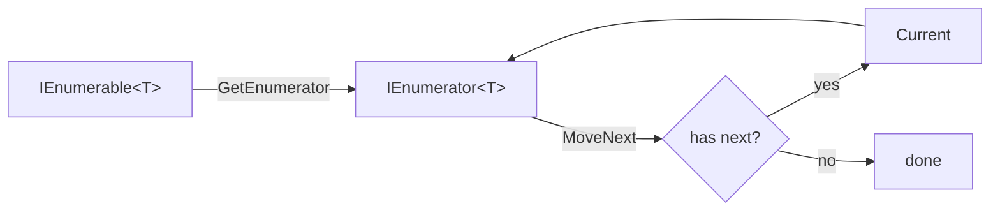
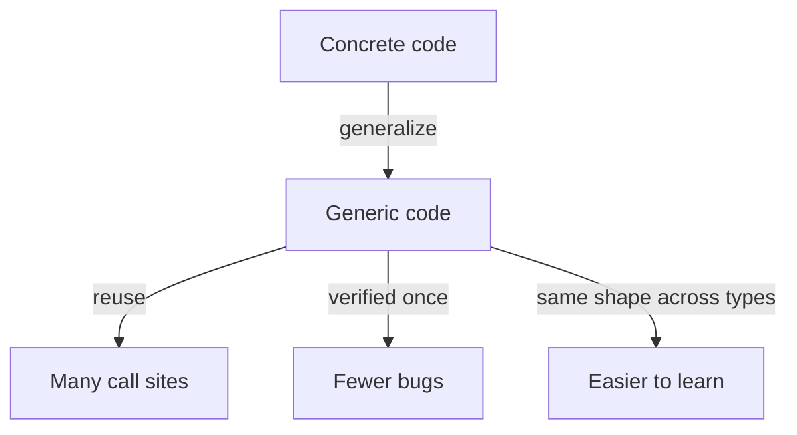

LINQ is *not* "a library that works on lists". It's a library that
works on **any sequence** — arrays, lists, dictionaries, file lines,
network records, custom iterators — through a single generic
interface: `IEnumerable<T>`.

This unification is what makes the same `.Where(...).Select(...)`
work for everything from in-memory collections to streaming files.
It is also a fantastic case study in how generics enable
**reusable, type-safe abstractions** in any language.

## The interface that unifies everything

`IEnumerable<T>` says one thing:

> "I can give you a *one-direction*, *one-element-at-a-time* iterator
> over values of type `T`."

That's it. No indexing, no length, no mutation. The minimum
necessary to *walk* a sequence.

Because *so many* data sources can satisfy that contract, almost
everything in .NET implements it. Arrays. `List<T>`. `HashSet<T>`.
`Dictionary<K,V>` (as key-value pairs). `string` (as `char`).
`File.ReadLines(...)`. Even your own iterator methods.

This is **abstraction as superpower**: when you write an algorithm
against `IEnumerable<T>`, you've written it for *all* of those at
once.

## Generic operators, one definition

Watch how much one type parameter buys you.

<CodeBlock
  adapter="csharp"
  initialCode={`using System;
using System.Collections.Generic;
using System.Linq;

public static class MyOps
{
    public static IEnumerable<T> EveryOther<T>(this IEnumerable<T> source)
    {
        bool keep = true;
        foreach (var x in source)
        {
            if (keep) yield return x;
            keep = !keep;
        }
    }
}

Console.WriteLine(string.Join(",", new[] { 1, 2, 3, 4, 5, 6 }.EveryOther()));
Console.WriteLine(string.Join(",", new[] { "a", "b", "c", "d", "e" }.EveryOther()));
Console.WriteLine(string.Join(",", "abcdef".EveryOther()));
`}
/>

One implementation. Three element types. Zero casts. Zero boxing.
The C# compiler synthesizes the right concrete code at each call
site.

## Building a generic `MyWhere`

To really see how built-in LINQ works, let's reimplement `Where`.

<CodeBlock
  adapter="csharp"
  initialCode={`using System;
using System.Collections.Generic;
using System.Linq;

public static class Mini
{
    public static IEnumerable<T> MyWhere<T>(this IEnumerable<T> source, Func<T, bool> predicate)
    {
        if (source is null) throw new ArgumentNullException(nameof(source));
        if (predicate is null) throw new ArgumentNullException(nameof(predicate));

        foreach (var x in source)
            if (predicate(x))
                yield return x;
    }

    public static IEnumerable<TResult> MySelect<T, TResult>(
        this IEnumerable<T> source, Func<T, TResult> selector)
    {
        foreach (var x in source)
            yield return selector(x);
    }
}

var nums = Enumerable.Range(1, 8);
var result = nums.MyWhere(n => n % 2 == 0).MySelect(n => n * n);
Console.WriteLine(string.Join(",", result));   // 4,16,36,64
`}
/>

Two short methods, generic over the element type, and they chain.
This is essentially all built-in `Where` and `Select` do.

The real implementations add micro-optimizations (special cases for
arrays/lists) but the *shape* is exactly this.

## Constraints: making generics smarter

Sometimes you need to know *something* about `T`. C# generic
**constraints** let you say so.

| Constraint | Meaning |
| --- | --- |
| `where T : struct` | T is a value type |
| `where T : class` | T is a reference type |
| `where T : new()` | T has a public parameterless constructor |
| `where T : IComparable<T>` | T can be ordered |
| `where T : SomeBase` | T inherits from SomeBase |
| `where T : notnull` | T is non-nullable |

<CodeBlock
  adapter="csharp"
  initialCode={`using System;
using System.Collections.Generic;
using System.Linq;

public static class Stats
{
    public static T MaxOrDefault<T>(this IEnumerable<T> source, T fallback)
        where T : IComparable<T>
    {
        bool seen = false;
        T best = fallback;
        foreach (var x in source)
        {
            if (!seen || x.CompareTo(best) > 0) { best = x; seen = true; }
        }
        return best;
    }
}

Console.WriteLine(new[] { 3, 1, 4, 1, 5, 9, 2 }.MaxOrDefault(-1));         // 9
Console.WriteLine(new[] { "pear", "apple", "kiwi" }.MaxOrDefault("zzz")); // pear
Console.WriteLine(System.Linq.Enumerable.Empty<int>().MaxOrDefault(-1));   // -1
`}
/>

The constraint `where T : IComparable<T>` is what allows `CompareTo`
to be called. Without it, the compiler couldn't guarantee that `T`
supports comparison.

## Generic delegates: the lambda type system

LINQ's operator signatures use these tiny, ubiquitous generic
delegate types:

| Delegate | Shape | Used for |
| --- | --- | --- |
| `Func<T, TResult>` | `T → TResult` | selectors, projections |
| `Func<T, bool>` | `T → bool` | predicates |
| `Func<T1, T2, TResult>` | `(T1, T2) → TResult` | combining two values |
| `Action<T>` | `T → void` | side-effecting callbacks |

Every LINQ method's signature you'll ever read is some combination
of these. Master them and the entire API surface becomes
self-documenting.

## Building a generic key-grouped histogram

A satisfying use of constraints + generics — count by an arbitrary
key extracted from any sequence.

<ChallengeCard
  adapter="csharp"
  entryFilename="Program.cs"
  files={[
    {
      filename: "Program.cs",
      initialContent: `using System;
using System.Linq;

var words = new[] { "alpha", "beta", "gamma", "delta", "epsilon", "zeta" };

// Group by word length, count how many fall in each bucket, in ascending key order.
var byLen = words.Histogram(w => w.Length);
foreach (var (key, count) in byLen)
    Console.WriteLine($"len {key}: {count}");

Console.WriteLine("--");

var nums = new[] { 1, 2, 3, 4, 5, 6, 7, 8, 9, 10 };

// Group by parity (string keys), in ascending key order ("even" < "odd").
var byParity = nums.Histogram(n => n % 2 == 0 ? "even" : "odd");
foreach (var (key, count) in byParity)
    Console.WriteLine($"{key}: {count}");
`,
      solutionContent: `using System;
using System.Linq;

var words = new[] { "alpha", "beta", "gamma", "delta", "epsilon", "zeta" };

var byLen = words.Histogram(w => w.Length);
foreach (var (key, count) in byLen)
    Console.WriteLine($"len {key}: {count}");

Console.WriteLine("--");

var nums = new[] { 1, 2, 3, 4, 5, 6, 7, 8, 9, 10 };

var byParity = nums.Histogram(n => n % 2 == 0 ? "even" : "odd");
foreach (var (key, count) in byParity)
    Console.WriteLine($"{key}: {count}");
`,
    },
    {
      filename: "Histogram.cs",
      initialContent: `using System;
using System.Collections.Generic;
using System.Linq;

public static class HistogramOp
{
    // TODO: implement Histogram<T, TKey>:
    //   1) Use a generic constraint so TKey can be compared / used as a dictionary key.
    //   2) Count how many elements of 'source' produce each key (via keySelector).
    //   3) Return pairs ordered by key ascending.
    public static IEnumerable<(TKey key, int count)> Histogram<T, TKey>(
        this IEnumerable<T> source, Func<T, TKey> keySelector)
        where TKey : notnull
    {
        throw new NotImplementedException();
    }
}
`,
      solutionContent: `using System;
using System.Collections.Generic;
using System.Linq;

public static class HistogramOp
{
    public static IEnumerable<(TKey key, int count)> Histogram<T, TKey>(
        this IEnumerable<T> source, Func<T, TKey> keySelector)
        where TKey : notnull
    {
        return source
            .GroupBy(keySelector)
            .OrderBy(g => g.Key)
            .Select(g => (g.Key, g.Count()));
    }
}
`,
    },
  ]}
  tests={[
    {
      id: "histogram-generic",
      name: "Generic histogram handles ints and strings",
      description: "Same generic operator works on words-by-length and ints-by-parity",
      expect: {
        stdoutEquals: "len 4: 1\nlen 5: 3\nlen 7: 2\n--\neven: 5\nodd: 5\n",
      },
    },
  ]}
/>

Take a moment to appreciate that the *same* `Histogram<T, TKey>`
method ran with `T = string, TKey = int` *and* `T = int, TKey = string`
without modification. That's the payoff of writing against the
generic abstraction.

## Why this matters

Generic abstractions are one of the great inventions of strongly
typed languages. They let you write each piece of logic *once*,
preserve type safety at every call site, and grow a library that
scales as the program grows.

LINQ is the showcase: dozens of operators, each generic, each
working on every sequence type, every projection type — all from a
single ten-line interface.

<MultipleChoice
  markdown={`When you call \`new[] { "a", "b", "c" }.MyWhere(s => s.Length == 1)\`, where does the type \`T\` come from?

- It defaults to \`object\` and gets cast back to \`string\` later.
  > That would be the pre-generics approach. Generic type inference avoids casts and boxing entirely.
- The lambda parameter \`s\` is declared as \`string\`, which is how \`T\` is decided.
  > Close, but inverted. The compiler first infers \`T\` from the *source*, then types the lambda accordingly.
- [o] The compiler infers \`T = string\` from the source array's element type, then specializes \`MyWhere\` for \`string\`.
  > C# infers generic type arguments by looking at the call site — most importantly the type of the source expression — and then synthesizes a strongly typed specialization. No casting, no boxing, full IntelliSense.
- \`T\` is resolved at runtime by reflection.
  > No — generic type resolution happens at compile time in C#. Reflection is not involved at the call site.

This is why writing one generic method buys you type-safe behavior across every element type.`}
/>
