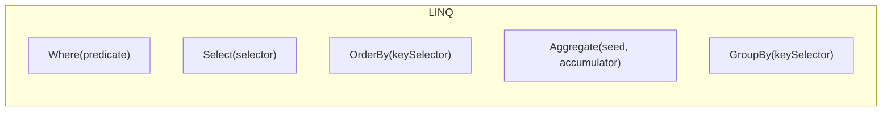

A **higher-order function** (HOF) is a function that does at least
one of these two things:

1. **Takes another function as an argument.**
2. **Returns a function as its result.**

That's the whole definition. It sounds abstract, but you have already
been using HOFs every time you wrote `.Where(n => n % 2 == 0)`.
`Where` is a higher-order function: it takes another function (the
predicate) as a parameter.

This page is about why that idea is so powerful, and how to wield it
in everyday C#.

## The pattern before the name

Look at three "search" methods written in classic imperative style:

<CodeBlock
  adapter="csharp"
  starterCode={`using System;
using System.Collections.Generic;

static int? FirstEven(IEnumerable<int> xs)
{
    foreach (var x in xs)
        if (x % 2 == 0) return x;
    return null;
}

static int? FirstNegative(IEnumerable<int> xs)
{
    foreach (var x in xs)
        if (x < 0) return x;
    return null;
}

static int? FirstOver100(IEnumerable<int> xs)
{
    foreach (var x in xs)
        if (x > 100) return x;
    return null;
}

var nums = new[] { 1, -3, 7, 200, 8 };
Console.WriteLine(FirstEven(nums));
Console.WriteLine(FirstNegative(nums));
Console.WriteLine(FirstOver100(nums));
`}
/>

These three methods are **the same method** except for one
expression: the condition inside the `if`. That's a code smell. The
*behavior* is what differs, but we've duplicated everything else.

A higher-order function lets us extract behavior as an *argument*:

<CodeBlock
  adapter="csharp"
  starterCode={`using System;
using System.Collections.Generic;

static int? FirstWhere(IEnumerable<int> xs, Func<int, bool> predicate)
{
    foreach (var x in xs)
        if (predicate(x)) return x;
    return null;
}

var nums = new[] { 1, -3, 7, 200, 8 };

Console.WriteLine(FirstWhere(nums, n => n % 2 == 0));   // 200... wait, -3 is odd, 1 is odd... 200
Console.WriteLine(FirstWhere(nums, n => n < 0));
Console.WriteLine(FirstWhere(nums, n => n > 100));
`}
/>

One method, three different conditions, zero duplication. That is
the LINQ idea in miniature — and it's exactly what `Enumerable.First`
is, just slightly more polished.

## The two function shapes you'll see everywhere

Almost every higher-order function in C# uses one of these two
generic delegates:

| Delegate | Shape | Used for |
| --- | --- | --- |
| `Func<TIn, TOut>` | A function that returns a value | Mapping, projecting, computing |
| `Action<T>` | A function that returns `void` | Side effects (printing, writing) |

There's a special case for predicates:

| Delegate | Shape | Used for |
| --- | --- | --- |
| `Func<T, bool>` | A function returning bool | Filtering — also written `Predicate<T>` |

<CodeBlock
  adapter="csharp"
  starterCode={`using System;

Func<int, int>          square    = x => x * x;
Func<int, int, int>     add       = (a, b) => a + b;
Func<string, bool>      isLong    = s => s.Length > 5;
Action<string>          shout     = s => Console.WriteLine(s.ToUpper());

Console.WriteLine(square(4));
Console.WriteLine(add(2, 3));
Console.WriteLine(isLong("hi"));
shout("hello world");
`}
/>

These are values, just like `int` or `string`. You can store them in
variables, pass them around, return them, put them in lists.

## Returning a function

This is the other half of "higher-order". A function that *returns*
a function is sometimes called a **function factory**.

<CodeBlock
  adapter="csharp"
  starterCode={`using System;

static Func<int, int> Multiplier(int factor) => x => x * factor;

var doubler = Multiplier(2);
var tripler = Multiplier(3);

Console.WriteLine(doubler(10));    // 20
Console.WriteLine(tripler(10));    // 30
`}
/>

`Multiplier(2)` returns a *new function* that remembers `factor=2`.
`Multiplier(3)` returns a different function. The captured `factor`
is part of the returned function's "personality".

A practical example — a predicate factory:

<CodeBlock
  adapter="csharp"
  starterCode={`using System;
using System.Linq;

static Func<int, bool> Above(int threshold) => x => x > threshold;

var nums = new[] { 1, 5, 9, 12, 30, 50 };
Console.WriteLine(string.Join(",", nums.Where(Above(10))));
Console.WriteLine(string.Join(",", nums.Where(Above(20))));
`}
/>

You can build a *library* of predicates this way without writing
each one from scratch.

## Composing functions

Functions are values, so you can write a function that *composes
two other functions*: feed the output of one into the other.

<CodeBlock
  adapter="csharp"
  starterCode={`using System;

static Func<A, C> Compose<A, B, C>(Func<A, B> f, Func<B, C> g) =>
    x => g(f(x));

Func<int, int> addOne   = x => x + 1;
Func<int, int> square   = x => x * x;

var addThenSquare = Compose(addOne, square);  // (x+1)^2
var squareThenAdd = Compose(square, addOne);  // x^2 + 1

Console.WriteLine(addThenSquare(4));   // (4+1)^2 = 25
Console.WriteLine(squareThenAdd(4));   // 16 + 1  = 17
`}
/>

Compose is **the** operation in functional programming. Composing
small pure functions is how you build large transformations without
ever writing a `for` loop.

## Why this is the engine of LINQ

Every LINQ operator is a higher-order function:

Each box accepts a function and uses it to drive its behavior over a
sequence. The sequence itself is just data; the *behavior* is
parameterized.

This is the cleanest possible separation of:

- **Structure** — the operator (iterate, branch, accumulate)
- **Policy** — the function you pass in

You can change the policy without rewriting the structure, and you
can reuse the structure across hundreds of policies.

## A practical pattern: configurable transformations

A real example: a configurable text "pipeline" built from small
named functions.

<CodeBlock
  adapter="csharp"
  starterCode={`using System;
using System.Linq;

static string Trim(string s)     => s.Trim();
static string Lower(string s)    => s.ToLowerInvariant();
static string Collapse(string s) => System.Text.RegularExpressions.Regex.Replace(s, @"\s+", " ");

static Func<string, string> Pipeline(params Func<string, string>[] steps) =>
    input => steps.Aggregate(input, (acc, step) => step(acc));

var clean = Pipeline(Trim, Lower, Collapse);

Console.WriteLine($"[{clean("  Hello   World  ")}]");        // [hello world]
Console.WriteLine($"[{clean("\tC# IS  Fun\n")}]");           // [c# is fun]
`}
/>

The same `Pipeline` function builds different cleaners depending on
which steps you pass in. The steps themselves are pure, tiny, and
testable in isolation.

## A multi-file challenge

Implement a small reusable HOF utility.

<ChallengeCard
  adapter="csharp"
  title="Build a reusable filter"
  instructions={`Implement \`Filters.Build\`, a higher-order function that takes
a predicate (\`Func<int, bool>\`) and returns a function that, given a
list of ints, returns only those that match the predicate (in order).

Signature:

\`public static Func<IEnumerable<int>, IEnumerable<int>> Build(Func<int, bool> predicate)\`

\`Program.cs\` uses it to build an "is positive" filter and prints the
matching numbers, one per line.`}
  entryFilename="Program.cs"
  files={[
    {
      filename: "Program.cs",
      initialContent: `var positive = Filters.Build(n => n > 0);

foreach (var n in positive(new[] { -2, 5, 0, 7, -1, 3 }))
    System.Console.WriteLine(n);
`,
    },
    {
      filename: "Filters.cs",
      initialContent: `using System;
using System.Collections.Generic;

public static class Filters
{
    public static Func<IEnumerable<int>, IEnumerable<int>> Build(Func<int, bool> predicate)
    {
        // your code here
        return xs => xs;
    }
}
`,
      solutionContent: `using System;
using System.Collections.Generic;
using System.Linq;

public static class Filters
{
    public static Func<IEnumerable<int>, IEnumerable<int>> Build(Func<int, bool> predicate) =>
        xs => xs.Where(predicate);
}
`,
    },
  ]}
  tests={[
    {
      id: "builds_filter",
      name: "Filter returns 5, 7, 3",
      description: "Positive numbers from [-2,5,0,7,-1,3]",
      expect: { stdoutEquals: "5\n7\n3" },
    },
  ]}
/>

<MultipleChoice
  markdown={`Which of the following is **not** a higher-order function?

- \`Enumerable.Where\` — takes a \`Func<T, bool>\` predicate.
  > \`Where\` accepts a function as a parameter, so it *is* higher-order.
- \`Enumerable.Select\` — takes a \`Func<TSource, TResult>\` selector.
  > \`Select\` accepts a function, so it *is* higher-order.
- A "Multiplier" method that returns \`Func<int, int>\` for a given factor.
  > Returning a function makes a method higher-order, so this *is* higher-order.
- [o] \`static int Add(int x, int y) => x + y;\`
  > \`Add\` neither takes a function as a parameter nor returns one — it only operates on values. It is a perfectly ordinary first-order function.

A higher-order function must either accept a function as an argument
or return a function. Plain functions over plain values (like \`Add\`)
are *first-order* functions.`}
/>
