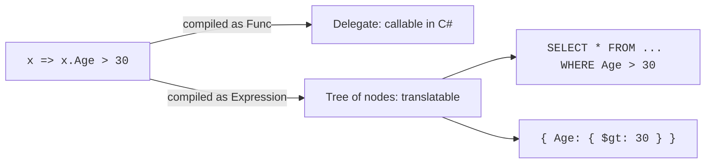

We've been writing lambdas like `n => n * 2` for several pages
without explaining the machinery underneath them. This page lifts the
hood. By the end of it you'll understand what a delegate is, what a
lambda compiles to, what a closure captures, and why
`Expression<Func<T,bool>>` is fundamentally different from
`Func<T,bool>`.

This is the most "language mechanics" page in the course. It is
worth the patience — every page after this assumes you can read a
lambda and know what it's doing.

<svg
  viewBox="0 0 640 230"
  role="img"
  aria-label="Three tiny mappings, each an input dot, a fat arrow, and an output — change of shape, change of size, one into two — with a captured red dot tethered to the last row"
  style={{ display: "block", width: "100%", maxWidth: "640px", height: "auto", margin: "2.5rem auto" }}
>
  <g fill="currentColor" opacity="0.35">
    <rect x="240" y="54" width="30" height="12" rx="6" />
    <polygon points="274,46 274,74 298,60" />
    <rect x="240" y="104" width="30" height="12" rx="6" />
    <polygon points="274,96 274,124 298,110" />
    <rect x="240" y="154" width="30" height="12" rx="6" />
    <polygon points="274,146 274,174 298,160" />
  </g>
  <g style={{ color: "var(--ds-yellow-500)" }} fill="currentColor">
    <circle cx="200" cy="60" r="11" />
    <rect x="320" y="46" width="28" height="28" rx="7" />
  </g>
  <g style={{ color: "var(--ds-green-500)" }} fill="currentColor">
    <circle cx="200" cy="110" r="8" />
    <circle cx="334" cy="110" r="16" />
  </g>
  <g style={{ color: "var(--ds-blue-500)" }} fill="currentColor">
    <circle cx="200" cy="160" r="11" />
    <circle cx="326" cy="160" r="8" />
    <circle cx="348" cy="160" r="8" />
  </g>
  <g style={{ color: "var(--ds-red-500)" }} fill="currentColor">
    <circle cx="120" cy="204" r="8" />
    <circle cx="146" cy="192" r="3" fillOpacity="0.5" />
    <circle cx="170" cy="178" r="3" fillOpacity="0.5" />
  </g>
</svg>

## Delegates: the type of a function

A **delegate** is a type that represents *a function with a specific
signature*. Just like `int` is the type of integers, `Func<int,
int>` is the type of functions from `int` to `int`.

<CodeBlock
  adapter="csharp"
  files={[
    {
      filename: "main.cs",
      starterCode: `using System;

// A delegate variable holds a reference to a function.
Func<int, int> square = x => x * x;
Func<int, int> negate = x => -x;

Console.WriteLine(square(5)); // 25
Console.WriteLine(negate(5)); // -5

// You can reassign.
square = x => x * x * x;
Console.WriteLine(square(5)); // 125

// You can store delegates in collections like any other value.
var ops = new Func<int, int>[] { square, negate, x => x + 1 };
foreach (var f in ops)
    Console.WriteLine(f(10));
`,
    },
  ]}
/>

The built-in delegate types you'll use 99% of the time:

| Type | Shape |
| --- | --- |
| `Action` | `() => void` |
| `Action<T>` | `(T) => void` |
| `Action<T1, T2>` | `(T1, T2) => void` |
| `Func<TResult>` | `() => TResult` |
| `Func<T, TResult>` | `(T) => TResult` |
| `Func<T1, T2, TResult>` | `(T1, T2) => TResult` |
| `Predicate<T>` | `(T) => bool` |

`Action` is for void-returning functions (side effects). `Func` is
for value-returning functions. `Predicate<T>` is a niche older alias
for `Func<T, bool>` — LINQ uses `Func<T, bool>`, not `Predicate<T>`.

## Lambda syntax

A **lambda** is an inline literal of a delegate type. It is written
`parameters => body`.

<CodeBlock
  adapter="csharp"
  files={[
    {
      filename: "main.cs",
      starterCode: `using System;

Func<int, int> a = x => x * 2;           // single param, no parens
Func<int, int, int> b = (x, y) => x + y; // multiple params
Func<int, int> c = (int x) => x * 2;     // explicit type (optional)
Func<int, int> d = x =>
{ return x * 2; }; // statement body

Action e = () => Console.WriteLine("hi");
Action<string> f = s => Console.WriteLine($"Hi, {s}");

Console.WriteLine(a(5));
Console.WriteLine(b(2, 3));
Console.WriteLine(c(6));
Console.WriteLine(d(7));
e();
f("Ada");
`,
    },
  ]}
/>

Two forms of body are allowed:

- **Expression body** — `x => expr` — implicitly returns the value
  of `expr`.
- **Statement body** — `x => { ... }` — needs an explicit `return`
  if it has a return type.

Almost everywhere in LINQ you'll see the expression form.

## Method references

If a function you want already exists as a named method, you can
pass the method directly — no need to wrap it in a lambda.

<CodeBlock
  adapter="csharp"
  files={[
    {
      filename: "main.cs",
      starterCode: `using System;
using System.Linq;

static int Double(int x) => x * 2;

var nums = new[] { 1, 2, 3 };

// Both lines do the same thing.
Console.WriteLine(string.Join(",", nums.Select(x => Double(x))));
Console.WriteLine(string.Join(",", nums.Select(Double)));
`,
    },
  ]}
/>

Prefer the method reference — `nums.Select(Double)` — when the
lambda would just call the method. It reads better.

## Closures: capturing variables

A lambda can use variables from its enclosing scope. The compiler
generates a hidden class to hold those captured variables. This is
called a **closure**.

<CodeBlock
  adapter="csharp"
  files={[
    {
      filename: "main.cs",
      starterCode: `using System;
using System.Linq;

int threshold = 10;
Func<int, bool> aboveThreshold = n => n > threshold;

var nums = new[] { 5, 12, 8, 20, 3 };
Console.WriteLine(string.Join(",", nums.Where(aboveThreshold))); // 12, 20

// Reassigning the captured variable changes what the closure sees!
threshold = 4;
Console.WriteLine(string.Join(",", nums.Where(aboveThreshold))); // 5, 12, 8, 20
`,
    },
  ]}
/>

The lambda captured the *variable*, not the value of `threshold` at
the time of capture. This is occasionally surprising; usually it is
what you want.

### The classic loop-variable bug

The most famous closure bug in C# is capturing a loop variable.

<CodeBlock
  adapter="csharp"
  files={[
    {
      filename: "main.cs",
      starterCode: `using System;
using System.Collections.Generic;

// In C# 5+ this prints 0,1,2,3,4 (the loop variable is per-iteration).
// In C# 4 and earlier the same code would print 5,5,5,5,5.
var actions = new List<Action>();
for (int i = 0; i < 5; i++)
{
    actions.Add(() => Console.WriteLine(i));
}

foreach (var a in actions)
    a();
`,
    },
  ]}
/>

If you encounter older codebases, you may see explicit
`int copy = i;` inside loops to dodge the older capture behavior.
Modern C# fixed this in the `foreach`/`for` of loop variables,
but the lesson stands: **prefer capturing immutable data**.

## When a lambda becomes data: expression trees

This is the deepest idea on this page. Most of the time a lambda
compiles to *executable code* — a regular method the runtime can
call. But there is a second form: a lambda can compile to a *data
structure* describing itself.

That data structure is called an **expression tree**, and its type
is `Expression<Func<...>>`.

```csharp
using System;
using System.Linq.Expressions;

// Compiled to executable code — you can call it.
Func<int, int> doubleFunc = x => x * 2;
Console.WriteLine(doubleFunc(7)); // 14

// Compiled to a data structure — you can inspect it.
Expression<Func<int, int>> doubleExpr = x => x * 2;

Console.WriteLine($"Type:        {doubleExpr.GetType().Name}");
Console.WriteLine($"Parameter:   {doubleExpr.Parameters[0].Name}");
Console.WriteLine($"Body:        {doubleExpr.Body}");
Console.WriteLine($"Body kind:   {doubleExpr.Body.NodeType}");

// You can still compile and call it if you want.
var compiled = doubleExpr.Compile();
Console.WriteLine(compiled(7)); // 14
```

Why does this matter? Because LINQ providers — EF Core, MongoDB
LINQ, etc. — accept `Expression<Func<T,bool>>`. They don't *call*
your lambda; they walk its tree and *translate* it into another
language (SQL, BSON, an HTTP query).



We're not going to write a LINQ provider in this course, but it is
useful to know the difference exists. When you start using EF Core
in real work, you'll occasionally hit "the LINQ provider could not
translate this expression" errors — and now you'll know why.

## Functions as values: a practical example

Putting lambdas and HOFs together — a small "rule engine" defined
entirely as data.

<CodeBlock
  adapter="csharp"
  files={[
    {
      filename: "main.cs",
      starterCode: `using System;
using System.Collections.Generic;
using System.Linq;

var rules = new(string Name, Func<Person, bool> Pred)[] {
    ("adult", p => p.Age >= 18),
    ("from-Paris", p => p.City == "Paris"),
    ("under-40", p => p.Age < 40),
};

var people = new[] {
    new Person("Ada", 36, "London"),
    new Person("Bilal", 17, "Paris"),
    new Person("Chiara", 44, "Paris"),
    new Person("Dmitri", 22, "Paris"),
};

foreach (var p in people)
{
    var labels = rules.Where(r => r.Pred(p)).Select(r => r.Name);
    Console.WriteLine($"{p.Name,-7}: {string.Join(", ", labels)}");
}

record Person(string Name, int Age, string City);
`,
    },
  ]}
/>

The rules are *data*. You could load them from a config file,
combine them dynamically, or build a UI to toggle them — all without
recompiling. That power comes from treating functions as values.

<MultipleChoice
  markdown={`What is the difference between \`Func<int, bool>\` and \`Expression<Func<int, bool>>\`?

- They are the same; \`Expression<...>\` is just a longer alias.
  > They are different types with different runtime representations and different uses.
- \`Func<int, bool>\` can only be created from a method, while \`Expression<Func<int, bool>>\` can be created from a lambda.
  > Both can be created from a lambda; the *compiler* decides which target type to produce based on the variable's declared type.
- [o] \`Func<int, bool>\` compiles to executable code that can be invoked directly; \`Expression<Func<int, bool>>\` compiles to a data structure that describes the lambda and can be inspected or translated by a LINQ provider.
  > The same lambda \`x => x > 30\` becomes a callable delegate when assigned to \`Func<int, bool>\`, and an inspectable tree when assigned to \`Expression<Func<int, bool>>\`. Providers like EF use the latter to translate to SQL.
- \`Expression<Func<int, bool>>\` is the async version of \`Func<int, bool>\`.
  > Async has nothing to do with expression trees; there is no asynchronous variant of either type implied by these names.

The same lambda syntax can become either a *callable function* or
*data describing the function*, depending on what the surrounding
type expects. That dual nature is what makes LINQ work over both
in-memory collections and external query engines.`}
/>
