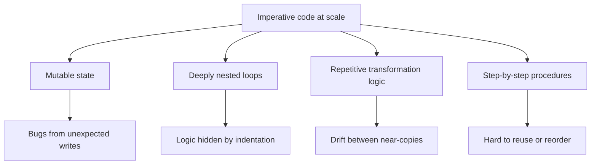

Before we touch LINQ, we have to understand the *problem* LINQ solves.
LINQ did not appear because Microsoft thought it would be elegant. It
appeared because real codebases — millions of lines of object-oriented
C# and C++ and Java — were drowning in a very specific style of bug
that had nothing to do with algorithms. The bugs lived in the *shape*
of the code itself.

That style of code has a name: **imperative**.

## What "imperative" really means

In an **imperative** program, you describe a computation as a
*sequence of statements that change state*. You declare variables,
you mutate them, you branch, you loop, you mutate some more, and
eventually a variable somewhere contains the answer.

Here is a tiny imperative task: *"Find the average age of people who
live in Berlin."*

<CodeBlock
  adapter="csharp"
  initialCode={`using System;
using System.Collections.Generic;

record Person(string Name, string City, int Age);

var people = new List<Person>
{
    new("Ada", "London",  36),
    new("Bilal", "Berlin", 41),
    new("Chiara", "Berlin", 29),
    new("Dmitri", "Paris", 52),
    new("Esther", "Berlin", 33),
};

int total = 0;
int count = 0;
foreach (var p in people)
{
    if (p.City == "Berlin")
    {
        total += p.Age;
        count += 1;
    }
}

double avg = count == 0 ? 0.0 : (double)total / count;
Console.WriteLine($"Average Berlin age: {avg:F1}");
`}
/>

Look at how much *bookkeeping* there is. The interesting idea is
"average age of Berliners", but two thirds of the code is about
manually maintaining `total`, `count`, dividing while avoiding a
divide-by-zero, and walking the list one element at a time. The
intent is buried.

## The four classic pain points

Almost every problem with large imperative codebases reduces to one of
four recurring patterns.



### 1. Mutable state

A variable that can change at any time, from any place, is a variable
nobody fully understands. In a 200-line method, the value of `total`
on line 130 depends on every prior line that touched it — and you
have to read all of them to be sure.

### 2. Deeply nested loops

When transformation gets even slightly more complicated, imperative
code grows *inward*. A filter-and-group becomes a `for` inside an
`if` inside a `foreach` inside a `try`. Reading it requires holding a
stack in your head.

### 3. Repetitive transformation logic

Need the same "filter / project / aggregate" pattern in five places
with slightly different rules? In imperative code, the *shape* of the
loop is identical, but the *details* differ — so it gets copy-pasted.
A year later, a subtle bug fix lands in three of the five copies and
not the other two.

### 4. Procedures that don't compose

`ComputeReportA()` does seven things in a specific order. To make
`ComputeReportB()` — which needs steps 2, 4, and 6 in a different
order — you can't reuse the procedure. You copy-paste and edit, or
you refactor the original to take ten optional booleans. Neither
ages well.

## A bigger example

Consider a slightly bigger task: *"For each city, compute the average
age of residents, but only for cities with at least two residents,
sorted by average age descending."*

<CodeBlock
  adapter="csharp"
  initialCode={`using System;
using System.Collections.Generic;

record Person(string Name, string City, int Age);

var people = new List<Person>
{
    new("Ada", "London",  36),  new("Bilal", "Berlin", 41),
    new("Chiara", "Berlin", 29), new("Dmitri", "Paris", 52),
    new("Esther", "Berlin", 33), new("Farah",  "London", 27),
    new("Gus", "Paris", 60),
};

// Step 1: group by city manually.
var byCity = new Dictionary<string, List<Person>>();
foreach (var p in people)
{
    if (!byCity.ContainsKey(p.City))
        byCity[p.City] = new List<Person>();
    byCity[p.City].Add(p);
}

// Step 2: compute averages.
var averages = new List<(string City, double Avg, int Count)>();
foreach (var kv in byCity)
{
    int sum = 0;
    foreach (var p in kv.Value) sum += p.Age;
    averages.Add((kv.Key, (double)sum / kv.Value.Count, kv.Value.Count));
}

// Step 3: filter to cities with >= 2 residents.
var filtered = new List<(string City, double Avg, int Count)>();
foreach (var row in averages)
    if (row.Count >= 2) filtered.Add(row);

// Step 4: sort descending by average.
filtered.Sort((a, b) => b.Avg.CompareTo(a.Avg));

foreach (var row in filtered)
    Console.WriteLine($"{row.City,-8} avg={row.Avg:F1} (n={row.Count})");
`}
/>

Forty lines for what is, in plain English, one sentence. And every
one of those lines is a place a bug can live.

The LINQ equivalent — which we'll write properly later — is *one
expression*:

```csharp
var report = people
    .GroupBy(p => p.City)
    .Where(g => g.Count() >= 2)
    .Select(g => new { City = g.Key, Avg = g.Average(p => p.Age), Count = g.Count() })
    .OrderByDescending(r => r.Avg);
```

You don't have to *understand* that yet — just notice that the LINQ
version is the same length as the English sentence.

## The cost of imperative thinking

Imperative code has a real cost that compounds as a system grows:

- **Reading cost**: you must mentally execute the program to know
  what it does.
- **Change cost**: every mutation is a place where future code can
  surprise you.
- **Testing cost**: hidden state means tests must construct the *exact
  sequence of events* that triggers a bug.
- **Reuse cost**: a step buried in a 200-line method cannot be lifted
  out without rewriting.

None of these costs show up in a textbook 20-line example. They all
show up by the time the codebase is 200,000 lines.

## What we want instead

We want code that:

- Says **what** we want, not how to get it
- Treats data as a stream of values flowing through transformations,
  not buckets you reach into and stir
- Lets us **name** transformation steps and **reuse** them
- Lets us reason about a single step in isolation, without thinking
  about the loop around it

That style is called **declarative** programming, and it is the
subject of the next page.

<MultipleChoice
  markdown={`Which of the following is **not** one of the four pain points of large imperative codebases discussed on this page?

- Mutable state being modified from many places
  > Mutable state is one of the classic pain points — it makes code hard to reason about.
- Deeply nested loops that hide the actual logic
  > Nested loops are explicitly discussed as a major pain point.
- Repetitive transformation logic that drifts apart over time
  > Copy-pasted near-duplicates are listed as a pain point.
- [o] Compilers being too slow to optimize the code
  > Compiler performance was not one of the pain points discussed. The pain points were structural and human (mutable state, nesting, repetition, non-composable procedures), not about machine performance.

The complaint against imperative code is not that the *machine* runs it
poorly — modern compilers handle it well. The complaint is that
*humans* read it poorly, and that bug cost compounds as systems grow.`}
/>
