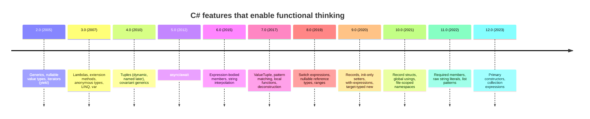

C# started life in 2002 as a deliberate response to Java, with the
same OO-centric flavor. Over twenty years it absorbed an enormous
amount from F#, Haskell, Scala, and TypeScript — to the point where
modern C# is comfortably a *multi-paradigm* language with first-class
functional support.

This page is a short, opinionated tour of the features that matter
for functional thinking, in roughly the order they appeared. You do
not need to memorize the version numbers. You do need to recognize
the syntax — every page after this will use them freely.

## Timeline

We'll spend the rest of this page on the features highlighted above.

## Lambda expressions (C# 3.0)

A **lambda** is an inline function. It is the unit of behavior you
pass to LINQ.

<CodeBlock
  adapter="csharp"
  starterCode={`using System;

Func<int, int>      square      = x => x * x;
Func<int, int, int> add         = (a, b) => a + b;
Func<int, bool>     isPositive  = x => x > 0;

Console.WriteLine(square(7));            // 49
Console.WriteLine(add(3, 4));            // 7
Console.WriteLine(isPositive(-2));       // False
`}
/>

A lambda captures variables from its enclosing scope. This is called
a **closure**.

<CodeBlock
  adapter="csharp"
  starterCode={`using System;

int factor = 10;
Func<int, int> times = x => x * factor;

Console.WriteLine(times(3));   // 30

factor = 100;
Console.WriteLine(times(3));   // 300 — the lambda *captured* factor, not its value
`}
/>

Captured variables are a common source of bugs in loops. The general
rule is to **capture immutable data**; we'll come back to this.

## Iterators with `yield` (C# 2.0)

`yield return` lets a method *produce* a sequence one element at a
time, lazily. It's the secret behind almost every LINQ operator.

<CodeBlock
  adapter="csharp"
  starterCode={`using System;
using System.Collections.Generic;

static IEnumerable<int> Counting()
{
    Console.WriteLine("  about to yield 1");
    yield return 1;
    Console.WriteLine("  about to yield 2");
    yield return 2;
    Console.WriteLine("  about to yield 3");
    yield return 3;
}

Console.WriteLine("Before foreach");
foreach (var n in Counting())
    Console.WriteLine($"got {n}");
Console.WriteLine("After foreach");
`}
/>

Notice the interleaving: the producer runs *only as the consumer
asks for the next value*. We'll come back to this in
[Deferred Execution](./deferred-execution).

## Expression-bodied members (C# 6/7)

These let you write one-liner methods and properties without `{ }`
and `return`.

<CodeBlock
  adapter="csharp"
  starterCode={`using System;

record Circle(double Radius)
{
    public double Area => Math.PI * Radius * Radius;
    public double Circumference() => 2 * Math.PI * Radius;
}

var c = new Circle(2);
Console.WriteLine($"area={c.Area:F2}, circ={c.Circumference():F2}");
`}
/>

Expression bodies make short pure functions look like the math they
implement.

## Pattern matching and switch expressions (C# 7/8)

A `switch` *expression* returns a value. Combined with patterns, it
is the closest thing C# has to Haskell-style pattern matching.

<CodeBlock
  adapter="csharp"
  starterCode={`using System;

static string Describe(object o) => o switch
{
    null            => "nothing",
    int n when n < 0 => $"negative int {n}",
    int n           => $"int {n}",
    string s        => $"string of length {s.Length}",
    int[] arr       => $"int[] with {arr.Length} elements",
    _               => $"something else ({o.GetType().Name})"
};

Console.WriteLine(Describe(42));
Console.WriteLine(Describe(-1));
Console.WriteLine(Describe("hello"));
Console.WriteLine(Describe(new[] { 1, 2, 3 }));
Console.WriteLine(Describe(null));
`}
/>

Switch expressions are *expressions* — they return a value, which
means they compose. You can use one anywhere you'd use an
expression: inside `Select`, as a method body, as an argument.

## Records (C# 9, struct in C# 10)

A `record` is a class designed for *value semantics*: equality by
content, easy non-destructive update, ToString that prints fields.
Records are the workhorse of immutable data in modern C#.

<CodeBlock
  adapter="csharp"
  starterCode={`using System;

record Person(string Name, int Age);

var a = new Person("Ada", 36);
var b = new Person("Ada", 36);
var older = a with { Age = 37 };

Console.WriteLine(a == b);       // True — equality by value, not by reference
Console.WriteLine(a);            // Person { Name = Ada, Age = 36 }
Console.WriteLine(older);        // Person { Name = Ada, Age = 37 }
Console.WriteLine(a == older);   // False
`}
/>

`with` produces a *new* record with some fields replaced. The
original is untouched. This is **immutable update**.

## Local functions (C# 7)

A local function is a method declared inside another method. They
are great for splitting a pipeline into named steps without polluting
the class.

<CodeBlock
  adapter="csharp"
  starterCode={`using System;
using System.Linq;

int[] nums = { 1, 2, 3, 4, 5, 6, 7, 8, 9, 10 };

static bool IsEven(int n) => n % 2 == 0;
static int  Squared(int n) => n * n;

var answer = nums.Where(IsEven).Select(Squared).Sum();
Console.WriteLine(answer);
`}
/>

Local functions can be `static` (recommended when they don't capture
outer variables) — this prevents accidental closure-related bugs.

## Tuples and deconstruction (C# 7)

Tuples are ad-hoc, lightweight value types — perfect for returning
multiple values without inventing a class.

<CodeBlock
  adapter="csharp"
  starterCode={`using System;
using System.Linq;

static (int min, int max, double avg) Stats(int[] xs) =>
    (xs.Min(), xs.Max(), xs.Average());

var (lo, hi, mean) = Stats(new[] { 4, 1, 9, 2, 7 });
Console.WriteLine($"lo={lo}, hi={hi}, mean={mean:F2}");
`}
/>

## Collection expressions (C# 12)

The new `[ ... ]` literal works for arrays, lists, spans, and more —
the compiler picks the right type.

<CodeBlock
  adapter="csharp"
  starterCode={`using System;
using System.Collections.Generic;

int[]      a = [1, 2, 3];
List<int>  b = [4, 5, 6];
int[]      c = [..a, ..b, 7, 8];

Console.WriteLine(string.Join(", ", c));   // 1, 2, 3, 4, 5, 6, 7, 8
`}
/>

## The modern functional toolkit, summarized

By 2024-era C#, "functional" idioms look like this:

<CodeBlock
  adapter="csharp"
  starterCode={`using System;
using System.Linq;
using System.Collections.Generic;

record Sale(string Region, string Product, decimal Amount);

var sales = new List<Sale>
{
    new("EU",   "Widget",  12.50m),
    new("EU",   "Gadget",  44.00m),
    new("EU",   "Widget",   9.99m),
    new("APAC", "Widget",  31.00m),
    new("APAC", "Gadget",  21.50m),
    new("US",   "Gizmo",   77.00m),
};

var report = sales
    .GroupBy(s => s.Region)
    .Select(g => new
    {
        Region   = g.Key,
        Products = g.GroupBy(s => s.Product)
                    .Select(p => $"{p.Key}={p.Sum(s => s.Amount):C}")
                    .ToArray(),
        Total    = g.Sum(s => s.Amount),
    })
    .OrderByDescending(r => r.Total);

foreach (var r in report)
    Console.WriteLine($"{r.Region,-5} total={r.Total,8:C}   {string.Join(", ", r.Products)}");
`}
/>

Every page after this one uses some subset of these features. With
the historical setup complete, we can leave history behind and start
building the functional toolkit from first principles — beginning
with the most important idea of all: **pure functions**.

<MultipleChoice
  markdown={`What does the C# expression \`p with { Age = 37 }\` do, when \`p\` is a record?

- It mutates \`p\` so that its Age becomes 37 and returns \`p\`.
  > Records support non-destructive update; \`with\` never mutates the original. The original \`p\` is unchanged.
- [o] It creates a new record value that is a copy of \`p\` but with \`Age\` set to 37, leaving \`p\` unchanged.
  > \`with\` is the non-destructive update operator: it produces a brand-new record with selected fields replaced. The original record is immutable.
- It throws a compile error because records do not support partial updates.
  > Records explicitly support \`with\` expressions for exactly this purpose.
- It modifies \`p\` only if \`p\` is a mutable record (i.e. not declared with init-only properties).
  > \`with\` always produces a copy; whether the record's properties are init-only or settable doesn't change that.

\`with\` expressions are how modern C# expresses *immutable update*:
keep the old value, build a new one. Two threads can read \`p\` forever
without worrying that the call to \`with\` will race.`}
/>
