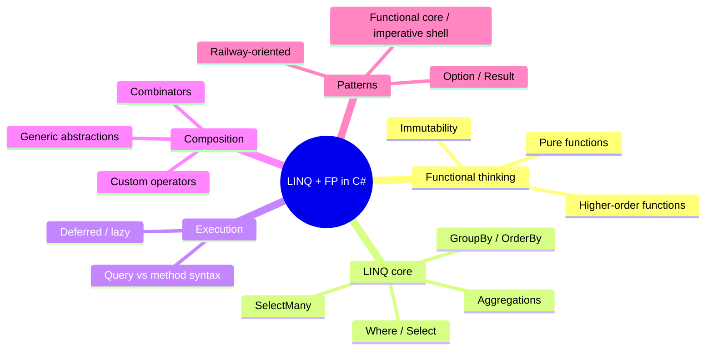
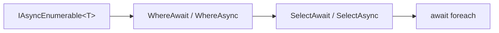
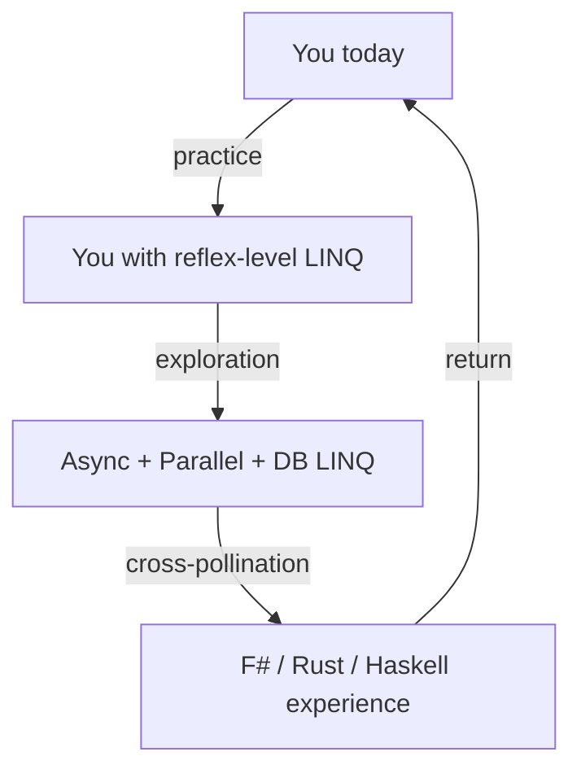

You've covered the core of LINQ and functional-style C#. This page
is a road map of where to wander next, organized by the kind of
problem you're trying to solve.

## Quick recap

Before we look outward, take stock of what you now have:



Each of those is a *whole sub-discipline*. We've planted seeds; the
following are paths for deeper study.

## Going faster: PLINQ

`AsParallel()` turns a LINQ query into a parallel one, distributing
work across CPU cores.

<CodeBlock
  adapter="csharp"
  starterCode={`using System;
using System.Linq;

var nums = Enumerable.Range(1, 20);

var squares = nums
    .AsParallel()
    .Select(n =>
    {
        // pretend this is expensive
        return n * n;
    })
    .OrderBy(n => n)
    .ToList();

Console.WriteLine(string.Join(",", squares));
`}
/>

PLINQ is ideal when **each element's work is expensive and
independent**. It is *not* a free upgrade — coordination overhead
can make small/cheap pipelines slower. Profile before you parallelize.

Topics to study: `AsParallel`, `WithDegreeOfParallelism`,
`WithCancellation`, `ForAll`, partitioning, `AsOrdered`/`AsUnordered`.

## Going async: IAsyncEnumerable

For data that arrives over time — streams, network sources, paginated
APIs — `IAsyncEnumerable<T>` is LINQ's asynchronous cousin.

```csharp
await foreach (var item in StreamItems().WhereAwait(...).SelectAwait(...))
{
    Console.WriteLine(item);
}
```

The `System.Linq.Async` NuGet package brings full LINQ-style
operators for `IAsyncEnumerable<T>`. Async iterators (`async` methods
that `yield return`) make defining sources delightful.



## Going to a database: IQueryable and EF Core

`IQueryable<T>` *looks* exactly like `IEnumerable<T>` from the
outside, but it captures your LINQ query as an **expression tree**
that providers can translate — typically into SQL.

```csharp
var top = db.Orders
    .Where(o => o.Total > 1000)
    .OrderByDescending(o => o.PlacedAt)
    .Take(10)
    .Select(o => new { o.Id, o.Total })
    .ToList();
```

That code compiles to SQL roughly equivalent to:

```sql
SELECT TOP 10 Id, Total FROM Orders WHERE Total > 1000 ORDER BY PlacedAt DESC;
```

This is the same LINQ surface, *running on a database*. Things to
study next:

- The Expression API (`Expression<Func<T, bool>>`)
- Provider semantics — what *can* and *cannot* be translated
- When LINQ silently falls back to client evaluation, and why that's
  dangerous

## More operators: MoreLINQ

[MoreLINQ](https://github.com/morelinq/MoreLINQ) extends LINQ with
operators the standard library lacks: `Batch`, `Window`, `Lag`,
`Lead`, `Pairwise`, `Cartesian`, `MinBy`/`MaxBy` (now in standard
LINQ too), `Scan`, `Segment`, `Index`, and many more.

If you've ever wanted "the missing LINQ operator", check MoreLINQ
first — it's probably there, already battle-tested.

## Going deeper into FP: F#

C# borrowed LINQ heavily from concepts in F# (which itself borrowed
from ML and Haskell). F# is C#'s sibling on the .NET platform, and
spending a weekend with it is the fastest way to understand *why*
functional programming has the shape it does.

You'll meet:

- Records, discriminated unions, and pattern matching by default
- The pipe operator `|>` (the spiritual ancestor of chained LINQ)
- Computation expressions (the general form of `async` and LINQ)
- Type inference everywhere

Most of what you learn in F# you can bring straight back to C#.

## Going wider: other ecosystems

The same patterns appear under many names. Spotting them across
languages cements the underlying ideas:

| Concept | C# | F# | Java | TypeScript | Rust |
| --- | --- | --- | --- | --- | --- |
| Map | `Select` | `map` / `List.map` | `Stream.map` | `Array.map` | `map` |
| Filter | `Where` | `filter` / `List.filter` | `Stream.filter` | `Array.filter` | `filter` |
| Reduce | `Aggregate` | `fold` / `List.fold` | `Stream.reduce` | `Array.reduce` | `fold` |
| Flat-map | `SelectMany` | `collect` / `List.collect` | `Stream.flatMap` | `Array.flatMap` | `flat_map` |
| Option | `T?` | `option<'T>` | `Optional<T>` | `T \| undefined` | `Option<T>` |
| Result | (custom) | `Result<'T, 'E>` | (custom) | (custom) | `Result<T, E>` |

Learn it once, recognize it everywhere.

## Reading recommendations

Treat these as a curated next-90-days plan, not a homework list.

| Resource | Why |
| --- | --- |
| Eric Lippert's blog posts on LINQ and iterators | The "why" behind the design |
| *Functional Programming in C#* by Enrico Buonanno | The book-length treatment of these patterns |
| *Real-World Functional Programming* by Tomas Petricek & Jon Skeet | Bridges F# and C# beautifully |
| Microsoft Learn: *LINQ in C#* | Authoritative reference for every operator |
| *Structure and Interpretation of Computer Programs* (SICP) | Functional thinking from first principles, language-agnostic |

## A final word

LINQ is one of those rare features that *quietly changes how you
think*. You may have started this course wanting to write `.Where`
and `.Select` more comfortably. You're leaving with something
larger: a vocabulary for talking about computation as *the
description of a transformation*, not the *sequence of steps that
performs it*.

That mental shift outlasts any single language. Take it with you.



Happy querying.

<MultipleChoice
  markdown={`Which statement best describes the relationship between \`IEnumerable<T>\` and \`IQueryable<T>\`?

- They are unrelated — \`IQueryable<T>\` is a database-only type with its own API.
  > \`IQueryable<T>\` inherits from \`IEnumerable<T>\`. They share the LINQ method surface.
- [o] \`IQueryable<T>\` captures a query as an *expression tree* that a provider (like EF Core) can translate, instead of executing the LINQ in process.
  > The same \`.Where(...).Select(...)\` syntax that runs in-memory against \`IEnumerable<T>\` becomes a reified expression tree against \`IQueryable<T>\`, which providers translate (typically to SQL). This is the trick behind EF Core, LINQ to XML, LINQ to remote services, and more.
- They are the same interface with different names for historical reasons.
  > They have different semantics: \`IEnumerable<T>\` runs delegates in-process; \`IQueryable<T>\` captures expressions for a provider.
- \`IQueryable<T>\` is always faster because it runs on a server.
  > Sometimes faster, sometimes much slower — and if the provider can't translate a clause, it may silently fall back to fetching everything and filtering client-side.

Understanding this distinction is essential before you write LINQ against EF Core or any remote data source.`}
/>
