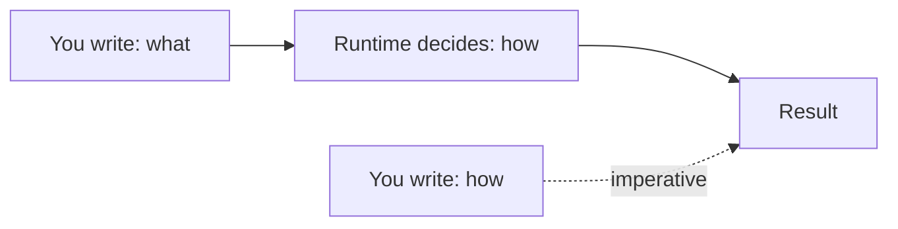
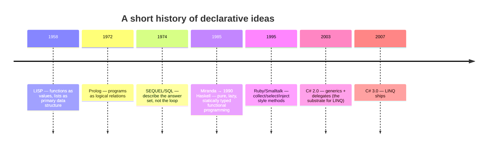

If imperative code says "do this, then do this, then mutate that",
**declarative** code says "this is what I want". The difference looks
small on a four-line example and is enormous on a forty-thousand-line
codebase.

This page is the prehistory of LINQ — the languages, ideas, and
research papers that made it possible to write `people.Where(p =>
p.City == "Berlin").Average(p => p.Age)` in a mainstream
object-oriented language and have it feel natural.

## What "declarative" means

A program is declarative when it describes **what** result you want,
leaving the **how** to the runtime, library, or compiler.

Two examples you have probably already used:

- **SQL**: `SELECT city, AVG(age) FROM people WHERE country = 'DE'
  GROUP BY city` — you do not write the loop that scans the table or
  the hash map that does the grouping. The database does.
- **HTML and CSS**: `<button class="primary">Save</button>` — you do
  not write the pixel-by-pixel rendering routine.

In both cases you describe *the shape of the answer*. The system
figures out the steps.

## Where the idea came from

Declarative programming is not a 2007 invention. By the time C# 3.0
shipped, the idea had been brewing for half a century.

Each step contributed something:

- **LISP** showed that you can treat functions as ordinary values you
  pass around. That is the engine behind every `.Where(predicate)`
  you will ever write.
- **SQL** showed that ordinary programmers — not just researchers —
  will happily write declarative queries when the syntax is friendly.
- **Haskell** showed that an entire program can be built out of
  composed pure functions, with laziness as a first-class concept.
- **Smalltalk** and **Ruby** popularized the idea of collection
  methods like `select`, `collect`, and `inject` that take blocks of
  code as arguments.

## A small declarative shift, in C#

Compare four ways of saying *"the names of even numbers, doubled, as
a comma-separated string"*. We will execute each.

<CodeBlock
  adapter="csharp"
  starterCode={`using System;
using System.Collections.Generic;
using System.Text;
using System.Linq;

var nums = new[] { 1, 2, 3, 4, 5, 6 };

// 1. Fully imperative — index loop, manual string building.
var sb = new StringBuilder();
for (int i = 0; i < nums.Length; i++)
{
    if (nums[i] % 2 == 0)
    {
        if (sb.Length > 0)
            sb.Append(", ");
        sb.Append(nums[i] * 2);
    }
}
Console.WriteLine("v1: " + sb.ToString());

// 2. foreach — a slight step up.
var parts = new List<string>();
foreach (var n in nums)
    if (n % 2 == 0)
        parts.Add((n * 2).ToString());
Console.WriteLine("v2: " + string.Join(", ", parts));

// 3. LINQ method syntax — declarative pipeline.
var v3 = string.Join(", ", nums.Where(n => n % 2 == 0).Select(n => n * 2));
Console.WriteLine("v3: " + v3);

// 4. LINQ query syntax — looks like SQL.
var v4 = string.Join(", ",
    from n in nums where n % 2 == 0 select n * 2);
Console.WriteLine("v4: " + v4);
`}
/>

All four print `2, 4, 8, 12`. They are **operationally equivalent**.
They are not **cognitively equivalent**. Each version, top to bottom,
moves further from "I am driving a CPU" toward "I am describing a
result".

## Declarative ≠ slow, declarative ≠ magic

Two myths are worth dispelling now, because they will come up:

- *"Declarative code is slower."* In modern .NET, LINQ over arrays
  and lists is competitive with hand-written loops in the vast
  majority of code paths. Where it isn't, the difference is usually
  tiny next to I/O. We will revisit performance in
  [Deferred Execution](./deferred-execution).
- *"Declarative is just sugar."* LINQ is **also** sugar — but it is
  built on a real abstraction, `IEnumerable<T>`, which we will
  dissect in [IEnumerable and Iteration](./ienumerable-and-iteration).
  The "magic" is just a single interface and an extension method.

## A larger payoff: rearranging an algorithm

The hidden superpower of declarative code is that *the pieces are
named, independent, and reorderable*. Suppose we want to add "skip
the first 1" to our pipeline.

In the imperative version, you have to find the right place to
insert a counter, increment it, and add a guard. In the LINQ
version, you splice in one operator:

<CodeBlock
  adapter="csharp"
  starterCode={`using System;
using System.Linq;

var nums = new[] { 1, 2, 3, 4, 5, 6 };

// Just add .Skip(1) between Where and Select. Done.
var result = string.Join(", ", nums.Where(n => n % 2 == 0).Skip(1).Select(n => n * 2));

Console.WriteLine(result); // 8, 12
`}
/>

This is what people mean when they say "LINQ is composable". The
pipeline is a sequence of named steps you can reorder, add to, or
remove without rewriting the rest.

## The rest of the story

The next page is about LINQ specifically: how Microsoft Research
designed it, what `IEnumerable<T>` and lambda expressions had to be
in place first, and why this style of querying is now standard
across many modern languages.

<MultipleChoice
  markdown={`What is the defining characteristic of **declarative** code, as discussed on this page?

- It uses fewer lines of code than imperative code.
  > Conciseness is often a side effect, but it is not the definition. A long declarative program is still declarative.
- It runs faster than imperative code.
  > Declarative code can be faster or slower, depending on the runtime. Performance is not the defining trait.
- [o] It describes *what* result is wanted and leaves *how* to compute it to the runtime or library.
  > Declarative code expresses the desired result; an imperative program describes the precise sequence of state changes to reach it.
- It must be written in a functional programming language.
  > Declarative styles exist in many paradigms, including SQL (relational), HTML (markup), and LINQ inside an OO language.

Declarative programming is a question of *what the code says*, not a
question of which language it's written in. SQL inside C#, LINQ inside
C#, and even CSS inside HTML are all declarative.`}
/>
