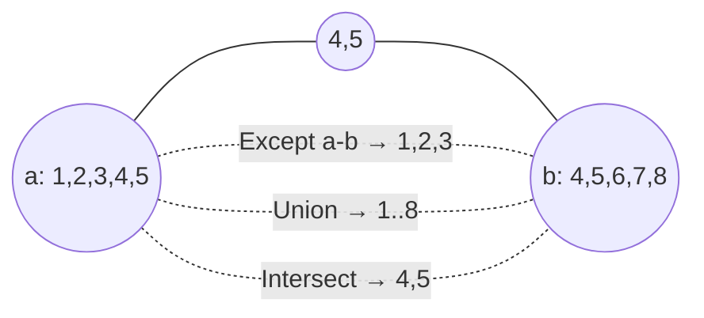

So far our operators have transformed *one* sequence at a time. This
page is about operators that take *two* sequences and combine them:
removing duplicates, finding overlaps, gluing them end-to-end, or
joining them by key.

## Distinct: removing duplicates

`Distinct` produces a sequence of unique elements, preserving the
order of first appearance.

<CodeBlock
  adapter="csharp"
  starterCode={`using System;
using System.Linq;

var xs = new[] { 3, 1, 4, 1, 5, 9, 2, 6, 5, 3, 5 };

Console.WriteLine(string.Join(",", xs.Distinct())); // 3,1,4,5,9,2,6
`}
/>

Equality is determined by the type's `Equals` / `GetHashCode`. For
records this means *value equality* — two `Person("Ada", 36)`
records are equal.

`DistinctBy` (since .NET 6) lets you de-duplicate by a *key*:

<CodeBlock
  adapter="csharp"
  starterCode={`using System;
using System.Linq;

var people = new[] {
    new Person("Ada", 36),
    new Person("Bilal", 41),
    new Person("Ada", 99), // same name, different age
    new Person("Chiara", 29),
};

foreach (var p in people.DistinctBy(p => p.Name))
    Console.WriteLine(p);

record Person(string Name, int Age);
`}
/>

`DistinctBy` keeps the *first* person per key. The second "Ada" is
discarded.

## Set operations: Union, Intersect, Except

These mimic mathematical set operations. They deduplicate as part of
the operation.

<CodeBlock
  adapter="csharp"
  starterCode={`using System;
using System.Linq;

var a = new[] { 1, 2, 3, 4, 5 };
var b = new[] { 4, 5, 6, 7, 8 };

Console.WriteLine($"Union     : [{string.Join(",", a.Union(b))}]");
Console.WriteLine($"Intersect : [{string.Join(",", a.Intersect(b))}]");
Console.WriteLine($"Except a-b: [{string.Join(",", a.Except(b))}]");
Console.WriteLine($"Except b-a: [{string.Join(",", b.Except(a))}]");
`}
/>



`-By` variants exist: `UnionBy`, `IntersectBy`, `ExceptBy` (taking a
key selector), all introduced in .NET 6.

## Concat — gluing end to end

`Concat` does not deduplicate; it just appends the second sequence
to the first.

<CodeBlock
  adapter="csharp"
  starterCode={`using System;
using System.Linq;

var a = new[] { 1, 2, 3 };
var b = new[] { 3, 4, 5 };

Console.WriteLine(string.Join(",", a.Concat(b))); // 1,2,3,3,4,5
`}
/>

Use `Concat` when order matters and duplicates are okay. Use `Union`
when you want a set.

## Zip — pairing two sequences

`Zip` walks two sequences in parallel and combines each pair with a
function.

<CodeBlock
  adapter="csharp"
  starterCode={`using System;
using System.Linq;

var names = new[] { "Ada", "Bilal", "Chiara", "Dmitri" };
var ages = new[] { 36, 41, 29 };

var pairs = names.Zip(ages, (name, age) => $"{name}({age})");

foreach (var p in pairs)
    Console.WriteLine(p);
`}
/>

Output: three lines. `Zip` stops at the **shorter** sequence — there
is no `Dmitri(?)`. There's also a no-lambda overload that returns
tuples:

<CodeBlock
  adapter="csharp"
  starterCode={`using System;
using System.Linq;

var names = new[] { "Ada", "Bilal", "Chiara" };
var ages = new[] { 36, 41, 29 };

foreach (var (n, a) in names.Zip(ages))
    Console.WriteLine($"{n} is {a}");
`}
/>

A common use of `Zip`: pair items with their index without using
`Where((x, i) => ...)`.

```csharp
var indexed = items.Zip(Enumerable.Range(0, int.MaxValue));
```

(Modern code can use `Select((x, i) => ...)` for this — but `Zip` is
a useful general tool.)

## Join — relational join

`Join` matches elements of two sequences by a key — the LINQ
equivalent of a SQL `INNER JOIN`.

<CodeBlock
  adapter="csharp"
  starterCode={`using System;
using System.Linq;

var customers = new[] {
    new Customer(1, "Ada"),
    new Customer(2, "Bilal"),
    new Customer(3, "Chiara"),
};

var orders = new[] {
    new Order(1, "Widget"),
    new Order(1, "Gadget"),
    new Order(2, "Gizmo"),
    // No order for customer 3.
    new Order(99, "Mystery"), // No matching customer.
};

var joined = customers.Join(orders,
                            c => c.Id,         // outer key
                            o => o.CustomerId, // inner key
                            (c, o) => new { c.Name, o.Product });

foreach (var row in joined)
    Console.WriteLine($"{row.Name} bought {row.Product}");

record Customer(int Id, string Name);
record Order(int CustomerId, string Product);
`}
/>

Customer 3 produces no rows (no matching order). The "Mystery" order
produces no row (no matching customer). That's *inner join*
behavior.

### Left outer join with `GroupJoin` + `SelectMany`

LINQ has no `LeftJoin` operator. The idiomatic way to do a left
outer join is `GroupJoin` followed by `SelectMany` with
`DefaultIfEmpty`.

<CodeBlock
  adapter="csharp"
  starterCode={`using System;
using System.Linq;

var customers = new[] {
    new Customer(1, "Ada"),
    new Customer(2, "Bilal"),
    new Customer(3, "Chiara"), // no orders
};

var orders = new[] {
    new Order(1, "Widget"),
    new Order(1, "Gadget"),
    new Order(2, "Gizmo"),
};

var leftJoined =
    customers.GroupJoin(orders, c => c.Id, o => o.CustomerId, (c, os) => new { c, os })
        .SelectMany(x => x.os.DefaultIfEmpty(), (x, o) => new { x.c.Name, Product = o?.Product ?? "(none)" });

foreach (var row in leftJoined)
    Console.WriteLine($"{row.Name,-7} → {row.Product}");

record Customer(int Id, string Name);
record Order(int CustomerId, string Product);
`}
/>

Customer 3 appears with `(none)`. That's the difference from inner
join: every left element is preserved.

## A pipeline that uses several at once

A realistic pipeline often uses two or three combination operators
together.

<CodeBlock
  adapter="csharp"
  starterCode={`using System;
using System.Linq;

var classA = new[] { "Ada", "Bilal", "Chiara" };
var classB = new[] { "Chiara", "Dmitri", "Esther" };
var dropped = new[] { "Bilal" };

// Students in either class, excluding the dropped, deduped, sorted.
var active = classA.Union(classB).Except(dropped).OrderBy(name => name);

Console.WriteLine(string.Join(", ", active));
`}
/>

The shape — *union, except, order* — comes up constantly in
"compute the active members" / "find the new entries" / "diff two
lists" kinds of problems.

## A multi-file challenge

<ChallengeCard
  adapter="csharp"
  title="New students this semester"
  instructions={`Implement \`Roster.NewThisSemester(IEnumerable<string> last, IEnumerable<string> current)\`
that returns the names that are present in \`current\` but not in
\`last\`, deduplicated, sorted alphabetically (ordinal).

Use \`Except\` and \`OrderBy\`. Don't write a \`foreach\`.`}
  entryFilename="Program.cs"
  files={[
    {
      filename: "Program.cs",
      initialContent: `var last    = new[] { "Ada", "Bilal", "Chiara", "Bilal" };
var current = new[] { "Ada", "Chiara", "Dmitri", "Esther", "Dmitri" };

foreach (var name in Roster.NewThisSemester(last, current))
    System.Console.WriteLine(name);
`,
    },
    {
      filename: "Roster.cs",
      initialContent: `using System.Collections.Generic;

public static class Roster
{
    public static IEnumerable<string> NewThisSemester(IEnumerable<string> last, IEnumerable<string> current)
    {
        // your code here
        return new string[0];
    }
}
`,
      solutionContent: `using System.Collections.Generic;
using System.Linq;

public static class Roster
{
    public static IEnumerable<string> NewThisSemester(IEnumerable<string> last, IEnumerable<string> current) =>
        current.Except(last).OrderBy(n => n, System.StringComparer.Ordinal);
}
`,
    },
  ]}
  tests={[
    {
      id: "new_students",
      name: "Yields Dmitri then Esther",
      description: "New students sorted alphabetically",
      expect: { stdoutEquals: "Dmitri\nEsther" },
    },
  ]}
/>

<MultipleChoice
  markdown={`What does \`a.Concat(b)\` differ from \`a.Union(b)\` in?

- \`Concat\` only works on arrays; \`Union\` works on any \`IEnumerable<T>\`.
  > Both work on any \`IEnumerable<T>\`; that is not the difference.
- \`Union\` always produces a longer sequence than \`Concat\`.
  > The opposite is often true — \`Union\` deduplicates and can be shorter than \`Concat\`.
- [o] \`Concat\` preserves every element including duplicates between the two sequences; \`Union\` deduplicates so each value appears at most once.
  > \`Concat\` is purely "append" semantics; \`Union\` is set semantics that removes duplicates across (and within) the inputs.
- \`Concat\` requires both sequences to have the same element type; \`Union\` does not.
  > Both require compatible element types (typically the same type or a common base type).

Use \`Concat\` when you want a stitched-together list and duplicates are
fine. Use \`Union\` when you want set semantics — each value at most
once.`}
/>
