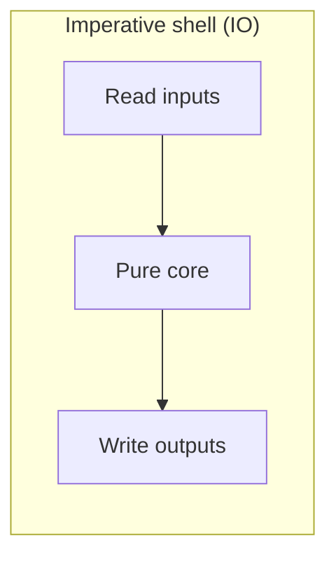
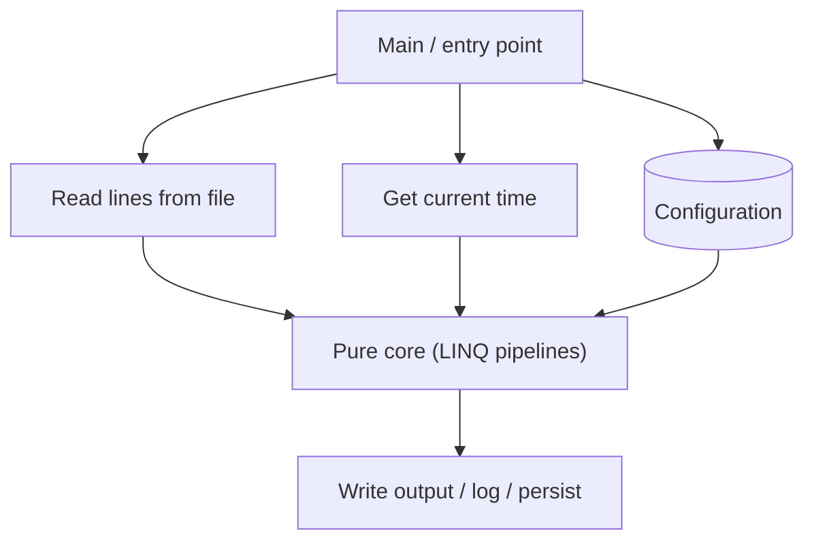

LINQ pipelines work best when their lambdas are **pure** — they
read inputs, return outputs, and *do nothing else*. Real programs,
of course, have to do plenty of impure work: read files, hit the
network, write to a database, print to a console, check the clock.

This page is about *where* the impurity lives. The pattern is older
than C#, but it fits LINQ exceptionally well: **functional core,
imperative shell**.

<svg
  viewBox="0 0 640 240"
  role="img"
  aria-label="A solid green core inside a translucent yellow shell: red effect dots live only in the shell, while blue dots flow in one side and green dots flow out the other"
  style={{ display: "block", width: "100%", maxWidth: "640px", height: "auto", margin: "2.5rem auto" }}
>
  <g style={{ color: "var(--ds-yellow-500)" }} fill="currentColor">
    <circle cx="320" cy="120" r="85" fillOpacity="0.14" />
  </g>
  <g style={{ color: "var(--ds-green-500)" }} fill="currentColor">
    <circle cx="320" cy="120" r="48" />
    <circle cx="430" cy="120" r="4" />
    <circle cx="455" cy="120" r="4" />
    <circle cx="480" cy="120" r="4" />
  </g>
  <g style={{ color: "var(--ds-red-500)" }} fill="currentColor">
    <circle cx="255" cy="75" r="7" />
    <circle cx="390" cy="80" r="7" />
    <circle cx="380" cy="170" r="7" />
    <circle cx="250" cy="160" r="7" />
  </g>
  <g style={{ color: "var(--ds-blue-500)" }} fill="currentColor">
    <circle cx="160" cy="120" r="4" />
    <circle cx="185" cy="120" r="4" />
    <circle cx="210" cy="120" r="4" />
  </g>
</svg>

## The two halves of a program



The **shell** talks to the outside world: it reads files, performs
HTTP calls, accepts user input, prints results, writes to disk.

The **core** does the work: filtering, transforming, calculating,
deciding. It takes pure data in and returns pure data out. The core
never knows where its inputs came from or where its outputs will go.

## Why this split is a superpower

| Property | Shell (IO) | Core (pure) |
| --- | --- | --- |
| Hardest part to test | ✅ | ❌ |
| Hardest part to read | ❌ | ✅ |
| Worth most of your engineering attention | ✅ | ✅ |
| Where bugs hide | ✅ | ✅ |
| Where LINQ shines | ❌ | ✅ |

The trick is to make the *core as large as possible* and the *shell
as small as possible*. The shell becomes thin glue that's easy to
audit. The core becomes a pile of pure functions that's a joy to
test.

## A bad example: tangled IO and logic

<CodeBlock
  adapter="csharp"
  files={[
    {
      filename: "main.cs",
      starterCode: `using System;
using System.Collections.Generic;

// Pretend this reads a file. Mixing logic with IO makes everything harder to test.
List<decimal> ReadAndSumPositiveSales()
{
    var lines = new[] { "10.50", "-3.00", "abc", "7.25", "", "12.00" }; // pretend File.ReadAllLines
    var positives = new List<decimal>();
    foreach (var line in lines)
    {
        if (decimal.TryParse(line, out var n) && n > 0)
        {
            Console.WriteLine($"keeping {n}"); // logging
            positives.Add(n);
        }
        else
        {
            Console.WriteLine($"skipping '{line}'");
        }
    }
    return positives;
}

var sales = ReadAndSumPositiveSales();
Console.WriteLine($"Sum: {sales.Sum()}");
`,
    },
  ]}
/>

To test the *parsing rule* — "non-numeric and non-positive entries
are dropped" — you'd have to mock a file reader, capture console
output, and assert on log lines. The logic is *trapped* inside the
IO.

## A good example: pure core, thin shell

<CodeBlock
  adapter="csharp"
  files={[
    {
      filename: "main.cs",
      starterCode: `using System;
using System.Collections.Generic;
using System.Linq;

// --- pure core: takes raw lines, returns processed values ---

// --- imperative shell: reads input, prints output ---
var lines = new[] { "10.50", "-3.00", "abc", "7.25", "", "12.00" }; // pretend File.ReadAllLines
var positives = SalesParser.Parse(lines).ToList();
foreach (var p in positives)
    Console.WriteLine($"keeping {p}");
Console.WriteLine($"Sum: {positives.Sum()}");

public static class SalesParser
{
    public static IEnumerable<decimal> Parse(IEnumerable<string> lines) =>
        lines.Select(line => decimal.TryParse(line, out var n) ? (decimal?)n : null)
            .Where(n => n is > 0)
            .Select(n => n!.Value);
}
`,
    },
  ]}
/>

`SalesParser.Parse` is *pure*: same input, same output, no side
effects. You can hand-write tests for it without ever touching a
file, the console, or any infrastructure.

The shell — the four lines after the class — is so small there's
almost nothing to test.

## Threading the "world" through arguments

When you *do* need impure inputs (the clock, randomness, a database
result), pass them in as parameters instead of calling them inline.
This single change makes the function pure (or at least *more*
pure).

<CodeBlock
  adapter="csharp"
  files={[
    {
      filename: "main.cs",
      starterCode: `using System;
using System.Collections.Generic;
using System.Linq;

var subs = new[] {
    new Subscription("A", new DateTime(2026, 6, 1)),
    new Subscription("B", new DateTime(2026, 5, 27)),
    new Subscription("C", new DateTime(2026, 7, 1)),
};
var fixedNow = new DateTime(2026, 5, 26);

foreach (var s in Subs.ExpiringSoon(subs, fixedNow))
    Console.WriteLine($"{s.User} expires {s.ExpiresOn:yyyy-MM-dd}");

public record Subscription(string User, DateTime ExpiresOn);
public static class Subs
{
    // BAD: hidden dependency on DateTime.UtcNow makes this hard to test.
    public static IEnumerable<Subscription> ExpiringSoonBad(IEnumerable<Subscription> subs) =>
        subs.Where(s => s.ExpiresOn <= DateTime.UtcNow.AddDays(7));

    // GOOD: pass "now" in. Same code, infinitely more testable.
    public static IEnumerable<Subscription> ExpiringSoon(IEnumerable<Subscription> subs,
                                                         DateTime now) => subs.Where(s => s.ExpiresOn <=
                                                                                          now.AddDays(7));
}
`,
    },
  ]}
/>

In a test, you pass an arbitrary `DateTime`. In production, the
shell calls `Subs.ExpiringSoon(subs, DateTime.UtcNow)`. Same code,
no mocking framework needed.

The same trick works for randomness (`Random rng`), configuration
(`Settings s`), and external services (interfaces).

## What about logging?

Logging is a side effect — but most teams accept it inside pure code
because it's "harmless". A pragmatic compromise:

- Don't log inside lambdas that LINQ may run many times or never.
- *Do* log at boundaries (when receiving input, before returning to
  the shell).
- If logging is essential to a transformation, return the log lines
  *as data* and let the shell print them.

```csharp
// Return logs as data instead of writing them inline
public static (IEnumerable<decimal> values, IEnumerable<string> warnings) ParseWithWarnings(IEnumerable<string> lines)
{
    var warnings = new List<string>();
    var values = lines
        .Select(line => decimal.TryParse(line, out var n) ? (decimal?)n : (decimal?)null)
        .Select((n, i) =>
        {
            if (n is null) warnings.Add($"line {i}: not a number");
            return n;
        })
        .Where(n => n is > 0)
        .Select(n => n!.Value)
        .ToList();   // materialize so the warnings list is filled
    return (values, warnings);
}
```

The function still returns *data*. The shell decides whether
"warnings" go to the console, a log file, or a UI.

## Practice: extract the core

<ChallengeCard
  adapter="csharp"
  entryFilename="Program.cs"
  files={[
    {
      filename: "Program.cs",
      starterCode: `using System;
using System.Collections.Generic;
using System.Linq;

// "Shell" — fixed inputs (pretending these came from a file / clock).
var rawLines = new[] {
    "2026-05-01,paid,120", "2026-05-12,paid,300", "2026-05-20,pending,75",
    "garbage line",        "2026-05-25,paid,40",  "2026-05-26,refund,-50",
};
var today = new DateTime(2026, 5, 26);
var windowDays = 10;

var report = Report.Build(rawLines, today, windowDays);
Console.WriteLine(report);
`,
      solutionCode: `using System;
using System.Collections.Generic;
using System.Linq;

var rawLines = new[] {
    "2026-05-01,paid,120", "2026-05-12,paid,300", "2026-05-20,pending,75",
    "garbage line",        "2026-05-25,paid,40",  "2026-05-26,refund,-50",
};
var today = new DateTime(2026, 5, 26);
var windowDays = 10;

var report = Report.Build(rawLines, today, windowDays);
Console.WriteLine(report);
`,
    },
    {
      filename: "Report.cs",
      starterCode: `using System;
using System.Collections.Generic;
using System.Globalization;
using System.Linq;

// Build the report PURELY: no Console, no DateTime.UtcNow, no File IO inside.
// The whole function takes its inputs explicitly and returns a string.
public static class Report
{
    public static string Build(IEnumerable<string> lines, DateTime today, int windowDays)
    {
        // TODO:
        // 1) Parse each line as "yyyy-MM-dd,status,amount".
        //    Skip lines that fail to parse. (decimal.Parse with InvariantCulture for amount.)
        // 2) Keep entries where status == "paid" AND date >= today.AddDays(-windowDays).
        // 3) Sum the amounts.
        // 4) Return a single string: $"PAID in last {windowDays} days: {total}".
        throw new NotImplementedException();
    }
}
`,
      solutionCode: `using System;
using System.Collections.Generic;
using System.Globalization;
using System.Linq;

public static class Report
{
    public static string Build(IEnumerable<string> lines, DateTime today, int windowDays)
    {
        var cutoff = today.AddDays(-windowDays);
        var total =
            lines.Select(l => l.Split(','))
                .Where(parts => parts.Length == 3)
                .Select(
                    parts =>
                    {
                        if (!DateTime.TryParse(parts[0], CultureInfo.InvariantCulture, DateTimeStyles.None, out var d))
                            return ((DateTime?)null, parts[1], 0m);
                        if (!decimal.TryParse(parts[2], NumberStyles.Any, CultureInfo.InvariantCulture, out var n))
                            return ((DateTime?)null, parts[1], 0m);
                        return ((DateTime?)d, parts[1], n);
                    })
                .Where(r => r.Item1 is not null)
                .Where(r => r.Item2 == "paid")
                .Where(r => r.Item1!.Value >= cutoff)
                .Sum(r => r.Item3);

        return $"PAID in last {windowDays} days: {total}";
    }
}
`,
    },
  ]}
  tests={[
    {
      id: "pure-core-report",
      name: "Pure Report.Build returns deterministic, time-injected total",
      description: "Date and window are arguments, so output is fully predictable",
      expect: {
        stdoutEquals: "PAID in last 10 days: 40\n",
      },
    },
  ]}
/>

`Report.Build` reads no environment. It uses no `Console`. It takes
"today" as an argument. Given the same three inputs, it always
returns the same string. *That* is what makes it a pure core.

## The shape of a clean program



The arrows on the boundary are IO. Everything inside the inner box
is pure. The pure code grows, the boundary stays thin. As an
engineering posture, this is one of the most impactful habits you
can adopt.

<MultipleChoice
  markdown={`Why do experienced functional-style C# programmers pass values like \`DateTime now\` or \`Random rng\` as arguments instead of calling \`DateTime.UtcNow\` / \`new Random()\` inside the function?

- Because \`DateTime.UtcNow\` is slow.
  > It is essentially free. Performance is not the reason.
- Because static calls are forbidden inside LINQ lambdas.
  > Not true — you can call any method inside a lambda. The objection is about *purity*, not legality.
- [o] To make the function deterministic and testable — the same inputs always produce the same output, and tests can supply any time/seed they want.
  > Hidden environmental reads (clock, RNG, environment variables) make a function impure and untestable. Lifting those reads to parameters turns the function into a pure, predictable building block; the shell stays responsible for sourcing the real values.
- To improve thread safety.
  > A side benefit in some cases (avoiding shared \`Random\` instances, for example), but the primary motivation is testability and reasoning.

This single discipline — *push reads out, return data in* — is the
core habit behind "functional core, imperative shell".`}
/>
