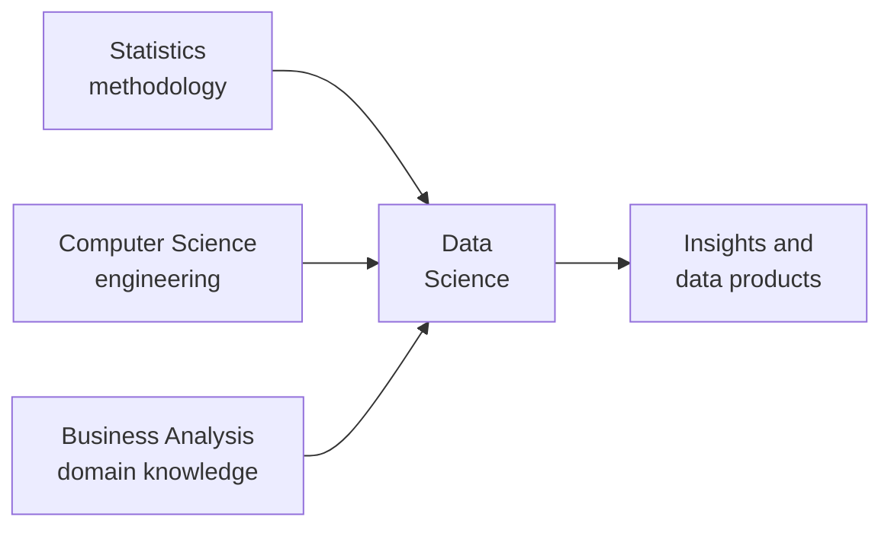
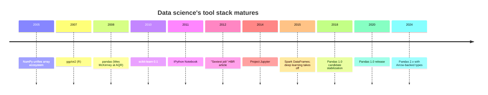
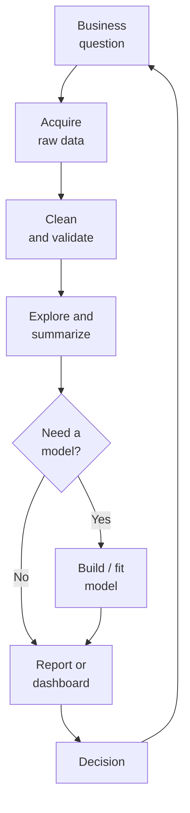

By the late 2000s, three communities that had been doing related
work in parallel discovered they were doing the *same* work. When
they finally combined their tools and methods, the result picked
up a name that would stick: **data science**.

## Three roads, one destination

### Statisticians

Statisticians had been reasoning carefully about data since the
1800s. They had inferential machinery — confidence intervals,
hypothesis tests, regression — but most of them worked in
expensive proprietary tools (SAS, SPSS, Stata) and most of their
datasets were small and carefully designed (surveys, clinical
trials, scientific experiments).

### Computer scientists

Computer scientists could move terabytes around, store them
efficiently, and query them with SQL. But until the rise of
machine learning, they did not typically *interpret* the data —
they served it.

### Business analysts

Business analysts knew the questions, understood the domain, and
could communicate to executives. But their tooling (Excel,
Tableau, hand-written SQL) hit a ceiling at modest data sizes and
left no reproducible trail.

Data science is, in some sense, the disciplined union of these
three. The classic Drew Conway *Venn diagram* (2010) names them
"hacking skills," "math and statistics," and "substantive
expertise" — but it is the same idea.

## The naming

The term "data science" itself goes back to the 1960s in
statistics literature, but it became a *profession* between 2008
and 2012. Two often-cited milestones:

- 2008 — **DJ Patil** at LinkedIn and **Jeff Hammerbacher** at
  Facebook independently coined "data scientist" as a job
  title for the small interdisciplinary teams they were
  building.
- 2012 — **Harvard Business Review** published *Data Scientist:
  The Sexiest Job of the 21st Century* (Davenport & Patil).
  Whether or not it was *sexy*, it was certainly *new*, and
  university programs sprang up in response.

In the same window, a handful of open-source tools matured to a
point where this work was actually pleasant:

- **R** had had `ggplot2` since 2007 and a vibrant statistical
  community.
- **NumPy** unified Python's scientific arrays in 2005.
- **scikit-learn** brought consistent machine-learning APIs to
  Python in 2010.
- **pandas** brought R-like DataFrames to Python in 2008. This
  is the one we will live in for the rest of the course.
- **IPython Notebook** (later **Jupyter**) gave analysts a
  document-style environment in 2011 that mixed prose, code,
  and output.

## What data scientists actually do

Once the smoke clears, the day-to-day of a data scientist (or
data analyst — the line is blurry, and depends entirely on the
company) is dominated by four activities:

1. **Acquiring data.** Pulling from databases, APIs, files,
   scrapers, dashboards.
2. **Cleaning data.** Fixing types, filling or removing missing
   values, reconciling inconsistent categories, dropping
   duplicates.
3. **Exploring data.** Computing summaries, plotting
   distributions, hunting for patterns and anomalies.
4. **Communicating results.** Charts, reports, dashboards,
   memos, sometimes models.

Estimates vary, but cleaning is often cited as **60–80% of the
job**. The famous quip — "data scientists spend 80% of their
time cleaning data and 20% complaining about cleaning data" —
is funny because it is largely true.

<Callout type="info" title="Why cleaning takes so long">
Real-world data is collected by many different systems, often
designed by many different people, often years apart, often with
inconsistent assumptions. The dataset you receive is rarely the
dataset the system *intended* to produce. Cleaning is the work
of reconciling intent and reality. It is intellectually serious
work — not "grunt work" — because the decisions you make about
how to handle a bad row will affect every downstream conclusion.
</Callout>

## The shape of a modern data project

A typical analyst project in 2024 looks something like this:

Notice the loop at the end. Data science is rarely "ask
question → get answer → done." Almost always, the answer
reframes the question, exposes a new data gap, or prompts a
follow-up analysis. The cycle keeps spinning.

This course takes you all the way from the box labeled "Acquire
raw data" through "Report or dashboard." We will not build
machine-learning models — that is its own course. But everything
*before* the model is what this course is about.

## A first end-to-end taste

Just for the satisfaction of it, let us do a *very* small
end-to-end project right now. We will:

1. **Load** an HR dataset.
2. **Clean** it (drop a few obvious garbage columns if any).
3. **Explore** which departments have the highest attrition.
4. **Communicate** with a sorted summary.

<CodeBlock
  adapter="python"
  starterCode={`import pandas as pd

# 1. Load
df = pd.read_csv(
    "https://raw.githubusercontent.com/bdi475/datasets/main/HR-dataset-v14.csv"
)

# 2. Inspect — what columns relate to attrition and department?
print("Columns:", df.columns.tolist())
print()
print("Has 'Attrition' column?", "Attrition" in df.columns)
print("Has 'Department' column?", "Department" in df.columns)
print()

# 3. Explore — attrition rate per department
# Convert Attrition (Yes/No) to 1/0 so we can take a mean
df["left"] = (df["Attrition"] == "Yes").astype(int)

attrition_by_dept = (
    df.groupby("Department")["left"]
      .mean()
      .mul(100)
      .round(1)
      .sort_values(ascending=False)
)

# 4. Communicate
print("Attrition rate (%) by department:")
print(attrition_by_dept)
`}
/>

In 15 lines of code we did the whole loop — load, inspect, group,
summarize, sort, present. By the end of this course every step
will feel obvious. Right now, just notice the *shape* of the work.

## "Data analyst" vs "data scientist" vs "ML engineer"

These titles are inconsistent across companies, but a rough
breakdown:

- **Data analyst** — focused on answering business questions with
  existing data. Heavy on SQL, Pandas, BI tools, and
  communication. This is the role this course prepares you for.
- **Data scientist** — overlaps with analyst but adds heavier
  statistical or ML modeling, A/B testing, and (sometimes)
  prototyping production models.
- **ML engineer** — focused on putting models into production:
  pipelines, latency, scaling, monitoring.

You can build a complete and lucrative career at the analyst
level without touching machine learning. Many people do. The
skills in this course are the foundation for every one of these
roles.

## Check your understanding

<MultipleChoice
  markdown={`Which of these communities does the chapter argue **fused** to form modern data science?

- Web designers, copywriters, and accountants
- [o] Statisticians, computer scientists, and business analysts
  > The Drew Conway Venn diagram (math/stats, hacking skills, substantive expertise) captures the same three-way intersection.
- Hardware engineers, mathematicians, and biologists
- Sociologists, philosophers, and historians

Each community contributed a piece — methodology, engineering, and domain understanding — that the others lacked alone.`}
/>

<MultipleChoice
  markdown={`The chapter cites a famous estimate that data scientists spend roughly what fraction of their time on data cleaning?

- 10%
- 30%
- [o] 60–80%
  > Yes. The exact number varies by team and project, but multiple industry surveys put cleaning above half of an analyst's time, often by a wide margin. This is why this course gives the topic an entire section.
- 100%

Time spent cleaning is not wasted — it is the substrate that every later conclusion rests on.`}
/>

<MultipleChoice
  markdown={`Which open-source Python library, released in 2008, is the focus of this course?

- NumPy
- scikit-learn
- [o] pandas
  > Pandas was released by Wes McKinney in 2008 while he was at AQR Capital Management. Its history is the subject of the next chapter.
- matplotlib

NumPy and matplotlib are older; scikit-learn arrived in 2010. Pandas is the one we will build the course around.`}
/>

<MultipleChoice
  markdown={`Why does the chapter draw the analysis loop as a *cycle* rather than a straight line from "question" to "answer"?

- Because data scientists like circles
- Because Pandas requires you to repeat operations
- [o] Because the answer to one analysis almost always raises new questions, exposes data gaps, or prompts follow-up work — analysis is iterative by nature
  > Exactly. The cycle is a more honest depiction of how real analyses unfold. Treating analysis as one-shot tends to produce shallow results.
- Because dashboards refresh on a schedule

Embracing iteration — and writing code that supports re-runs and modifications — is one of the recurring themes of this course.`}
/>
